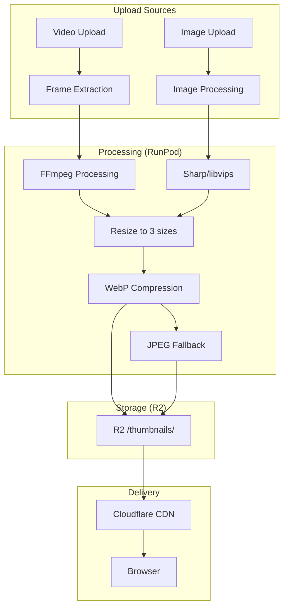

# Image Processing Pipeline

**Status**: Design
**Created**: 2026-01-12
**Purpose**: Define the complete image processing pipeline for thumbnails and media assets

---

## Overview

This document specifies how images are processed, optimized, stored, and served across the Codex platform. The primary use case is content thumbnails, but the pipeline should support other image assets (org logos, user avatars, etc.).

---

## Architecture



---

## Thumbnail Specifications

### Size Variants

| Name | Width | Aspect Ratio | Use Cases |
|------|-------|--------------|-----------|
| `sm` | 200px | Preserve | Mobile grids, compact cards |
| `md` | 400px | Preserve | Standard cards, tablet |
| `lg` | 800px | Preserve | Featured content, desktop hero |

### Format Priority

**Decision**: WebP primary, JPEG fallback. AVIF deferred to Phase 2.

| Priority | Format | Browser Support | Rationale |
|----------|--------|-----------------|-----------|
| 1 | WebP | 95%+ (all modern) | Best balance of compression/support |
| 2 | JPEG | 100% | Universal fallback |
| Future | AVIF | 93%+ | Better compression, slower encode |

**Why not AVIF in Phase 1:**

| Factor | WebP | AVIF |
|--------|------|------|
| Browser support | 95.3% | 93.8% |
| Encode time | ~100ms | ~500-2000ms |
| Decode time | Fast | Slower |
| File size | Good | 20-30% smaller |
| RunPod cost | Lower | Higher (more GPU time) |

AVIF's better compression doesn't justify the encoding cost at our scale. Revisit when content volume grows.

### Quality Settings

| Format | Quality | Effort | Target File Size |
|--------|---------|--------|------------------|
| WebP | 82 | 6 | sm: <15KB, md: <40KB, lg: <100KB |
| JPEG | 85 | mozjpeg | ~20% larger than WebP |

### Quality Benchmarks

Target: **Visually lossless** at standard viewing distances.

| Metric | Target | Measurement |
|--------|--------|-------------|
| SSIM | > 0.95 | Structural similarity to source |
| PSNR | > 35 dB | Peak signal-to-noise ratio |
| File size | < 40KB (md) | Measured after compression |

**Validation Script:**

```bash
# Compare compressed vs original
ffmpeg -i original.png -i compressed.webp \
  -lavfi "ssim;[0:v][1:v]psnr" -f null -

# Output: SSIM:0.97 PSNR:38.2
```

### Quality Tuning Guidelines

| Content Type | WebP Quality | Notes |
|--------------|--------------|-------|
| Photography | 82-85 | Standard setting |
| Text/Graphics | 90 | Preserve sharp edges |
| Low motion video | 80 | Can be more aggressive |
| High motion video | 85 | Preserve detail |

---

## Frame Extraction (Video Thumbnails)

### Strategy Decision

**Decision**: Use **time-based extraction (10% of duration)** with **scene detection fallback** and **I-frame targeting** for quality.

| Strategy | When Used | Rationale |
|----------|-----------|-----------|
| Time-based (10%) | Primary | Skips intro sequences, shows actual content |
| Scene detection | If time-based yields black/low-contrast | Finds visually interesting frames |
| I-frame targeting | Always | I-frames are complete images, avoid blur |

### Implementation

```bash
# Step 1: Get video duration
DURATION=$(ffprobe -v error -show_entries format=duration \
  -of default=noprint_wrappers=1:nokey=1 input.mp4)

# Step 2: Calculate 10% timestamp
TIMESTAMP=$(echo "$DURATION * 0.1" | bc)

# Step 3: Extract frame at timestamp, targeting nearest I-frame
ffmpeg -ss $TIMESTAMP -i input.mp4 \
  -vf "select='eq(pict_type,PICT_TYPE_I)'" \
  -vframes 1 \
  -q:v 2 \
  -f image2pipe \
  -vcodec png - | \
  # Pipe to Sharp for resizing
```

### Scene Detection Fallback

If primary extraction yields poor results (black frame, low contrast), use scene detection:

```bash
# Extract frame at scene change after 10% mark
ffmpeg -ss $TIMESTAMP -i input.mp4 \
  -vf "select='gt(scene,0.3)',thumbnail=100" \
  -frames:v 1 \
  -q:v 2 \
  scene_thumb.jpg
```

**Scene threshold**: `0.3` balances sensitivity (0=most sensitive, 1=least). Lower values catch more scene changes.

### Quality Detection (Optional Enhancement)

For Phase 2, add automatic quality scoring:

```typescript
// Evaluate thumbnail quality
interface ThumbnailScore {
  contrast: number;     // 0-1, higher = better
  brightness: number;   // 0-1, 0.5 = ideal
  sharpness: number;    // 0-1, higher = better
}

async function scoreThumbnail(buffer: Buffer): Promise<ThumbnailScore> {
  const { data, info } = await sharp(buffer)
    .raw()
    .toBuffer({ resolveWithObject: true });

  // Calculate metrics from pixel data
  // ...implementation details...

  return { contrast, brightness, sharpness };
}

// Reject thumbnails below threshold
const MIN_SCORE = 0.4;
if (score.contrast < MIN_SCORE || score.brightness < 0.1) {
  // Try scene detection fallback
}
```

---

## Compression Pipeline

### WebP Generation

```bash
# Using FFmpeg for video frame → WebP
ffmpeg -i input.mp4 \
  -vf "select='eq(n,0)',scale=400:-1" \
  -vframes 1 \
  -c:v libwebp \
  -quality 82 \
  -compression_level 6 \
  thumb-md.webp

# Using Sharp for image → WebP (Node.js)
await sharp(input)
  .resize(400, null, { withoutEnlargement: true })
  .webp({ quality: 82, effort: 6 })
  .toFile('thumb-md.webp');
```

### JPEG Generation

```bash
# FFmpeg
ffmpeg -i input.mp4 \
  -vf "select='eq(n,0)',scale=400:-1" \
  -vframes 1 \
  -q:v 2 \
  thumb-md.jpg

# Sharp
await sharp(input)
  .resize(400, null, { withoutEnlargement: true })
  .jpeg({ quality: 85, mozjpeg: true })
  .toFile('thumb-md.jpg');
```

---

## Storage Structure

### R2 Bucket Layout

```
content-bucket/
├── thumbnails/
│   ├── {contentId}-sm.webp
│   ├── {contentId}-sm.jpg
│   ├── {contentId}-md.webp
│   ├── {contentId}-md.jpg
│   ├── {contentId}-lg.webp
│   └── {contentId}-lg.jpg
├── media/
│   └── {contentId}/
│       ├── master.m3u8
│       └── segments/
└── uploads/
    └── {uploadId}/
        └── original.*
```

### Naming Convention

```
{contentId}-{size}.{format}

Example:
550e8400-e29b-41d4-a716-446655440000-md.webp
```

---

## CDN Configuration

### Cache Headers

```
Cache-Control: public, max-age=31536000, immutable
```

Thumbnails are immutable (content-addressed by ID). 1-year cache is safe.

### URL Pattern

```
https://content.revelations.studio/thumbnails/{contentId}-{size}.webp
```

### Browser Selection

Frontend uses `<picture>` or srcset for format selection:

```html
<picture>
  <source
    srcset="thumb-sm.webp 200w, thumb-md.webp 400w, thumb-lg.webp 800w"
    type="image/webp"
  />
  
</picture>
```

---

## Integration with Transcoding Pipeline

### Current Flow (Video)

```
1. User uploads video → R2 /uploads/
2. Content-API creates media item (status: uploading)
3. Upload complete → trigger RunPod job
4. RunPod transcodes video → HLS segments → R2 /media/
5. Webhook callback → update media item (status: ready)
```

### Enhanced Flow (Video + Thumbnails)

```
1. User uploads video → R2 /uploads/
2. Content-API creates media item (status: uploading)
3. Upload complete → trigger RunPod job
4. RunPod:
   a. Extract thumbnail frame
   b. Generate 3 sizes × 2 formats = 6 files
   c. Upload thumbnails to R2 /thumbnails/
   d. Transcode video → HLS
   e. Upload HLS to R2 /media/
5. Webhook callback includes:
   - thumbnailUrls: { sm, md, lg }
   - streamingUrl
   - status: ready
6. Content-API updates content with thumbnail URLs
```

---

## Database Schema Updates

### Content Table

```sql
-- Add thumbnail URL field (stores base URL, sizes derived)
ALTER TABLE content ADD COLUMN thumbnail_base_url TEXT;

-- Example value: "https://content.revelations.studio/thumbnails/abc123"
-- Frontend constructs: "{base}-{size}.webp"
```

### Alternative: Store All URLs

```sql
ALTER TABLE content ADD COLUMN thumbnails JSONB;

-- Example value:
-- {
--   "sm": "https://.../abc123-sm.webp",
--   "md": "https://.../abc123-md.webp",
--   "lg": "https://.../abc123-lg.webp"
-- }
```

**Recommendation**: Store base URL only, derive sizes in application code.

---

## Error Handling

### Generation Failures

| Failure | Handling |
|---------|----------|
| Frame extraction fails | Use placeholder, log error |
| Compression fails | Retry once, then placeholder |
| R2 upload fails | Retry with backoff, fail job if persistent |

### Missing Thumbnails

Frontend must handle null/missing thumbnails gracefully:

```typescript
function getThumbnailUrl(content: Content, size: Size): string {
  if (!content.thumbnailBaseUrl) {
    return '/images/placeholder-content.svg';
  }
  return `${content.thumbnailBaseUrl}-${size}.webp`;
}
```

---

## Other Image Types

### Organization Logos

| Aspect | Specification |
|--------|---------------|
| Sizes | 64px, 128px, 256px |
| Format | WebP, PNG fallback (transparency) |
| Upload | Via platform settings |
| Processing | Sharp on API worker (no RunPod needed) |

### User Avatars

| Aspect | Specification |
|--------|---------------|
| Sizes | 32px, 64px, 128px |
| Format | WebP, JPEG fallback |
| Upload | Via account settings |
| Processing | Sharp on API worker |

---

## Performance Targets

| Metric | Target |
|--------|--------|
| Thumbnail generation time | <5s per video |
| File size (md WebP) | <40KB |
| CDN cache hit rate | >95% |
| First paint with thumbnail | <500ms (cached) |

---

## Cost Analysis

### Storage (R2)

```
Per content item:
- 6 thumbnail files × ~50KB average = 300KB
- 1000 content items = 300MB
- R2 cost: $0.015/GB/month = $0.0045/month

Negligible storage cost.
```

### Processing (RunPod)

```
Thumbnail generation adds ~5 seconds to transcoding job.
Marginal cost increase per video.
```

### Egress (Cloudflare CDN)

```
R2 → Cloudflare CDN: Free (same network)
CDN → User: Included in Cloudflare plan
```

---

## Implementation Phases

### Phase 1: Basic Thumbnails
- [ ] Add thumbnail extraction to RunPod worker
- [ ] Generate 3 sizes in WebP only
- [ ] Store in R2, update content record
- [ ] Frontend displays thumbnails

### Phase 2: Optimization
- [ ] Add JPEG fallback generation
- [ ] Tune compression quality settings
- [ ] Implement scene detection for better frame selection
- [ ] Add placeholder handling

### Phase 3: Other Images
- [ ] Org logo upload and processing
- [ ] User avatar upload and processing
- [ ] Generic image upload component

---

## Related Issues

- Codex-zjq: Add thumbnail generation to transcoding pipeline
- Codex-iew: Optimize thumbnail compression
- Codex-8zx: Configure R2 CDN caching
- Codex-gg9: WP-13 Image Optimization (frontend)

---

## Related Documents

- [INFRASTRUCTURE.md](./frontend/INFRASTRUCTURE.md) - CDN and caching
- [COMPONENTS.md](./frontend/COMPONENTS.md) - Image components
- [DATA.md](./frontend/DATA.md) - Thumbnail URL patterns

