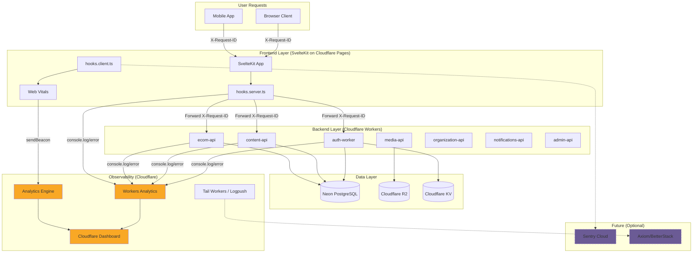

# Unified Observability Strategy

**Status**: Design Complete
**Created**: 2026-01-12
**Updated**: 2026-01-12
**Beads Task**: Codex-gtu

---

## Executive Summary

This document defines the unified observability strategy for Codex, spanning both the SvelteKit frontend and Cloudflare Workers backend. The strategy prioritizes:

1. **Cloudflare-native tools** — Zero additional cost, deeply integrated with our hosting platform
2. **Distributed tracing** — End-to-end request correlation via OpenTelemetry-compatible headers
3. **Structured logging** — Consistent JSON format with automatic PII redaction
4. **Graceful scaling path** — Easy migration to Sentry/Axiom when budget allows

### Cost Summary

| Layer | Tool | Cost |
|-------|------|------|
| Distributed Tracing | OpenTelemetry headers + Correlation IDs | Free |
| Centralized Logging | Cloudflare Workers Tail + Analytics | Free |
| Error Reporting | Cloudflare Analytics (+ Sentry future) | Free (or $26/mo) |
| Metrics (Backend) | Cloudflare Workers Analytics | Free |
| Metrics (Frontend) | Cloudflare Analytics Engine | Free |

**Total Phase 1 Cost**: $0/month

---

## Architecture Overview



---

## 1. Distributed Tracing

### Strategy: OpenTelemetry-Compatible Correlation IDs

We use W3C Trace Context headers (`traceparent`, `tracestate`) alongside a simpler `X-Request-ID` for backward compatibility. This enables future migration to full OpenTelemetry instrumentation.

### Request Flow

```
┌─────────────────────────────────────────────────────────────────────────────┐
│ User Request                                                                │
│ ├── X-Request-ID: req_abc123 (or auto-generated)                           │
│ └── traceparent: 00-{trace-id}-{span-id}-01                                │
└───────────────────────────────┬─────────────────────────────────────────────┘
                                │
                ┌───────────────▼───────────────┐
                │ SvelteKit (hooks.server.ts)   │
                │ ├── Extract/generate IDs      │
                │ ├── Set event.locals.requestId│
                │ └── Forward to Workers        │
                └───────────────┬───────────────┘
                                │
        ┌───────────────────────┼───────────────────────┐
        │                       │                       │
┌───────▼───────┐       ┌───────▼───────┐       ┌───────▼───────┐
│  auth-worker  │       │  content-api  │       │   ecom-api    │
│  requestId: X │       │  requestId: X │       │  requestId: X │
└───────────────┘       └───────────────┘       └───────────────┘
        │
        └───────────► All logs include requestId for correlation
```

### Implementation

#### Frontend: Request ID Middleware

```typescript
// apps/web/src/hooks.server.ts
import { sequence } from '@sveltejs/kit/hooks';
import type { Handle } from '@sveltejs/kit';

const TRACE_HEADER = 'traceparent';
const REQUEST_ID_HEADER = 'x-request-id';

function generateTraceId(): string {
  const bytes = crypto.getRandomValues(new Uint8Array(16));
  return Array.from(bytes).map(b => b.toString(16).padStart(2, '0')).join('');
}

function generateSpanId(): string {
  const bytes = crypto.getRandomValues(new Uint8Array(8));
  return Array.from(bytes).map(b => b.toString(16).padStart(2, '0')).join('');
}

const addTracing: Handle = async ({ event, resolve }) => {
  // Extract or generate trace context
  let traceparent = event.request.headers.get(TRACE_HEADER);
  let traceId: string;
  let spanId: string;

  if (traceparent) {
    const parts = traceparent.split('-');
    traceId = parts[1];
    spanId = generateSpanId(); // New span for this service
  } else {
    traceId = generateTraceId();
    spanId = generateSpanId();
    traceparent = `00-${traceId}-${spanId}-01`;
  }

  // Simple request ID (shorter, for logs)
  const requestId = event.request.headers.get(REQUEST_ID_HEADER)
    || `req_${traceId.substring(0, 12)}`;

  // Store in locals for downstream use
  event.locals.requestId = requestId;
  event.locals.traceId = traceId;
  event.locals.spanId = spanId;

  const response = await resolve(event);

  // Return trace headers
  response.headers.set(REQUEST_ID_HEADER, requestId);
  response.headers.set(TRACE_HEADER, traceparent);

  return response;
};

export const handle = sequence(addTracing);
```

#### Backend: Worker Tracing Middleware

```typescript
// packages/worker-utils/src/tracing.ts
import type { Context, Next } from 'hono';

export function tracingMiddleware() {
  return async (c: Context, next: Next) => {
    const requestId = c.req.header('x-request-id') || crypto.randomUUID();
    const traceparent = c.req.header('traceparent');

    // Store in context for use in handlers
    c.set('requestId', requestId);
    c.set('traceId', traceparent?.split('-')[1] ?? requestId);

    // Timing
    const start = Date.now();

    await next();

    const duration = Date.now() - start;

    // Response headers
    c.header('x-request-id', requestId);
    if (traceparent) {
      c.header('traceparent', traceparent);
    }

    // Log request completion with trace context
    console.log(JSON.stringify({
      level: 'info',
      message: 'Request completed',
      requestId,
      method: c.req.method,
      path: c.req.path,
      status: c.res.status,
      duration,
      timestamp: new Date().toISOString()
    }));
  };
}
```

### Propagating Context to Workers

```typescript
// apps/web/src/lib/api.ts
export async function fetchFromWorker(
  path: string,
  event: RequestEvent,
  options?: RequestInit
): Promise<Response> {
  const headers = new Headers(options?.headers);

  // Forward trace context
  headers.set('x-request-id', event.locals.requestId);
  if (event.locals.traceId) {
    headers.set('traceparent', `00-${event.locals.traceId}-${event.locals.spanId}-01`);
  }

  // Forward auth cookies
  const cookie = event.request.headers.get('cookie');
  if (cookie) {
    headers.set('cookie', cookie);
  }

  return fetch(`${WORKER_BASE_URL}${path}`, {
    ...options,
    headers
  });
}
```

---

## 2. Centralized Logging

### Strategy: Cloudflare Tail Workers + Optional Logpush

All logs are written as structured JSON to `console.log`/`console.error`. Cloudflare captures these automatically via Workers Analytics (24h retention free). For longer retention, enable Logpush to Axiom/R2/BetterStack.

### Log Format

```typescript
interface LogEntry {
  level: 'debug' | 'info' | 'warn' | 'error';
  message: string;
  timestamp: string;        // ISO 8601
  service: string;          // 'auth-worker', 'content-api', 'frontend', etc.
  environment: string;      // 'development', 'staging', 'production'
  requestId?: string;       // Correlation ID
  traceId?: string;         // W3C trace ID
  duration?: number;        // Request duration in ms
  metadata?: Record<string, unknown>; // Additional context (auto-redacted)
}
```

### Using @codex/observability

The existing `@codex/observability` package provides structured logging with automatic PII redaction:

```typescript
// workers/auth/src/index.ts
import { ObservabilityClient, createRequestTimer } from '@codex/observability';

const obs = new ObservabilityClient('auth-worker', env.ENVIRONMENT);

app.use('*', async (c, next) => {
  const timer = createRequestTimer(obs, {
    url: c.req.url,
    method: c.req.method,
    headers: c.req.header
  });

  try {
    await next();
    timer.end(c.res.status);
  } catch (error) {
    obs.trackError(error, {
      url: c.req.url,
      method: c.req.method,
      requestId: c.get('requestId')
    });
    throw error;
  }
});
```

### Cloudflare Logpush Configuration (Production)

For production log retention beyond 24 hours, enable Logpush via Cloudflare Dashboard or API:

```typescript
// infrastructure/cloudflare/logpush-config.ts
export const logpushConfig = {
  destination: 'https://api.axiom.co/v1/datasets/{dataset}/ingest',
  dataset: 'workers_logs',
  filter: {
    // Only push error-level logs to save costs
    where: {
      key: 'Outcome',
      operator: 'eq',
      value: 'exception'
    }
  },
  headers: {
    'Authorization': 'Bearer ${AXIOM_API_TOKEN}',
    'Content-Type': 'application/json'
  }
};
```

### Log Levels by Environment

| Environment | debug | info | warn | error |
|-------------|-------|------|------|-------|
| development | ✅ | ✅ | ✅ | ✅ |
| staging | ❌ | ✅ | ✅ | ✅ |
| production | ❌ | ❌ | ✅ | ✅ |

---

## 3. Error Reporting

### Strategy: Cloudflare Analytics + Future Sentry

**Phase 1 (Now)**: Use Cloudflare's built-in error tracking via Workers Analytics and console.error.

**Phase 2 (When budget allows)**: Add Sentry for automatic error grouping, stack traces with source maps, and session replay.

### Phase 1: Cloudflare-Native Error Tracking

#### Frontend Error Handler

```typescript
// apps/web/src/hooks.client.ts
import type { HandleClientError } from '@sveltejs/kit';

export const handleError: HandleClientError = async ({ error, event, status, message }) => {
  const errorData = {
    type: 'client',
    message: error instanceof Error ? error.message : String(error),
    stack: error instanceof Error ? error.stack : undefined,
    url: event.url.pathname,
    status,
    timestamp: Date.now(),
    userAgent: navigator.userAgent
  };

  // Log to console (visible in browser dev tools)
  console.error('[Client Error]', JSON.stringify(errorData));

  // Report to Analytics Engine via beacon
  if ('sendBeacon' in navigator) {
    navigator.sendBeacon('/api/errors', JSON.stringify(errorData));
  }

  return {
    message: 'Something went wrong',
    code: status?.toString() ?? 'unknown'
  };
};
```

#### Backend Error Handler

```typescript
// packages/worker-utils/src/error-handler.ts
import { ObservabilityClient } from '@codex/observability';

export function createErrorHandler(obs: ObservabilityClient) {
  return (err: Error, c: Context) => {
    const errorData = {
      name: err.name,
      message: err.message,
      stack: err.stack,
      url: c.req.url,
      method: c.req.method,
      requestId: c.get('requestId')
    };

    obs.error('Unhandled error', errorData);

    // Write to Analytics Engine for aggregation
    c.env?.ANALYTICS?.writeDataPoint({
      blobs: ['error', err.name, c.req.path],
      doubles: [c.res?.status ?? 500, Date.now()],
      indexes: ['worker_errors']
    });

    return c.json(
      { error: 'Internal Server Error', requestId: c.get('requestId') },
      500
    );
  };
}
```

### Phase 2: Sentry Integration (Future)

When budget allows ($26/month for Team plan), add Sentry with minimal code changes:

```typescript
// packages/observability/src/sentry.ts
import * as Sentry from '@sentry/cloudflare';

export function initSentry(env: Env) {
  Sentry.init({
    dsn: env.SENTRY_DSN,
    environment: env.ENVIRONMENT,
    tracesSampleRate: env.ENVIRONMENT === 'production' ? 0.1 : 1.0,
    beforeSend(event) {
      // Redact PII
      if (event.user?.email) {
        event.user.email = '[REDACTED]';
      }
      return event;
    }
  });
}

export function captureError(error: Error, context?: Record<string, unknown>) {
  Sentry.captureException(error, { extra: context });
}
```

```typescript
// apps/web/src/hooks.client.ts (updated)
import { captureError } from '@codex/observability/sentry';

export const handleError: HandleClientError = async ({ error, event }) => {
  // Existing console.error logging...

  // Add Sentry when available
  if (error instanceof Error) {
    captureError(error, { url: event.url.pathname });
  }

  return { message: 'Something went wrong' };
};
```

---

## 4. Metrics

### Strategy: Cloudflare Analytics Engine + Workers Analytics

**Backend metrics**: Captured automatically via Cloudflare Workers Analytics (request count, CPU time, errors).

**Frontend metrics**: Web Vitals (LCP, CLS, INP, FCP, TTFB) sent to Cloudflare Analytics Engine.

**Custom metrics**: Business metrics (signups, purchases, content views) sent to Analytics Engine.

### Analytics Engine Binding

```jsonc
// wrangler.jsonc (all workers)
{
  "analytics_engine_datasets": [
    {
      "binding": "ANALYTICS",
      "dataset": "codex_metrics"
    }
  ]
}
```

### Web Vitals Collection

```typescript
// apps/web/src/lib/vitals.ts
import { onCLS, onINP, onLCP, onTTFB, onFCP } from 'web-vitals';

export function initWebVitals() {
  const report = (name: string, value: number, rating: string) => {
    if ('sendBeacon' in navigator) {
      navigator.sendBeacon('/api/vitals', JSON.stringify({
        name,
        value,
        rating,
        page: window.location.pathname,
        timestamp: Date.now()
      }));
    }
  };

  onCLS((m) => report('cls', m.value, m.rating));
  onINP((m) => report('inp', m.value, m.rating));
  onLCP((m) => report('lcp', m.value, m.rating));
  onTTFB((m) => report('ttfb', m.value, m.rating));
  onFCP((m) => report('fcp', m.value, m.rating));
}
```

```typescript
// apps/web/src/routes/api/vitals/+server.ts
import type { RequestHandler } from './$types';

export const POST: RequestHandler = async ({ request, platform }) => {
  const vital = await request.json();

  platform?.env?.ANALYTICS?.writeDataPoint({
    blobs: [vital.name, vital.page, vital.rating],
    doubles: [vital.value, vital.timestamp],
    indexes: ['web_vitals']
  });

  return new Response(null, { status: 204 });
};
```

### Custom Business Metrics

```typescript
// packages/observability/src/metrics.ts
export interface MetricPoint {
  name: string;
  value: number;
  tags?: Record<string, string>;
  timestamp?: number;
}

export function trackMetric(
  analytics: AnalyticsEngineDataset,
  metric: MetricPoint
) {
  const tags = metric.tags
    ? Object.values(metric.tags).slice(0, 3)
    : [];

  analytics.writeDataPoint({
    blobs: [metric.name, ...tags],
    doubles: [metric.value, metric.timestamp ?? Date.now()],
    indexes: ['business_metrics']
  });
}

// Usage example:
trackMetric(env.ANALYTICS, {
  name: 'content_published',
  value: 1,
  tags: { type: 'article', plan: 'pro' }
});
```

### SLOs (Service Level Objectives)

| Metric | Target | Measurement |
|--------|--------|-------------|
| Availability | 99.9% | Workers Analytics (successful requests / total) |
| P95 Latency | < 200ms | Workers Analytics (CPU time) |
| Error Rate | < 0.1% | Workers Analytics (errors / total) |
| LCP | < 2.5s | Analytics Engine (web_vitals index) |
| CLS | < 0.1 | Analytics Engine (web_vitals index) |
| INP | < 200ms | Analytics Engine (web_vitals index) |

---

## 5. Alerting

### Cloudflare Notifications (Built-in)

Configure via Cloudflare Dashboard → Notifications:

| Alert | Condition | Channel |
|-------|-----------|---------|
| Worker Error Spike | Error rate > 1% (5 min) | Email + Slack |
| High CPU Usage | Avg CPU > 10ms (15 min) | Email |
| Origin Unreachable | 5xx responses > 10 (5 min) | Email + Slack + PagerDuty |
| SSL Certificate Expiry | 14 days before expiry | Email |

### Custom Slack Alerts

```typescript
// packages/observability/src/alerts.ts
interface AlertConfig {
  webhookUrl: string;
  channel?: string;
  username?: string;
}

export async function sendSlackAlert(
  config: AlertConfig,
  message: string,
  severity: 'info' | 'warning' | 'critical'
) {
  const colors = {
    info: '#36a64f',
    warning: '#ff9800',
    critical: '#f44336'
  };

  await fetch(config.webhookUrl, {
    method: 'POST',
    headers: { 'Content-Type': 'application/json' },
    body: JSON.stringify({
      channel: config.channel,
      username: config.username ?? 'Codex Alerts',
      attachments: [{
        color: colors[severity],
        text: message,
        footer: `Codex ${severity.toUpperCase()}`,
        ts: Math.floor(Date.now() / 1000)
      }]
    })
  });
}
```

---

## 6. Dashboard & Querying

### Cloudflare Dashboard Views

| View | Location | Data |
|------|----------|------|
| Worker Overview | Workers & Pages → Analytics | Requests, CPU, errors |
| Real-time Logs | Workers & Pages → Logs | Last 24h structured logs |
| Custom Metrics | Analytics → SQL Analytics | Analytics Engine data |

### Analytics Engine GraphQL Queries

```graphql
# Error count by worker in last 24h
query ErrorsByWorker {
  viewer {
    accounts(filter: { accountTag: "your-account-id" }) {
      data: analyticsEngineData(
        filter: {
          datetime_geq: "2026-01-11T00:00:00Z"
          index1: "worker_errors"
        }
        limit: 100
      ) {
        count
        dimensions {
          blob2  # Worker name
        }
      }
    }
  }
}

# Web Vitals averages by page
query WebVitalsByPage {
  viewer {
    accounts(filter: { accountTag: "your-account-id" }) {
      data: analyticsEngineData(
        filter: {
          index1: "web_vitals"
          datetime_geq: "2026-01-11T00:00:00Z"
        }
        limit: 1000
      ) {
        avg { double1 }  # Metric value
        dimensions {
          blob1  # Metric name (lcp, cls, etc.)
          blob2  # Page path
        }
      }
    }
  }
}
```

---

## Implementation Checklist

### Phase 1: Foundation (Week 1)

- [ ] Add tracing middleware to all workers
- [ ] Add request ID middleware to SvelteKit hooks
- [ ] Configure Analytics Engine binding in all wrangler.jsonc files
- [ ] Set up error ingestion endpoint `/api/errors`
- [ ] Set up vitals ingestion endpoint `/api/vitals`
- [ ] Add Web Vitals collection to frontend

### Phase 2: Integration (Week 2)

- [ ] Update `@codex/observability` with adapter pattern for multi-destination logging
- [ ] Add `tracingMiddleware` to `@codex/worker-utils`
- [ ] Configure Cloudflare Notifications for critical alerts
- [ ] Set up Slack webhook for alerts
- [ ] Document dashboard locations in runbook

### Phase 3: Production Hardening (Week 3)

- [ ] Enable Logpush to R2 for log archival (optional)
- [ ] Create GraphQL dashboard queries
- [ ] Define SLO thresholds and alerting rules
- [ ] Create incident response runbook
- [ ] Load test observability infrastructure

### Phase 4: Enhanced Monitoring (Future)

- [ ] Add Sentry integration when budget allows
- [ ] Enable Axiom/BetterStack for long-term log retention
- [ ] Add full OpenTelemetry tracing export
- [ ] Implement distributed trace visualization

---

## Related Documents

- [ARCHITECTURE.md](./ARCHITECTURE.md) — System architecture overview
- [design/frontend/OBSERVABILITY_PLAN.md](./frontend/OBSERVABILITY_PLAN.md) — Frontend-specific observability details
- [packages/observability/CLAUDE.md](../packages/observability/CLAUDE.md) — Package documentation
- [design/infrastructure/SECURITY.md](./infrastructure/SECURITY.md) — Security and incident response

---

## Decision Log

| Date | Decision | Rationale |
|------|----------|-----------|
| 2026-01-12 | Cloudflare-native over Sentry | Zero cost, sufficient for launch |
| 2026-01-12 | OpenTelemetry-compatible headers | Future-proofing for full OTel |
| 2026-01-12 | Analytics Engine for custom metrics | Free tier covers expected volume |
| 2026-01-12 | Structured JSON logging | Enables Logpush to any destination |
