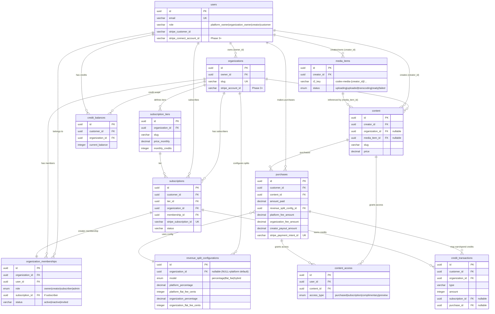

# Database Schema Revision - Phase 1 Alignment

**Date**: 2025-11-08
**Version**: 2.0
**Status**: 🚧 Proposal - Awaiting Review

---

## Purpose

This document provides comprehensive updates to `database-schema.md` to align with:
1. **Corrected Architecture** - Creator-owned media, proper user roles
2. **Revenue Splitting** - 3-way splits (platform/organization/creator) with configurable models
3. **Organization Membership** - Proper creator-organization relationships
4. **Subscription Scoping** - Organization-level vs platform-wide subscriptions
5. **Credit System** - Clarified purpose and scoping
6. **Stripe Connect Integration** - Best practices for multi-party payouts

---

## Section 1: Conceptual Model

### User Types & Roles

```
┌─────────────────────────────────────────────────────────────┐
│                    Platform Architecture                     │
├─────────────────────────────────────────────────────────────┤
│                                                              │
│  Platform Owner (Super Admin - Developer)                   │
│  ├─ Manages platform settings                               │
│  ├─ Has access to all organizations                         │
│  └─ Not a content creator                                   │
│                                                              │
│  Organization Owner (Business Operator + Creator)           │
│  ├─ Owns an organization                                    │
│  ├─ IS ALSO a creator (can upload/sell content)             │
│  ├─ Can invite other creators to organization (Phase 2+)    │
│  └─ Manages organization settings and revenue splits        │
│                                                              │
│  Creator (Content Producer)                                 │
│  ├─ Can belong to one or more organizations                 │
│  ├─ Owns their media files (creator_id on media_items)      │
│  ├─ Can post content to personal profile OR organizations   │
│  └─ Receives payouts via Stripe Connect (Phase 3+)          │
│                                                              │
│  Customer (End User / Buyer)                                │
│  ├─ Purchases content from creators/organizations           │
│  ├─ May have subscriptions to organizations (Phase 2+)      │
│  └─ May have credit balance (Phase 2+)                      │
│                                                              │
└─────────────────────────────────────────────────────────────┘
```

### Content Ownership Model

```
┌──────────────────────────────────────────────────────────────┐
│                  Creator → Media → Content Flow              │
├──────────────────────────────────────────────────────────────┤
│                                                               │
│  1. Creator uploads video to R2                              │
│     └─ media_items.creator_id = {creator_id}                 │
│     └─ Stored in: codex-media-{creator_id}/originals/        │
│                                                               │
│  2. Creator creates content post                             │
│     └─ content.creator_id = {creator_id}                     │
│     └─ content.media_item_id = {media_id}                    │
│     └─ content.organization_id = NULL | {org_id}             │
│        ├─ NULL = Personal creator profile                    │
│        └─ {org_id} = Posted to organization                  │
│                                                               │
│  3. Customer purchases content                               │
│     └─ purchases.customer_id = {customer_id}                 │
│     └─ purchases.content_id = {content_id}                   │
│     └─ Revenue split calculation:                            │
│        ├─ Platform Fee (configurable)                        │
│        ├─ Organization Fee (if org content, configurable)    │
│        └─ Creator Payout (remainder)                         │
│                                                               │
└──────────────────────────────────────────────────────────────┘
```

### Revenue Split Models

```
┌──────────────────────────────────────────────────────────────┐
│               Revenue Split Scenarios                        │
├──────────────────────────────────────────────────────────────┤
│                                                               │
│  SCENARIO A: Personal Creator Content                        │
│  ┌─────────────────────────────────────┐                    │
│  │ Customer pays $100                  │                    │
│  │ ├─ Platform: 5% = $5                │ (percentage model) │
│  │ └─ Creator: 95% = $95               │                    │
│  └─────────────────────────────────────┘                    │
│                                                               │
│  SCENARIO B: Organization Content (Percentage Model)         │
│  ┌─────────────────────────────────────┐                    │
│  │ Customer pays $100                  │                    │
│  │ ├─ Platform: 5% = $5                │                    │
│  │ ├─ Organization: 20% = $20          │                    │
│  │ └─ Creator: 75% = $75               │                    │
│  └─────────────────────────────────────┘                    │
│                                                               │
│  SCENARIO C: Organization Content (Flat Fee Model)           │
│  ┌─────────────────────────────────────┐                    │
│  │ Customer pays $100                  │                    │
│  │ ├─ Platform: $2 flat fee            │                    │
│  │ ├─ Organization: $10 flat fee       │                    │
│  │ └─ Creator: $88 remainder           │                    │
│  └─────────────────────────────────────┘                    │
│                                                               │
│  SCENARIO D: Hybrid Model                                    │
│  ┌─────────────────────────────────────┐                    │
│  │ Customer pays $100                  │                    │
│  │ ├─ Platform: 5% + $1 = $6           │ (percentage + flat)│
│  │ ├─ Organization: $5 flat            │                    │
│  │ └─ Creator: $89 remainder           │                    │
│  └─────────────────────────────────────┘                    │
│                                                               │
└──────────────────────────────────────────────────────────────┘
```

### Subscription Model (Phase 2+)

```
┌──────────────────────────────────────────────────────────────┐
│         Subscription & Organization Membership               │
├──────────────────────────────────────────────────────────────┤
│                                                               │
│  Organization has subscription_tiers                         │
│  ├─ "Basic Membership" - $10/month                           │
│  ├─ "Premium Membership" - $30/month                         │
│  └─ "VIP Membership" - $100/month                            │
│                                                               │
│  Customer subscribes to tier                                 │
│  ├─ Creates: subscription record                             │
│  ├─ Grants: organization_membership (role: 'subscriber')     │
│  └─ Access: All content with visibility='members_only'       │
│                                                               │
│  Membership types:                                           │
│  ├─ 'owner' - Organization owner (1 per org)                 │
│  ├─ 'creator' - Invited creator (can post content)           │
│  ├─ 'subscriber' - Paying member (Phase 2+)                  │
│  └─ 'admin' - Manager role (Phase 3+)                        │
│                                                               │
└──────────────────────────────────────────────────────────────┘
```

---

## Section 2: Schema Updates

### 2.1 Fixed User Roles

**File**: `database-schema.md` Line 32

**❌ OLD (Incorrect)**:
```sql
role VARCHAR(50) NOT NULL CHECK (role IN ('platform_creator', 'platform_owner', 'media_owner', 'customer')),
-- Phase 1: Only platform_owner and customer used
-- Phase 3: media_owner introduced
```

**✅ NEW (Correct)**:
```sql
role VARCHAR(50) NOT NULL CHECK (role IN ('platform_owner', 'organization_owner', 'creator', 'customer')),
-- Phase 1: platform_owner, organization_owner, customer
--   - organization_owner IS ALSO a creator (has entries in organization_memberships)
--   - Database supports 'creator' role from day 1, but Phase 1 UI only for org owner
-- Phase 2+: 'creator' role used for invited creators
```

**Explanation**:
- `platform_owner` = Super admin (developer), manages platform settings
- `organization_owner` = Business operator who IS ALSO a content creator
- `creator` = Additional creators invited to organizations (Phase 2+)
- `customer` = End users who purchase content

---

### 2.2 Organizations Table

**Current**: Table exists but needs clarification

**Enhanced Schema**:
```sql
CREATE TABLE organizations (
  id UUID PRIMARY KEY DEFAULT gen_random_uuid(),

  -- Ownership
  owner_id UUID NOT NULL REFERENCES users(id), -- Must have role='organization_owner'

  -- Basic Info
  name VARCHAR(255) NOT NULL,
  slug VARCHAR(255) UNIQUE NOT NULL, -- URL-friendly: /org/{slug}
  description TEXT,
  logo_url TEXT,

  -- Settings
  settings JSONB DEFAULT '{}',
  -- e.g., { branding: {...}, payment_settings: {...} }

  -- Stripe Connect (Phase 3+)
  stripe_account_id VARCHAR(255), -- Connected account ID for payouts
  stripe_account_status VARCHAR(50), -- 'pending', 'active', 'restricted'
  stripe_onboarding_completed BOOLEAN DEFAULT FALSE,

  -- Status
  status VARCHAR(50) NOT NULL DEFAULT 'active'
    CHECK (status IN ('active', 'suspended', 'archived')),

  created_at TIMESTAMP NOT NULL DEFAULT NOW(),
  updated_at TIMESTAMP NOT NULL DEFAULT NOW(),
  deleted_at TIMESTAMP,

  INDEX idx_organizations_owner_id (owner_id),
  INDEX idx_organizations_slug (slug),
  INDEX idx_organizations_status (status)
);
```

**Phase 1 Usage**:
- Single organization per platform owner
- `owner_id` references the organization owner
- Organization owner can post content and manage settings

---

### 2.3 NEW: Organization Memberships Table

**Purpose**: Track which creators belong to which organizations and their roles

```sql
CREATE TYPE org_membership_role AS ENUM ('owner', 'creator', 'subscriber', 'admin');

CREATE TABLE organization_memberships (
  id UUID PRIMARY KEY DEFAULT gen_random_uuid(),

  organization_id UUID NOT NULL REFERENCES organizations(id) ON DELETE CASCADE,
  user_id UUID NOT NULL REFERENCES users(id) ON DELETE CASCADE,

  -- Role within organization
  role org_membership_role NOT NULL,
  -- 'owner' = Organization owner (only one per org)
  -- 'creator' = Invited creator (can post content)
  -- 'subscriber' = Paying member via subscription (Phase 2+)
  -- 'admin' = Manager role (Phase 3+)

  -- Permissions (JSONB for flexibility)
  permissions JSONB DEFAULT '{}',
  -- Phase 1: Empty
  -- Phase 2+: { can_post: true, can_edit_others: false, can_manage_members: false }

  -- Status
  status VARCHAR(50) NOT NULL DEFAULT 'active'
    CHECK (status IN ('active', 'inactive', 'invited')),
  -- 'active' = Current member
  -- 'inactive' = Removed/left organization
  -- 'invited' = Pending invitation acceptance (Phase 2+)

  -- Subscription link (Phase 2+)
  subscription_id UUID REFERENCES subscriptions(id),
  -- If role='subscriber', this links to their active subscription

  invited_by UUID REFERENCES users(id),
  invited_at TIMESTAMP,
  joined_at TIMESTAMP,

  created_at TIMESTAMP NOT NULL DEFAULT NOW(),
  updated_at TIMESTAMP NOT NULL DEFAULT NOW(),

  INDEX idx_org_memberships_org_id (organization_id),
  INDEX idx_org_memberships_user_id (user_id),
  INDEX idx_org_memberships_role (organization_id, role),
  INDEX idx_org_memberships_subscription_id (subscription_id),

  -- Constraints
  UNIQUE (organization_id, user_id), -- User can't have duplicate memberships

  -- Only one owner per organization
  UNIQUE (organization_id, user_id) WHERE role = 'owner'
);
```

**Phase 1 Usage**:
- Created automatically when organization is created (owner membership)
- `role = 'owner'` for organization owner
- Phase 1: Single membership (owner only)
- Phase 2+: Add creators with `role = 'creator'`
- Phase 2+: Subscriptions create `role = 'subscriber'` memberships

---

### 2.4 NEW: Revenue Split Configurations

**Purpose**: Configure how revenue is split between platform, organization, and creator

```sql
CREATE TYPE split_model AS ENUM ('percentage', 'flat_fee', 'hybrid');

CREATE TABLE revenue_split_configurations (
  id UUID PRIMARY KEY DEFAULT gen_random_uuid(),

  -- Scope
  organization_id UUID REFERENCES organizations(id) ON DELETE CASCADE,
  -- NULL = platform-wide default
  -- NOT NULL = organization-specific override

  -- Model Type
  model split_model NOT NULL,
  -- 'percentage' = All splits as percentages
  -- 'flat_fee' = All splits as fixed amounts
  -- 'hybrid' = Mix of percentage and flat fee

  -- Platform Split
  platform_percentage DECIMAL(5,2), -- e.g., 5.00 for 5%
  platform_flat_fee_cents INTEGER,  -- e.g., 200 for $2.00
  -- At least one must be set

  -- Organization Split (only applies if content.organization_id NOT NULL)
  organization_percentage DECIMAL(5,2), -- e.g., 20.00 for 20%
  organization_flat_fee_cents INTEGER,  -- e.g., 1000 for $10.00

  -- Creator gets remainder after platform + organization fees

  -- Constraints
  CHECK (
    (model = 'percentage' AND platform_percentage IS NOT NULL) OR
    (model = 'flat_fee' AND platform_flat_fee_cents IS NOT NULL) OR
    (model = 'hybrid' AND (platform_percentage IS NOT NULL OR platform_flat_fee_cents IS NOT NULL))
  ),

  -- Status
  active BOOLEAN NOT NULL DEFAULT TRUE,
  effective_from TIMESTAMP NOT NULL DEFAULT NOW(),
  effective_until TIMESTAMP, -- NULL = active indefinitely

  -- Notes
  description TEXT, -- e.g., "Standard platform fee - 5% + $0.50"

  created_at TIMESTAMP NOT NULL DEFAULT NOW(),
  updated_at TIMESTAMP NOT NULL DEFAULT NOW(),

  INDEX idx_revenue_split_org_id (organization_id),
  INDEX idx_revenue_split_active (active, effective_from, effective_until)
);
```

**Phase 1 Default Configuration**:
```sql
INSERT INTO revenue_split_configurations (
  organization_id, -- NULL = platform default
  model,
  platform_percentage,
  platform_flat_fee_cents,
  organization_percentage,
  description
) VALUES (
  NULL,
  'percentage',
  0.00,  -- Phase 1: 0% platform fee
  0,     -- Phase 1: $0 flat fee
  0.00,  -- Phase 1: 0% organization fee
  'Phase 1 - No platform fees (100% to creator)'
);
```

**Phase 2+ Example**:
```sql
INSERT INTO revenue_split_configurations (
  organization_id, -- NULL = platform default
  model,
  platform_percentage,
  platform_flat_fee_cents,
  organization_percentage,
  description
) VALUES (
  NULL,
  'hybrid',
  5.00,  -- 5% platform fee
  50,    -- + $0.50 flat fee
  NULL,  -- Organizations configure their own fee
  'Platform default: 5% + $0.50 per transaction'
);

-- Organization-specific override
INSERT INTO revenue_split_configurations (
  organization_id,
  model,
  organization_percentage,
  description
) VALUES (
  '{some-org-id}',
  'percentage',
  20.00, -- Organization takes 20%
  'Yoga Studio - 20% organization fee'
);
```

**Revenue Calculation Logic** (pseudocode):
```typescript
function calculateRevenueSplit(purchase: Purchase, content: Content): RevenueSplit {
  const totalAmount = purchase.amountPaid;

  // Get active split configuration
  const config = getActiveSplitConfig(content.organizationId);

  // Calculate platform fee
  let platformFee = 0;
  if (config.platformPercentage) {
    platformFee += totalAmount * (config.platformPercentage / 100);
  }
  if (config.platformFlatFeeCents) {
    platformFee += config.platformFlatFeeCents / 100;
  }

  // Calculate organization fee (only if content posted to org)
  let organizationFee = 0;
  if (content.organizationId) {
    if (config.organizationPercentage) {
      organizationFee += (totalAmount - platformFee) * (config.organizationPercentage / 100);
    }
    if (config.organizationFlatFeeCents) {
      organizationFee += config.organizationFlatFeeCents / 100;
    }
  }

  // Creator gets remainder
  const creatorPayout = totalAmount - platformFee - organizationFee;

  return {
    platformFeeAmount: platformFee,
    organizationFeeAmount: organizationFee,
    creatorPayoutAmount: creatorPayout
  };
}
```

---

### 2.5 Updated Purchases Table

**File**: `database-schema.md` Lines 269-310

**Changes**:
1. Add `organization_fee_amount` field
2. Update comments to reflect 3-way split
3. Add `revenue_split_config_id` to track which config was used
4. Add Stripe Connect payout tracking fields

```sql
CREATE TABLE purchases (
  id UUID PRIMARY KEY DEFAULT gen_random_uuid(),

  -- Relationships
  customer_id UUID NOT NULL REFERENCES users(id),
  content_id UUID NOT NULL REFERENCES content(id),

  -- Payment Details
  amount_paid DECIMAL(10,2) NOT NULL,
  currency VARCHAR(3) NOT NULL DEFAULT 'usd',

  -- Stripe IDs
  stripe_payment_intent_id VARCHAR(255) UNIQUE NOT NULL,
  stripe_checkout_session_id VARCHAR(255) UNIQUE,

  -- Revenue Split (calculated at purchase time)
  revenue_split_config_id UUID REFERENCES revenue_split_configurations(id),
  -- Tracks which config was used for this purchase

  platform_fee_amount DECIMAL(10,2) NOT NULL DEFAULT 0,
  -- Phase 1: 0
  -- Phase 2+: Based on revenue_split_configuration

  organization_fee_amount DECIMAL(10,2) NOT NULL DEFAULT 0,
  -- Phase 1: 0
  -- Phase 2+: Based on revenue_split_configuration (only if content.organization_id NOT NULL)

  creator_payout_amount DECIMAL(10,2) NOT NULL,
  -- Phase 1: = amount_paid (100% to creator)
  -- Phase 2+: = amount_paid - platform_fee_amount - organization_fee_amount

  -- Verification
  CHECK (amount_paid = platform_fee_amount + organization_fee_amount + creator_payout_amount),

  -- Stripe Connect Payout Tracking (Phase 3+)
  creator_payout_status VARCHAR(50) DEFAULT 'pending'
    CHECK (creator_payout_status IN ('pending', 'paid', 'failed')),
  creator_stripe_transfer_id VARCHAR(255), -- Stripe Transfer ID
  creator_payout_at TIMESTAMP,

  organization_payout_status VARCHAR(50) DEFAULT 'pending',
  organization_stripe_transfer_id VARCHAR(255),
  organization_payout_at TIMESTAMP,

  -- Status
  status VARCHAR(50) NOT NULL DEFAULT 'pending'
    CHECK (status IN ('pending', 'completed', 'refunded', 'failed')),

  -- Refund Tracking
  refunded_at TIMESTAMP,
  refund_reason TEXT,
  refund_amount DECIMAL(10,2), -- Can be partial in Phase 2+
  stripe_refund_id VARCHAR(255),

  -- Timestamps
  purchased_at TIMESTAMP,
  created_at TIMESTAMP NOT NULL DEFAULT NOW(),
  updated_at TIMESTAMP NOT NULL DEFAULT NOW(),

  -- Indexes
  INDEX idx_purchases_customer_id (customer_id),
  INDEX idx_purchases_content_id (content_id),
  INDEX idx_purchases_status (status),
  INDEX idx_purchases_created_at (created_at),
  INDEX idx_purchases_stripe_payment_intent_id (stripe_payment_intent_id),
  INDEX idx_purchases_payout_status (creator_payout_status, organization_payout_status),

  -- Constraint: Can't purchase same content twice (unless refunded)
  UNIQUE (customer_id, content_id) WHERE status = 'completed' AND refunded_at IS NULL
);
```

---

### 2.6 Updated Subscription Tables (Organization-Scoped)

**File**: `database-schema.md` Lines 461-542

**Key Changes**:
1. Add `organization_id` to `subscription_tiers`
2. Add `organization_id` to `subscriptions`
3. Link subscriptions to organization memberships
4. Clarify relationship between subscription and membership

#### subscription_tiers

```sql
CREATE TABLE subscription_tiers (
  id UUID PRIMARY KEY DEFAULT gen_random_uuid(),

  -- Organization Scoping
  organization_id UUID NOT NULL REFERENCES organizations(id) ON DELETE CASCADE,
  -- Subscriptions are ORGANIZATION-SCOPED (not platform-wide)
  -- Each organization defines its own tiers

  name VARCHAR(255) NOT NULL, -- e.g., "Basic Membership", "VIP Access"
  slug VARCHAR(255) NOT NULL, -- URL-friendly
  description TEXT,

  -- Pricing
  price_monthly DECIMAL(10,2),
  price_yearly DECIMAL(10,2),

  -- Benefits
  benefits JSONB DEFAULT '{}',
  -- e.g., {
  --   content_access: { categories: ['yoga', 'meditation'], full_catalog: false },
  --   monthly_credits: 10,
  --   credit_rollover: true,
  --   priority_support: true
  -- }

  -- Content Access Rules
  category_access JSONB DEFAULT '[]', -- Array of categories granted
  full_catalog_access BOOLEAN NOT NULL DEFAULT FALSE, -- Access to all org content?

  -- Credits (Phase 2+)
  monthly_credits INTEGER NOT NULL DEFAULT 0,
  credit_rollover BOOLEAN NOT NULL DEFAULT FALSE,

  -- Status
  active BOOLEAN NOT NULL DEFAULT TRUE,
  display_order INTEGER NOT NULL DEFAULT 0,

  created_at TIMESTAMP NOT NULL DEFAULT NOW(),
  updated_at TIMESTAMP NOT NULL DEFAULT NOW(),

  INDEX idx_subscription_tiers_org_id (organization_id),
  INDEX idx_subscription_tiers_active (organization_id, active),

  UNIQUE (organization_id, slug) -- Slug unique per organization
);
```

#### subscriptions

```sql
CREATE TABLE subscriptions (
  id UUID PRIMARY KEY DEFAULT gen_random_uuid(),

  -- Relationships
  customer_id UUID NOT NULL REFERENCES users(id) ON DELETE CASCADE,
  tier_id UUID NOT NULL REFERENCES subscription_tiers(id),
  organization_id UUID NOT NULL REFERENCES organizations(id) ON DELETE CASCADE,
  -- organization_id denormalized for query efficiency
  -- Must match subscription_tiers.organization_id

  -- Stripe
  stripe_subscription_id VARCHAR(255) UNIQUE NOT NULL,
  stripe_customer_id VARCHAR(255) NOT NULL, -- Customer's Stripe ID

  -- Billing
  billing_period VARCHAR(20) NOT NULL CHECK (billing_period IN ('monthly', 'yearly')),
  current_period_start TIMESTAMP NOT NULL,
  current_period_end TIMESTAMP NOT NULL,

  -- Status
  status VARCHAR(50) NOT NULL
    CHECK (status IN ('active', 'past_due', 'canceled', 'trialing', 'incomplete')),
  cancel_at_period_end BOOLEAN NOT NULL DEFAULT FALSE,

  -- Trial
  trial_end TIMESTAMP,

  -- Membership Link
  membership_id UUID REFERENCES organization_memberships(id),
  -- Links to the organization_membership record created by this subscription
  -- When subscription is active, membership.role = 'subscriber'
  -- When subscription ends, membership.status = 'inactive'

  created_at TIMESTAMP NOT NULL DEFAULT NOW(),
  updated_at TIMESTAMP NOT NULL DEFAULT NOW(),
  canceled_at TIMESTAMP,
  ended_at TIMESTAMP,

  INDEX idx_subscriptions_customer_id (customer_id),
  INDEX idx_subscriptions_org_id (organization_id),
  INDEX idx_subscriptions_status (status),
  INDEX idx_subscriptions_stripe_subscription_id (stripe_subscription_id),
  INDEX idx_subscriptions_membership_id (membership_id),

  -- Ensure organization_id matches tier's organization
  CHECK (organization_id = (SELECT organization_id FROM subscription_tiers WHERE id = tier_id))
);
```

**Subscription Workflow**:
1. Customer subscribes to tier → Creates `subscription` record
2. Subscription webhook (`customer.subscription.created`) → Creates `organization_membership` with `role='subscriber'`
3. Active subscription → `membership.status = 'active'`
4. Subscription canceled → `membership.status = 'inactive'`
5. Content Access checks: `WHERE user_id IN (SELECT user_id FROM organization_memberships WHERE organization_id = X AND status = 'active')`

---

### 2.7 Updated Credit System (Organization-Scoped)

**File**: `database-schema.md` Lines 545-601

**Key Changes**:
1. Scope credits to organizations (not platform-wide)
2. Clarify purpose: Subscriber benefits and gifting
3. Link to subscriptions and organization memberships

#### credit_balances

```sql
CREATE TABLE credit_balances (
  id UUID PRIMARY KEY DEFAULT gen_random_uuid(),

  customer_id UUID NOT NULL REFERENCES users(id) ON DELETE CASCADE,
  organization_id UUID NOT NULL REFERENCES organizations(id) ON DELETE CASCADE,
  -- Credits are ORGANIZATION-SCOPED
  -- Customer has separate credit balance per organization

  current_balance INTEGER NOT NULL DEFAULT 0,
  lifetime_earned INTEGER NOT NULL DEFAULT 0,
  lifetime_spent INTEGER NOT NULL DEFAULT 0,

  updated_at TIMESTAMP NOT NULL DEFAULT NOW(),
  created_at TIMESTAMP NOT NULL DEFAULT NOW(),

  INDEX idx_credit_balances_customer_id (customer_id),
  INDEX idx_credit_balances_org_id (organization_id),

  UNIQUE (customer_id, organization_id) -- One balance per customer per org
);
```

#### credit_transactions

```sql
CREATE TABLE credit_transactions (
  id UUID PRIMARY KEY DEFAULT gen_random_uuid(),

  customer_id UUID NOT NULL REFERENCES users(id) ON DELETE CASCADE,
  organization_id UUID NOT NULL REFERENCES organizations(id) ON DELETE CASCADE,

  type VARCHAR(50) NOT NULL
    CHECK (type IN (
      'earned_subscription',   -- Monthly credits from active subscription
      'earned_purchase',       -- Bonus credits from content purchase
      'earned_gift',           -- Gifted by organization owner
      'spent_content',         -- Used to purchase content
      'spent_offering',        -- Used to book offering (Phase 2+)
      'expired',               -- Credits expired
      'adjustment'             -- Manual admin adjustment
    )),

  amount INTEGER NOT NULL, -- Positive for earn, negative for spend
  balance_after INTEGER NOT NULL,

  -- References
  subscription_id UUID REFERENCES subscriptions(id),
  -- If type='earned_subscription'

  purchase_id UUID REFERENCES purchases(id),
  -- If type='earned_purchase' or 'spent_content'

  offering_booking_id UUID REFERENCES offering_bookings(id),
  -- If type='spent_offering' (Phase 2+)

  -- Expiration
  expires_at TIMESTAMP, -- For credits that expire (e.g., monthly subscription credits)

  description TEXT,
  created_at TIMESTAMP NOT NULL DEFAULT NOW(),

  INDEX idx_credit_transactions_customer_id (customer_id),
  INDEX idx_credit_transactions_org_id (organization_id),
  INDEX idx_credit_transactions_created_at (created_at),
  INDEX idx_credit_transactions_type (type)
);
```

**Credit System Purpose**:
- **Primary**: Subscriber benefits (monthly credits for active subscribers)
- **Secondary**: Gifting (org owner can gift credits to customers)
- **Tertiary**: Purchase bonuses (e.g., spend $100, get 10 credits)

**Example**:
1. Customer subscribes to "VIP Tier" ($50/month, 10 credits/month)
2. On subscription renewal, create credit_transaction:
   - `type = 'earned_subscription'`
   - `amount = 10`
   - `expires_at = current_period_end`
3. Customer uses 5 credits to purchase $50 content:
   - Create purchase with `amount_paid = $0` (paid with credits)
   - Create credit_transaction: `type = 'spent_content'`, `amount = -5`
4. If subscription canceled, unused credits marked as expired

---

## Section 3: Entity Relationship Diagram



---

## Section 4: Migration Strategy

### Phase 1 → Phase 2 Migration

```sql
-- 1. Create new tables
CREATE TABLE organization_memberships (...);
CREATE TABLE revenue_split_configurations (...);

-- 2. Migrate existing organizations
-- Create owner membership for each organization
INSERT INTO organization_memberships (organization_id, user_id, role, status, joined_at)
SELECT id, owner_id, 'owner', 'active', created_at
FROM organizations;

-- 3. Create default platform revenue split config
INSERT INTO revenue_split_configurations (
  organization_id, model, platform_percentage,
  platform_flat_fee_cents, organization_percentage, description
) VALUES (
  NULL, 'percentage', 0.00, 0, 0.00,
  'Phase 1 - No platform fees (100% to creator)'
);

-- 4. Add new columns to purchases table
ALTER TABLE purchases
  ADD COLUMN organization_fee_amount DECIMAL(10,2) NOT NULL DEFAULT 0,
  ADD COLUMN revenue_split_config_id UUID REFERENCES revenue_split_configurations(id);

-- 5. Update subscription_tiers to add organization_id
ALTER TABLE subscription_tiers
  ADD COLUMN organization_id UUID REFERENCES organizations(id);
-- Note: Requires careful migration if existing tiers exist

-- 6. Update subscriptions to add organization_id and membership_id
ALTER TABLE subscriptions
  ADD COLUMN organization_id UUID REFERENCES organizations(id),
  ADD COLUMN membership_id UUID REFERENCES organization_memberships(id);

-- 7. Update credit_balances to add organization_id
ALTER TABLE credit_balances
  ADD COLUMN organization_id UUID REFERENCES organizations(id);

-- 8. Verify constraints and indexes
-- Run schema validation tests
```

---

## Section 5: Implementation Checklist

### Database Schema

- [ ] Update `users.role` enum to new values
- [ ] Create `organization_memberships` table
- [ ] Create `revenue_split_configurations` table
- [ ] Update `purchases` table with new revenue split fields
- [ ] Update `subscription_tiers` to add `organization_id`
- [ ] Update `subscriptions` to add `organization_id` and `membership_id`
- [ ] Update `credit_balances` to add `organization_id`
- [ ] Update `credit_transactions` to add `organization_id`
- [ ] Create default platform revenue split configuration
- [ ] Add all indexes and constraints
- [ ] Test constraints (e.g., revenue split adds up to amount_paid)

### Application Logic

- [ ] Implement revenue split calculation service
- [ ] Update purchase creation to calculate splits
- [ ] Create organization membership on organization creation
- [ ] Create organization membership on subscription activation
- [ ] Implement subscription → membership lifecycle
- [ ] Implement credit earning on subscription renewal
- [ ] Implement credit spending on content purchase
- [ ] Update content access checks to include memberships
- [ ] Add admin UI for revenue split configuration (Phase 2+)
- [ ] Add Stripe Connect integration for payouts (Phase 3+)

### Testing

- [ ] Unit tests for revenue split calculations
- [ ] Unit tests for all scenarios (personal content, org content, flat fee, percentage, hybrid)
- [ ] Integration tests for subscription → membership flow
- [ ] Integration tests for credit earning/spending
- [ ] E2E tests for complete purchase flow with splits
- [ ] Migration tests (Phase 1 data → Phase 2 schema)

---

## Section 6: Example Queries

### Check if user can access content

```sql
-- Check access via purchase OR subscription membership
SELECT EXISTS (
  -- Direct purchase
  SELECT 1 FROM purchases p
  WHERE p.customer_id = $1
    AND p.content_id = $2
    AND p.status = 'completed'
    AND p.refunded_at IS NULL

  UNION

  -- Subscription membership (Phase 2+)
  SELECT 1 FROM content c
  JOIN organization_memberships om ON om.organization_id = c.organization_id
  WHERE om.user_id = $1
    AND c.id = $2
    AND om.status = 'active'
    AND om.role = 'subscriber'
    AND c.visibility = 'members_only'
) AS has_access;
```

### Calculate creator revenue (with splits)

```sql
SELECT
  u.id AS creator_id,
  u.full_name AS creator_name,
  COUNT(p.id) AS total_sales,
  SUM(p.amount_paid) AS total_revenue,
  SUM(p.creator_payout_amount) AS creator_earnings,
  SUM(p.organization_fee_amount) AS organization_share,
  SUM(p.platform_fee_amount) AS platform_share
FROM users u
JOIN content c ON c.creator_id = u.id
JOIN purchases p ON p.content_id = c.id
WHERE p.status = 'completed'
  AND p.refunded_at IS NULL
  AND u.id = $1
GROUP BY u.id, u.full_name;
```

### Get active organization members

```sql
SELECT
  u.id,
  u.full_name,
  u.email,
  om.role,
  om.joined_at,
  s.status AS subscription_status
FROM organization_memberships om
JOIN users u ON u.id = om.user_id
LEFT JOIN subscriptions s ON s.membership_id = om.id
WHERE om.organization_id = $1
  AND om.status = 'active'
ORDER BY om.role, om.joined_at;
```

### Get user's credit balance per organization

```sql
SELECT
  o.id AS organization_id,
  o.name AS organization_name,
  cb.current_balance,
  cb.lifetime_earned,
  cb.lifetime_spent
FROM credit_balances cb
JOIN organizations o ON o.id = cb.organization_id
WHERE cb.customer_id = $1
  AND cb.current_balance > 0
ORDER BY o.name;
```

---

## Section 7: Stripe Connect Integration Plan (Phase 3+)

### Account Structure

```
Platform Stripe Account (Your account)
├─ Receives all payments from customers
└─ Transfers funds to connected accounts

Organization Connected Account
├─ Receives organization_fee_amount transfers
└─ Payout schedule: Daily/Weekly/Monthly

Creator Connected Account
├─ Receives creator_payout_amount transfers
└─ Payout schedule: Daily/Weekly/Monthly
```

### Transfer Flow

```typescript
// When purchase is completed (webhook: checkout.session.completed)

// 1. Calculate splits
const splits = calculateRevenueSplit(purchase, content);

// 2. Create transfers
if (splits.organizationFeeAmount > 0 && organization.stripe_account_id) {
  const orgTransfer = await stripe.transfers.create({
    amount: Math.round(splits.organizationFeeAmount * 100),
    currency: 'usd',
    destination: organization.stripe_account_id,
    transfer_group: purchase.id,
  });

  await db.update(purchases)
    .set({
      organization_stripe_transfer_id: orgTransfer.id,
      organization_payout_status: 'paid',
      organization_payout_at: new Date(),
    })
    .where(eq(purchases.id, purchase.id));
}

if (splits.creatorPayoutAmount > 0 && creator.stripe_connect_account_id) {
  const creatorTransfer = await stripe.transfers.create({
    amount: Math.round(splits.creatorPayoutAmount * 100),
    currency: 'usd',
    destination: creator.stripe_connect_account_id,
    transfer_group: purchase.id,
  });

  await db.update(purchases)
    .set({
      creator_stripe_transfer_id: creatorTransfer.id,
      creator_payout_status: 'paid',
      creator_payout_at: new Date(),
    })
    .where(eq(purchases.id, purchase.id));
}
```

---

## Summary of Key Changes

### ✅ Fixed Issues

1. **User Roles**: Changed from `'platform_creator', 'media_owner'` to `'organization_owner', 'creator'`
2. **Organization Memberships**: Added table to track creator-organization relationships
3. **Revenue Splits**: Added 3-way splits (platform/organization/creator) with configurable models
4. **Subscription Scoping**: Scoped to organizations, linked to memberships
5. **Credit Scoping**: Scoped to organizations, clarified purpose

### 📊 New Tables

1. `organization_memberships` - Creator-organization relationships
2. `revenue_split_configurations` - Configurable revenue splitting

### 🔄 Updated Tables

1. `users` - Fixed role enum
2. `organizations` - Added Stripe Connect fields
3. `purchases` - Added organization_fee_amount, revenue split tracking
4. `subscription_tiers` - Added organization_id
5. `subscriptions` - Added organization_id, membership_id
6. `credit_balances` - Added organization_id
7. `credit_transactions` - Added organization_id

### 🎯 Alignment with Architecture

- ✅ Creator-owned media model
- ✅ Personal vs organization content
- ✅ Organization owner IS a creator
- ✅ Multi-creator support (Phase 2+)
- ✅ Stripe Connect revenue splitting (Phase 3+)
- ✅ Organization-scoped subscriptions
- ✅ Clear credit system purpose

---

**Next Steps**:
1. Review this proposal
2. Apply changes to `database-schema.md`
3. Update work packets to reflect new schema
4. Create Drizzle schema migrations
5. Update service layer to implement revenue splits
6. Add tests for all scenarios

