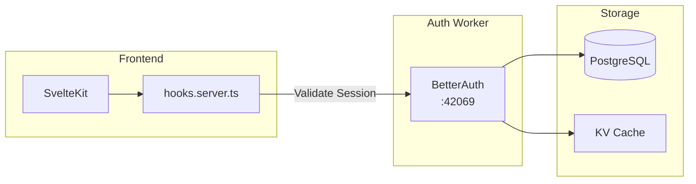
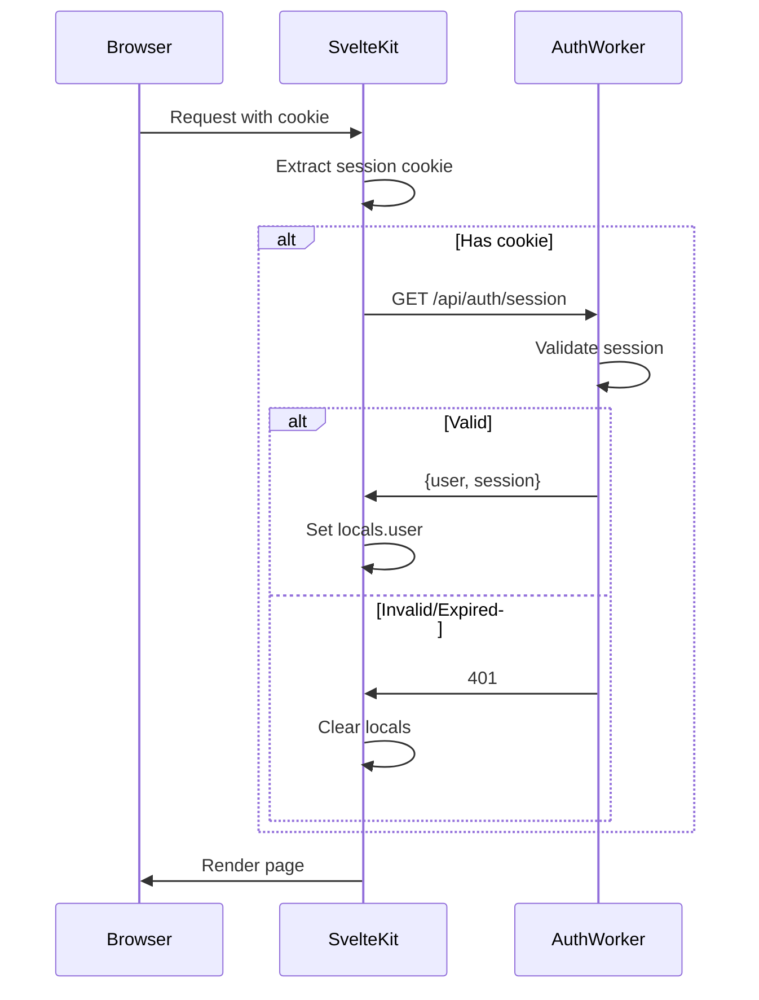
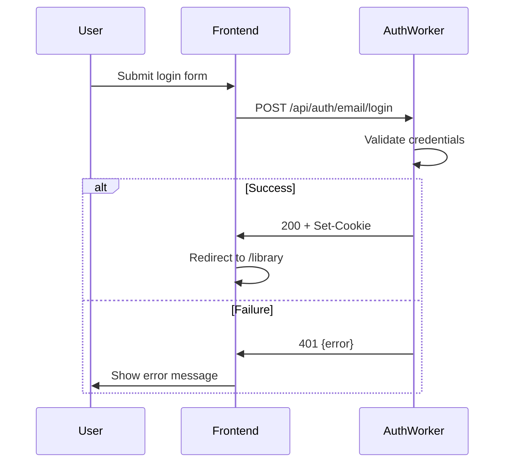
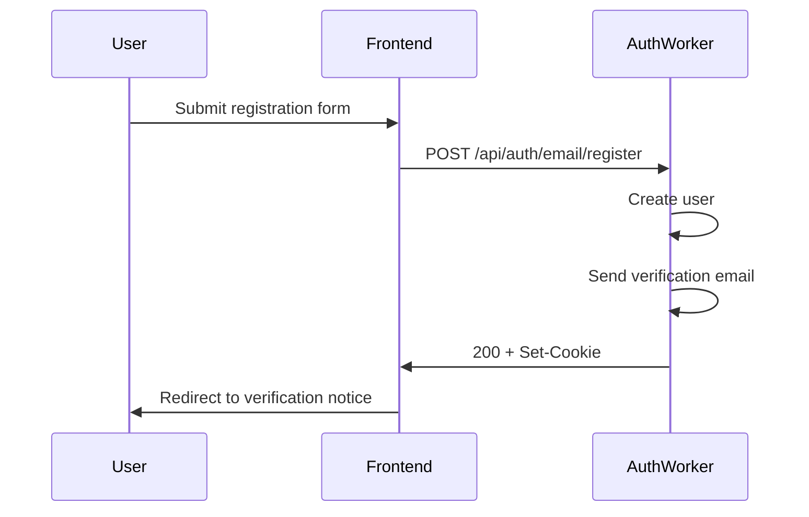
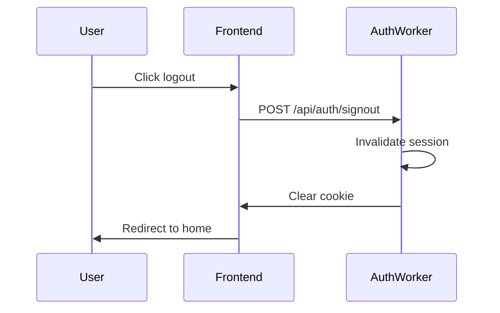
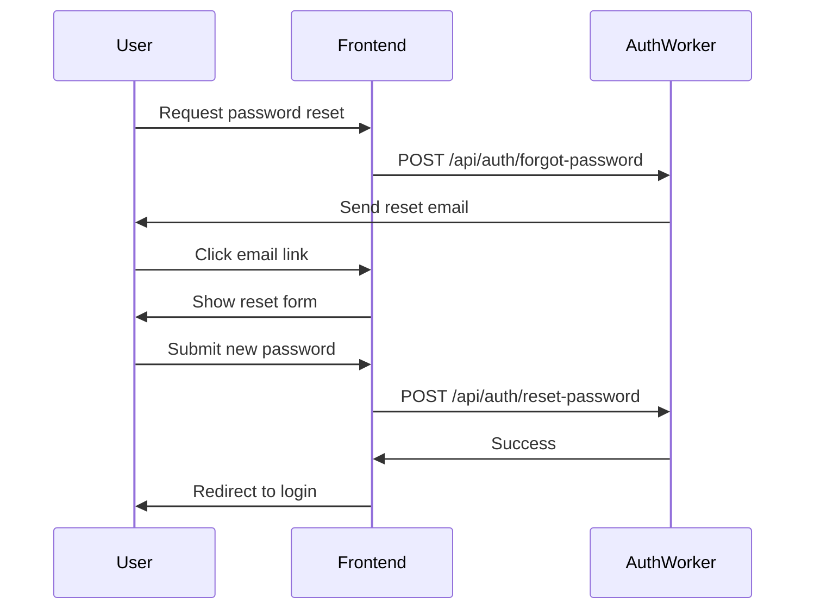
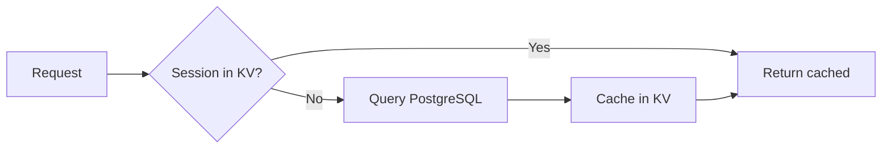

# Authentication

**Status**: Design
**Last Updated**: 2026-01-10

---

## Architecture

Authentication is owned entirely by the **Auth Worker** (BetterAuth). The frontend never implements auth logic—it delegates to the Auth Worker for all session operations.

**Key principle**: Frontend reads the session cookie and calls Auth Worker to validate. It never decodes or validates tokens itself.

---

## Session Cookie

The Auth Worker sets a cross-subdomain session cookie:

| Property | Value | Purpose |
|----------|-------|---------|
| Name | `codex-session` | Identifies the session |
| Domain | `.revelations.studio` | Shared across all subdomains |
| Path | `/` | Available on all paths |
| HttpOnly | `true` | JavaScript cannot access |
| Secure | `true` | HTTPS only |
| SameSite | `Lax` | CSRF protection, allows navigation |

### Why Cross-Subdomain?

Users navigate between:
- `yoga-studio.revelations.studio` (org space)
- `creators.revelations.studio/alice` (creator profile)
- `revelations.studio` (platform)

A single session cookie with `.revelations.studio` domain works across all these without re-authentication.

---

## Session Resolution Flow

On every request, the server hook validates the session:

### Locals Population

After session resolution, `event.locals` contains:

| Property | Type | Description |
|----------|------|-------------|
| `userId` | `string \| null` | Authenticated user ID |
| `user` | `User \| null` | User object with profile |
| `session` | `Session \| null` | Session metadata |

---

## Auth Flows

### Login

### Registration

### Logout

### Password Reset

---

## Auth Worker Endpoints

| Endpoint | Method | Purpose |
|----------|--------|---------|
| `/api/auth/session` | GET | Validate current session |
| `/api/auth/email/login` | POST | Email/password login |
| `/api/auth/email/register` | POST | Create new account |
| `/api/auth/signout` | POST | End session |
| `/api/auth/forgot-password` | POST | Request password reset |
| `/api/auth/reset-password` | POST | Set new password |
| `/api/auth/verify-email` | GET | Verify email address |

---

## Auth Pages

| Route | Purpose | Auth State |
|-------|---------|------------|
| `/login` | Login form | Redirect if authenticated |
| `/register` | Registration form | Redirect if authenticated |
| `/forgot-password` | Request reset | Public |
| `/reset-password` | Set new password | Token required |
| `/verify-email` | Email verification | Token required |

### Redirect Handling

Login and register pages accept a `redirect` query parameter. After successful auth, user is redirected to this URL (validated to be same-origin).

---

## Form Implementation

Auth forms use SvelteKit form actions with progressive enhancement:

1. **Without JavaScript**: Standard form POST, full page reload
2. **With JavaScript**: Enhanced with loading states, inline validation

Forms submit to SvelteKit form actions, which forward to Auth Worker. This keeps Auth Worker URLs internal and allows server-side response handling.

---

## Session Caching

The Auth Worker caches session data in KV for fast validation:

KV cache TTL is shorter than session expiry to balance performance and security.

---

## Security Considerations

### Cookie Security
- **HttpOnly**: Prevents XSS from stealing session
- **Secure**: Prevents transmission over HTTP
- **SameSite=Lax**: Prevents CSRF from external sites

### Session Validation
- Every protected request validates session with Auth Worker
- Session can be invalidated server-side (logout everywhere)
- Session tied to user agent/IP for anomaly detection (future)

### Rate Limiting
- Auth Worker applies rate limits to login attempts
- Prevents brute force attacks

---

## Related Documents

- [AUTHORIZATION.md](./AUTHORIZATION.md) - Role-based access after authentication
- [ROUTING.md](./ROUTING.md) - Protected routes and redirects
