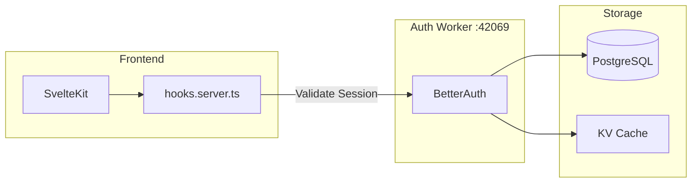
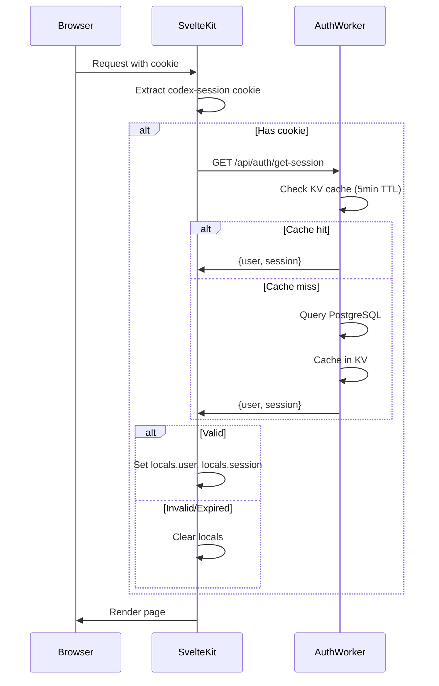
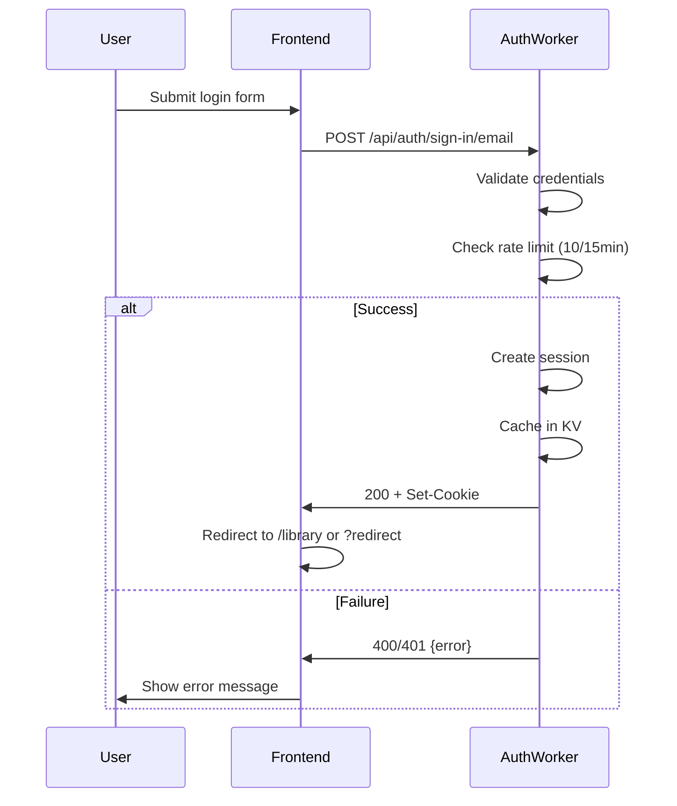
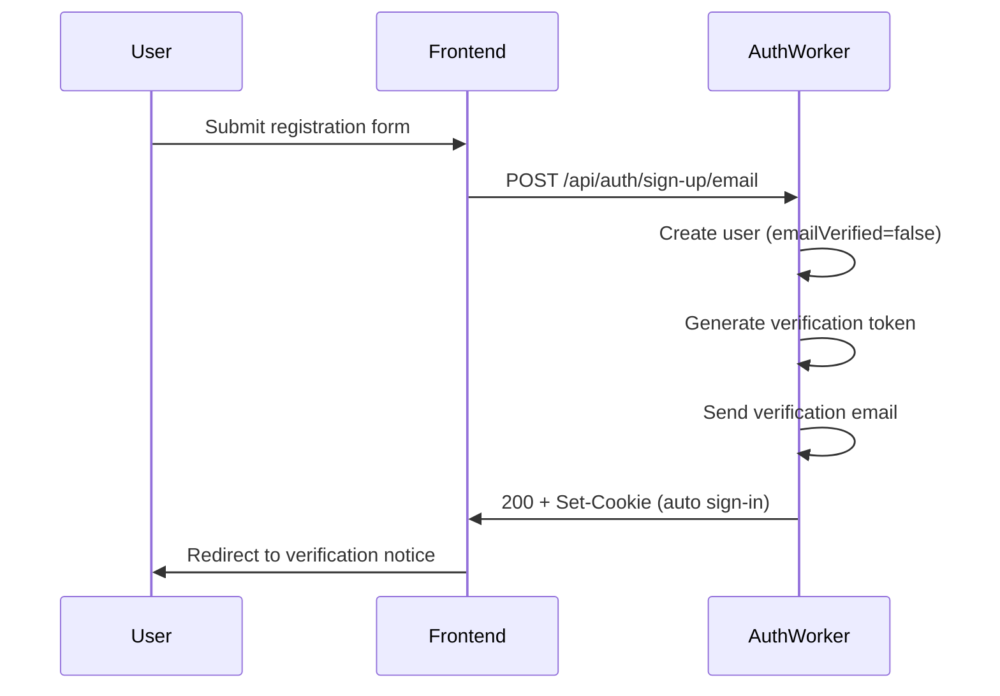
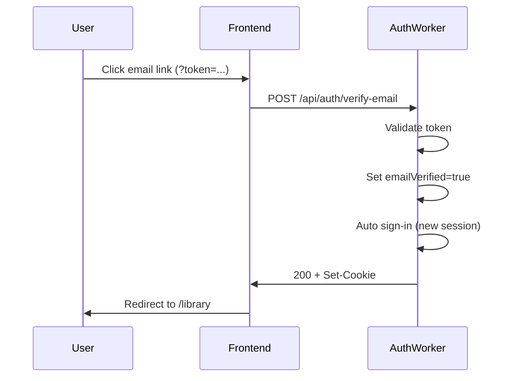
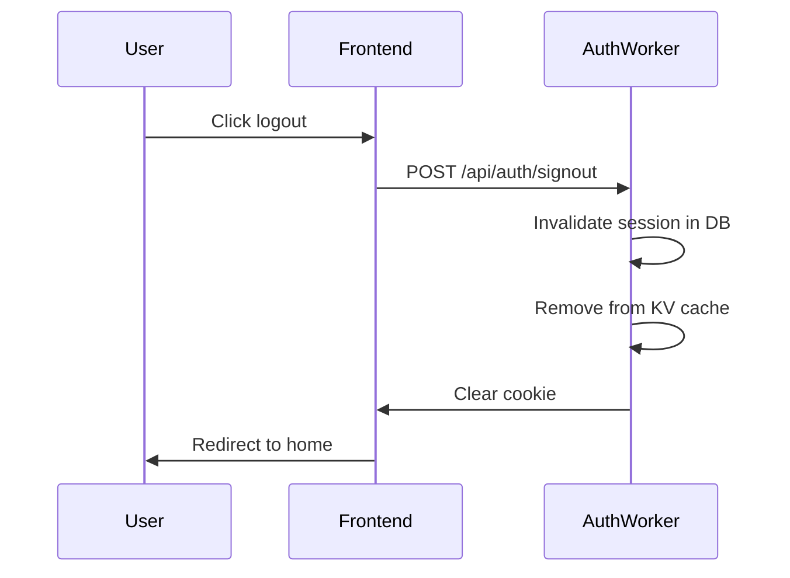
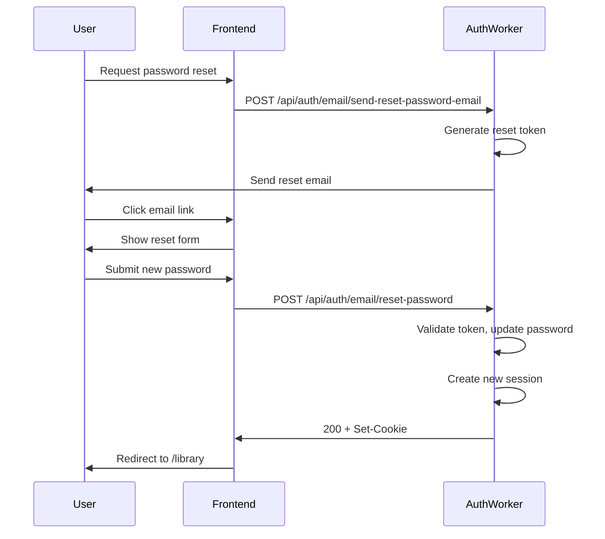
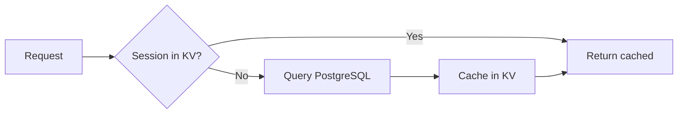

# Authentication

**Status**: Design (Verified against implementation 2026-01-11)
**Last Updated**: 2026-01-11

---

## Architecture

Authentication is owned entirely by the **Auth Worker** (BetterAuth). The frontend never implements auth logic—it delegates to the Auth Worker for all session operations.



**Key principle**: Frontend reads the session cookie and calls Auth Worker to validate. It never decodes or validates tokens itself.

---

## Session Cookie

The Auth Worker sets a cross-subdomain session cookie:

| Property | Value | Purpose |
|----------|-------|---------|
| Name | `codex-session` | Identifies the session |
| Domain | `.revelations.studio` | Shared across all subdomains |
| Path | `/` | Available on all paths |
| HttpOnly | `true` | JavaScript cannot access |
| Secure | `true` | HTTPS only |
| SameSite | `Lax` | CSRF protection, allows navigation |

### Why Cross-Subdomain?

Users navigate between:
- `yoga-studio.revelations.studio` (org space)
- `creators.revelations.studio/alice` (creator profile)
- `revelations.studio` (platform)

A single session cookie with `.revelations.studio` domain works across all these without re-authentication.

---

## Session Resolution Flow

On every request, the server hook validates the session:



### Locals Population

After session resolution, `event.locals` contains:

| Property | Type | Description |
|----------|------|-------------|
| `userId` | `string \| null` | Authenticated user ID |
| `user` | `UserData \| null` | User object with profile |
| `session` | `SessionData \| null` | Session metadata |

### UserData Shape

```typescript
interface UserData {
  id: string;
  email: string;
  name: string | null;
  role: string;           // 'customer', 'creator', 'admin'
  emailVerified: boolean;
  createdAt: string;      // ISO 8601
}
```

### SessionData Shape

```typescript
interface SessionData {
  id: string;
  userId: string;
  expiresAt: string;      // ISO 8601
}
```

---

## Auth Flows

### Login (Phase 1)



### Registration (Phase 1)



### Email Verification (Phase 1)



### Logout (Phase 1)



### Password Reset (Phase 1)



---

## Auth Worker Endpoints

### Phase 1 Endpoints

> **Note**: BetterAuth uses its own endpoint naming conventions. These are the actual paths verified against e2e tests.

| Endpoint | Method | Purpose | Rate Limit |
|----------|--------|---------|------------|
| `/api/auth/get-session` | GET | Validate current session | None |
| `/api/auth/sign-in/email` | POST | Email/password login | 10/15min |
| `/api/auth/sign-up/email` | POST | Create new account | 10/15min |
| `/api/auth/signout` | POST | End session | None |
| `/api/auth/verify-email` | GET | Verify email address | 10/15min |
| `/api/auth/email/send-reset-password-email` | POST | Request password reset | 10/15min |
| `/api/auth/email/reset-password` | POST | Set new password | 10/15min |

### Request/Response Examples

**Login Request**:
```typescript
POST /api/auth/sign-in/email
{
  "email": "user@example.com",
  "password": "SecurePass123!"
}
```

**Login Response** (200):
```typescript
{
  "user": {
    "id": "user_123",
    "email": "user@example.com",
    "name": "John Doe",
    "role": "customer",
    "emailVerified": true,
    "createdAt": "2025-01-15T10:00:00Z"
  },
  "session": {
    "id": "session_456",
    "userId": "user_123",
    "expiresAt": "2025-01-24T10:00:00Z"
  }
}
// + Set-Cookie: codex-session=<token>; HttpOnly; Secure; SameSite=Lax
```

**Session Check Response** (200):
```typescript
GET /api/auth/get-session
// Cookie: codex-session=<token>

{
  "user": { ... },
  "session": { ... }
}
```

**Error Response** (401):
```typescript
{
  "error": {
    "code": "UNAUTHORIZED",
    "message": "Invalid credentials"
  }
}
```

---

## Auth Pages

| Route | Purpose | Auth State |
|-------|---------|------------|
| `/login` | Login form | Redirect if authenticated |
| `/register` | Registration form | Redirect if authenticated |
| `/forgot-password` | Request reset | Public |
| `/reset-password` | Set new password | Token required |
| `/verify-email` | Email verification | Token required |

### Redirect Handling

Login and register pages accept a `redirect` query parameter. After successful auth, user is redirected to this URL (validated to be same-origin).

```typescript
// +page.server.ts
export async function load({ url, locals }) {
  // Already logged in? Redirect away
  if (locals.user) {
    const redirect = url.searchParams.get('redirect') || '/library';
    throw redirect(302, validateRedirect(redirect));
  }
  return {};
}

function validateRedirect(url: string): string {
  // Only allow same-origin redirects
  if (url.startsWith('/') && !url.startsWith('//')) {
    return url;
  }
  return '/library';
}
```

---

## Frontend Implementation

### Server Hook (hooks.server.ts)

```typescript
import type { Handle } from '@sveltejs/kit';

export const handle: Handle = async ({ event, resolve, platform }) => {
  // Access worker URLs via platform.env (Cloudflare Workers pattern)
  const authUrl = platform?.env?.AUTH_WORKER_URL ?? 'http://localhost:42069';
  const sessionCookie = event.cookies.get('codex-session');

  if (sessionCookie) {
    try {
      const response = await fetch(`${authUrl}/api/auth/get-session`, {
        headers: {
          Cookie: `codex-session=${sessionCookie}`
        }
      });

      if (response.ok) {
        const { user, session } = await response.json();
        event.locals.user = user;
        event.locals.session = session;
        event.locals.userId = user.id;
      }
    } catch (error) {
      // Auth worker unavailable - treat as not authenticated
      console.error('Session validation failed:', error);
    }
  }

  return resolve(event);
};
```

> **Note**: Cloudflare Workers use `platform.env` to access bindings, not `$env/static/public`.

### Form Implementation

Auth forms use SvelteKit form actions with progressive enhancement:

```svelte
<!-- routes/login/+page.svelte -->
<script>
  import { enhance } from '$app/forms';
  let loading = $state(false);
</script>

<form
  method="POST"
  use:enhance={() => {
    loading = true;
    return async ({ update }) => {
      loading = false;
      await update();
    };
  }}
>
  <label>
    Email
    <input type="email" name="email" required />
  </label>

  <label>
    Password
    <input type="password" name="password" required />
  </label>

  <button type="submit" disabled={loading}>
    {loading ? 'Signing in...' : 'Sign in'}
  </button>
</form>
```

```typescript
// routes/login/+page.server.ts
import { fail, redirect } from '@sveltejs/kit';

export const actions = {
  default: async ({ request, url, cookies, platform }) => {
    // Access worker URL via platform.env (Cloudflare Workers pattern)
    const authUrl = platform?.env?.AUTH_WORKER_URL ?? 'http://localhost:42069';

    const formData = await request.formData();
    const email = formData.get('email');
    const password = formData.get('password');

    const response = await fetch(`${authUrl}/api/auth/sign-in/email`, {
      method: 'POST',
      headers: { 'Content-Type': 'application/json' },
      body: JSON.stringify({ email, password })
    });

    if (!response.ok) {
      const error = await response.json();
      return fail(response.status, {
        email,
        error: error.error?.message || 'Login failed'
      });
    }

    // Forward the Set-Cookie header from auth worker
    const setCookie = response.headers.get('set-cookie');
    if (setCookie) {
      // Parse and set cookie in SvelteKit
      // (In practice, use a cookie parsing library)
    }

    const redirectTo = url.searchParams.get('redirect') || '/library';
    throw redirect(302, redirectTo);
  }
};
```

---

## Session Caching

The Auth Worker caches session data in KV for fast validation:



| Setting | Value |
|---------|-------|
| KV Cache TTL | 5 minutes |
| Session Expiry | 24 hours |
| Session Renewal | Every 24 hours |

---

## Security Considerations

### Cookie Security
- **HttpOnly**: Prevents XSS from stealing session
- **Secure**: Prevents transmission over HTTP
- **SameSite=Lax**: Prevents CSRF from external sites while allowing navigation

### Session Validation
- Every protected request validates session with Auth Worker
- Session can be invalidated server-side (logout everywhere)
- Session tied to user agent/IP for anomaly detection (Future)

### Rate Limiting
- Auth Worker applies rate limits to login attempts
- 10 requests per 15 minutes per IP
- Prevents brute force attacks

### Email Verification
- New accounts require email verification
- Users can sign in immediately but with `emailVerified=false`
- Certain features may be gated on email verification

---

## Protected Routes

Route protection implemented via layout load functions:

```typescript
// routes/(authenticated)/+layout.server.ts
import { redirect } from '@sveltejs/kit';

export async function load({ locals, url }) {
  if (!locals.user) {
    throw redirect(302, `/login?redirect=${encodeURIComponent(url.pathname)}`);
  }

  return {
    user: locals.user
  };
}
```

### Route Groups

| Group | Protection | Example Routes |
|-------|------------|----------------|
| `(public)` | None | `/`, `/explore` |
| `(authenticated)` | Requires login | `/library`, `/account` |
| `(studio)` | Requires login + creator role | `/studio/*` |

---

## Future Features

| Feature | Notes |
|---------|-------|
| OAuth providers | Google, GitHub, etc. |
| Two-factor auth | TOTP or SMS |
| Session management UI | View/revoke active sessions |
| Remember me | Extended session duration |
| Login history | IP, device, location tracking |

---

## Related Documents

- [AUTHORIZATION.md](./AUTHORIZATION.md) - Role-based access after authentication
- [ROUTING.md](./ROUTING.md) - Protected routes and redirects
- [DATA.md](./DATA.md) - API integration patterns
