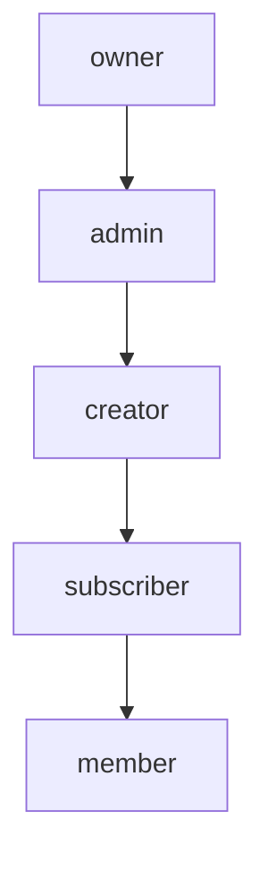
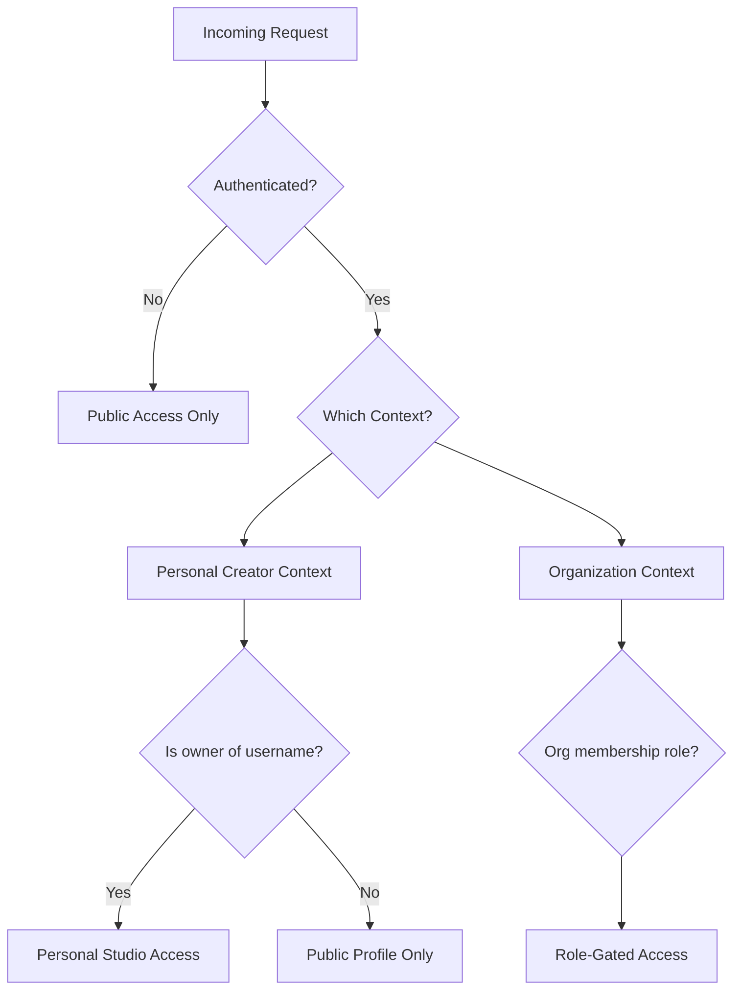
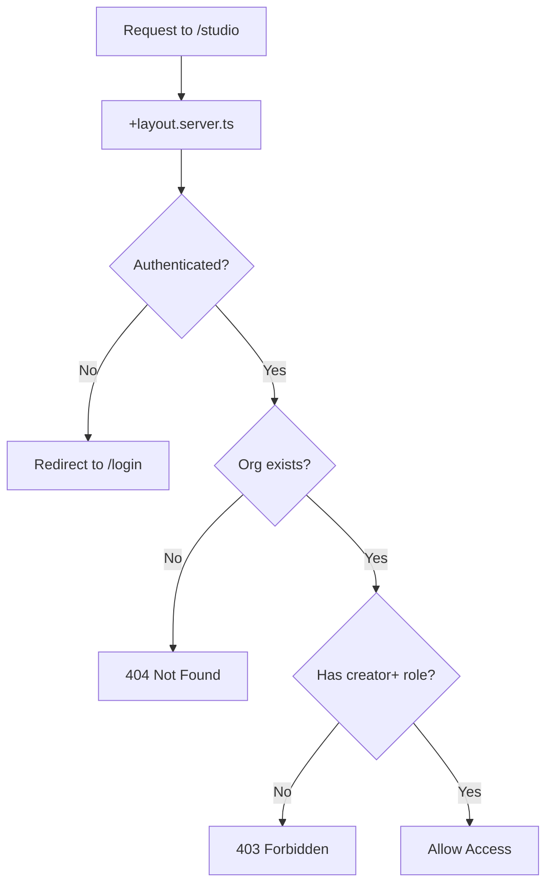
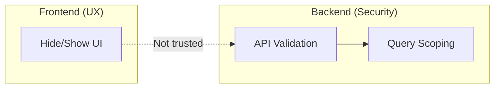
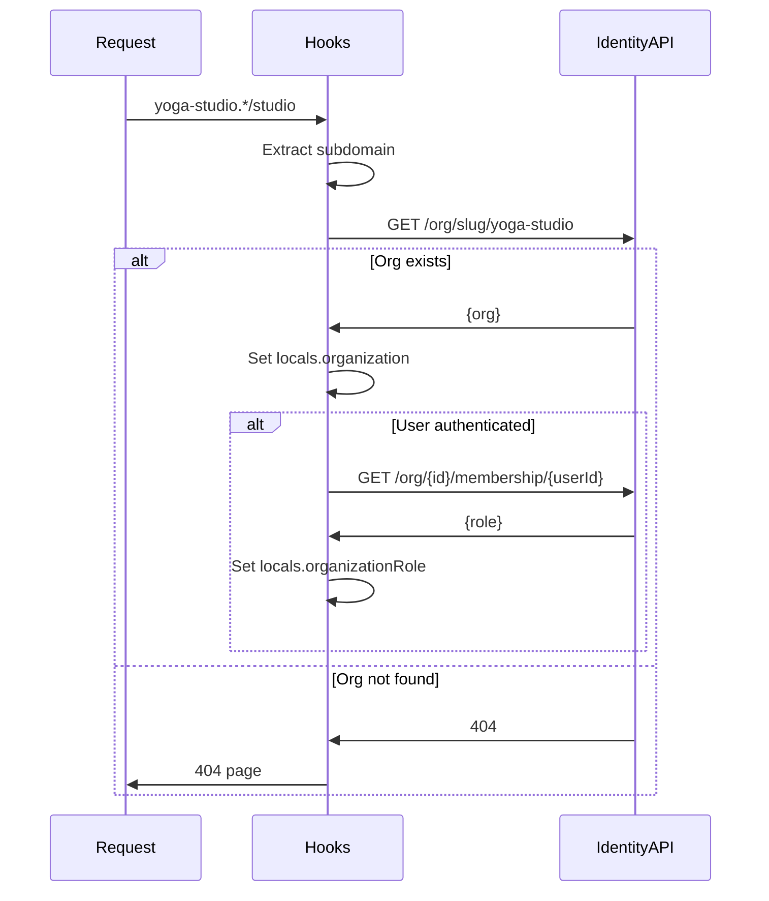
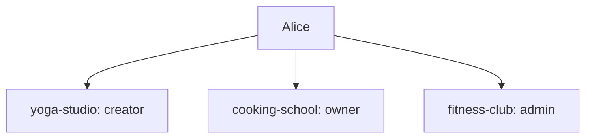

# Authorization

**Status**: Design
**Last Updated**: 2026-01-10

---

## Role System

Codex uses two levels of roles:

### Platform Role

Every user has a platform-level role in the `users` table:

| Role | Description |
|------|-------------|
| `customer` | Default role for all users |

**Note**: Currently only `customer` exists. Platform admin roles may be added later.

### Organization Membership Role

Users can have different roles in different organizations via `organizationMemberships`:

| Role | Description |
|------|-------------|
| `owner` | Full org control: billing, team, settings |
| `admin` | Content management, customer support |
| `creator` | Create and manage own content |
| `subscriber` | Subscription-based content access |
| `member` | Basic org membership |

---

## Role Hierarchy

Roles are hierarchical—higher roles inherit lower role permissions:

An `owner` can do anything an `admin`, `creator`, `subscriber`, or `member` can do.

---

## Context Resolution

Authorization requires knowing both the user and the context:

### Context Determination

| Subdomain | Context | How Resolved |
|-----------|---------|--------------|
| `creators.*.studio/{username}/studio` | Personal | Username must match authenticated user |
| `{org-slug}.*` | Organization | Lookup user's membership in org |
| `revelations.studio` | Platform | Platform role (if any) |

---

## Permission Matrix

### Personal Creator Context

| Resource | Owner | Others |
|----------|-------|--------|
| View profile | ✓ | ✓ |
| View content | ✓ | ✓ (if published) |
| Access studio | ✓ | ✗ |
| Manage content | ✓ | ✗ |
| Manage settings | ✓ | ✗ |

### Organization Context

| Resource | Owner | Admin | Creator | Subscriber | Member |
|----------|-------|-------|---------|------------|--------|
| View space | ✓ | ✓ | ✓ | ✓ | ✓ |
| View content | ✓ | ✓ | ✓ | ✓ | ✓ |
| Purchase content | ✓ | ✓ | ✓ | ✓ | ✓ |
| Access library | ✓ | ✓ | ✓ | ✓ | ✓ |
| Access studio | ✓ | ✓ | ✓ | ✗ | ✗ |
| Create content | ✓ | ✓ | ✓ | ✗ | ✗ |
| Manage own content | ✓ | ✓ | ✓ | ✗ | ✗ |
| Manage all content | ✓ | ✓ | ✗ | ✗ | ✗ |
| Manage team | ✓ | ✓ | ✗ | ✗ | ✗ |
| View customers | ✓ | ✓ | ✗ | ✗ | ✗ |
| Manage billing | ✓ | ✗ | ✗ | ✗ | ✗ |
| Manage org settings | ✓ | ✗ | ✗ | ✗ | ✗ |

---

## Guard Patterns

### Layout-Level Guards

Route groups have `+layout.server.ts` that enforce access:

### Guard Hierarchy

| Route Group | Guards Applied |
|-------------|----------------|
| `(space)` | None (public) |
| `(app)` | Require authentication |
| `studio` | Require authentication + creator role |

### Fine-Grained Guards

Some actions require additional checks beyond role:

| Action | Additional Check |
|--------|------------------|
| Edit content | Must be content creator OR admin+ |
| Delete content | Must be content creator OR admin+ |
| Manage team member | Cannot demote self if last owner |
| Access billing | Owner only |

---

## Frontend vs Backend Authorization

### Frontend (UX Only)

- Hide UI elements user shouldn't see
- Disable buttons for actions user can't take
- Never trust for security

### Backend (Actual Security)

- Every API endpoint validates permissions
- Database queries scoped by user/org
- Workers enforce role requirements

**Rule**: If a user manipulates the frontend to show a hidden button and clicks it, the backend must still reject the action.

---

## Organization Resolution

The hooks resolve organization and membership:

### Locals After Resolution

| Property | Type | Description |
|----------|------|-------------|
| `organization` | `Organization \| null` | Current org (if on org subdomain) |
| `organizationRole` | `Role \| null` | User's role in current org |

---

## Multi-Org Users

Users can have memberships in multiple organizations with different roles:

The role is always resolved **per request** based on which org subdomain is being accessed.

---

## Error Handling

| Scenario | Response |
|----------|----------|
| Not authenticated | Redirect to `/login?redirect=...` |
| Org not found | 404 page |
| No membership | Redirect to org home (public) |
| Insufficient role | 403 page or redirect |

---

## Related Documents

- [AUTH.md](./AUTH.md) - How authentication works
- [ROUTING.md](./ROUTING.md) - Route structure and guards
