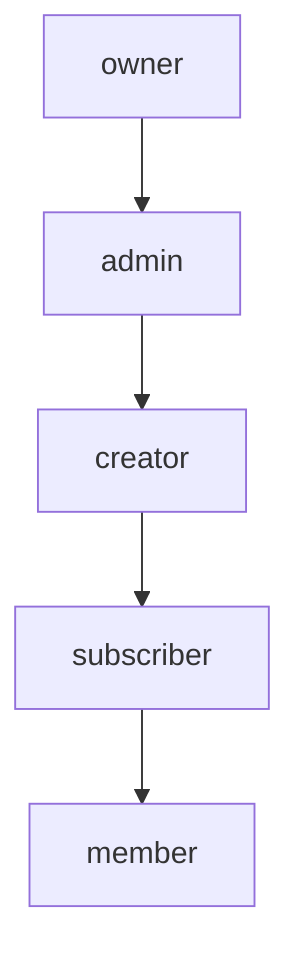
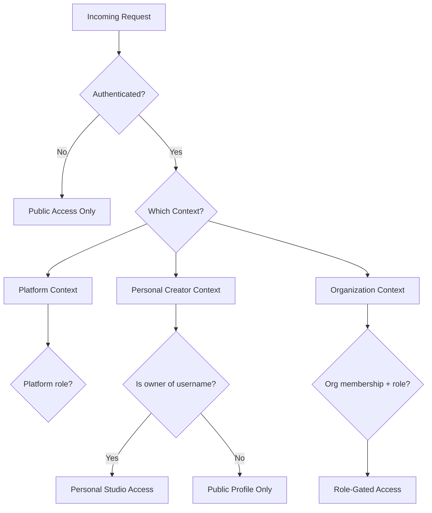
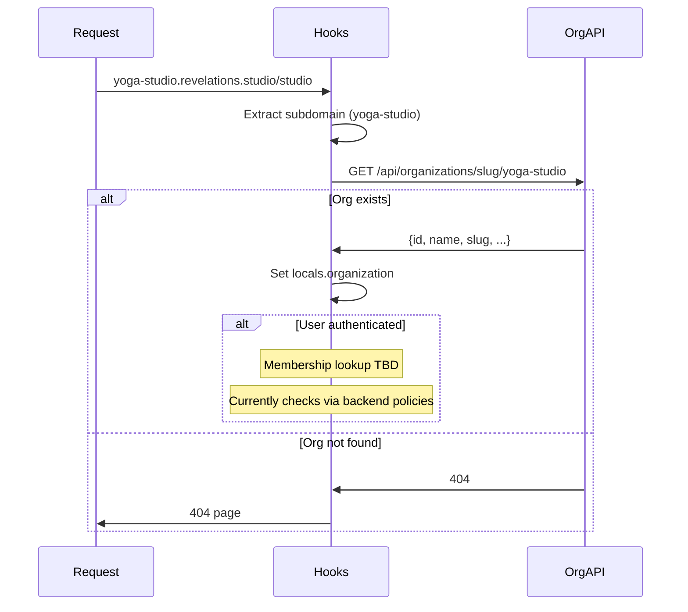
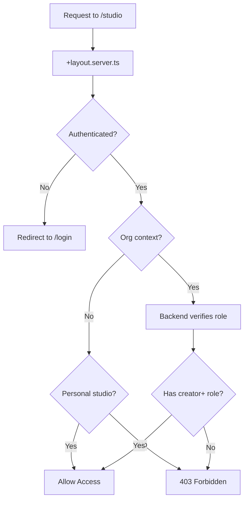
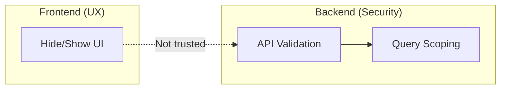
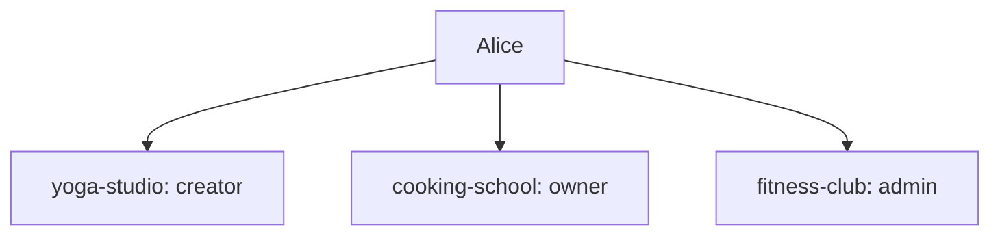

# Authorization

**Status**: Design (Verified against implementation 2026-01-11)
**Last Updated**: 2026-01-11

---

## Role System

Codex uses two levels of roles:

### Platform Role

Every user has a platform-level role in the `users` table:

| Role | Description |
|------|-------------|
| `customer` | Default role for all users |
| `creator` | Can create and manage content |
| `admin` | Platform administration (Future) |

### Organization Membership Role

Users can have different roles in different organizations via `organizationMemberships`:

| Role | Description |
|------|-------------|
| `owner` | Full org control: billing, team, settings |
| `admin` | Content management, customer support |
| `creator` | Create and manage own content |
| `subscriber` | Subscription-based content access (Future) |
| `member` | Basic org membership |

---

## Role Hierarchy

Roles are hierarchical—higher roles inherit lower role permissions:



An `owner` can do anything an `admin`, `creator`, `subscriber`, or `member` can do.

---

## Context Resolution

Authorization requires knowing both the user and the context:



### Context Determination

| Subdomain | Context | How Resolved |
|-----------|---------|--------------|
| `revelations.studio` | Platform | User's platform role from session |
| `creators.revelations.studio/{username}` | Personal | Username must match authenticated user |
| `{org-slug}.revelations.studio` | Organization | Lookup user's membership in org |

---

## Organization Resolution Flow (Phase 1)

The hooks resolve organization and membership:



### Organization-API Endpoints (Phase 1)

> **Note**: Organization endpoints are served by `organization-api` worker on port 42071, not `identity-api`.

| Endpoint | Method | Purpose |
|----------|--------|---------|
| `/api/organizations/slug/:slug` | GET | Get org by slug |
| `/api/organizations/:id` | GET | Get org by ID |
| `/api/organizations/check-slug/:slug` | GET | Check if slug is available |
| `/api/organizations/:id/settings` | GET | Get org branding/contact/features |
| `/api/organizations/:id/settings/branding` | GET/PUT | Logo and primary color |
| `/api/organizations/:id/settings/contact` | GET/PUT | Support email, social links |
| `/api/organizations/:id/settings/features` | GET/PUT | Feature toggles |

### Membership Resolution

**Current State**: Membership and role verification happens at the backend (worker) level via `procedure()` policies. The frontend doesn't query membership directly—it relies on backend authorization.

**Future**: A dedicated membership endpoint may be added for frontend role display.

---

## Permission Matrix

### Personal Creator Context (Phase 1)

| Resource | Owner | Others |
|----------|-------|--------|
| View profile | Yes | Yes |
| View content | Yes | Yes (if published) |
| Access studio | Yes | No |
| Manage content | Yes | No |
| Manage settings | Yes | No |

### Organization Context (Phase 1)

| Resource | Owner | Admin | Creator | Member |
|----------|-------|-------|---------|--------|
| View space | Yes | Yes | Yes | Yes |
| View content | Yes | Yes | Yes | Yes |
| Purchase content | Yes | Yes | Yes | Yes |
| Access library | Yes | Yes | Yes | Yes |
| Access studio | Yes | Yes | Yes | No |
| Create content | Yes | Yes | Yes | No |
| Manage own content | Yes | Yes | Yes | No |
| Manage all content | Yes | Yes | No | No |
| Manage team | Yes | Yes | No | No |
| View customers | Yes | Yes | No | No |
| Manage billing | Yes | No | No | No |
| Manage org settings | Yes | No | No | No |

---

## Guard Patterns

### Layout-Level Guards (Phase 1)

Route groups have `+layout.server.ts` that enforce access:



### Implementation

```typescript
// routes/(org)/[orgSlug]/(studio)/+layout.server.ts
import { error, redirect } from '@sveltejs/kit';

export async function load({ params, locals, url, platform }) {
  // 1. Must be authenticated
  if (!locals.user) {
    throw redirect(302, `/login?redirect=${encodeURIComponent(url.pathname)}`);
  }

  // 2. Access org API URL via platform.env (Cloudflare Workers pattern)
  // Note: $env/static/public does NOT work on Cloudflare Pages - use platform.env
  const orgApiUrl = platform?.env?.ORG_API_URL ?? 'http://localhost:42071';

  // 3. Org must exist
  const orgResponse = await fetch(
    `${orgApiUrl}/api/organizations/slug/${params.orgSlug}`,
    { headers: { Cookie: `codex-session=${locals.sessionCookie}` } }
  );

  if (!orgResponse.ok) {
    throw error(404, 'Organization not found');
  }

  const org = await orgResponse.json();

  // 4. Role check happens on backend when accessing protected resources
  // Frontend shows UI optimistically, backend enforces

  return {
    organization: org.data,
    user: locals.user
  };
}
```

> **Important**: On Cloudflare Pages/Workers, use `platform.env.VARIABLE_NAME` to access environment bindings. The SvelteKit `$env/static/public` pattern does NOT work in this deployment target.

### Guard Hierarchy

| Route Group | Guards Applied |
|-------------|----------------|
| `(public)` | None (public) |
| `(authenticated)` | Require authentication |
| `(org)/[orgSlug]` | Org must exist |
| `(org)/[orgSlug]/(studio)` | Auth + org exists + backend role check |
| `(creator)/[username]/(studio)` | Auth + username matches user |

### Fine-Grained Guards

Some actions require additional checks beyond role:

| Action | Additional Check |
|--------|------------------|
| Edit content | Must be content creator OR admin+ |
| Delete content | Must be content creator OR admin+ |
| Publish content | Admin+ must approve (org context) |
| Manage team member | Cannot demote self if last owner |
| Access billing | Owner only |

---

## Frontend vs Backend Authorization

### Frontend (UX Only)

- Hide UI elements user shouldn't see
- Disable buttons for actions user can't take
- Show role-appropriate navigation
- **Never trust for security**

### Backend (Actual Security)

- Every API endpoint validates permissions via `procedure()` policies
- Database queries scoped by user/org
- Workers enforce role requirements
- Access denied returns 403



**Rule**: If a user manipulates the frontend to show a hidden button and clicks it, the backend must still reject the action.

---

## Frontend Role Checks (Phase 1)

For UI display purposes, check roles from session:

```typescript
// lib/auth/permissions.ts
import type { UserData } from '$lib/types';

export function canAccessStudio(user: UserData | null): boolean {
  if (!user) return false;
  return user.role === 'creator' || user.role === 'admin';
}

export function isAdmin(user: UserData | null): boolean {
  if (!user) return false;
  return user.role === 'admin';
}
```

```svelte
<!-- Conditionally show studio link -->
<script>
  import { canAccessStudio } from '$lib/auth/permissions';
  let { data } = $props();
</script>

{#if canAccessStudio(data.user)}
  <a href="/studio">Studio</a>
{/if}
```

### Organization Role Display

When organization membership data becomes available:

```typescript
// Future: when membership endpoint exists
interface OrgMembership {
  organizationId: string;
  userId: string;
  role: 'owner' | 'admin' | 'creator' | 'member';
  joinedAt: string;
}

export function canManageOrg(membership: OrgMembership | null): boolean {
  if (!membership) return false;
  return membership.role === 'owner' || membership.role === 'admin';
}
```

---

## Locals After Resolution

After hooks run, `event.locals` contains:

| Property | Type | Description |
|----------|------|-------------|
| `user` | `UserData \| null` | Authenticated user |
| `session` | `SessionData \| null` | Session metadata |
| `organization` | `Organization \| null` | Current org (if on org subdomain) |
| `organizationRole` | `string \| null` | User's role in current org (Future) |

---

## Multi-Org Users

Users can have memberships in multiple organizations with different roles:



The role is always resolved **per request** based on which org subdomain is being accessed.

---

## Error Handling

| Scenario | Response |
|----------|----------|
| Not authenticated | Redirect to `/login?redirect=...` |
| Org not found | 404 page |
| No membership in org | Can view public content, no studio access |
| Insufficient role | 403 page or redirect to org home |

---

## Studio Switcher Logic

The studio switcher shows orgs where user has creator+ role:

```typescript
// Future: when membership list endpoint exists
async function getCreatorOrgs(userId: string): Promise<Organization[]> {
  // Query orgs where user has creator/admin/owner role
  // For Phase 1, this might be handled differently
}
```

```svelte
<!-- Studio switcher in header/sidebar -->
<script>
  let { orgs } = $props();
</script>

<nav class="studio-switcher">
  <a href="/studio">Personal Studio</a>

  {#each orgs as org}
    <a href="/{org.slug}/studio">{org.name}</a>
  {/each}
</nav>
```

---

## Phase 1 Limitations

| Feature | Status | Notes |
|---------|--------|-------|
| Platform roles | Implemented | customer, creator in users table |
| Org membership | Backend only | Frontend doesn't query directly |
| Role-based UI | Limited | Based on user.role from session |
| Org role display | Not available | No membership endpoint yet |
| Studio switcher | Basic | Shows personal studio, orgs TBD |

---

## Future Features

| Feature | Notes |
|---------|-------|
| Membership API | `GET /api/organizations/:id/memberships` |
| Role management UI | Invite, promote, demote members |
| Permission granularity | Custom permissions beyond roles |
| Team analytics | View who's accessing what |
| Audit logs | Track authorization events |

---

## Related Documents

- [AUTH.md](./AUTH.md) - How authentication works
- [ROUTING.md](./ROUTING.md) - Route structure and guards
- [DATA.md](./DATA.md) - API integration patterns
