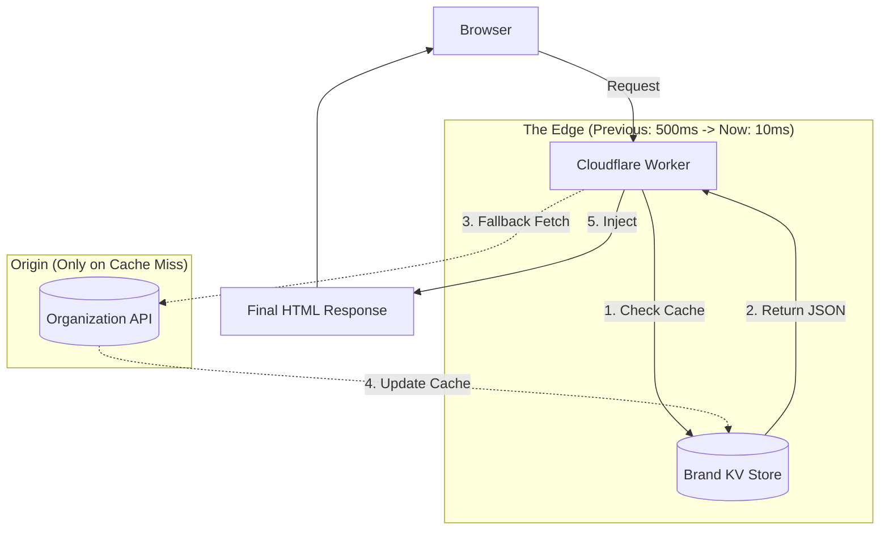

# Branding Cache Strategy: The "Zero-Latency" Edge Pattern

**Goal**: Deliver organization-specific brand tokens with **0ms added latency** and **no flash of unstyled content (FOUC)**.

## The Problem
Fetching unique brand settings for every page load from a central database (Postgres) introduces a 100-500ms bottleneck.
Making the browser fetch a separate `theme.css` file introduces a network waterfall (HTML executes -> discovers CSS -> requests CSS -> parses CSS -> renders), often causing layout shifts.

## The Solution: Edge-Injected KV Caching

We utilize **Cloudflare KV (Key-Value Storage)** to push brand data to the network edge, physically close to the user.

### Architecture



### 1. The Data Structure (KV)

Key: `org-brand:{slug}`
Value (JSON):
```json
{
  "version": 12,
  "tokens": {
    "brand-primary": "#e85a3f",
    "brand-glass-blur": "12px",
    "brand-font-body": "Inter",
    "brand-radius-base": "0.5rem"
  },
  "assets": {
    "logo_url": "https://cdn.../logo.png",
    "favicon_url": "https://cdn.../icon.png"
  }
}
```

### 2. Implementation: The Layout Hook

In `src/routes/+layout.server.ts`:

```typescript
export async function load({ platform, locals }) {
  const orgSlug = locals.organization?.slug;
  if (!orgSlug) return {};

  // 1. Try Edge Cache (Extremely Fast <10ms)
  let brandConfig = await platform.env.BRAND_KV.get(`org-brand:${orgSlug}`, 'json');

  // 2. Cache Miss? Fetch from API (Slower ~200ms)
  if (!brandConfig) {
    brandConfig = await fetchOrgSettings(orgSlug);
    // 3. Write to Cache (Background)
    platform.context.waitUntil(
      platform.env.BRAND_KV.put(
        `org-brand:${orgSlug}`,
        JSON.stringify(brandConfig),
        { expirationTtl: 604800 } // 7 days
      )
    );
  }

  // 4. Return for Injection
  return { brandConfig };
}
```

### 3. Browser-Side Caching (Static Assets)
While the *tokens* are injected (Zero RTT), the *referenced assets* (Fonts, Logos) use standard browser caching.

*   **Logos**: Served from R2/CDN with `Cache-Control: public, max-age=31536000, immutable`.
*   **Fonts**: Served from Google Fonts or our CDN with long TTL.

### 4. Cache Invalidation
When an Admin updates settings in the Dashboard (`P1-FE-ADMIN-002`):

1.  Write to Postgres (System of Record).
2.  **Write to KV** (Update Cache).
3.  Update `version` timestamp.

This ensures the very next request from *any* user worldwide receives the new branding instantly.

### Why this is better than `theme.css`
| Strategy | First Paint | Layout Shift | Network Requests | Stale Data |
|----------|-------------|--------------|------------------|------------|
| **Separate CSS File** | Delayed (wait for CSS) | High Risk (FOUC) | 2 (HTML + CSS) | Depends on TTL |
| **Edge Injection (Selected)** | **Instant** | **None** | **1 (HTML only)** | **None (Instant Invalidation)** |

## Implementation Checklist updates

**P1-FE-FOUNDATION-001 (Project Setup)**
- [ ] Bind `BRAND_KV` to the SvelteKit Worker `wrangler.toml`.
- [ ] Implement `getBrandConfig` helper with KV fallback logic.

**P1-FE-ADMIN-002 (Settings)**
- [ ] Add "Invalidate Cache" or "Write to KV" step on save.
