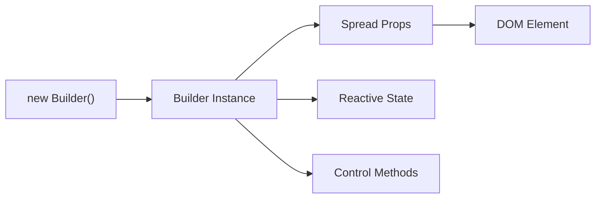
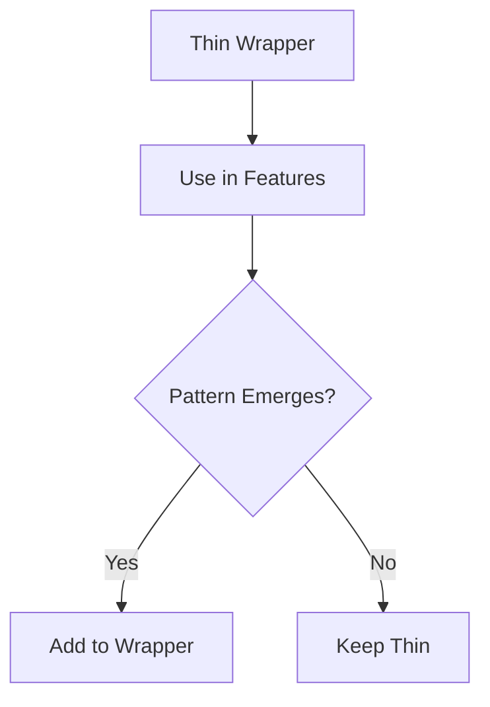
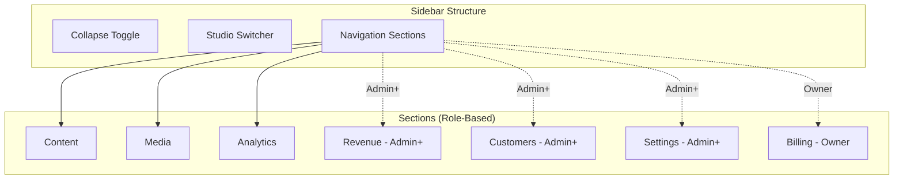
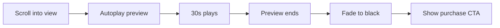
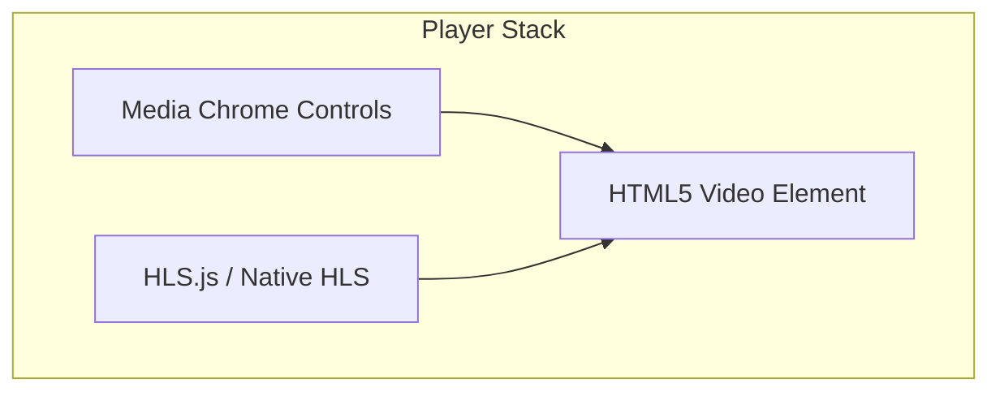
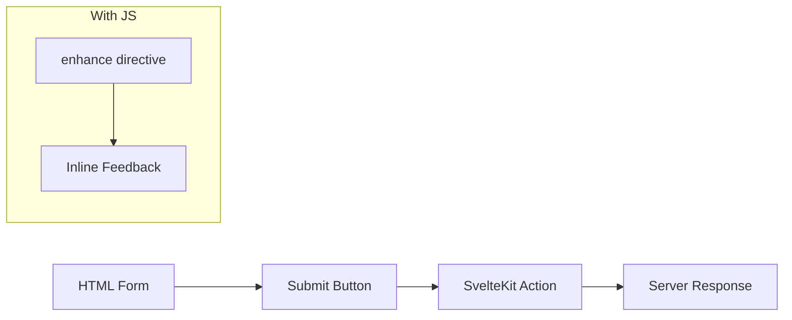
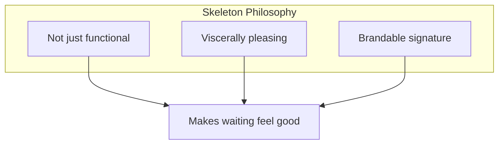
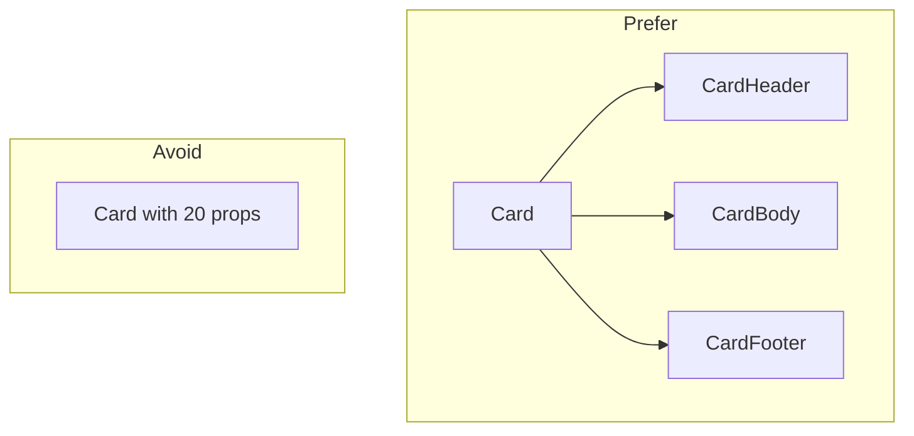
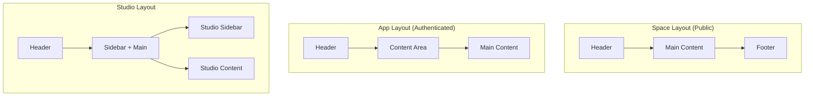

# Components

**Status**: Design
**Last Updated**: 2026-01-10

---

## Component Library

The frontend uses **Melt UI Next-Gen** for accessible, headless component primitives.

### Why Melt UI

| Consideration | Melt UI Approach |
|---------------|------------------|
| Accessibility | WAI-ARIA compliant out of the box |
| Styling | Headless—no styling opinions |
| Svelte 5 | Native runes support (`$state`, `$derived`) |
| SSR | Compatible with SvelteKit SSR |
| Customization | Full control over markup and styles |

### Melt UI Next-Gen Pattern

Melt UI next-gen uses a **class-based builder pattern**:



**Import from `melt/builders`**, not `@melt-ui/svelte`:

| Old API (Svelte 4) | New API (Svelte 5) |
|--------------------|--------------------|
| `createAccordion()` | `new Accordion()` |
| `use:melt={$trigger}` | `{...accordion.trigger}` |
| Stores (`$value`) | Direct properties (`accordion.value`) |

### Builder Usage

Builders spread attributes onto elements and provide:
- ARIA attributes automatically
- Keyboard handlers
- Focus management
- Reactive state via Svelte 5 runes

### Data Attributes for Styling

Melt UI exposes state via data attributes:

| Attribute | Purpose |
|-----------|---------|
| `[data-melt-accordion-trigger]` | Element identification |
| `[data-state="open"]` | Open/closed state |
| `[data-highlighted]` | Keyboard navigation highlight |
| `[data-selected]` | Selected item |
| `[data-disabled]` | Disabled state |

Style components using these selectors in CSS.

---

## Component Organization

```
$lib/components/
├── primitives/         # Melt UI wrappers (thin, only what we use)
│   ├── Accordion/
│   ├── Dialog/
│   ├── DropdownMenu/
│   ├── Popover/
│   ├── Select/
│   ├── Tabs/
│   └── Tooltip/
├── layout/             # Page structure
│   ├── Header/
│   ├── StudioSidebar/
│   ├── Footer/
│   └── PageContainer/
├── content/            # Content-specific
│   ├── ContentCard/
│   ├── ContentGrid/
│   ├── VideoPlayer/
│   ├── PreviewPlayer/
│   └── MediaUpload/
├── library/            # Library-specific
│   ├── LibraryGrid/
│   ├── LibraryFilters/
│   └── LibrarySearch/
├── forms/              # Form components
│   ├── TextField/
│   ├── TextArea/
│   ├── Select/
│   ├── Checkbox/
│   ├── RadioGroup/
│   ├── FormField/
│   └── FileUpload/
├── feedback/           # User feedback
│   ├── Toast/
│   ├── ConfirmDialog/
│   ├── Skeleton/
│   └── ErrorBanner/
└── shared/             # Cross-cutting
    ├── Breadcrumbs/
    ├── Avatar/
    └── Badge/
```

---

## Primitives (Melt UI Wrappers)

Thin wrappers around Melt UI builders. Only wrap what we actually use.

| Component | Melt Builder | Purpose |
|-----------|--------------|---------|
| Accordion | `Accordion` | Collapsible sections |
| Dialog | `Dialog` | Modal dialogs |
| DropdownMenu | `Menu` | Action menus |
| Popover | `Popover` | Floating content |
| Select | `Select` | Dropdown selection |
| Tabs | `Tabs` | Tabbed content |
| Tooltip | `Tooltip` | Hover hints |

### Wrapper Philosophy

Wrappers start thin—just styling. Add behavior only when patterns emerge:



---

## Layout Components

### Header

Varies by context. Could be variants of one component or separate components—follow Svelte conventions.

| Context | Contents |
|---------|----------|
| Platform | Logo, Platform Nav, Library link, Login/Signup |
| Org Space | Org Logo, Explore, Login/Library |
| Org App | Org Logo, Library link, User Menu |
| Studio | Context Logo, Studio Switcher, User Menu |
| Creator Profile | Creator Banner, Nav |

**Library link**: Always navigates to platform library (`revelations.studio/library`), even when on org subdomain.

### Studio Sidebar

Collapsible sidebar with role-based sections.



| Feature | Behavior |
|---------|----------|
| Expand/Collapse | Toggle button, remembers preference |
| Sections | Show based on user role in context |
| Switcher | Navigate between personal/org studios |
| Active State | Highlight current section |

Sidebar is similar across personal and org studios—progressive enhancement based on role and context.

### Footer

Same across most contexts. Some pages (player fullscreen, focused flows) hide footer.

| Element | Content |
|---------|---------|
| Links | About, Privacy, Terms, Help |
| Copyright | Platform copyright |
| Social | Social links (if applicable) |

### PageContainer

Consistent margins and max-width:

| Context | Max Width |
|---------|-----------|
| Content pages | 1280px |
| Studio | Full width (sidebar + content) |
| Marketing | 1440px |

---

## Content Components

### ContentCard

Displays content item in grid/list. Used everywhere.

| Element | Description |
|---------|-------------|
| Thumbnail | Cover image with aspect ratio |
| Title | Content title (truncate if long) |
| Creator | Creator name + avatar (in org context) |
| Org Badge | Org avatar when showing creator's cross-org content |
| Price | Free / $XX.XX |
| Progress | Playback progress bar (library views) |

### ContentGrid

Responsive grid of ContentCards:

| Breakpoint | Columns |
|------------|---------|
| Mobile | 1-2 |
| Tablet | 2-3 |
| Desktop | 3-4 |
| Wide | 4-5 |

### PreviewPlayer (Phase 1)

Marketing-style player for content without access (30-second preview).

| Aspect | Specification |
|--------|---------------|
| Duration | 30 seconds |
| Controls | Play, Mute, Fullscreen only (minimal) |
| Sound | NOT muted by default |
| Trigger | Autoplay on scroll into view |
| Indicator | "Preview" badge appears after a moment (not immediately) |
| End behavior | Fade to black → Show purchase CTA overlay |



**CTA Overlay**: Simple, straightforward - price + "Get Full Access" button.

### VideoPlayer (Phase 1)

**Foundation**: Media Chrome (Mux's web component library)

Media Chrome provides accessible, customizable player controls as web components. We build our distinctive player on top.



| Component | Source |
|-----------|--------|
| Controls UI | Media Chrome web components |
| HLS Streaming | HLS.js (Chrome/Firefox/Edge) or native (Safari) |
| Theming | CSS variables (70+ customizable) |
| Icons | Custom SVGs via slots |

#### HLS Browser Support

| Browser | Strategy |
|---------|----------|
| Safari | Native HLS via `<video src="*.m3u8">` |
| Chrome/Firefox/Edge | HLS.js with MediaSource Extensions |

Detection pattern: `Hls.isSupported()` → HLS.js, else `video.canPlayType('application/vnd.apple.mpegurl')` → native.

#### Player Features (Phase 1)

| Feature | Included | Notes |
|---------|----------|-------|
| Play/Pause/Seek | Yes | - |
| Volume control | Yes | - |
| Fullscreen | Yes | - |
| Quality selector | Yes | Auto + manual options |
| Progress saving | Yes | On pause + on page leave |
| Playback speed | Yes | 0.5x, 1x, 1.5x, 2x |
| Keyboard shortcuts | Yes | - |
| Captions | No | Future (via Whisper from HLS) |
| Chapters | No | Future |
| Picture-in-Picture | No | Future |

#### Progress Saving

| Event | Action |
|-------|--------|
| Pause | Save progress to server |
| Page change | Cache locally, send to server on leave |
| Tab close | Send cached progress to server |

#### Video End Behavior

When full video ends, show recommendations:

| Source | Priority |
|--------|----------|
| Same creator | High |
| Same org (if applicable) | Medium |
| Discovery/random | Low |

**Important**: Stay within current org context. Don't recommend content from other orgs.

#### Player Theming

Media Chrome uses CSS variables for full customization:

| Variable | Purpose |
|----------|---------|
| `--media-primary-color` | Brand accent |
| `--media-secondary-color` | Control backgrounds |
| `--media-icon-color` | Icon fill |
| `--media-range-bar-color` | Progress/volume bars |

Goal: Player should feel distinctively "ours" while remaining accessible.

### Mini Player (Future - Not Phase 1)

Picture-in-picture style player when scrolling away from video.

| Aspect | Specification |
|--------|---------------|
| Trigger | Scroll video out of view |
| Desktop position | Top right |
| Mobile position | Bottom right |
| UI reference | iPhone PiP |
| Click behavior | Centers and enlarges |
| Controls | Mute, Fullscreen, Close |

### MediaUpload

File upload zone for studio:

| Feature | Description |
|---------|-------------|
| Drag-drop | Visual drop zone |
| Click to browse | Fallback file picker |
| Progress | Upload progress indicator |
| Preview | Thumbnail/filename preview |
| Validation | File type, size limits |
| Multiple | Support batch uploads |

---

## Library Components (Phase 1)

### LibraryPage

User's purchased content at platform level (`revelations.studio/library`).

**Access**: Header nav link (always goes to platform library, even from org subdomains).

| Feature | Description |
|---------|-------------|
| Continue watching | Content with progress, sorted by recent |
| Search | Title, creator name, org name |
| Filters | Org, content type, progress status |
| Sort | Recently purchased, recently watched, alphabetical |

### LibraryGrid

Grid of purchased content with progress indicators.

### LibraryFilters

Filter controls:

| Filter | Options |
|--------|---------|
| Organization | All, or specific org |
| Content type | All types, or specific type |
| Progress | Not started, In progress, Completed |

### LibrarySearch

Search across:
- Content title
- Creator name
- Organization name

---

## Form Components

### Progressive Enhancement

**All forms work without JavaScript.** This is non-negotiable.



| JavaScript | Behavior |
|------------|----------|
| Disabled | Standard form POST, full page reload |
| Enabled | Enhanced submit, inline feedback, no reload |

### Form Components

| Component | Purpose |
|-----------|---------|
| TextField | Text input with label, error, hint |
| TextArea | Multi-line text (no rich text Phase 1) |
| Select | Dropdown using Melt UI Select |
| Checkbox | Checkbox with label |
| RadioGroup | Radio button group |
| FormField | Wrapper providing consistent layout |
| FileUpload | File input with drag-drop enhancement |

### Rich Text Editor

**Not Phase 1.** Content descriptions use plain TextArea initially. Rich text editing is future enhancement.

---

## Feedback Components

### Toast

Notifications for actions and events.

| Aspect | Specification |
|--------|---------------|
| Position | Bottom-right |
| Queue | Stack (newest on top) |
| Duration | 5s default, configurable |
| Dismiss | Click X or auto-dismiss |
| Types | Success, Error, Warning, Info |

### ConfirmDialog

Modal confirmation for destructive actions. **Three tiers** based on severity:

| Tier | When | Confirmation |
|------|------|--------------|
| None | Low-risk (remove from wishlist) | No dialog |
| Confirm | Most deletes | "Are you sure?" dialog |
| Type to confirm | Critical/irreversible | Type "DELETE" to confirm |

#### Standard Confirm

| Element | Description |
|---------|-------------|
| Title | Clear action description |
| Message | Consequences explanation |
| Cancel | Secondary button, closes dialog |
| Confirm | Destructive button (red for delete) |

**Examples**:
- Delete content: "Delete 'Intro to Yoga'? This cannot be undone."
- Leave organization: "Leave yoga-studio? You'll lose access to..."

#### Type to Confirm (Critical)

For irreversible actions:
- User must type specific word (e.g., "DELETE") to enable confirm button
- Used sparingly for most critical actions

### Skeleton (Loading States)

**Design Goal**: Loading states so satisfying they trigger a dopamine response. ASMR for your eyes.



#### Content-Aware Placeholders

Skeletons hint at actual content structure:

| Content Type | Skeleton Shape |
|--------------|----------------|
| ContentCard | Thumbnail rect + title lines + price |
| VideoPlayer | 16:9 rect with centered play icon |
| Profile | Avatar circle + name line + bio lines |
| Table row | Cells matching column widths |

#### The Shimmer

The shimmer effect should be the platform's signature loading motif:

| Aspect | Specification |
|--------|---------------|
| Feel | Smooth, organic, almost meditative |
| Motion | Flowing, not mechanical |
| Color | Uses org's `--brand-primary` in highlight |
| Speed | Unhurried—confidence, not anxiety |
| Reduced motion | Respects `prefers-reduced-motion` (static gradient) |

**Design direction**: The specific animation will be refined in design phase, but the goal is clear—loading should feel *good*, not like waiting.

### ErrorBanner

Inline error display:

| Element | Description |
|---------|-------------|
| Icon | Warning/error icon |
| Message | Clear error description |
| Action | Retry button (if applicable) |
| Dismiss | X to close (if dismissible) |

---

## Future Components (Not Phase 1)

### Wishlist

Replaces cart concept. Users save content for later.

| Aspect | Specification |
|--------|---------------|
| Visibility | Private by default, user can make public |
| Scope | Cross-org (attached to user, not per-org) |
| Remove | No confirmation needed (low-risk) |

### FollowButton (Future)

Follow creators or organizations.

| Context | Options |
|---------|---------|
| Creator page | Follow this creator |
| Org page | Follow org OR follow specific creator OR both |

**Result**:
- Follow creator = see all their content across all orgs
- Follow org = see all org content (all creators)

### Feed (Future)

Instagram-style vertical feed of content from followed creators/orgs.

| Feature | Description |
|---------|-------------|
| Layout | Vertical scroll, full-width cards |
| Content | Followed creators + followed orgs + recommendations |
| No stories | Just content cards |
| Inline actions | Unfollow directly from feed |

### FollowingPage (Future)

Manage who you follow.

| Feature | Description |
|---------|-------------|
| List | All followed creators and orgs |
| Actions | Unfollow |
| Access | Dedicated page + inline in feed |

### UserDashboard (Future)

Personalized hub with widgets.

| Feature | Description |
|---------|-------------|
| Continue watching | Resume where you left off |
| Quick actions | Jump into meditation, etc. |
| Recommendations | Based on history, preferences, time of day |
| Upcoming | Appointments (future) |
| Feed preview | Latest from follows |
| Customization | Reorder/hide widgets |

**Inspiration**: Substack's clean, calm interaction with content.

---

## Component Design Principles

### 1. Composition Over Configuration

Prefer composable components over prop-heavy ones:



### 2. Props Interface

| Prop Type | Convention |
|-----------|------------|
| Data | Descriptive names: `content`, `user` |
| Callbacks | `on` prefix: `onclick`, `onchange` |
| Variants | Literal unions: `variant: 'primary' \| 'secondary'` |
| Slots | Use Svelte 5 snippets |

### 3. Styling

Components use CSS custom properties from design tokens:

| Approach | Use |
|----------|-----|
| Semantic tokens | `var(--color-interactive)` not `var(--color-blue-500)` |
| Data attributes | Style states via `[data-state="open"]` |
| `class` prop | Allow parent overrides when needed |

See [STYLING.md](./STYLING.md) for token system.

---

## Layout Patterns

### Page Structure



### Context-Specific Layouts

| Context | Layout | Sidebar |
|---------|--------|---------|
| Platform public | Header + Main + Footer | No |
| Org space | Header + Main + Footer | No |
| Org app | Header + Main | No |
| Studio | Header + Sidebar + Main | Yes |
| Creator profile | Header + Main + Footer | No |

---

## Accessibility Requirements

All components must meet WCAG 2.1 AA:

| Requirement | Implementation |
|-------------|----------------|
| Keyboard nav | All interactive elements focusable and operable |
| Screen readers | Proper ARIA labels and live regions |
| Color contrast | 4.5:1 for normal text, 3:1 for large |
| Focus indicators | Visible focus states (see STYLING.md) |
| Motion | Respect `prefers-reduced-motion` |

Melt UI provides ARIA and keyboard handling. Custom components must maintain these standards.

---

## Error States

Components handle error states consistently:

| State | Visual Treatment |
|-------|------------------|
| Loading | Content-aware skeleton with shimmer |
| Empty | Empty state illustration + message + action |
| Error | Error message with retry option |
| Forbidden | "Access denied" message |

---

## Related Documents

- [STYLING.md](./STYLING.md) - Design tokens and theming
- [DATA.md](./DATA.md) - How components receive data
- [ROUTING.md](./ROUTING.md) - Where components are used

