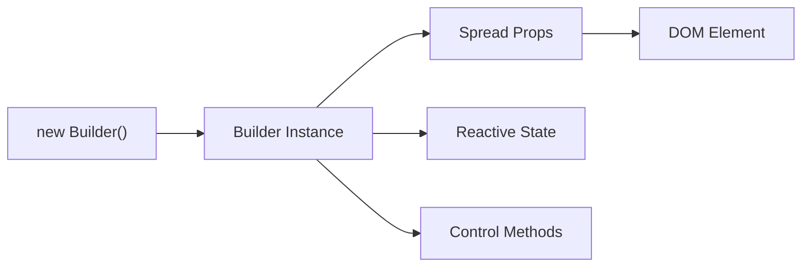
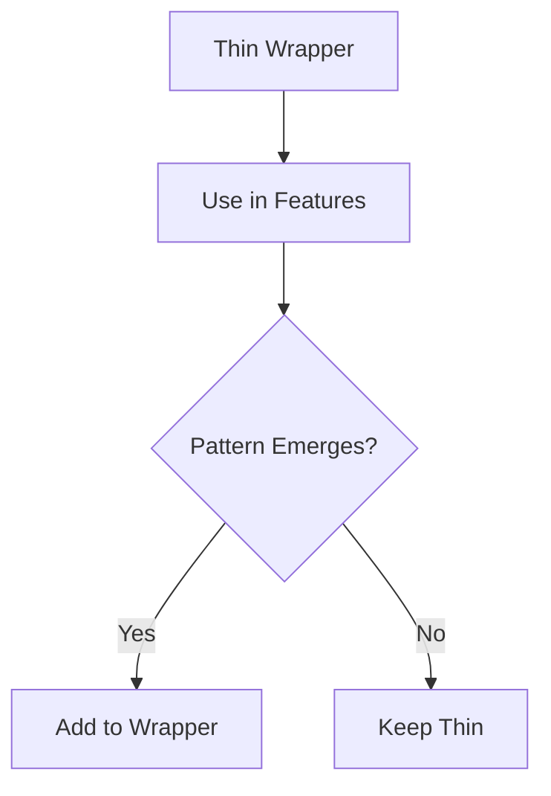
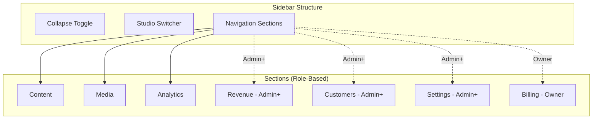
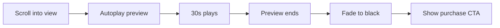
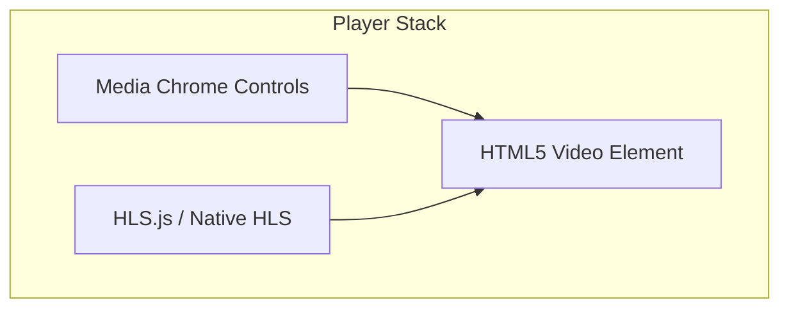
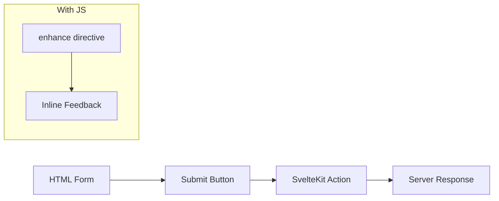
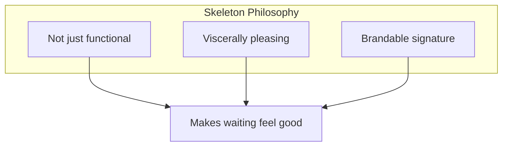
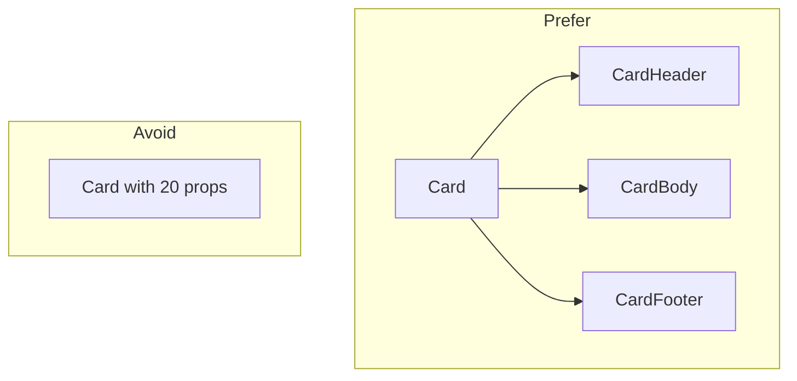
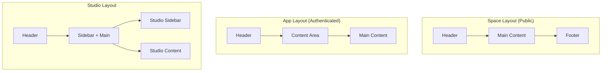

# Components

**Status**: Design (Pre-implementation - no code to verify against)
**Last Updated**: 2026-01-11

---

## Component Library

The frontend uses **Melt UI Next-Gen** for accessible, headless component primitives.

> **Verification Required**: Before implementation, verify Melt UI's Svelte 5 support status. If unstable, consider alternatives:
> - **Bits UI** - Svelte 5 compatible, similar API
> - **Shadcn-Svelte** - Pre-styled components based on Bits UI
> - **Custom primitives** - Build with Svelte 5 runes directly

### Why Melt UI

| Consideration | Melt UI Approach |
|---------------|------------------|
| Accessibility | WAI-ARIA compliant out of the box |
| Styling | Headless—no styling opinions |
| Svelte 5 | Native runes support (`$state`, `$derived`) |
| SSR | Compatible with SvelteKit SSR |
| Customization | Full control over markup and styles |

### Melt UI Next-Gen Pattern

Melt UI next-gen uses a **class-based builder pattern**:



**Import from `melt/builders`**, not `@melt-ui/svelte`:

| Old API (Svelte 4) | New API (Svelte 5) |
|--------------------|--------------------|
| `createAccordion()` | `new Accordion()` |
| `use:melt={$trigger}` | `{...accordion.trigger}` |
| Stores (`$value`) | Direct properties (`accordion.value`) |

### Builder Usage

Builders spread attributes onto elements and provide:
- ARIA attributes automatically
- Keyboard handlers
- Focus management
- Reactive state via Svelte 5 runes

### Data Attributes for Styling

Melt UI exposes state via data attributes:

| Attribute | Purpose |
|-----------|---------|
| `[data-melt-accordion-trigger]` | Element identification |
| `[data-state="open"]` | Open/closed state |
| `[data-highlighted]` | Keyboard navigation highlight |
| `[data-selected]` | Selected item |
| `[data-disabled]` | Disabled state |

Style components using these selectors in CSS.

---

## Component Organization

> **Phase 1 MVP**: Not all 33 components are needed immediately. Start with ~12-15 core components:
> - **Layout**: Header, Footer, PageContainer
> - **Content**: ContentCard, ContentGrid, VideoPlayer (or PreviewPlayer)
> - **Forms**: TextField, Button, basic inputs
> - **Feedback**: Toast, Skeleton
>
> Build additional components incrementally as routes require them.

```
$lib/components/
├── primitives/         # Melt UI wrappers (thin, only what we use)
│   ├── Accordion/
│   ├── Dialog/
│   ├── DropdownMenu/
│   ├── Popover/
│   ├── Select/
│   ├── Tabs/
│   └── Tooltip/
├── layout/             # Page structure
│   ├── Header/
│   ├── StudioSidebar/
│   ├── Footer/
│   └── PageContainer/
├── content/            # Content-specific
│   ├── ContentCard/
│   ├── ContentGrid/
│   ├── VideoPlayer/
│   ├── PreviewPlayer/
│   └── MediaUpload/
├── library/            # Library-specific
│   ├── LibraryGrid/
│   ├── LibraryFilters/
│   └── LibrarySearch/
├── forms/              # Form components
│   ├── TextField/
│   ├── TextArea/
│   ├── Select/
│   ├── Checkbox/
│   ├── RadioGroup/
│   ├── FormField/
│   └── FileUpload/
├── feedback/           # User feedback
│   ├── Toast/
│   ├── ConfirmDialog/
│   ├── Skeleton/
│   └── ErrorBanner/
└── shared/             # Cross-cutting
    ├── Breadcrumbs/
    ├── Avatar/
    └── Badge/
```

---

## Primitives (Melt UI Wrappers)

Thin wrappers around Melt UI builders. Only wrap what we actually use.

| Component | Melt Builder | Purpose |
|-----------|--------------|---------|
| Accordion | `Accordion` | Collapsible sections |
| Dialog | `Dialog` | Modal dialogs |
| DropdownMenu | `Menu` | Action menus |
| Popover | `Popover` | Floating content |
| Select | `Select` | Dropdown selection |
| Tabs | `Tabs` | Tabbed content |
| Tooltip | `Tooltip` | Hover hints |

### Wrapper Philosophy

Wrappers start thin—just styling. Add behavior only when patterns emerge:



---

## Layout Components

### Header

Varies by context. Could be variants of one component or separate components—follow Svelte conventions.

| Context | Contents |
|---------|----------|
| Platform | Logo, Platform Nav, Library link, Login/Signup |
| Org Space | Org Logo, Explore, Login/Library |
| Org App | Org Logo, Library link, User Menu |
| Studio | Context Logo, Studio Switcher, User Menu |
| Creator Profile | Creator Banner, Nav |

**Library link**: Always navigates to platform library (`revelations.studio/library`), even when on org subdomain.

### Studio Sidebar

Collapsible sidebar with role-based sections.



| Feature | Behavior |
|---------|----------|
| Expand/Collapse | Toggle button, remembers preference |
| Sections | Show based on user role in context |
| Switcher | Navigate between personal/org studios |
| Active State | Highlight current section |

Sidebar is similar across personal and org studios—progressive enhancement based on role and context.

### Footer

Same across most contexts. Some pages (player fullscreen, focused flows) hide footer.

| Element | Content |
|---------|---------|
| Links | About, Privacy, Terms, Help |
| Copyright | Platform copyright |
| Social | Social links (if applicable) |

### PageContainer

Consistent margins and max-width:

| Context | Max Width |
|---------|-----------|
| Content pages | 1280px |
| Studio | Full width (sidebar + content) |
| Marketing | 1440px |

---

## Content Components

### ContentCard

Displays content item in grid/list. Used everywhere.

| Element | Description |
|---------|-------------|
| Thumbnail | Cover image with aspect ratio |
| Title | Content title (truncate if long) |
| Creator | Creator name + avatar (in org context) |
| Org Badge | Org avatar when showing creator's cross-org content |
| Price | Free / $XX.XX |
| Progress | Playback progress bar (library views) |

#### Thumbnail Handling

Thumbnails are pre-generated during transcoding in three sizes for responsive loading:

| Size | Width | Use Case |
|------|-------|----------|
| `sm` | 200px | Mobile grids, small cards |
| `md` | 400px | Tablet, standard cards |
| `lg` | 800px | Desktop, featured content |

**Format**: WebP (primary), JPEG (fallback). Generated by RunPod alongside video transcoding.

**URL Pattern**:
```
https://content.revelations.studio/thumbnails/{contentId}-{size}.webp
```

**Responsive Loading**:
```svelte

```

**Skeleton Placeholder**: Show shimmer while image loads (see Skeleton component).

### ContentGrid

Responsive grid of ContentCards:

| Breakpoint | Columns |
|------------|---------|
| Mobile | 1-2 |
| Tablet | 2-3 |
| Desktop | 3-4 |
| Wide | 4-5 |

### PreviewPlayer (Phase 1)

Marketing-style player for content without access (30-second preview).

| Aspect | Specification |
|--------|---------------|
| Duration | 30 seconds |
| Controls | Play, Mute, Fullscreen only (minimal) |
| Sound | NOT muted by default |
| Trigger | Autoplay on scroll into view |
| Indicator | "Preview" badge appears after a moment (not immediately) |
| End behavior | Fade to black → Show purchase CTA overlay |



**CTA Overlay**: Simple, straightforward - price + "Get Full Access" button.

### VideoPlayer (Phase 1)

**Foundation**: Media Chrome (Mux's web component library)

Media Chrome provides accessible, customizable player controls as web components. We build our distinctive player on top.



| Component | Source |
|-----------|--------|
| Controls UI | Media Chrome web components |
| HLS Streaming | HLS.js (Chrome/Firefox/Edge) or native (Safari) |
| Theming | CSS variables (70+ customizable) |
| Icons | Custom SVGs via slots |

#### HLS Browser Support

| Browser | Strategy |
|---------|----------|
| Safari | Native HLS via `<video src="*.m3u8">` |
| Chrome/Firefox/Edge | HLS.js with MediaSource Extensions |

Detection pattern: `Hls.isSupported()` → HLS.js, else `video.canPlayType('application/vnd.apple.mpegurl')` → native.

#### Player Features (Phase 1)

| Feature | Included | Notes |
|---------|----------|-------|
| Play/Pause/Seek | Yes | - |
| Volume control | Yes | - |
| Fullscreen | Yes | - |
| Quality selector | Yes | Auto + manual options |
| Progress saving | Yes | On pause + on page leave |
| Playback speed | Yes | 0.5x, 1x, 1.5x, 2x |
| Keyboard shortcuts | Yes | - |
| Captions | No | Future (via Whisper from HLS) |
| Chapters | No | Future |
| Picture-in-Picture | No | Future |

#### Progress Saving

| Event | Action |
|-------|--------|
| Pause | Save progress to server |
| Page change | Cache locally, send to server on leave |
| Tab close | Send cached progress to server |

#### Video End Behavior

When full video ends, show recommendations:

| Source | Priority |
|--------|----------|
| Same creator | High |
| Same org (if applicable) | Medium |
| Discovery/random | Low |

**Important**: Stay within current org context. Don't recommend content from other orgs.

#### Player Theming

Media Chrome uses CSS variables for full customization:

| Variable | Purpose |
|----------|---------|
| `--media-primary-color` | Brand accent |
| `--media-secondary-color` | Control backgrounds |
| `--media-icon-color` | Icon fill |
| `--media-range-bar-color` | Progress/volume bars |

Goal: Player should feel distinctively "ours" while remaining accessible.

### Mini Player (Future - Not Phase 1)

Picture-in-picture style player when scrolling away from video.

| Aspect | Specification |
|--------|---------------|
| Trigger | Scroll video out of view |
| Desktop position | Top right |
| Mobile position | Bottom right |
| UI reference | iPhone PiP |
| Click behavior | Centers and enlarges |
| Controls | Mute, Fullscreen, Close |

### MediaUpload

File upload zone for studio:

| Feature | Description |
|---------|-------------|
| Drag-drop | Visual drop zone |
| Click to browse | Fallback file picker |
| Progress | Upload progress indicator |
| Preview | Thumbnail/filename preview |
| Validation | File type, size limits |
| Multiple | Support batch uploads |

---

## Library Components (Phase 1)

### LibraryPage

User's purchased content at platform level (`revelations.studio/library`).

**Access**: Header nav link (always goes to platform library, even from org subdomains).

| Feature | Description |
|---------|-------------|
| Continue watching | Content with progress, sorted by recent |
| Search | Title, creator name, org name |
| Filters | Org, content type, progress status |
| Sort | Recently purchased, recently watched, alphabetical |

### LibraryGrid

Grid of purchased content with progress indicators.

### LibraryFilters

Filter controls:

| Filter | Options |
|--------|---------|
| Organization | All, or specific org |
| Content type | All types, or specific type |
| Progress | Not started, In progress, Completed |

### LibrarySearch

Search across:
- Content title
- Creator name
- Organization name

---

## Form Components

### Progressive Enhancement

**All forms work without JavaScript.** This is non-negotiable.



| JavaScript | Behavior |
|------------|----------|
| Disabled | Standard form POST, full page reload |
| Enabled | Enhanced submit, inline feedback, no reload |

### Form Components

| Component | Purpose |
|-----------|---------|
| TextField | Text input with label, error, hint |
| TextArea | Multi-line text (no rich text Phase 1) |
| Select | Dropdown using Melt UI Select |
| Checkbox | Checkbox with label |
| RadioGroup | Radio button group |
| FormField | Wrapper providing consistent layout |
| FileUpload | File input with drag-drop enhancement |

### Rich Text Editor

**Not Phase 1.** Content descriptions use plain TextArea initially. Rich text editing is future enhancement.

---

## Feedback Components

### Toast

Notifications for actions and events.

| Aspect | Specification |
|--------|---------------|
| Position | Bottom-right |
| Queue | Stack (newest on top) |
| Duration | 5s default, configurable |
| Dismiss | Click X or auto-dismiss |
| Types | Success, Error, Warning, Info |

### ConfirmDialog

Modal confirmation for destructive actions. **Three tiers** based on severity:

| Tier | When | Confirmation |
|------|------|--------------|
| None | Low-risk (remove from wishlist) | No dialog |
| Confirm | Most deletes | "Are you sure?" dialog |
| Type to confirm | Critical/irreversible | Type "DELETE" to confirm |

#### Standard Confirm

| Element | Description |
|---------|-------------|
| Title | Clear action description |
| Message | Consequences explanation |
| Cancel | Secondary button, closes dialog |
| Confirm | Destructive button (red for delete) |

**Examples**:
- Delete content: "Delete 'Intro to Yoga'? This cannot be undone."
- Leave organization: "Leave yoga-studio? You'll lose access to..."

#### Type to Confirm (Critical)

For irreversible actions:
- User must type specific word (e.g., "DELETE") to enable confirm button
- Used sparingly for most critical actions

### ErrorBoundary (Resilience)

High-quality apps don't crash the whole page when one widget fails. We use granular error boundaries to isolate volatile UI elements.

#### Svelte 5 `<svelte:boundary>` Pattern

Svelte 5 provides native error boundaries via `<svelte:boundary>`:

```svelte
<!-- Basic usage with failed snippet -->
<svelte:boundary>
  <VideoPlayer {content} />

  {#snippet failed(error, reset)}
    <div class="error-fallback">
      <p>Video player failed to load</p>
      <button onclick={reset}>Try again</button>
    </div>
  {/snippet}
</svelte:boundary>
```

```svelte
<!-- With error reporting -->
<script lang="ts">
  import { reportError } from '$lib/observability';

  function handleError(error: Error, reset: () => void) {
    reportError(error, { component: 'VideoPlayer' });
  }
</script>

<svelte:boundary onerror={handleError}>
  <VideoPlayer {content} />

  {#snippet failed(error, reset)}
    <ErrorFallback {error} {reset} />
  {/snippet}
</svelte:boundary>
```

#### Boundary Granularity Strategy

**Decision**: Apply boundaries at **feature level**, not component level.

| Level | Example | Boundary? | Reason |
|-------|---------|-----------|--------|
| Page | Entire route | No | Let SvelteKit handle via +error.svelte |
| Feature | VideoPlayer section | **Yes** | Isolates major functionality |
| Component | Button, Input | No | Too granular, overhead |
| Data fetch | ContentGrid items | **Yes** | Network failures common |

**Where to Place Boundaries:**

```svelte
<!-- +page.svelte -->
<script>
  let { data } = $props();
</script>

<!-- NO boundary: Header is stable -->
<Header />

<!-- YES boundary: Player is volatile -->
<svelte:boundary>
  <VideoPlayer content={data.content} />
  {#snippet failed(error, reset)}
    <PlayerErrorFallback {error} {reset} />
  {/snippet}
</svelte:boundary>

<!-- YES boundary: Grid fetches data -->
<svelte:boundary>
  <RelatedContentGrid contentId={data.content.id} />
  {#snippet failed(error, reset)}
    <GridErrorFallback {error} {reset} />
  {/snippet}
</svelte:boundary>

<!-- YES boundary: Payment is critical -->
<svelte:boundary>
  <PurchaseButton content={data.content} />
  {#snippet failed(error, reset)}
    <PurchaseErrorFallback {error} {reset} />
  {/snippet}
</svelte:boundary>

<!-- NO boundary: Footer is stable -->
<Footer />
```

#### Error Reporting Integration

Report errors to logging service while providing user-friendly fallbacks:

```typescript
// lib/components/ErrorBoundary/error-handler.ts
import { reportError } from '$lib/observability';

export function createErrorHandler(componentName: string) {
  return (error: Error, reset: () => void) => {
    // Report to observability service
    reportError(error, {
      component: componentName,
      type: 'boundary_caught'
    });
      extra: {
        timestamp: new Date().toISOString()
      }
    });

    // Log for debugging (dev only)
    if (import.meta.env.DEV) {
      console.error(`[${componentName}] Error caught:`, error);
    }
  };
}
```

```svelte
<!-- Usage -->
<script>
  import { createErrorHandler } from '$lib/components/ErrorBoundary/error-handler';
  const handlePlayerError = createErrorHandler('VideoPlayer');
</script>

<svelte:boundary onerror={handlePlayerError}>
  <VideoPlayer {content} />
  {#snippet failed(error, reset)}
    <PlayerErrorFallback {error} {reset} />
  {/snippet}
</svelte:boundary>
```

#### Recovery Patterns

**1. Simple Retry:**

```svelte
{#snippet failed(error, reset)}
  <div class="error-box">
    <p>Something went wrong</p>
    <button onclick={reset}>Try again</button>
  </div>
{/snippet}
```

**2. Retry with Backoff:**

```svelte
<script>
  let retryCount = $state(0);
  const MAX_RETRIES = 3;

  function handleReset(reset: () => void) {
    if (retryCount < MAX_RETRIES) {
      retryCount++;
      setTimeout(reset, Math.pow(2, retryCount) * 1000); // Exponential backoff
    }
  }
</script>

{#snippet failed(error, reset)}
  <div class="error-box">
    {#if retryCount < MAX_RETRIES}
      <p>Retrying... ({retryCount}/{MAX_RETRIES})</p>
    {:else}
      <p>Failed after {MAX_RETRIES} attempts</p>
      <a href="/support">Contact support</a>
    {/if}
  </div>
{/snippet}
```

**3. Graceful Degradation:**

```svelte
{#snippet failed(error, reset)}
  <!-- Show static fallback content -->
  <div class="degraded-player">
    
    <p>Video unavailable. <a href={content.directUrl}>Download instead</a></p>
  </div>
{/snippet}
```

**4. Context-Aware Recovery:**

```svelte
{#snippet failed(error, reset)}
  {#if error.message.includes('network')}
    <NetworkErrorFallback {reset} />
  {:else if error.message.includes('permission')}
    <PermissionErrorFallback />
  {:else}
    <GenericErrorFallback {error} {reset} />
  {/if}
{/snippet}
```

#### Reusable Error Fallback Components

```svelte
<!-- lib/components/ErrorBoundary/PlayerErrorFallback.svelte -->
<script lang="ts">
  let { error, reset } = $props<{
    error: Error;
    reset: () => void;
  }>();
</script>

<div class="player-error">
  <div class="player-error__icon">⚠️</div>
  <h3>Video playback error</h3>
  <p>We couldn't load this video. Please try again.</p>
  <div class="player-error__actions">
    <button onclick={reset} class="btn-primary">
      Retry
    </button>
    <button onclick={() => window.location.reload()} class="btn-secondary">
      Refresh page
    </button>
  </div>
  {#if import.meta.env.DEV}
    <details class="player-error__debug">
      <summary>Debug info</summary>
      <pre>{error.stack}</pre>
    </details>
  {/if}
</div>

<style>
  .player-error {
    display: flex;
    flex-direction: column;
    align-items: center;
    padding: var(--space-8);
    background: var(--color-surface-secondary);
    border-radius: var(--radius-md);
    text-align: center;
  }
  /* ... more styles ... */
</style>
```

#### Testing Error Boundaries

**Unit Test:**

```typescript
// ErrorBoundary.test.ts
import { render, screen, fireEvent } from '@testing-library/svelte';
import { describe, it, expect, vi } from 'vitest';
import * as Observability from '$lib/observability';
import TestBoundary from './TestBoundary.svelte';

// Mock reportError
vi.mock('$lib/observability', () => ({
  reportError: vi.fn()
}));

describe('ErrorBoundary', () => {
  it('renders children normally', () => {
    render(TestBoundary, { props: { shouldFail: false } });
    expect(screen.getByText('Content loaded')).toBeInTheDocument();
  });

  it('catches errors and shows fallback', () => {
    render(TestBoundary, { props: { shouldFail: true } });
    expect(screen.getByText('Something went wrong')).toBeInTheDocument();
  });

  it('resets on retry click', async () => {
    const { component } = render(TestBoundary, { props: { shouldFail: true } });

    // Click retry
    await fireEvent.click(screen.getByText('Try again'));

    // Should attempt re-render
    expect(component.resetCount).toBe(1);
  });

  it('reports errors to observability service', () => {
    render(TestBoundary, { props: { shouldFail: true } });

    expect(Observability.reportError).toHaveBeenCalledWith(
      expect.any(Error),
      expect.objectContaining({
        component: 'TestComponent'
      })
    );
  });
});
```

**Test Helper Component:**

```svelte
<!-- TestBoundary.svelte -->
<script lang="ts">
  import { createErrorHandler } from '$lib/components/ErrorBoundary/error-handler';

  let { shouldFail = false } = $props();
  export let resetCount = 0;

  const handleError = createErrorHandler('TestComponent');

  function onReset(reset: () => void) {
    resetCount++;
    reset();
  }
</script>

<svelte:boundary onerror={handleError}>
  {#if shouldFail}
    <FailingComponent />
  {:else}
    <p>Content loaded</p>
  {/if}

  {#snippet failed(error, reset)}
    <div>
      <p>Something went wrong</p>
      <button onclick={() => onReset(reset)}>Try again</button>
    </div>
  {/snippet}
</svelte:boundary>
```

#### Boundary Placement Summary

| Component | Boundary | Fallback Type |
|-----------|----------|---------------|
| VideoPlayer | Yes | Retry + thumbnail fallback |
| ContentGrid | Yes | Retry + empty state |
| PurchaseButton | Yes | Retry + contact support |
| MediaUpload | Yes | Retry + manual upload link |
| SearchResults | Yes | Retry + browse suggestion |
| UserMenu | Yes | Refresh page prompt |
| Header/Footer | No | Page-level error |
| Static content | No | Page-level error |

### Skeleton (Loading States)

**Design Goal**: Loading states so satisfying they trigger a dopamine response. ASMR for your eyes.



#### Content-Aware Placeholders

Skeletons hint at actual content structure:

| Content Type | Skeleton Shape |
|--------------|----------------|
| ContentCard | Thumbnail rect + title lines + price |
| VideoPlayer | 16:9 rect with centered play icon |
| Profile | Avatar circle + name line + bio lines |
| Table row | Cells matching column widths |

#### The Shimmer

The shimmer effect should be the platform's signature loading motif:

| Aspect | Specification |
|--------|---------------|
| Feel | Smooth, organic, almost meditative |
| Motion | Flowing, not mechanical |
| Color | Uses org's `--brand-primary` in highlight |
| Speed | Unhurried—confidence, not anxiety |
| Reduced motion | Respects `prefers-reduced-motion` (static gradient) |

**Design direction**: The specific animation will be refined in design phase, but the goal is clear—loading should feel *good*, not like waiting.

### ErrorBanner

Inline error display:

| Element | Description |
|---------|-------------|
| Icon | Warning/error icon |
| Message | Clear error description |
| Action | Retry button (if applicable) |
| Dismiss | X to close (if dismissible) |

---

## Image Optimization

### Static Images (Build-time)

Use `@sveltejs/enhanced-img` for static assets (logos, icons, marketing images):

```typescript
// vite.config.ts
import { enhancedImages } from '@sveltejs/enhanced-img';
import { sveltekit } from '@sveltejs/kit/vite';

export default {
  plugins: [enhancedImages(), sveltekit()]
};
```

```svelte
<!-- Automatically generates AVIF/WebP + responsive srcset -->
<enhanced:img
  src="./hero.jpg"
  alt="Hero image"
  sizes="(max-width: 768px) 100vw, 50vw"
/>
```

### Dynamic Images (Runtime)

For user-uploaded content (thumbnails), use pre-generated sizes from R2:

```typescript
// $lib/utils/image.ts
const CDN_BASE = 'https://content.revelations.studio';

export function getThumbnailUrl(
  contentId: string,
  size: 'sm' | 'md' | 'lg'
): string {
  return `${CDN_BASE}/thumbnails/${contentId}-${size}.webp`;
}

export function getThumbnailSrcset(contentId: string): string {
  return `
    ${getThumbnailUrl(contentId, 'sm')} 200w,
    ${getThumbnailUrl(contentId, 'md')} 400w,
    ${getThumbnailUrl(contentId, 'lg')} 800w
  `.trim();
}
```

### ResponsiveImage Component

Reusable wrapper for dynamic images:

```svelte
<!-- $lib/components/shared/ResponsiveImage.svelte -->
<script>
  import { getThumbnailUrl, getThumbnailSrcset } from '$lib/utils/image';

  let {
    contentId,
    alt,
    sizes = '100vw',
    loading = 'lazy',
    class: className = ''
  } = $props();
</script>


```

### Image Loading States

| State | Visual |
|-------|--------|
| Loading | Skeleton with shimmer (aspect-ratio preserved) |
| Loaded | Fade-in transition (0.3s) |
| Error | Fallback placeholder |

```css
.thumbnail-wrapper {
  aspect-ratio: 16 / 9;
  background: var(--color-surface-secondary);
  overflow: hidden;
}

.thumbnail-wrapper img {
  width: 100%;
  height: 100%;
  object-fit: cover;
  opacity: 0;
  transition: opacity 0.3s;
}

.thumbnail-wrapper img.loaded {
  opacity: 1;
}
```

---

## Future Components (Not Phase 1)

### Wishlist

Replaces cart concept. Users save content for later.

| Aspect | Specification |
|--------|---------------|
| Visibility | Private by default, user can make public |
| Scope | Cross-org (attached to user, not per-org) |
| Remove | No confirmation needed (low-risk) |

### FollowButton (Future)

Follow creators or organizations.

| Context | Options |
|---------|---------|
| Creator page | Follow this creator |
| Org page | Follow org OR follow specific creator OR both |

**Result**:
- Follow creator = see all their content across all orgs
- Follow org = see all org content (all creators)

### Feed (Future)

Instagram-style vertical feed of content from followed creators/orgs.

| Feature | Description |
|---------|-------------|
| Layout | Vertical scroll, full-width cards |
| Content | Followed creators + followed orgs + recommendations |
| No stories | Just content cards |
| Inline actions | Unfollow directly from feed |

### FollowingPage (Future)

Manage who you follow.

| Feature | Description |
|---------|-------------|
| List | All followed creators and orgs |
| Actions | Unfollow |
| Access | Dedicated page + inline in feed |

### UserDashboard (Future)

Personalized hub with widgets.

| Feature | Description |
|---------|-------------|
| Continue watching | Resume where you left off |
| Quick actions | Jump into meditation, etc. |
| Recommendations | Based on history, preferences, time of day |
| Upcoming | Appointments (future) |
| Feed preview | Latest from follows |
| Customization | Reorder/hide widgets |

**Inspiration**: Substack's clean, calm interaction with content.

---

## Component Design Principles

### 1. Composition Over Configuration

Prefer composable components over prop-heavy ones:



### 2. Props Interface

| Prop Type | Convention |
|-----------|------------|
| Data | Descriptive names: `content`, `user` |
| Callbacks | `on` prefix: `onclick`, `onchange` |
| Variants | Literal unions: `variant: 'primary' \| 'secondary'` |
| Slots | Use Svelte 5 snippets |

### 3. Styling

Components use CSS custom properties from design tokens:

| Approach | Use |
|----------|-----|
| Semantic tokens | `var(--color-interactive)` not `var(--color-blue-500)` |
| Data attributes | Style states via `[data-state="open"]` |
| `class` prop | Allow parent overrides when needed |

See [STYLING.md](./STYLING.md) for token system.

---

## Layout Patterns

### Page Structure



### Context-Specific Layouts

| Context | Layout | Sidebar |
|---------|--------|---------|
| Platform public | Header + Main + Footer | No |
| Org space | Header + Main + Footer | No |
| Org app | Header + Main | No |
| Studio | Header + Sidebar + Main | Yes |
| Creator profile | Header + Main + Footer | No |

---

## Accessibility Requirements

All components must meet WCAG 2.1 AA:

| Requirement | Implementation |
|-------------|----------------|
| Keyboard nav | All interactive elements focusable and operable |
| Screen readers | Proper ARIA labels and live regions |
| Color contrast | 4.5:1 for normal text, 3:1 for large |
| Focus indicators | Visible focus states (see STYLING.md) |
| Motion | Respect `prefers-reduced-motion` |

Melt UI provides ARIA and keyboard handling. Custom components must maintain these standards.

---

## Error States

Components handle error states consistently:

| State | Visual Treatment |
|-------|------------------|
| Loading | Content-aware skeleton with shimmer |
| Empty | Empty state illustration + message + action |
| Error | Error message with retry option |
| Forbidden | "Access denied" message |

---

## Related Documents

- [STYLING.md](./STYLING.md) - Design tokens and theming
- [DATA.md](./DATA.md) - How components receive data
- [ROUTING.md](./ROUTING.md) - Where components are used

