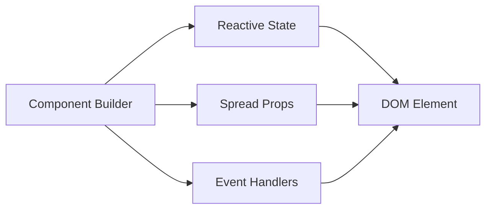
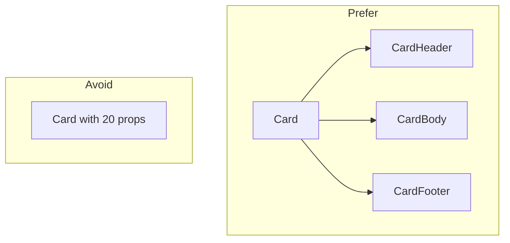
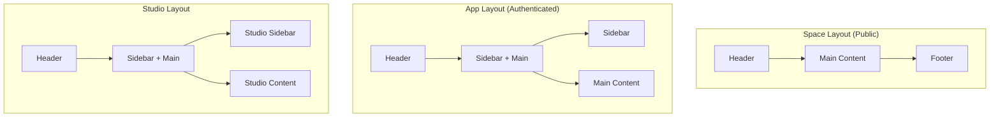

# Components

**Status**: Design
**Last Updated**: 2026-01-10

---

## Component Library

The frontend uses **Melt UI** for accessible, headless component primitives.

### Why Melt UI

| Consideration | Melt UI Approach |
|---------------|------------------|
| Accessibility | WAI-ARIA compliant out of the box |
| Styling | Headless—no styling opinions |
| Svelte 5 | Native runes support |
| SSR | Compatible with SvelteKit SSR |
| Customization | Full control over markup and styles |

### Melt UI Patterns

Melt UI uses a "builders" pattern:



Builders return objects that spread onto elements, providing:
- ARIA attributes
- Keyboard handlers
- State management
- Focus management

---

## Component Organization

```
$lib/components/
├── primitives/         # Melt UI wrappers
│   ├── Accordion/
│   ├── Dialog/
│   ├── DropdownMenu/
│   ├── Tabs/
│   └── ...
├── layout/             # Page structure
│   ├── Header/
│   ├── Sidebar/
│   ├── Footer/
│   └── PageContainer/
├── content/            # Content-specific
│   ├── ContentCard/
│   ├── ContentGrid/
│   ├── VideoPlayer/
│   └── MediaUpload/
├── forms/              # Form components
│   ├── TextField/
│   ├── Select/
│   ├── Checkbox/
│   └── FormField/
└── shared/             # Cross-cutting
    ├── Breadcrumbs/
    ├── LoadingSpinner/
    ├── ErrorBanner/
    └── Toast/
```

---

## Component Categories

### Primitives

Thin wrappers around Melt UI builders with project styling:

| Component | Melt UI Builder | Purpose |
|-----------|-----------------|---------|
| Accordion | `createAccordion` | Collapsible sections |
| Dialog | `createDialog` | Modal dialogs |
| DropdownMenu | `createDropdownMenu` | Action menus |
| Popover | `createPopover` | Floating content |
| Select | `createSelect` | Dropdown selection |
| Tabs | `createTabs` | Tabbed content |
| Tooltip | `createTooltip` | Hover hints |

### Layout Components

| Component | Purpose |
|-----------|---------|
| Header | Top navigation, branding, user menu |
| Sidebar | Side navigation for studio/app |
| Footer | Footer links, copyright |
| PageContainer | Consistent page margins and max-width |
| Breadcrumbs | Navigation trail |

### Content Components

| Component | Purpose |
|-----------|---------|
| ContentCard | Thumbnail, title, price display |
| ContentGrid | Responsive grid of content cards |
| VideoPlayer | HLS video playback with controls |
| ChapterList | Video chapter navigation |
| MediaUpload | Drag-and-drop upload zone |
| ProgressBar | Playback or upload progress |

### Form Components

| Component | Purpose |
|-----------|---------|
| TextField | Text input with label, error |
| TextArea | Multi-line text input |
| Select | Dropdown with Melt UI |
| Checkbox | Checkbox with label |
| RadioGroup | Radio button group |
| FormField | Wrapper with label, error, hint |
| FileUpload | File input with drag-drop |

---

## Component Design Principles

### 1. Composition Over Configuration

Prefer composable components over prop-heavy ones:



### 2. Props Interface

Components receive data and callbacks:

| Prop Type | Convention |
|-----------|------------|
| Data | Descriptive names: `content`, `user` |
| Callbacks | `on` prefix: `onclick`, `onchange` |
| Variants | Literal unions: `variant: 'primary' \| 'secondary'` |
| Slots | Use Svelte snippets |

### 3. Styling

Components use CSS custom properties for theming:

| Approach | Use |
|----------|-----|
| Design tokens | Colors, spacing, typography |
| CSS classes | Component-specific styles |
| `class` prop | Allow parent overrides |

See [STYLING.md](./STYLING.md) for token system.

---

## Layout Patterns

### Page Structure



### Context-Specific Headers

| Context | Header Contents |
|---------|-----------------|
| Platform | Logo, Platform Nav, Login/Signup |
| Org Space | Org Logo, Explore, Login/Library |
| Org App | Org Logo, Library, User Menu |
| Studio | Org/Personal Logo, Studio Nav, User Menu |
| Creator Profile | Creator Banner, Nav |

---

## Key Components (Phase 1)

### ContentCard

Displays a content item in grid/list:

| Element | Description |
|---------|-------------|
| Thumbnail | Content cover image |
| Title | Content title |
| Creator | Creator name (in org context) |
| Price | Free / $XX.XX |
| Progress | Playback progress bar (if applicable) |

### VideoPlayer

HLS video playback:

| Feature | Description |
|---------|-------------|
| HLS.js | Adaptive streaming |
| Controls | Play, pause, seek, volume, fullscreen |
| Progress | Playback position saved |
| Chapters | Chapter navigation (if available) |
| Quality | Adaptive bitrate selection |

### MediaUpload

File upload zone:

| Feature | Description |
|---------|-------------|
| Drag-drop | Drop files to upload |
| Progress | Upload progress indicator |
| Preview | Thumbnail preview |
| Validation | File type and size limits |

---

## Accessibility Requirements

All components must meet WCAG 2.1 AA:

| Requirement | Implementation |
|-------------|----------------|
| Keyboard nav | All interactive elements focusable and operable |
| Screen readers | Proper ARIA labels and live regions |
| Color contrast | 4.5:1 for normal text, 3:1 for large |
| Focus indicators | Visible focus states |
| Motion | Respect `prefers-reduced-motion` |

Melt UI provides ARIA and keyboard handling. Custom components must maintain these standards.

---

## Error States

Components handle error states consistently:

| State | Visual Treatment |
|-------|------------------|
| Loading | Skeleton or spinner |
| Empty | Empty state illustration + message |
| Error | Error message with retry option |
| Forbidden | "Access denied" message |

---

## Related Documents

- [STYLING.md](./STYLING.md) - Design tokens and theming
- [DATA.md](./DATA.md) - How components receive data
