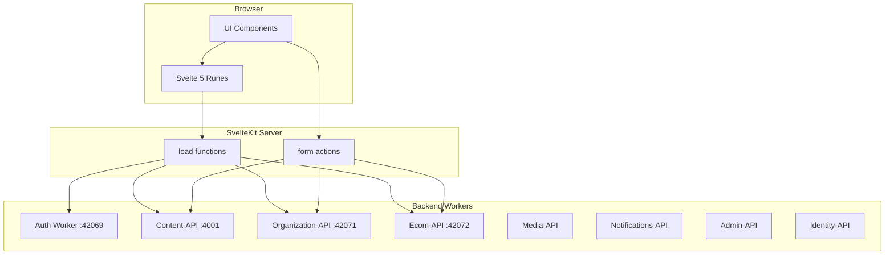
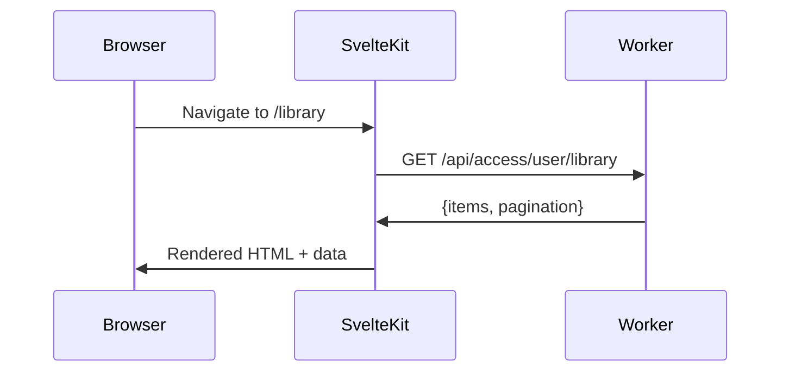
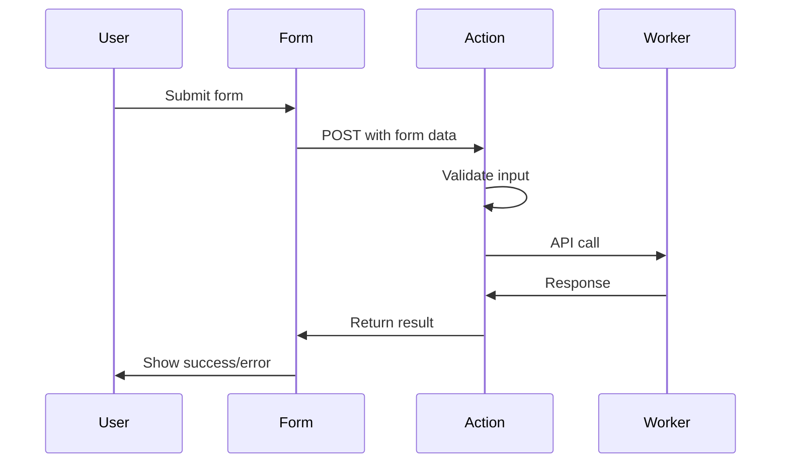
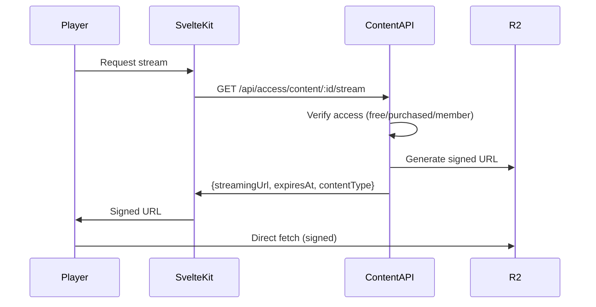

# Data Layer

**Status**: Design (Verified against implementation 2026-01-11)
**Last Updated**: 2026-01-11

---

## Architecture

The frontend acts as a presentation layer calling backend workers directly via HTTP. No BFF pattern.



---

## Worker Architecture

### 8 Backend Workers

| Worker | Dev Port | Purpose | Key Endpoints |
|--------|----------|---------|---------------|
| **Auth** | 42069 | Authentication, sessions | `/api/auth/*` |
| **Content-API** | 4001 | Content CRUD, streaming, access | `/api/content/*`, `/api/access/*` |
| **Organization-API** | 42071 | Org management, settings | `/api/organizations/*` |
| **Ecom-API** | 42072 | Checkout, webhooks | `/checkout/*`, `/webhooks/*` |
| **Media-API** | - | Transcoding callbacks | `/api/transcoding/*` |
| **Notifications-API** | - | Email templates | `/api/templates/*` |
| **Admin-API** | - | Platform admin | `/api/admin/*` |
| **Identity-API** | 42074 | User identity (placeholder) | `/health` |

### Environment Configuration

Worker URLs configured via wrangler bindings (Cloudflare Workers pattern):

```toml
# wrangler.toml
[env.production.vars]
AUTH_WORKER_URL = "https://auth.revelations.studio"
API_URL = "https://api.revelations.studio"
# Note: Additional worker URLs can be added as needed
```

```typescript
// Accessing in SvelteKit load functions (Cloudflare Workers)
export async function load({ platform }) {
  const authUrl = platform?.env?.AUTH_WORKER_URL ?? 'http://localhost:42069';
  const apiUrl = platform?.env?.API_URL ?? 'http://localhost:4001';
  // ...
}

// Local development fallbacks (when platform.env unavailable)
const WORKER_URLS = {
  auth: 'http://localhost:42069',
  content: 'http://localhost:4001',
  org: 'http://localhost:42071',
  ecom: 'http://localhost:42072',
} as const;
```

> **Important**: Cloudflare Workers use `platform.env` to access wrangler bindings, not `$env/static/public`. The `PUBLIC_*` prefix pattern from Vite `.env` files doesn't apply here.

---

## Data Fetching Patterns

### When to Use Each Pattern

| Pattern | Use Case | Example |
|---------|----------|---------|
| Server `load` | Initial page data, SEO content | Library list, content detail |
| Form actions | Mutations | Create content, purchase |
| Client fetch | Interactive updates | Search, filters, live data |
| Shared state | Cross-component reactivity | User preferences, playback |

---

## Server Load Functions

Load functions run on the server during SSR and on navigation:



### Data Flow

1. **Request arrives** at SvelteKit
2. **Load functions run** in route hierarchy (layout → page)
3. **Data returned** to page components via `data` prop
4. **HTML rendered** with data (SSR)
5. **Browser hydrates** with same data

### Parallel Fetching

Load functions can fetch from multiple workers in parallel:

```typescript
// +page.server.ts
export async function load({ fetch, cookies, platform }) {
  const sessionCookie = cookies.get('codex-session');

  // Access worker URLs via platform.env (Cloudflare Workers pattern)
  const apiUrl = platform?.env?.API_URL ?? 'http://localhost:4001';
  const orgApiUrl = platform?.env?.ORG_API_URL ?? 'http://localhost:42071';

  const [content, org] = await Promise.all([
    fetch(`${apiUrl}/api/content/${id}`, {
      headers: { Cookie: `codex-session=${sessionCookie}` }
    }),
    fetch(`${orgApiUrl}/api/organizations/slug/${slug}`, {
      headers: { Cookie: `codex-session=${sessionCookie}` }
    })
  ]);

  return {
    content: await content.json(),
    organization: await org.json()
  };
}
```

---

## Form Actions

Mutations use SvelteKit form actions for progressive enhancement:



### Progressive Enhancement

| JavaScript | Behavior |
|------------|----------|
| Disabled | Standard form POST, full page reload |
| Enabled | Enhanced submit, inline feedback, no reload |

Forms work without JavaScript, then enhance when JS loads.

---

## Client-Side Fetching

For interactive features that don't need SSR:

```typescript
// Search with debouncing
// API base URL passed from server-side load function to page data
let { data } = $props(); // data.apiUrl from load function
let searchQuery = $state('');
let results = $state([]);

$effect(() => {
  const query = searchQuery;
  if (query.length < 2) return;

  const timeout = setTimeout(async () => {
    // Use API URL from page data (set by server load function)
    const res = await fetch(
      `${data.apiUrl}/api/content?search=${encodeURIComponent(query)}`,
      { credentials: 'include' } // Forward session cookie
    );
    results = await res.json();
  }, 300);

  return () => clearTimeout(timeout);
});
```

> **Note**: Client-side code cannot access `platform.env` directly. Pass required URLs from server load functions via page data, or use relative URLs if proxying through the same origin.

### Use Cases

- **Search**: Debounced query as user types
- **Filters**: Update list without page reload
- **Infinite scroll**: Load more content (Future)
- **Live updates**: Polling or WebSocket (Future)

---

## State Management

Svelte 5 runes replace stores:

| Rune | Purpose |
|------|---------|
| `$state` | Reactive state declaration |
| `$derived` | Computed values |
| `$effect` | Side effects |

### State Locations

| Location | Scope | Example |
|----------|-------|---------|
| Component `$state` | Single component | Form input values |
| `.svelte.ts` files | Shared across components | User preferences |
| Page `data` | Current page | Server-loaded data |

### Shared State Pattern

Reactive state in `.svelte.ts` files:

```typescript
// lib/state/playback.svelte.ts
let currentPosition = $state(0);
let duration = $state(0);
let isPlaying = $state(false);

export function getPlaybackState() {
  return {
    get position() { return currentPosition; },
    get duration() { return duration; },
    get isPlaying() { return isPlaying; },
    get progress() { return duration > 0 ? (currentPosition / duration) * 100 : 0; },

    setPosition(pos: number) { currentPosition = pos; },
    setDuration(dur: number) { duration = dur; },
    play() { isPlaying = true; },
    pause() { isPlaying = false; }
  };
}
```

---

## API Helper Design

### Server-Side API Client

For use in `+page.server.ts` and `+server.ts` files:

```typescript
// lib/server/api.ts
import type { Platform } from '@sveltejs/kit';

const DEFAULT_URLS = {
  auth: 'http://localhost:42069',
  content: 'http://localhost:4001',
  org: 'http://localhost:42071',
  ecom: 'http://localhost:42072',
} as const;

type WorkerName = keyof typeof DEFAULT_URLS;

export function createServerApi(platform: Platform | undefined) {
  const authUrl = platform?.env?.AUTH_WORKER_URL ?? DEFAULT_URLS.auth;
  const apiUrl = platform?.env?.API_URL ?? DEFAULT_URLS.content;

  return {
    getWorkerUrl(worker: WorkerName): string {
      if (worker === 'auth') return authUrl;
      return apiUrl; // Other workers use single API_URL or defaults
    },

    async fetch<T>(
      worker: WorkerName,
      path: string,
      cookie?: string,
      options: RequestInit = {}
    ): Promise<T> {
      const url = `${this.getWorkerUrl(worker)}${path}`;
      const headers: Record<string, string> = {
        'Content-Type': 'application/json',
        ...options.headers as Record<string, string>,
      };
      if (cookie) headers.Cookie = cookie;

      const response = await fetch(url, { ...options, headers });

      if (!response.ok) {
        const error = await response.json();
        throw new ApiError(response.status, error);
      }

      if (response.status === 204) return null as T;
      return response.json();
    }
  };
}
```

### Client-Side API Client

For use in Svelte components (browser):

```typescript
// lib/api/client.ts
// Client-side uses relative URLs or configured base URLs

export async function api<T>(
  path: string,
  options: RequestInit = {}
): Promise<T> {
  const response = await fetch(path, {
    ...options,
    credentials: 'include', // Forward cookies
    headers: {
      'Content-Type': 'application/json',
      ...options.headers
    }
  });

  if (!response.ok) {
    const error = await response.json();
    throw new ApiError(response.status, error);
  }

  if (response.status === 204) return null as T;
  return response.json();
}

class ApiError extends Error {
  constructor(public status: number, public data: unknown) {
    super(`API Error: ${status}`);
  }
}
```

---

## Response Types

Workers return standardized response envelopes from `@codex/shared-types`:

### Single Item Response

```typescript
interface SingleItemResponse<T> {
  data: T;
}

// Example: GET /api/content/:id
const response: SingleItemResponse<Content> = {
  data: {
    id: "...",
    title: "...",
    // ...
  }
};
```

### Paginated List Response

```typescript
interface PaginatedListResponse<T> {
  items: T[];
  pagination: {
    page: number;
    limit: number;
    total: number;
    totalPages: number;
  };
}

// Example: GET /api/content
const response: PaginatedListResponse<Content> = {
  items: [...],
  pagination: { page: 1, limit: 20, total: 145, totalPages: 8 }
};
```

### Error Response

```typescript
interface ErrorResponse {
  error: {
    code: string;     // "NOT_FOUND", "UNAUTHORIZED", etc.
    message: string;  // Human-readable message
    details?: unknown;
  };
}
```

---

## Key API Endpoints

### Auth Worker (Phase 1)

> **Note**: BetterAuth uses its own endpoint naming conventions. Verified against e2e tests.

| Endpoint | Method | Purpose |
|----------|--------|---------|
| `/api/auth/get-session` | GET | Get current session + user |
| `/api/auth/sign-in/email` | POST | Email/password login |
| `/api/auth/sign-up/email` | POST | Create account |
| `/api/auth/signout` | POST | End session |
| `/api/auth/verify-email` | GET | Email verification |
| `/api/auth/email/send-reset-password-email` | POST | Request reset |
| `/api/auth/email/reset-password` | POST | Complete reset |

### Content-API Worker (Phase 1)

| Endpoint | Method | Purpose |
|----------|--------|---------|
| `/api/content` | GET | List content (paginated) |
| `/api/content/:id` | GET | Get content detail |
| `/api/access/content/:id/stream` | GET | Get streaming URL |
| `/api/access/content/:id/progress` | GET | Get playback progress |
| `/api/access/content/:id/progress` | POST | Save playback progress |
| `/api/access/user/library` | GET | User's purchased content |

### Organization-API Worker (Phase 1)

| Endpoint | Method | Purpose |
|----------|--------|---------|
| `/api/organizations/slug/:slug` | GET | Get org by slug |
| `/api/organizations/:id` | GET | Get org by ID |
| `/api/organizations/:id/settings` | GET | Get org settings (branding, features) |

### Ecom-API Worker (Phase 1)

| Endpoint | Method | Purpose |
|----------|--------|---------|
| `/checkout/create` | POST | Create Stripe checkout session |

---

## Streaming URL Flow

Content playback requires signed R2 URLs:



### StreamingUrlResponse

```typescript
interface StreamingUrlResponse {
  streamingUrl: string;  // Signed R2 URL
  expiresAt: string;     // ISO 8601
  contentType: string;   // "video" | "audio"
}
```

---

## Playback Progress

### Save Progress

```typescript
// POST /api/access/content/:id/progress
const body = {
  positionSeconds: 1200,
  durationSeconds: 3600,
  completed: false  // Auto-set true at 95%
};
// Returns: 204 No Content
```

### Get Progress

```typescript
// GET /api/access/content/:id/progress
interface PlaybackProgressResponse {
  progress: {
    positionSeconds: number;
    durationSeconds: number;
    completed: boolean;
    updatedAt: string;
  } | null;  // null if never started
}
```

---

## User Library

```typescript
// GET /api/access/user/library
interface UserLibraryResponse {
  items: Array<{
    content: {
      id: string;
      title: string;
      description: string;
      thumbnailUrl: string | null;
      contentType: string;
      durationSeconds: number;
    };
    purchase: {
      purchasedAt: string;
      priceCents: number;
    };
    progress: {
      positionSeconds: number;
      durationSeconds: number;
      completed: boolean;
      percentComplete: number;
      updatedAt: string;
    } | null;
  }>;
  pagination: PaginationMetadata;
}
```

---

## Data Dependencies

SvelteKit's `depends` and `invalidate` manage cache:

```typescript
// +page.server.ts
export async function load({ depends }) {
  depends('app:library');
  // fetch library...
}

// After purchase action
import { invalidate } from '$app/navigation';
await invalidate('app:library');  // Triggers reload
```

### Dependency Keys

| Key | Triggers Reload Of |
|-----|-------------------|
| `app:library` | User's content library |
| `app:content` | Content listings |
| `app:user` | User profile data |
| `app:org` | Organization data |

---

## Validation

Input validation uses Zod schemas from `@codex/validation`:

```typescript
import { createContentSchema } from '@codex/validation';

// In form action
export const actions = {
  create: async ({ request }) => {
    const formData = await request.formData();
    const data = Object.fromEntries(formData);

    const result = createContentSchema.safeParse(data);
    if (!result.success) {
      return fail(400, {
        errors: result.error.flatten().fieldErrors
      });
    }

    // Valid data, send to API
  }
};
```

### Shared Schemas

The frontend imports validation schemas directly from `@codex/validation`:

- Content: `createContentSchema`, `updateContentSchema`
- Organizations: `createOrganizationSchema`, `updateOrganizationSchema`
- Access: `savePlaybackProgressSchema`
- Primitives: `uuidSchema`, `emailSchema`, `urlSchema`

---

## Error Handling

### Load Function Errors

| Error Type | Handling |
|------------|----------|
| 404 | Show error page via SvelteKit error |
| 401 | Redirect to login with return URL |
| 403 | Show forbidden page |
| 500 | Show generic error |

```typescript
import { error, redirect } from '@sveltejs/kit';

export async function load({ fetch }) {
  const res = await fetch('/api/content/123');

  if (res.status === 401) {
    throw redirect(302, '/login?redirect=/content/123');
  }

  if (res.status === 404) {
    throw error(404, 'Content not found');
  }

  if (!res.ok) {
    throw error(res.status, 'Failed to load content');
  }

  return { content: await res.json() };
}
```

### Form Action Errors

| Error Type | Handling |
|------------|----------|
| Validation | Return errors to form, show inline |
| API error | Return error message, show banner |
| Network | Show retry option |

### Client Fetch Errors

| Error Type | Handling |
|------------|----------|
| Network | Show toast, offer retry |
| 401 | Redirect to login |
| Other | Show toast with message |

---

## Caching Strategy

| Layer | Cache | TTL |
|-------|-------|-----|
| Browser | HTTP cache headers | Per-resource |
| SvelteKit | Load function results | Until invalidated |
| Workers | KV cache | Varies by data type |

The frontend doesn't implement caching—it relies on proper cache headers from workers and SvelteKit's built-in handling.

---

## Future Features

| Feature | Notes |
|---------|-------|
| WebSocket live updates | Real-time notifications |
| Optimistic updates | Update UI before server confirms |
| Offline support | Service worker caching |
| Background sync | Queue mutations when offline |

---

## Related Documents

- [AUTH.md](./AUTH.md) - Session handling in data fetching
- [COMPONENTS.md](./COMPONENTS.md) - How components consume data
- [INFRASTRUCTURE.md](./INFRASTRUCTURE.md) - Worker deployment
