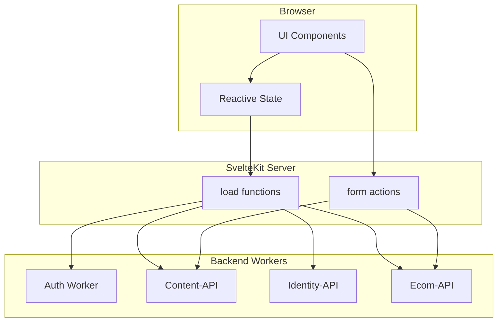
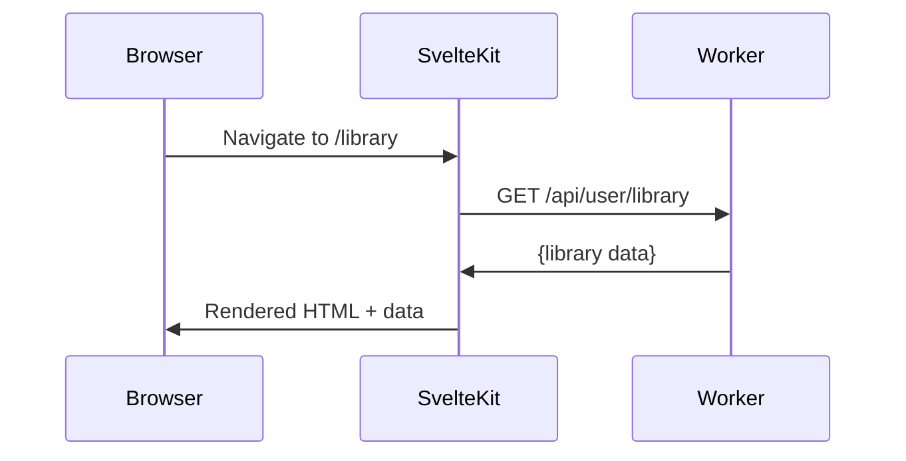
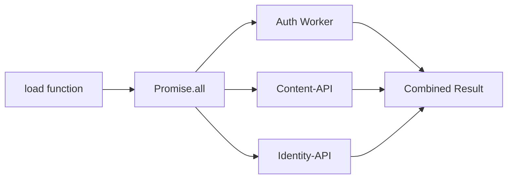
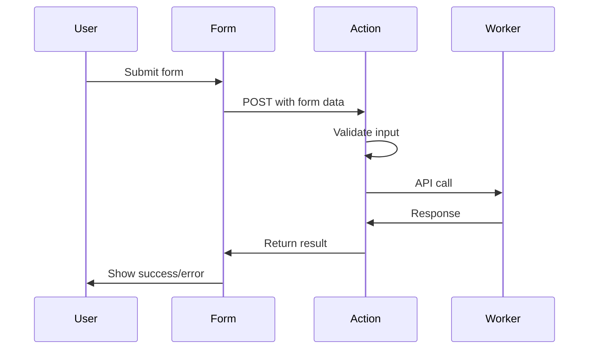
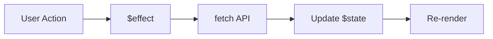
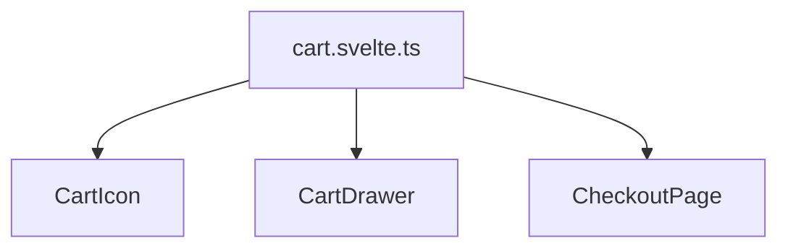
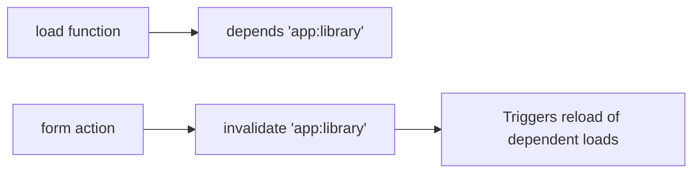
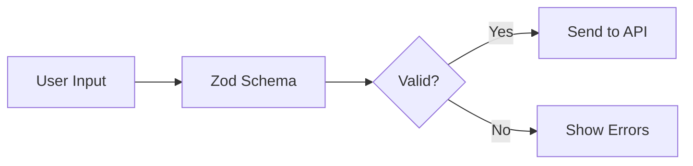

# Data Layer

**Status**: Design
**Last Updated**: 2026-01-10

---

## Architecture

The frontend acts as a presentation layer. All data comes from backend workers via HTTP.

---

## Data Fetching Patterns

### When to Use Each Pattern

| Pattern | Use Case | Example |
|---------|----------|---------|
| Server `load` | Initial page data, SEO content | Library list, content detail |
| Form actions | Mutations | Create content, purchase |
| Client fetch | Interactive updates | Search, filters, live data |
| Shared state | Cross-component reactivity | Cart, preferences |

---

## Server Load Functions

Load functions run on the server during SSR and on navigation:

### Data Flow

1. **Request arrives** at SvelteKit
2. **Load functions run** in route hierarchy (layout → page)
3. **Data returned** to page components via `data` prop
4. **HTML rendered** with data (SSR)
5. **Browser hydrates** with same data

### Parallel Fetching

Load functions can fetch from multiple workers in parallel:

This prevents waterfall requests and improves page load time.

---

## Form Actions

Mutations use SvelteKit form actions for progressive enhancement:

### Progressive Enhancement

| JavaScript | Behavior |
|------------|----------|
| Disabled | Standard form POST, full page reload |
| Enabled | Enhanced submit, inline feedback, no reload |

Forms work without JavaScript, then enhance when JS loads.

---

## Client-Side Fetching

For interactive features that don't need SSR:

### Use Cases

- **Search**: Debounced query as user types
- **Filters**: Update list without page reload
- **Infinite scroll**: Load more content
- **Live updates**: Polling or WebSocket

---

## State Management

Svelte 5 runes replace stores:

| Rune | Purpose |
|------|---------|
| `$state` | Reactive state declaration |
| `$derived` | Computed values |
| `$effect` | Side effects |

### State Locations

| Location | Scope | Example |
|----------|-------|---------|
| Component `$state` | Single component | Form input values |
| `.svelte.ts` files | Shared across components | Cart, user preferences |
| Page `data` | Current page | Server-loaded data |

### Shared State Pattern

Reactive state in `.svelte.ts` files is shared across components:

Changes in any component reflect everywhere instantly.

---

## API Helper Design

A centralized API helper handles:

- **Base URLs**: Per-worker URL configuration
- **Authentication**: Forward session cookie
- **Error handling**: Consistent error transformation
- **Typing**: Type-safe responses

### Worker Endpoints

| Worker | Base URL | Purpose |
|--------|----------|---------|
| Auth | `auth.revelations.studio` | Session, login, registration |
| Content | `api.revelations.studio` | Content CRUD, media, streaming |
| Identity | `identity.revelations.studio` | Orgs, memberships |
| Ecom | `ecom.revelations.studio` | Checkout, purchases |

---

## Data Dependencies

SvelteKit's `depends` and `invalidate` manage cache:

### Dependency Keys

| Key | Triggers Reload Of |
|-----|-------------------|
| `app:library` | User's content library |
| `app:content` | Content listings |
| `app:user` | User profile data |
| `app:org` | Organization data |

---

## Validation

Input validation uses Zod schemas shared with backend:

### Schema Sharing

The `@codex/validation` package contains schemas used by both frontend and backend. This ensures validation rules are consistent.

---

## Error Handling

### Load Function Errors

| Error Type | Handling |
|------------|----------|
| 404 | Show error page |
| 401 | Redirect to login |
| 403 | Show forbidden page |
| 500 | Show generic error |

### Form Action Errors

| Error Type | Handling |
|------------|----------|
| Validation | Return errors to form, show inline |
| API error | Return error message, show banner |
| Network | Show retry option |

### Client Fetch Errors

| Error Type | Handling |
|------------|----------|
| Network | Show toast, offer retry |
| 401 | Redirect to login |
| Other | Show toast with message |

---

## Caching Strategy

| Layer | Cache | TTL |
|-------|-------|-----|
| Browser | HTTP cache headers | Per-resource |
| SvelteKit | Load function results | Until invalidated |
| Workers | KV cache | Varies by data type |

The frontend doesn't implement caching—it relies on proper cache headers from workers and SvelteKit's built-in handling.

---

## Related Documents

- [AUTH.md](./AUTH.md) - Session handling in data fetching
- [COMPONENTS.md](./COMPONENTS.md) - How components consume data
