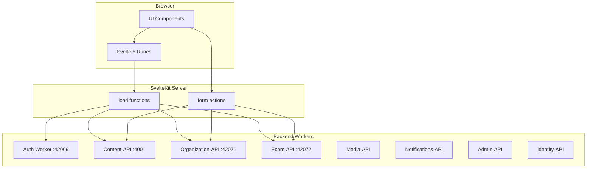
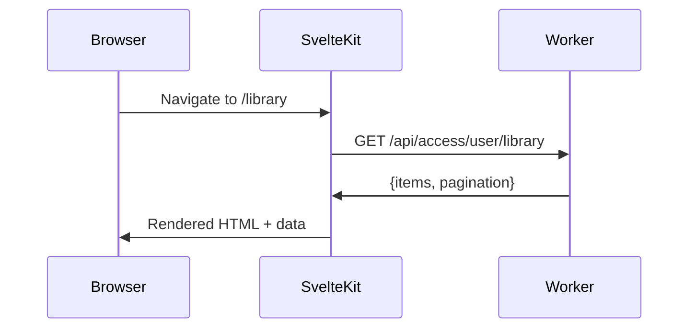
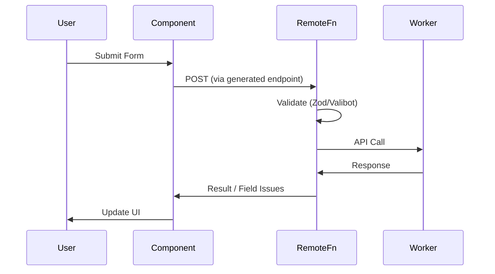
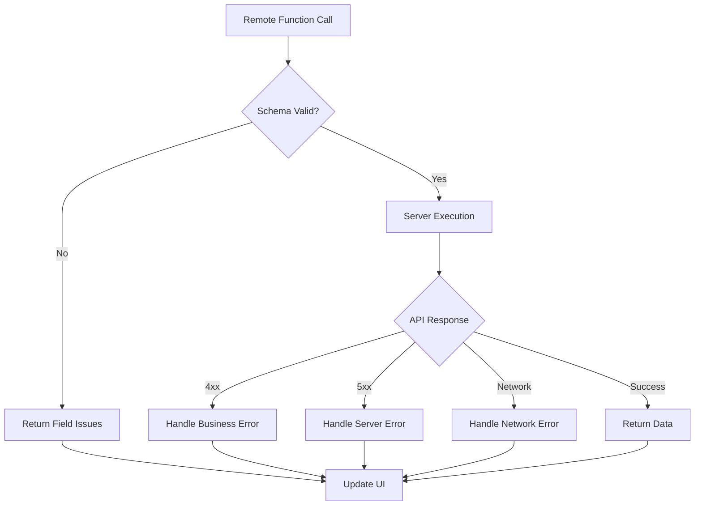
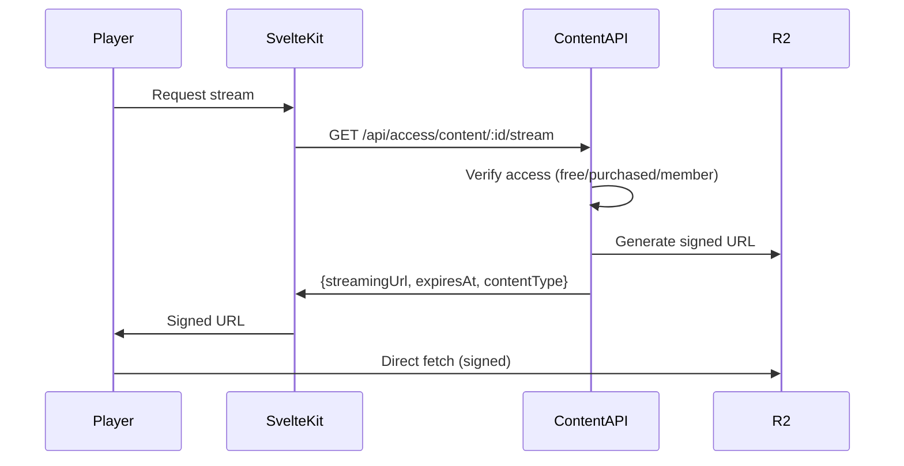

# Data Layer

**Status**: Design (Verified against implementation 2026-01-11)
**Last Updated**: 2026-01-11

---

## Architecture

The frontend acts as a presentation layer calling backend workers directly via HTTP. No BFF pattern.



---

## Worker Architecture

### 8 Backend Workers

| Worker | Dev Port | Purpose | Key Endpoints |
|--------|----------|---------|---------------|
| **Auth** | 42069 | Authentication, sessions | `/api/auth/*` |
| **Content-API** | 4001 | Content CRUD, streaming, access | `/api/content/*`, `/api/access/*` |
| **Organization-API** | 42071 | Org management, settings | `/api/organizations/*` |
| **Ecom-API** | 42072 | Checkout, webhooks | `/checkout/*`, `/webhooks/*` |
| **Media-API** | - | Transcoding callbacks | `/api/transcoding/*` |
| **Notifications-API** | - | Email templates | `/api/templates/*` |
| **Admin-API** | - | Platform admin | `/api/admin/*` |
| **Identity-API** | 42074 | User identity (placeholder) | `/health` |

### Environment Configuration

Worker URLs configured via wrangler bindings (Cloudflare Workers pattern):

```toml
# wrangler.toml
[env.production.vars]
AUTH_WORKER_URL = "https://auth.revelations.studio"
API_URL = "https://api.revelations.studio"
# Note: Additional worker URLs can be added as needed
```

```typescript
// Accessing in SvelteKit load functions (Cloudflare Workers)
export async function load({ platform }) {
  const authUrl = platform?.env?.AUTH_WORKER_URL ?? 'http://localhost:42069';
  const apiUrl = platform?.env?.API_URL ?? 'http://localhost:4001';
  // ...
}

// Local development fallbacks (when platform.env unavailable)
const WORKER_URLS = {
  auth: 'http://localhost:42069',
  content: 'http://localhost:4001',
  org: 'http://localhost:42071',
  ecom: 'http://localhost:42072',
} as const;
```

> **Important**: Cloudflare Workers use `platform.env` to access wrangler bindings, not `$env/static/public`. The `PUBLIC_*` prefix pattern from Vite `.env` files doesn't apply here.

---

## Data Fetching Patterns

### When to Use Each Pattern

| Pattern | Use Case | Example |
|---------|----------|---------|
| Server `load` | Initial page data, SEO content | Library list, content detail |
| Form actions | Mutations | Create content, purchase |
| Client fetch | Interactive updates | Search, filters, live data |
| Shared state | Cross-component reactivity | User preferences, playback |

---

## Server Load Functions

Load functions run on the server during SSR and on navigation:



### Data Flow

1. **Request arrives** at SvelteKit
2. **Load functions run** in route hierarchy (layout → page)
3. **Data returned** to page components via `data` prop
4. **HTML rendered** with data (SSR)
5. **Browser hydrates** with same data

### Parallel Fetching

Load functions can fetch from multiple workers in parallel:

```typescript
// +page.server.ts
export async function load({ fetch, cookies, platform }) {
  const sessionCookie = cookies.get('codex-session');

  // Access worker URLs via platform.env (Cloudflare Workers pattern)
  const apiUrl = platform?.env?.API_URL ?? 'http://localhost:4001';
  const orgApiUrl = platform?.env?.ORG_API_URL ?? 'http://localhost:42071';

  const [content, org] = await Promise.all([
    fetch(`${apiUrl}/api/content/${id}`, {
      headers: { Cookie: `codex-session=${sessionCookie}` }
    }),
    fetch(`${orgApiUrl}/api/organizations/slug/${slug}`, {
      headers: { Cookie: `codex-session=${sessionCookie}` }
    })
  ]);

  return {
    content: await content.json(),
    organization: await org.json()
  };
}
```

---

## Remote Functions (Experimental)

We utilize SvelteKit's experimental **Remote Functions** for type-safe client-server communication. Available since SvelteKit 2.27, this feature replaces standard Form Actions and simplifies data fetching.

> **Note**: Remote Functions are experimental (as of January 2026). The API may change. Monitor the [SvelteKit changelog](https://github.com/sveltejs/kit/releases) for updates.

### Configuration

Enable experimental support in `svelte.config.js`:

```javascript
/** @type {import('@sveltejs/kit').Config} */
const config = {
  kit: {
    experimental: {
      remoteFunctions: true
    }
  },
  compilerOptions: {
    experimental: {
      async: true  // Required for await in templates
    }
  }
};
export default config;
```

### Remote Function Types

| Type | Use Case | HTTP Method | Progressive Enhancement |
|------|----------|-------------|------------------------|
| `query` | Data fetching | GET | N/A (client-side) |
| `form` | Form mutations | POST | Yes (works without JS) |
| `command` | Programmatic actions | POST | No (requires JS) |
| `prerender` | Static data | Build time | N/A |

### 1. Remote Forms (`form`)

Used for mutations (POST). Provides progressive enhancement, validation, and type-safety.



**Implementation Pattern:**

Define the form in a `.remote.ts` file (e.g., `src/routes/login/auth.remote.ts`):

```typescript
import { form } from '$app/server';
import { loginSchema } from '@codex/validation'; // Shared Zod schema
import { redirect, invalid } from '@sveltejs/kit';
import { createServerApi } from '$lib/server/api';

export const login = form(
  loginSchema,
  async ({ email, password }, { platform }) => {
    const api = createServerApi(platform);

    try {
      const response = await api.fetch('auth', '/api/auth/sign-in/email', undefined, {
        method: 'POST',
        body: JSON.stringify({ email, password })
      });

      // Set session cookie from response
      redirect(303, '/library');
    } catch (error) {
      if (error instanceof ApiError) {
        if (error.status === 401) {
          // Return field-level issues
          return invalid(401, {
            email: ['Invalid email or password']
          });
        }
      }
      throw error;
    }
  }
);
```

Use in Component (`+page.svelte`):

```svelte
<script lang="ts">
  import { login } from './auth.remote';
</script>

<form {...login}>
  <label>
    Email
    <input {...login.fields.email.as('email')} />
  </label>
  {#each login.fields.email.issues() as issue}
    <span class="error">{issue.message}</span>
  {/each}

  <label>
    Password
    <input {...login.fields.password.as('password')} type="password" />
  </label>
  {#each login.fields.password.issues() as issue}
    <span class="error">{issue.message}</span>
  {/each}

  <button disabled={login.submitting}>
    {login.submitting ? 'Logging in...' : 'Log In'}
  </button>
</form>
```

### 2. Remote Queries (`query`)

Used for fetching data (GET). Can be awaited directly in templates.

**Basic Query:**

```typescript
// content.remote.ts
import { query } from '$app/server';
import * as v from 'valibot';
import { createServerApi } from '$lib/server/api';

export const getContent = query(
  v.string(), // Validate input
  async (id, { platform }) => {
    const api = createServerApi(platform);
    return api.fetch<Content>('content', `/api/content/${id}`);
  }
);
```

**Batched Queries** (solves N+1 problem):

```typescript
// For lists where each item needs additional data
export const getContentWithCreator = query.batch(
  v.string(),
  async (ids, { platform }) => {
    const api = createServerApi(platform);
    // Single request for all IDs
    const results = await api.fetch<Content[]>(
      'content',
      `/api/content?ids=${ids.join(',')}`
    );
    // Return Map keyed by input
    return new Map(results.map(c => [c.id, c]));
  }
);
```

**Usage in Template:**

```svelte
<script lang="ts">
  import { getContent } from './content.remote';
  let { data } = $props();
</script>

{#await getContent(data.id)}
  <ContentSkeleton />
{:then content}
  <h1>{content.title}</h1>
  <p>{content.description}</p>
{:catch error}
  <ErrorBanner message="Failed to load content" {error} />
{/await}
```

### 3. Remote Commands (`command`)

Used for actions triggered outside of forms (e.g., "Like" button, "Add to Wishlist").

```typescript
// interactions.remote.ts
import { command, query } from '$app/server';
import * as v from 'valibot';
import { createServerApi } from '$lib/server/api';

export const getLikes = query(
  v.string(),
  async (contentId, { platform }) => {
    const api = createServerApi(platform);
    const result = await api.fetch<{ count: number }>(
      'content',
      `/api/content/${contentId}/likes`
    );
    return result.count;
  }
);

export const addLike = command(
  v.string(),
  async (contentId, { platform }) => {
    const api = createServerApi(platform);
    await api.fetch('content', `/api/content/${contentId}/like`, undefined, {
      method: 'POST'
    });
    // Refresh the query after mutation
    getLikes(contentId).refresh();
  }
);
```

```svelte
<script lang="ts">
  import { getLikes, addLike } from './interactions.remote';
  let { content } = $props();
</script>

<button onclick={() => addLike(content.id)}>
  Like ({await getLikes(content.id)})
</button>
```

---

## Remote Functions: Advanced Patterns

### Error Handling Strategy

Remote functions can fail at multiple levels. Handle each appropriately:



**Form Error Handling:**

```typescript
// auth.remote.ts
import { form, invalid } from '$app/server';
import { loginSchema } from '@codex/validation';
import * as Sentry from '@sentry/sveltekit';

export const login = form(
  loginSchema,
  async ({ email, password }, { platform }) => {
    const api = createServerApi(platform);

    try {
      await api.fetch('auth', '/api/auth/sign-in/email', undefined, {
        method: 'POST',
        body: JSON.stringify({ email, password })
      });
      redirect(303, '/library');
    } catch (error) {
      // Business errors (4xx) - show to user
      if (error instanceof ApiError) {
        switch (error.status) {
          case 401:
            return invalid(401, { email: ['Invalid credentials'] });
          case 403:
            return invalid(403, { email: ['Account locked. Contact support.'] });
          case 429:
            return invalid(429, { _form: ['Too many attempts. Try again later.'] });
        }
      }

      // Server errors (5xx) - log and show generic message
      Sentry.captureException(error);
      return invalid(500, { _form: ['Something went wrong. Please try again.'] });
    }
  }
);
```

**Command Error Handling:**

```typescript
// interactions.remote.ts
export const addLike = command(
  v.string(),
  async (contentId, { platform }) => {
    const api = createServerApi(platform);

    try {
      await api.fetch('content', `/api/content/${contentId}/like`, undefined, {
        method: 'POST'
      });
      getLikes(contentId).refresh();
    } catch (error) {
      // Re-throw to let client handle
      // Client will catch and show toast
      throw error;
    }
  }
);
```

```svelte
<script lang="ts">
  import { addLike } from './interactions.remote';
  import { showToast } from '$lib/components/Toast';

  async function handleLike() {
    try {
      await addLike(content.id);
    } catch (error) {
      showToast('Failed to add like. Please try again.', 'error');
    }
  }
</script>
```

### Optimistic Updates

For instant UI feedback, use `withOverride` to update queries before server confirms:

```typescript
// Pattern: Optimistic update with automatic rollback
export const addLike = command(
  v.string(),
  async (contentId) => {
    await api.fetch('content', `/api/content/${contentId}/like`, undefined, {
      method: 'POST'
    });
    // Server-side refresh happens after success
    getLikes(contentId).refresh();
  }
);
```

```svelte
<script lang="ts">
  import { getLikes, addLike } from './interactions.remote';
  import { showToast } from '$lib/components/Toast';

  let { content } = $props();
  let isLiking = $state(false);

  async function handleLike() {
    isLiking = true;
    try {
      // Optimistic: update UI immediately, revert on failure
      await addLike(content.id).updates(
        getLikes(content.id).withOverride((count) => count + 1)
      );
    } catch (error) {
      // SvelteKit automatically reverts the optimistic update
      showToast('Failed to like. Please try again.', 'error');
    } finally {
      isLiking = false;
    }
  }
</script>

<button onclick={handleLike} disabled={isLiking}>
  {isLiking ? '...' : '❤️'} {await getLikes(content.id)}
</button>
```

**When to Use Optimistic Updates:**

| Action | Optimistic? | Reason |
|--------|-------------|--------|
| Like/Unlike | Yes | High frequency, low risk |
| Add to wishlist | Yes | Low risk, easy to undo |
| Purchase | No | Financial, needs confirmation |
| Delete content | No | Destructive, confirm first |
| Save draft | Yes | Frequent saves, auto-save pattern |
| Publish content | No | State change, confirm intent |

### Migration Strategy: Form Actions → Remote Functions

If you have existing SvelteKit Form Actions, migrate incrementally:

**Phase 1: New features use Remote Functions**

```typescript
// NEW: interactions.remote.ts
export const addLike = command(...);
```

**Phase 2: Migrate simple actions**

```typescript
// BEFORE: +page.server.ts
export const actions = {
  like: async ({ request, locals }) => {
    const data = await request.formData();
    const contentId = data.get('contentId');
    // ... handle like
  }
};

// AFTER: interactions.remote.ts
export const addLike = command(
  v.string(),
  async (contentId, { platform }) => {
    // ... same logic
  }
);
```

**Phase 3: Complex forms with validation**

```typescript
// BEFORE: +page.server.ts with superforms
export const actions = {
  create: async ({ request }) => {
    const form = await superValidate(request, createContentSchema);
    if (!form.valid) return fail(400, { form });
    // ...
  }
};

// AFTER: content.remote.ts
export const createContent = form(
  createContentSchema,
  async (data, { platform }) => {
    // Validation automatic via schema
    // ...
  }
);
```

**Migration Checklist:**

- [ ] Identify all `+page.server.ts` files with `actions`
- [ ] Prioritize by complexity (simple → complex)
- [ ] Create `.remote.ts` equivalents
- [ ] Update components to use new imports
- [ ] Test progressive enhancement (JS disabled)
- [ ] Remove old action code
- [ ] Update tests

### Query Caching and Invalidation

Remote queries integrate with SvelteKit's invalidation system:

```typescript
// Invalidate specific query
getLikes(contentId).refresh();

// Set query value directly (when you already have the data)
getLikes(contentId).set(42);

// Invalidate all queries of a type
import { invalidate } from '$app/navigation';
invalidate('app:content'); // Invalidates load functions with depends('app:content')
```

**Cache Behavior:**

| Method | Effect |
|--------|--------|
| `.refresh()` | Refetch from server, update cache |
| `.set(value)` | Update cache without server call |
| `.withOverride(fn)` | Temporary override, reverts on error |

### When to Use Remote Functions vs Load Functions

| Use Case | Remote Function | Load Function |
|----------|-----------------|---------------|
| Initial page data | No | Yes |
| SEO-critical content | No | Yes |
| Component-specific data | Yes | No |
| Interactive updates | Yes | No |
| Form submissions | Yes (form) | Depends |
| Server-only secrets | Both | Both |

**Hybrid Example:**

```typescript
// +page.server.ts - Initial data for SEO
export async function load({ params, platform }) {
  const api = createServerApi(platform);
  return {
    content: await api.fetch('content', `/api/content/${params.slug}`),
    // Pass ID for client-side queries
    contentId: params.slug
  };
}

// interactions.remote.ts - Interactive features
export const getLikes = query(v.string(), async (id) => { ... });
export const addLike = command(v.string(), async (id) => { ... });
```

```svelte
<script lang="ts">
  import { getLikes, addLike } from './interactions.remote';
  let { data } = $props();
</script>

<!-- SEO: Server-rendered -->
<h1>{data.content.title}</h1>

<!-- Interactive: Client-rendered -->
<LikeButton
  count={await getLikes(data.contentId)}
  onLike={() => addLike(data.contentId)}
/>
```

---

## Server Load Functions

Load functions are still used for:
1. SEO-critical data (Metadata)
2. Initial session validation
3. Passing params to page props

```mermaid
sequenceDiagram

## Client-Side Fetching

For interactive features that don't need SSR:

```typescript
// Search with debouncing
// API base URL passed from server-side load function to page data
let { data } = $props(); // data.apiUrl from load function
let searchQuery = $state('');
let results = $state([]);

$effect(() => {
  const query = searchQuery;
  if (query.length < 2) return;

  const timeout = setTimeout(async () => {
    // Use API URL from page data (set by server load function)
    const res = await fetch(
      `${data.apiUrl}/api/content?search=${encodeURIComponent(query)}`,
      { credentials: 'include' } // Forward session cookie
    );
    results = await res.json();
  }, 300);

  return () => clearTimeout(timeout);
});
```

> **Note**: Client-side code cannot access `platform.env` directly. Pass required URLs from server load functions via page data, or use relative URLs if proxying through the same origin.

### Use Cases

- **Search**: Debounced query as user types
- **Filters**: Update list without page reload
- **Infinite scroll**: Load more content (Future)
- **Live updates**: Polling or WebSocket (Future)

---

## State Management

Svelte 5 runes replace stores:

| Rune | Purpose |
|------|---------|
| `$state` | Reactive state declaration |
| `$derived` | Computed values |
| `$effect` | Side effects |

### State Locations

| Location | Scope | Example |
|----------|-------|---------|
| Component `$state` | Single component | Form input values |
| `.svelte.ts` files | Shared across components | User preferences |
| Page `data` | Current page | Server-loaded data |

### Shared State Pattern

Reactive state in `.svelte.ts` files:

```typescript
// lib/state/playback.svelte.ts
let currentPosition = $state(0);
let duration = $state(0);
let isPlaying = $state(false);

export function getPlaybackState() {
  return {
    get position() { return currentPosition; },
    get duration() { return duration; },
    get isPlaying() { return isPlaying; },
    get progress() { return duration > 0 ? (currentPosition / duration) * 100 : 0; },

    setPosition(pos: number) { currentPosition = pos; },
    setDuration(dur: number) { duration = dur; },
    play() { isPlaying = true; },
    pause() { isPlaying = false; }
  };
}
```

---

## API Helper Design

### Server-Side API Client

For use in `+page.server.ts` and `+server.ts` files:

```typescript
// lib/server/api.ts
import type { Platform } from '@sveltejs/kit';

const DEFAULT_URLS = {
  auth: 'http://localhost:42069',
  content: 'http://localhost:4001',
  org: 'http://localhost:42071',
  ecom: 'http://localhost:42072',
} as const;

type WorkerName = keyof typeof DEFAULT_URLS;

export function createServerApi(platform: Platform | undefined) {
  const authUrl = platform?.env?.AUTH_WORKER_URL ?? DEFAULT_URLS.auth;
  const apiUrl = platform?.env?.API_URL ?? DEFAULT_URLS.content;

  return {
    getWorkerUrl(worker: WorkerName): string {
      if (worker === 'auth') return authUrl;
      return apiUrl; // Other workers use single API_URL or defaults
    },

    async fetch<T>(
      worker: WorkerName,
      path: string,
      cookie?: string,
      options: RequestInit = {}
    ): Promise<T> {
      const url = `${this.getWorkerUrl(worker)}${path}`;
      const headers: Record<string, string> = {
        'Content-Type': 'application/json',
        ...options.headers as Record<string, string>,
      };
      if (cookie) headers.Cookie = cookie;

      const response = await fetch(url, { ...options, headers });

      if (!response.ok) {
        const error = await response.json();
        throw new ApiError(response.status, error);
      }

      if (response.status === 204) return null as T;
      return response.json();
    }
  };
}
```

### Client-Side API Client

For use in Svelte components (browser):

```typescript
// lib/api/client.ts
// Client-side uses relative URLs or configured base URLs

export async function api<T>(
  path: string,
  options: RequestInit = {}
): Promise<T> {
  const response = await fetch(path, {
    ...options,
    credentials: 'include', // Forward cookies
    headers: {
      'Content-Type': 'application/json',
      ...options.headers
    }
  });

  if (!response.ok) {
    const error = await response.json();
    throw new ApiError(response.status, error);
  }

  if (response.status === 204) return null as T;
  return response.json();
}

class ApiError extends Error {
  constructor(public status: number, public data: unknown) {
    super(`API Error: ${status}`);
  }
}
```

### Optimistic UI Updates

To achieve an "app-like" zero-latency feel, we use optimistic updates for high-frequency or high-impact interactions (e.g., Liking, Progress, Adding to List).

**Pattern**: Using Remote Functions' `withOverride` method.

```typescript
// Example: Optimistic Like
const { likeCount } = $derived(await getLikes(contentId));

async function handleLike() {
  try {
    // 1. Trigger command
    // 2. Optimistically update the query's cache
    await addLike(contentId).updates(
      getLikes(contentId).withOverride((current) => current + 1)
    );
  } catch (err) {
    // SvelteKit handles rollback automatically if command fails
    showToast('Failed to update likes', 'error');
  }
}
```

**Implementation Strategy**:
- **Immediate State Change**: UI reflects the intended state instantly.
- **Rollback**: SvelteKit automatically reverts the override if the server request fails.
- **Visual Cues**: Use a subtle loading state (e.g., opacity change) if the operation is expected to take significant time, but maintain the optimistic value.

---

## Response Types

Workers return standardized response envelopes from `@codex/shared-types`:

### Single Item Response

```typescript
interface SingleItemResponse<T> {
  data: T;
}

// Example: GET /api/content/:id
const response: SingleItemResponse<Content> = {
  data: {
    id: "...",
    title: "...",
    // ...
  }
};
```

### Paginated List Response

```typescript
interface PaginatedListResponse<T> {
  items: T[];
  pagination: {
    page: number;
    limit: number;
    total: number;
    totalPages: number;
  };
}

// Example: GET /api/content
const response: PaginatedListResponse<Content> = {
  items: [...],
  pagination: { page: 1, limit: 20, total: 145, totalPages: 8 }
};
```

### Error Response

```typescript
interface ErrorResponse {
  error: {
    code: string;     // "NOT_FOUND", "UNAUTHORIZED", etc.
    message: string;  // Human-readable message
    details?: unknown;
  };
}
```

---

## Key API Endpoints

### Auth Worker (Phase 1)

> **Note**: BetterAuth uses its own endpoint naming conventions. Verified against e2e tests.

| Endpoint | Method | Purpose |
|----------|--------|---------|
| `/api/auth/get-session` | GET | Get current session + user |
| `/api/auth/sign-in/email` | POST | Email/password login |
| `/api/auth/sign-up/email` | POST | Create account |
| `/api/auth/signout` | POST | End session |
| `/api/auth/verify-email` | GET | Email verification |
| `/api/auth/email/send-reset-password-email` | POST | Request reset |
| `/api/auth/email/reset-password` | POST | Complete reset |

### Content-API Worker (Phase 1)

| Endpoint | Method | Purpose |
|----------|--------|---------|
| `/api/content` | GET | List content (paginated) |
| `/api/content?visibility=public` | GET | List public content (no auth) |
| `/api/content/:id` | GET | Get content detail |
| `/api/access/content/:id/stream` | GET | Get streaming URL |
| `/api/access/content/:id/progress` | GET | Get playback progress |
| `/api/access/content/:id/progress` | POST | Save playback progress |
| `/api/access/user/library` | GET | User's purchased content |

> **Public Listing**: Add `?visibility=public&status=published` to list content for unauthenticated org explore pages.

### Organization-API Worker (Phase 1)

| Endpoint | Method | Purpose |
|----------|--------|---------|
| `/api/organizations/slug/:slug` | GET | Get org by slug (auth required) |
| `/api/organizations/public/:slug` | GET | Get public org info (no auth) |
| `/api/organizations/:id` | GET | Get org by ID |
| `/api/organizations/:id/settings` | GET | Get org settings (branding, features) |

> **Public Endpoint**: `/api/organizations/public/:slug` returns limited org info (name, logo, description) for marketing pages without requiring authentication.

### Ecom-API Worker (Phase 1)

| Endpoint | Method | Purpose |
|----------|--------|---------|
| `/checkout/create` | POST | Create Stripe checkout session |

---

## Streaming URL Flow

Content playback requires signed R2 URLs:



### StreamingUrlResponse

```typescript
interface StreamingUrlResponse {
  streamingUrl: string;  // Signed R2 URL
  expiresAt: string;     // ISO 8601
  contentType: string;   // "video" | "audio"
}
```

---

## Thumbnail URLs

Thumbnails are pre-generated during transcoding in three sizes. No API call required—construct URLs directly:

### URL Pattern

```typescript
// $lib/utils/image.ts
const CDN_BASE = 'https://content.revelations.studio';

export type ThumbnailSize = 'sm' | 'md' | 'lg';

const THUMBNAIL_SIZES = {
  sm: 200,  // Mobile, small cards
  md: 400,  // Tablet, standard cards
  lg: 800   // Desktop, featured
} as const;

export function getThumbnailUrl(contentId: string, size: ThumbnailSize): string {
  return `${CDN_BASE}/thumbnails/${contentId}-${size}.webp`;
}

export function getThumbnailSrcset(contentId: string): string {
  return Object.entries(THUMBNAIL_SIZES)
    .map(([size, width]) => `${getThumbnailUrl(contentId, size as ThumbnailSize)} ${width}w`)
    .join(', ');
}
```

### Usage in Components

```svelte

```

### Fallback Handling

If thumbnail generation failed during transcoding, content.thumbnailUrl will be null. Show placeholder:

```typescript
function getContentThumbnail(content: Content, size: ThumbnailSize): string {
  if (!content.thumbnailUrl) {
    return '/images/placeholder-thumbnail.svg';
  }
  return getThumbnailUrl(content.id, size);
}
```

---

## Playback Progress

### Save Progress

```typescript
// POST /api/access/content/:id/progress
const body = {
  positionSeconds: 1200,
  durationSeconds: 3600,
  completed: false  // Auto-set true at 95%
};
// Returns: 204 No Content
```

### Get Progress

```typescript
// GET /api/access/content/:id/progress
interface PlaybackProgressResponse {
  progress: {
    positionSeconds: number;
    durationSeconds: number;
    completed: boolean;
    updatedAt: string;
  } | null;  // null if never started
}
```

---

## User Library

```typescript
// GET /api/access/user/library
interface UserLibraryResponse {
  items: Array<{
    content: {
      id: string;
      title: string;
      description: string;
      thumbnailUrl: string | null;
      contentType: string;
      durationSeconds: number;
    };
    purchase: {
      purchasedAt: string;
      priceCents: number;
    };
    progress: {
      positionSeconds: number;
      durationSeconds: number;
      completed: boolean;
      percentComplete: number;
      updatedAt: string;
    } | null;
  }>;
  pagination: PaginationMetadata;
}
```

---

## Data Dependencies

SvelteKit's `depends` and `invalidate` manage cache:

```typescript
// +page.server.ts
export async function load({ depends }) {
  depends('app:library');
  // fetch library...
}

// After purchase action
import { invalidate } from '$app/navigation';
await invalidate('app:library');  // Triggers reload
```

### Dependency Keys

| Key | Triggers Reload Of |
|-----|-------------------|
| `app:library` | User's content library |
| `app:content` | Content listings |
| `app:user` | User profile data |
| `app:org` | Organization data |

---

## Validation

Input validation uses Zod schemas from `@codex/validation`:

```typescript
import { createContentSchema } from '@codex/validation';

// In form action
export const actions = {
  create: async ({ request }) => {
    const formData = await request.formData();
    const data = Object.fromEntries(formData);

    const result = createContentSchema.safeParse(data);
    if (!result.success) {
      return fail(400, {
        errors: result.error.flatten().fieldErrors
      });
    }

    // Valid data, send to API
  }
};
```

### Shared Schemas

The frontend imports validation schemas directly from `@codex/validation`:

- Content: `createContentSchema`, `updateContentSchema`
- Organizations: `createOrganizationSchema`, `updateOrganizationSchema`
- Access: `savePlaybackProgressSchema`
- Primitives: `uuidSchema`, `emailSchema`, `urlSchema`

---

## Error Handling

### Load Function Errors

| Error Type | Handling |
|------------|----------|
| 404 | Show error page via SvelteKit error |
| 401 | Redirect to login with return URL |
| 403 | Show forbidden page |
| 500 | Show generic error |

```typescript
import { error, redirect } from '@sveltejs/kit';

export async function load({ fetch }) {
  const res = await fetch('/api/content/123');

  if (res.status === 401) {
    throw redirect(302, '/login?redirect=/content/123');
  }

  if (res.status === 404) {
    throw error(404, 'Content not found');
  }

  if (!res.ok) {
    throw error(res.status, 'Failed to load content');
  }

  return { content: await res.json() };
}
```

### Form Action Errors

| Error Type | Handling |
|------------|----------|
| Validation | Return errors to form, show inline |
| API error | Return error message, show banner |
| Network | Show retry option |

### Client Fetch Errors

| Error Type | Handling |
|------------|----------|
| Network | Show toast, offer retry |
| 401 | Redirect to login |
| Other | Show toast with message |

---

## Caching Strategy

| Layer | Cache | TTL |
|-------|-------|-----|
| Browser | HTTP cache headers | Per-resource |
| SvelteKit | Load function results | Until invalidated |
| Workers | KV cache | Varies by data type |

The frontend doesn't implement caching—it relies on proper cache headers from workers and SvelteKit's built-in handling.

---

## Future Features

| Feature | Notes |
|---------|-------|
| WebSocket live updates | Real-time notifications |
| Optimistic updates | Update UI before server confirms |
| Offline support | Service worker caching |
| Background sync | Queue mutations when offline |

---

## Related Documents

- [AUTH.md](./AUTH.md) - Session handling in data fetching
- [COMPONENTS.md](./COMPONENTS.md) - How components consume data
- [INFRASTRUCTURE.md](./INFRASTRUCTURE.md) - Worker deployment
