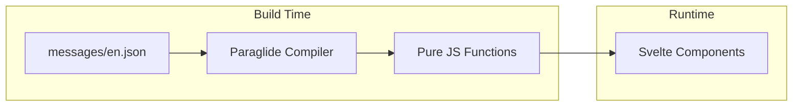

# Internationalization (i18n)

**Status**: Design (Required for "High Quality" standard)
**Last Updated**: 2026-01-12

---

## Philosophy

Even if the application launches English-only, we treat **all text as dynamic data**. Hardcoded strings are considered technical debt.

> [!IMPORTANT]
> Day 1 i18n architecture prevents expensive refactoring later. All user-facing text must go through the translation system from the start.

---

## Technology Decision: Paraglide JS

We use **Paraglide JS** (by Inlang) — the official SvelteKit i18n integration.

### Why Paraglide JS?

| Feature | Paraglide JS | svelte-i18n | i18next |
|---------|--------------|-------------|---------|
| **Type Safety** | ✅ Compile-time | ❌ Runtime only | ❌ Runtime only |
| **Bundle Size** | ✅ Zero overhead (tree-shaken) | ~8kb | ~15kb |
| **SvelteKit Adapter** | ✅ Native, official | ⚠️ Manual setup | ⚠️ Manual setup |
| **Cloudflare Workers** | ✅ Verified (with config) | ⚠️ Unknown | ⚠️ Unknown |
| **Localized URLs** | ✅ Built-in (`/es/page`) | ⚠️ Manual | ⚠️ Manual |
| **IDE Support** | ✅ Full autocomplete | ⚠️ Limited | ⚠️ Limited |
| **Active Development** | ✅ Inlang ecosystem | ⚠️ Community | ✅ Active |

### How It Works

Paraglide is a **compiler-based** i18n system:



- Translation files are compiled to pure JavaScript functions
- Bundlers tree-shake unused translations automatically
- Zero runtime overhead — no parsing, no interpolation logic shipped
- Type errors if you use a non-existent message key

---

## Cloudflare Workers Configuration

> [!WARNING]
> Cloudflare Workers requires special configuration to disable `AsyncLocalStorage`.

When deploying to Cloudflare Workers/Pages, add this to `vite.config.js`:

```typescript
// vite.config.js
import { paraglideVitePlugin } from '@inlang/paraglide-js';

export default {
  plugins: [
    paraglideVitePlugin({
      project: './project.inlang',
      outdir: './src/lib/paraglide',
      // CRITICAL: Required for Cloudflare Workers
      disableAsyncLocalStorage: true
    })
  ]
};
```

**Why?** Cloudflare Workers don't support Node.js `AsyncLocalStorage`. Setting this flag prevents potential issues. This is safe because Cloudflare Workers provide isolated request contexts.

---

## Project Structure

```
project.inlang/           # Inlang configuration
├── settings.json         # Language config

messages/
├── en.json               # English (Source of Truth)
└── es.json               # Spanish (Future)

src/lib/paraglide/        # Generated output (gitignored)
├── messages.js           # Compiled message functions
└── runtime.js            # Language utilities
```

### settings.json

```json
{
  "$schema": "https://inlang.com/schema/project-settings",
  "sourceLanguageTag": "en",
  "languageTags": ["en", "es"],
  "modules": [
    "https://cdn.jsdelivr.net/npm/@inlang/message-lint-rule-empty-pattern@latest/dist/index.js",
    "https://cdn.jsdelivr.net/npm/@inlang/message-lint-rule-missing-translation@latest/dist/index.js",
    "https://cdn.jsdelivr.net/npm/@inlang/plugin-message-format@latest/dist/index.js"
  ],
  "plugin.inlang.messageFormat": {
    "pathPattern": "./messages/{languageTag}.json"
  }
}
```

---

## Usage Patterns

### Basic Usage

```json
// messages/en.json
{
  "auth_login_title": "Welcome back",
  "auth_login_button": "Log In"
}
```

```svelte
<script>
  import * as m from '$lib/paraglide/messages';
</script>

<h1>{m.auth_login_title()}</h1>
<button>{m.auth_login_button()}</button>
```

### Interpolation

```json
{
  "player_preview_badge": "Previewing {title}",
  "greeting": "Hello, {name}!"
}
```

```svelte
<span>{m.player_preview_badge({ title: content.title })}</span>
<p>{m.greeting({ name: user.name })}</p>
```

### Pluralization (ICU Format)

```json
{
  "items_count": "{count, plural, =0 {No items} one {1 item} other {# items}}",
  "comments": "{count, plural, =0 {No comments} one {# comment} other {# comments}}"
}
```

```svelte
<span>{m.items_count({ count: items.length })}</span>
```

### Gender/Select

```json
{
  "user_status": "{gender, select, male {He is online} female {She is online} other {They are online}}"
}
```

---

## Language Detection & Routing

### URL-Based Locale (SEO Recommended)

```
revelations.studio/         → English (default)
revelations.studio/es/      → Spanish
revelations.studio/es/blog  → Spanish blog
```

### Detection Priority

| Priority | Source | Example |
|----------|--------|---------|
| 1 | URL prefix | `/es/page` → Spanish |
| 2 | User preference | Stored in profile |
| 3 | Cookie | `lang=es` |
| 4 | Browser header | `Accept-Language: es` |
| 5 | Default | English |

### SvelteKit Integration

```typescript
// src/hooks.ts
import { reroute } from '@inlang/paraglide-js-adapter-sveltekit';
import { i18n } from '$lib/i18n';

export const { reroute } = i18n;
```

```typescript
// src/lib/i18n.ts
import { createI18n } from '@inlang/paraglide-js-adapter-sveltekit';
import * as runtime from '$lib/paraglide/runtime';

export const i18n = createI18n(runtime);
```

---

## Formatting Non-Text Content

Paraglide handles text. For dates, numbers, and currency, use the browser's `Intl` APIs:

### Dates

```typescript
const locale = languageTag(); // from Paraglide runtime
const formatter = new Intl.DateTimeFormat(locale, {
  dateStyle: 'long',
  timeStyle: 'short'
});
return formatter.format(date);
```

### Currency

```typescript
const formatter = new Intl.NumberFormat(locale, {
  style: 'currency',
  currency: org.defaultCurrency // e.g., 'USD', 'EUR'
});
return formatter.format(amount);
```

### Relative Time

```typescript
const rtf = new Intl.RelativeTimeFormat(locale, { numeric: 'auto' });
rtf.format(-1, 'day'); // "yesterday"
```

---

## Developer Workflow

### Adding New Text

1. Add key to `messages/en.json`
2. Paraglide compiles automatically in dev mode
3. Import and use type-safe function
4. TypeScript errors if key doesn't exist

### Finding Untranslated Text

The Inlang VS Code extension highlights:
- Missing translations
- Empty patterns
- Unused messages

### Translation Workflow (Future)

When adding languages:

1. Translator adds translations to `messages/es.json`
2. CI validates no missing translations
3. Deploy includes new language

---

## Message Key Naming Convention

Use descriptive, hierarchical keys:

| Pattern | Example |
|---------|---------|
| `{feature}_{component}_{element}` | `auth_login_button` |
| `{page}_{section}_{text}` | `checkout_summary_total` |
| `{shared}_{element}` | `common_cancel` |

**Do:**
- `content_card_purchase_button`
- `player_controls_play`
- `common_loading`

**Don't:**
- `btn1`
- `title`
- `click_here`

---

## Dynamic Content

Some content comes from the API and cannot be translated at compile time:

| Content Type | Translation Approach |
|--------------|---------------------|
| UI text | Paraglide (compile-time) |
| Content titles | Creator's responsibility |
| System messages | Paraglide with variables |
| User-generated | Not translated |

For system messages from the backend, use message codes:

```typescript
// Backend returns
{ code: 'error.payment.declined' }

// Frontend translates
m[`error_payment_${code}`]()
```

---

## RTL Language Support (Future)

When adding RTL languages (Arabic, Hebrew):

- CSS logical properties (`margin-inline-start` vs `margin-left`)
- `dir="rtl"` attribute on `<html>`
- Paraglide handles text direction automatically

---

## Related Documents

- [COMPONENTS.md](./COMPONENTS.md) — Error states with i18n
- [DATA.md](./DATA.md) — API error code translation
