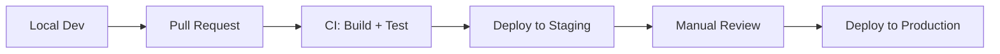
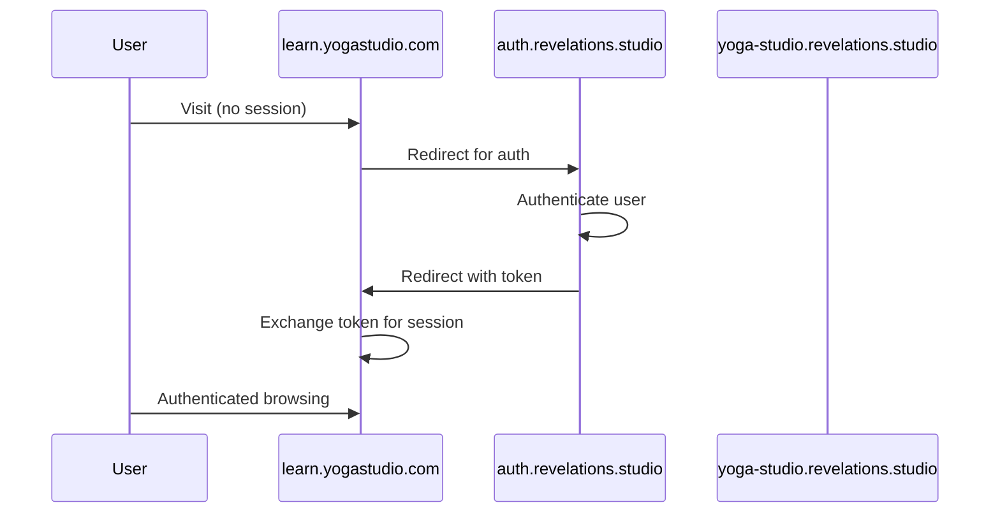

# Infrastructure

**Status**: Design
**Last Updated**: 2026-01-10

---

## Hosting Architecture

The frontend runs on **Cloudflare Workers** using `@sveltejs/adapter-cloudflare`. This provides edge-based SSR with global distribution.

```mermaid
graph LR
    subgraph "DNS"
        DNS[Cloudflare DNS<br/>*.revelations.studio]
    end

    subgraph "Edge Network"
        W[Cloudflare Workers<br/>SvelteKit SSR]
    end

    subgraph "Static Assets"
        A[Worker Static Assets]
    end

    subgraph "Backend"
        API[API Workers]
    end

    DNS --> W
    W --> A
    W --> API
```

### Why Workers (Not Pages)

| Consideration | Workers | Pages |
|---------------|---------|-------|
| SSR Control | Full control | Limited |
| Bindings Access | Direct (KV, R2, D1) | Via functions |
| Wildcard Subdomains | Supported | Limited |
| Deployment Model | Wrangler | Git-based |

Workers provides the flexibility needed for multi-tenant subdomain routing and direct access to Cloudflare bindings if needed.

---

## Domain Structure

```mermaid
graph TD
    Root[revelations.studio] --> Platform[Platform Marketing]
    Root --> WWW[www.revelations.studio<br/>Alias]

    Root --> Orgs[*.revelations.studio<br/>Organization Spaces]
    Orgs --> O1[yoga-studio.revelations.studio]
    Orgs --> O2[cooking-school.revelations.studio]

    Root --> Creators[creators.revelations.studio]
    Creators --> C1[/alice]
    Creators --> C2[/bob]

    Root --> APIs[API Subdomains]
    APIs --> Auth[auth.revelations.studio]
    APIs --> Content[api.revelations.studio]
    APIs --> Identity[identity.revelations.studio]
    APIs --> Ecom[ecom.revelations.studio]
```

### Subdomain Purposes

| Subdomain Pattern | Purpose | Example |
|-------------------|---------|---------|
| `revelations.studio` | Platform root/marketing | Landing page |
| `www.*` | Alias for root | Redirects to root |
| `{org-slug}.*` | Organization space | `yoga-studio.revelations.studio` |
| `creators.*` | Creator personal pages | `creators.revelations.studio/alice` |
| `auth.*` | Auth Worker | Session management |
| `api.*` | Content-API Worker | Content operations |
| `identity.*` | Identity-API Worker | Org management |
| `ecom.*` | Ecom-API Worker | Payments |

---

## DNS Configuration

### Wildcard vs On-Demand

Two approaches for org subdomains:

**Option A: Wildcard DNS**
- Single `*.revelations.studio` CNAME record
- All subdomains route to same Worker
- Worker resolves org from subdomain at runtime

**Option B: On-Demand DNS**
- Create DNS record when org is created
- Per-org control and debugging
- Slightly more operational overhead

**Decision**: Start with **wildcard** for simplicity. The Worker validates org existence via Identity-API.

### Reserved Subdomains

These subdomains are reserved and cannot be used as org slugs:

- `www`, `api`, `auth`, `identity`, `ecom`
- `creators`, `admin`, `platform`
- `staging`, `dev`, `test`

Org slug validation must reject these.

---

## Environment Configuration

### Environment Tiers

| Environment | Domain | Backend | Purpose |
|-------------|--------|---------|---------|
| Local | `localhost:5173` | `localhost:*` | Development |
| Staging | `staging.revelations.studio` | Staging workers | Pre-production |
| Production | `revelations.studio` | Production workers | Live |

### Required Environment Variables

| Variable | Description | Example |
|----------|-------------|---------|
| `AUTH_WORKER_URL` | Auth Worker base URL | `https://auth.revelations.studio` |
| `CONTENT_API_URL` | Content-API base URL | `https://api.revelations.studio` |
| `IDENTITY_API_URL` | Identity-API base URL | `https://identity.revelations.studio` |
| `ECOM_API_URL` | Ecom-API base URL | `https://ecom.revelations.studio` |
| `PUBLIC_DOMAIN` | Base domain | `revelations.studio` |

### Local Development

For local multi-subdomain testing, developers can use:
- `localhost:5173` for platform root
- `{slug}.localhost:5173` for org subdomains (browser supports this)

Alternatively, add entries to `/etc/hosts` for more realistic URLs.

---

## Cloudflare Bindings

The frontend Worker may access Cloudflare bindings for specific needs:

| Binding | Use Case |
|---------|----------|
| KV | Session caching (if needed beyond Auth Worker) |
| R2 | Direct static asset serving (rare) |
| Environment | Configuration secrets |

**Note**: Most data access goes through backend workers. Direct bindings are exceptional cases.

---

## Deployment Pipeline



### Deployment Steps

1. **Build**: SvelteKit builds to `.svelte-kit/cloudflare`
2. **Test**: Unit tests, type checking
3. **Deploy**: Wrangler deploys Worker with static assets
4. **Verify**: Smoke tests on deployed environment

---

## Custom Domains (Future)

Organizations may want custom domains like `learn.yogastudio.com`.

### Approach



### Requirements

- **Cloudflare for SaaS**: Orange-to-orange proxy for custom domains
- **Token exchange**: One-time tokens for cross-domain session establishment
- **Domain mapping**: Database table mapping custom domains to org IDs

**Status**: Future phase. Not in initial scope.

---

## Related Documents

- [OVERVIEW.md](./OVERVIEW.md) - Tech stack and principles
- [ROUTING.md](./ROUTING.md) - How subdomains map to routes
