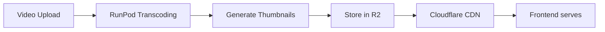
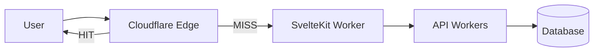
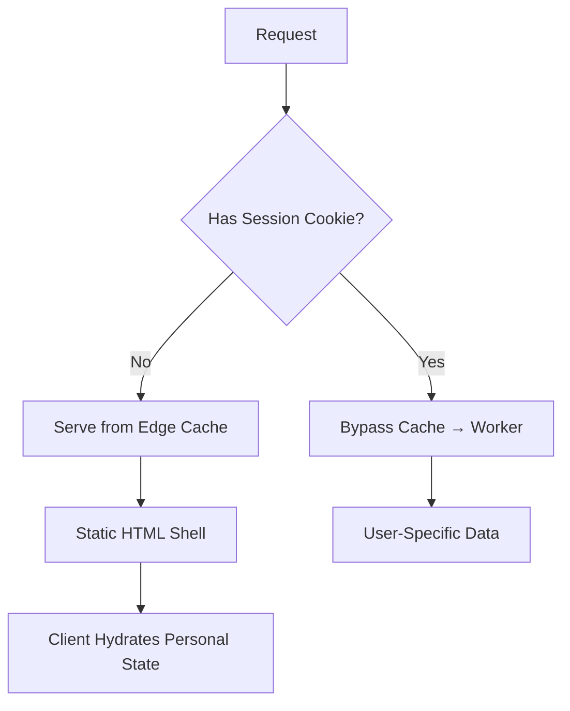
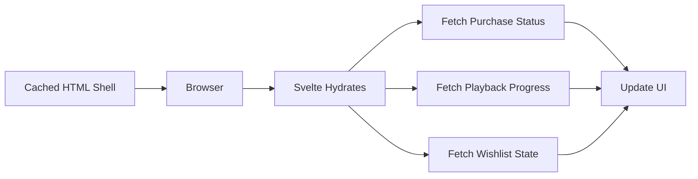
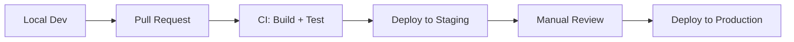
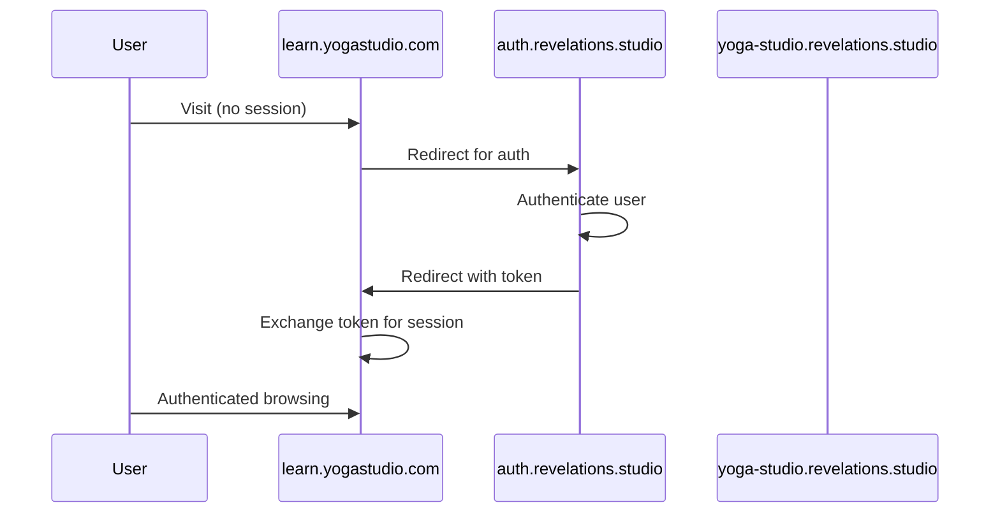

# Infrastructure

**Status**: Design (Verified against implementation 2026-01-11)
**Last Updated**: 2026-01-11

---

## Hosting Architecture

The frontend runs on **Cloudflare Workers** using `@sveltejs/adapter-cloudflare`. This provides edge-based SSR with global distribution.

```mermaid
graph LR
    subgraph "DNS"
        DNS[Cloudflare DNS<br/>*.revelations.studio]
    end

    subgraph "Edge Network"
        W[Cloudflare Workers<br/>SvelteKit SSR]
    end

    subgraph "Static Assets"
        A[Worker Static Assets]
    end

    subgraph "Backend"
        API[API Workers]
    end

    DNS --> W
    W --> A
    W --> API
```

### Why Workers (Not Pages)

| Consideration | Workers | Pages |
|---------------|---------|-------|
| SSR Control | Full control | Limited |
| Bindings Access | Direct (KV, R2, D1) | Via functions |
| Wildcard Subdomains | Supported | Limited |
| Deployment Model | Wrangler | Git-based |

Workers provides the flexibility needed for multi-tenant subdomain routing and direct access to Cloudflare bindings if needed.

---

## Domain Structure

```mermaid
graph TD
    Root[revelations.studio] --> Platform[Platform Marketing]
    Root --> WWW[www.revelations.studio<br/>Alias]

    Root --> Orgs[*.revelations.studio<br/>Organization Spaces]
    Orgs --> O1[yoga-studio.revelations.studio]
    Orgs --> O2[cooking-school.revelations.studio]

    Root --> Creators[creators.revelations.studio]
    Creators --> C1[/alice]
    Creators --> C2[/bob]

    Root --> APIs[API Subdomains]
    APIs --> Auth[auth.revelations.studio]
    APIs --> Content[content-api.revelations.studio]
    APIs --> OrgAPI[organization-api.revelations.studio]
    APIs --> Ecom[ecom-api.revelations.studio]
```

### Subdomain Purposes

| Subdomain Pattern | Purpose | Example |
|-------------------|---------|---------|
| `revelations.studio` | Platform root/marketing | Landing page |
| `www.*` | Alias for root | Redirects to root |
| `{org-slug}.*` | Organization space | `yoga-studio.revelations.studio` |
| `creators.*` | Creator personal pages | `creators.revelations.studio/alice` |
| `auth.*` | Auth Worker | Session management |
| `content-api.*` | Content-API Worker | Content operations |
| `organization-api.*` | Organization-API Worker | Org management |
| `ecom-api.*` | Ecom-API Worker | Payments |

---

## DNS Configuration

### Wildcard vs On-Demand

Two approaches for org subdomains:

**Option A: Wildcard DNS**
- Single `*.revelations.studio` CNAME record
- All subdomains route to same Worker
- Worker resolves org from subdomain at runtime

**Option B: On-Demand DNS**
- Create DNS record when org is created
- Per-org control and debugging
- Slightly more operational overhead

**Decision**: Start with **wildcard** for simplicity. The Worker validates org existence via Organization-API (port 42071).

### Wrangler Configuration for Wildcards

> **Important**: Cloudflare Workers `custom_domain = true` doesn't support wildcards. Use Worker Routes instead:

```toml
# CORRECT: Worker Routes pattern (supports wildcards)
[[env.production.routes]]
pattern = "*.revelations.studio/*"
zone_name = "revelations.studio"

# WRONG: custom_domain doesn't support wildcards
# [[env.production.routes]]
# pattern = "*.revelations.studio"
# custom_domain = true
```

> **Note**: Current `apps/web/wrangler.toml` uses `custom_domain = true` with staging wildcards. This may need to be updated to use `zone_name` pattern for proper wildcard subdomain support.

### Reserved Subdomains

These subdomains are reserved and cannot be used as org slugs:

- `www`, `auth`, `content-api`, `organization-api`, `ecom-api`
- `creators`, `admin`, `platform`, `identity-api`
- `staging`, `dev`, `test`

Org slug validation must reject these.

---

## Environment Configuration

### Environment Tiers

| Environment | Domain | Backend | Purpose |
|-------------|--------|---------|---------|
| Local | `localhost:5173` | `localhost:*` | Development |
| Staging | `staging.revelations.studio` | Staging workers | Pre-production |
| Production | `revelations.studio` | Production workers | Live |

### Required Environment Variables

Configured via `wrangler.toml` bindings (not `.env` files):

| Variable | Description | Example |
|----------|-------------|---------|
| `AUTH_WORKER_URL` | Auth Worker base URL | `https://auth.revelations.studio` |
| `API_URL` | Main API base URL | `https://api.revelations.studio` |

> **Important**: Cloudflare Workers use wrangler bindings accessed via `platform.env`, not the SvelteKit `$env/static/public` pattern. The `PUBLIC_*` prefix convention from Vite doesn't apply to Cloudflare Workers.

```typescript
// Accessing in load functions
export async function load({ platform }) {
  const authUrl = platform?.env?.AUTH_WORKER_URL ?? 'http://localhost:42069';
  // ...
}
```

### Local Development Fallbacks

For local development without wrangler:

```typescript
const WORKER_URLS = {
  auth: 'http://localhost:42069',
  content: 'http://localhost:4001',
  org: 'http://localhost:42071',
  ecom: 'http://localhost:42072',
} as const;
```

### Local Development

For local multi-subdomain testing, developers can use:
- `localhost:5173` for platform root
- `{slug}.localhost:5173` for org subdomains (browser supports this)

Alternatively, add entries to `/etc/hosts` for more realistic URLs.

---

## Cloudflare Bindings

The frontend Worker may access Cloudflare bindings for specific needs:

| Binding | Use Case |
|---------|----------|
| KV | Session caching (if needed beyond Auth Worker) |
| R2 | Direct static asset serving (rare) |
| Environment | Configuration secrets |

**Note**: Most data access goes through backend workers. Direct bindings are exceptional cases.

---

## Image & Media CDN

### Thumbnail Delivery

Thumbnails are pre-generated during transcoding and stored in R2. Served via Cloudflare CDN:

```
https://content.revelations.studio/thumbnails/{contentId}-{size}.webp
```

| Size | Dimensions | Use Case |
|------|------------|----------|
| `sm` | 200px wide | Mobile grids, small cards |
| `md` | 400px wide | Tablet, standard cards |
| `lg` | 800px wide | Desktop, featured content |

### Generation Pipeline

Thumbnails are generated during video transcoding by the RunPod worker:



**Key Points**:
- FFmpeg extracts key frame and generates WebP in 3 sizes
- JPEG fallback for older browsers
- No runtime image processing—all pre-generated
- R2 storage cost: ~$0.015/GB/month (very cheap)
- Cloudflare CDN caches at edge (no per-request cost)

### Static Image Optimization

For build-time static images (logos, icons, marketing):

```typescript
// vite.config.ts - enabled at build
import { enhancedImages } from '@sveltejs/enhanced-img';
```

This generates AVIF/WebP formats and responsive srcsets automatically.

## Observability & Error Tracking

Professional frontend engineering requires visibility into how the app behaves for real users on varied networks and devices.

### Observability Strategy

We use a **Cloudflare-native** approach for zero-cost observability during Phase 1, leveraging the shared `@codex/observability` package.

| Category | Implementation | Storage |
|----------|----------------|---------|
| **Logs** | `@codex/observability` (structured JSON) | Workers Dashboard (24h) |
| **Metrics** | Custom `Analytics Engine` events | Cloudflare Analytics |
| **Vitals** | Web Vitals reported to Analytics Engine | Cloudflare Analytics |
| **Context** | Attach `requestId` to all logs | N/A |

**Reporting Pattern**:

```typescript
// src/hooks.server.ts
import { logger } from '$lib/observability';

export const handleError = ({ error, event }) => {
  // 1. Log structured error via shared client
  logger.trackError(error instanceof Error ? error : new Error(String(error)), {
    url: event.url.toString(),
    user: event.locals.user?.id,
    requestId: event.locals.requestId
  });

  // 2. Track metric in Analytics Engine
  event.platform?.env?.ANALYTICS?.writeDataPoint({
    indexes: ['errors'],
    blobs: [event.url.pathname, error instanceof Error ? error.name : 'UnknownError']
  });
};
```

### Real User Monitoring (RUM)

Track Web Vitals (LCP, CLS, INP) to ensure high perceived performance across regions.

- **Vitals Tracking**: Reported to Cloudflare Analytics Engine.
- **Performance Budgets**: Enforce via CI/CD (LCP < 2.5s).

---

## Edge Caching Strategy

Public pages are cached at Cloudflare's edge for performance and cost reduction.

### Cache Layers



### Cache Key Composition

Cache keys must account for multi-tenant context. Cloudflare automatically includes URL in cache key; we add variant headers.

| Factor | Handling | Example |
|--------|----------|---------|
| Organization | URL path/subdomain | `yoga-studio.revelations.studio/explore` |
| Content slug | URL path | `/content/intro-to-yoga` |
| Locale | Vary header | `Vary: Accept-Language` |
| Dark mode | Client-side only | Not cached (hydrated) |

**Custom Cache Keys** (when needed):

```typescript
// For API responses that vary by org context
const cacheKey = new Request(
  `${request.url}?org=${orgSlug}`,
  { method: 'GET', headers: request.headers }
);
const cached = await caches.default.match(cacheKey);
```

### Vary Headers

**Critical**: Never use `Vary: *` (invalidates caching entirely).

| Header | When to Use | Effect |
|--------|-------------|--------|
| `Vary: Accept-Language` | i18n content | Separate cache per locale |
| `Vary: Accept-Encoding` | Always (automatic) | gzip/brotli variants |
| `Vary: Cookie` | **Avoid** | Effectively disables caching |

**Implementation**:

```typescript
// +page.server.ts
export async function load({ setHeaders, request }) {
  // Public page with locale variants
  setHeaders({
    'Cache-Control': 'public, max-age=300, s-maxage=300, stale-while-revalidate=60',
    'Vary': 'Accept-Language'
  });
  // ...
}
```

### Authenticated vs Unauthenticated Caching

**Never** cache authenticated user data at edge. Strategy:



| Content Type | Caching | Personalization |
|--------------|---------|-----------------|
| Public explore pages | Edge cached | Purchase status hydrated client-side |
| Content detail (public) | Edge cached | Progress/purchase hydrated |
| User library | Never cached | Fully server-rendered |
| Studio pages | Never cached | Fully server-rendered |

### Cache-Control by Route Type

| Route Type | Example | Cache-Control | Notes |
|------------|---------|---------------|-------|
| Platform home | `/` | `public, max-age=3600, s-maxage=3600, stale-while-revalidate=300` | Longest TTL |
| Org landing | `/[org]` | `public, max-age=300, s-maxage=300, stale-while-revalidate=60` | 5 min + SWR |
| Public explore | `/[org]/explore` | `public, max-age=300, s-maxage=300, stale-while-revalidate=60` | 5 min + SWR |
| Content detail | `/[org]/content/[slug]` | `public, max-age=300, s-maxage=300, stale-while-revalidate=60` | 5 min + SWR |
| User library | `/library` | `private, no-store` | Never cache |
| Studio pages | `/studio/*` | `private, no-store` | Never cache |
| API proxied | `/api/*` | `no-store` | Backend handles caching |

### Stale-While-Revalidate Pattern

Use `stale-while-revalidate` for perceived performance:

```typescript
// Serve stale content immediately while fetching fresh in background
setHeaders({
  'Cache-Control': 'public, max-age=300, s-maxage=300, stale-while-revalidate=60'
  // After 300s: serve stale for up to 60s while revalidating
});
```

### Cache Warming Strategy

For popular content, pre-warm edge caches after publish:

```typescript
// Called after content publish webhook
async function warmCache(content: Content, org: Organization) {
  const urls = [
    `https://${org.slug}.revelations.studio/content/${content.slug}`,
    `https://${org.slug}.revelations.studio/explore`
  ];

  // Hit each URL from multiple edge locations (via Cloudflare Workers)
  // Or use external service like Cloudflare Cache Reserve
  for (const url of urls) {
    await fetch(url, {
      cf: { cacheTtl: 300 }  // Force cache population
    });
  }
}
```

**Phase 1**: Manual warming not required (low traffic). Implement when cache miss rate impacts UX.

### i18n Interaction

If content is localized:

| Scenario | Cache Strategy |
|----------|----------------|
| UI text only (Paraglide) | Single cache, client hydrates locale |
| Content translated | `Vary: Accept-Language`, separate cache per locale |
| Mixed | Cache HTML shell, hydrate locale-specific text |

**Recommendation for Phase 1**: UI-only i18n (Paraglide). Content translations are future phase. Use single cache with client-side locale detection.

### Cache Metrics & Monitoring

Track via Cloudflare Analytics + custom logging:

| Metric | Source | Alert Threshold |
|--------|--------|-----------------|
| Cache hit ratio | Cloudflare Analytics | < 80% |
| Origin response time | Worker timing | > 500ms p95 |
| Cache purge frequency | Custom logging | > 100/hour |
| Bandwidth saved | Cloudflare Analytics | Informational |

**Implementation**:

```typescript
// Log cache status in worker
export async function load({ request, setHeaders, platform }) {
  const cacheStatus = request.headers.get('cf-cache-status');

  platform?.env?.ANALYTICS?.writeDataPoint({
    indexes: ['cache'],
    blobs: [cacheStatus ?? 'UNKNOWN'],
    doubles: [Date.now()]
  });

  // ...
}
```

### Cache Invalidation

On content publish/unpublish, purge via Cloudflare API:

```typescript
// lib/server/cache.ts
const ZONE_ID = platform.env.CLOUDFLARE_ZONE_ID;
const API_TOKEN = platform.env.CLOUDFLARE_API_TOKEN;

export async function purgeContentCache(org: Organization, content: Content) {
  const urls = [
    `https://${org.slug}.revelations.studio/content/${content.slug}`,
    `https://${org.slug}.revelations.studio/explore`,
    `https://${org.slug}.revelations.studio/` // Org landing
  ];

  await fetch(`https://api.cloudflare.com/client/v4/zones/${ZONE_ID}/purge_cache`, {
    method: 'POST',
    headers: {
      'Authorization': `Bearer ${API_TOKEN}`,
      'Content-Type': 'application/json'
    },
    body: JSON.stringify({ files: urls })
  });
}

// Purge by tag (requires Cache-Tag header on responses)
export async function purgeByTag(tags: string[]) {
  await fetch(`https://api.cloudflare.com/client/v4/zones/${ZONE_ID}/purge_cache`, {
    method: 'POST',
    headers: { 'Authorization': `Bearer ${API_TOKEN}` },
    body: JSON.stringify({ tags })
  });
}
```

**Cache Tags** (for granular purging):

```typescript
setHeaders({
  'Cache-Control': 'public, max-age=300',
  'Cache-Tag': `org:${orgSlug}, content:${contentId}`
});
```

### Client-Side Hydration

Cached pages serve static HTML shell. User-specific state hydrates client-side:



| Personalized Element | Hydration Pattern |
|---------------------|-------------------|
| Purchase status (Buy vs Play) | `onMount` → fetch `/api/access/check` |
| Playback progress | `onMount` → fetch `/api/access/progress` |
| Wishlist state | `onMount` → check local state + API |

This separation ensures pages cache effectively while users see personalized state with minimal latency.

---

## Deployment Pipeline



### Deployment Steps

1. **Build**: SvelteKit builds to `.svelte-kit/cloudflare`
2. **Test**: Unit tests, type checking
3. **Deploy**: Wrangler deploys Worker with static assets
4. **Verify**: Smoke tests on deployed environment

---

## Custom Domains (Future)

Organizations may want custom domains like `learn.yogastudio.com`.

### Approach



### Requirements

- **Cloudflare for SaaS**: Orange-to-orange proxy for custom domains
- **Token exchange**: One-time tokens for cross-domain session establishment
- **Domain mapping**: Database table mapping custom domains to org IDs

**Status**: Future phase. Not in initial scope.

---

## Related Documents

- [OVERVIEW.md](./OVERVIEW.md) - Tech stack and principles
- [ROUTING.md](./ROUTING.md) - How subdomains map to routes
