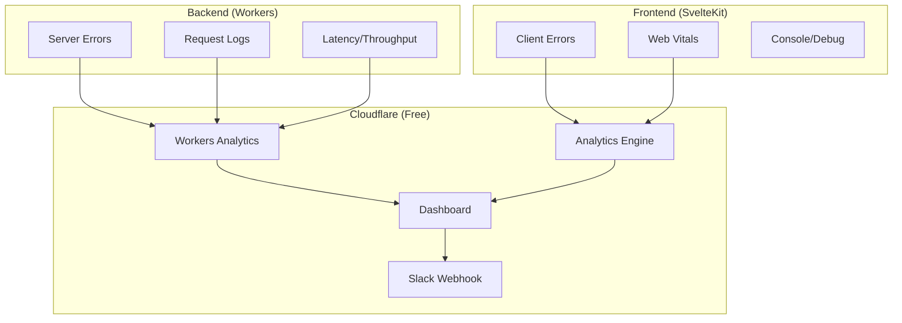

# Observability Strategy

**Status**: Design Decision
**Created**: 2026-01-12
**Updated**: 2026-01-12
**Purpose**: Define cohesive observability strategy across frontend and backend

---

## Executive Summary

**Decision**: Cloudflare-native approach using free tier services only. Zero additional cost.

| Layer | Tool | Cost |
|-------|------|------|
| Error Tracking | Cloudflare Workers Analytics + console.error | Free |
| Logs | Cloudflare Workers Analytics | Free |
| Metrics | Cloudflare Analytics | Free |
| Web Vitals | Cloudflare Analytics Engine | Free |
| Alerting | Cloudflare Notifications + Slack webhook | Free |

**Total cost**: $0/month

**Future**: Add Sentry when budget allows for better error grouping and stack traces.

---

## Architecture Overview



---

## Implementation

### 1. Error Tracking: Console + Analytics Engine

Errors are logged via `console.error` (visible in Workers dashboard) and tracked in Analytics Engine for aggregation.

**Frontend Error Handler:**

```typescript
// src/hooks.ts (client-side)
import type { HandleClientError } from '@sveltejs/kit';

export const handleError: HandleClientError = async ({ error, event, status, message }) => {
  // Log to console (visible in browser dev tools)
  console.error('[Client Error]', {
    message,
    status,
    url: event.url.pathname,
    error: error instanceof Error ? error.message : String(error)
  });

  // Report to Analytics Engine (if available)
  if (typeof navigator !== 'undefined' && 'sendBeacon' in navigator) {
    navigator.sendBeacon('/api/errors', JSON.stringify({
      type: 'client',
      message: error instanceof Error ? error.message : String(error),
      url: event.url.pathname,
      status,
      timestamp: Date.now(),
      userAgent: navigator.userAgent
    }));
  }

  return {
    message: 'Something went wrong',
    code: status.toString()
  };
};
```

```typescript
// src/hooks.server.ts
import type { HandleServerError } from '@sveltejs/kit';

export const handleError: HandleServerError = async ({ error, event, status, message }) => {
  const errorData = {
    type: 'server',
    message: error instanceof Error ? error.message : String(error),
    stack: error instanceof Error ? error.stack : undefined,
    url: event.url.pathname,
    method: event.request.method,
    status,
    requestId: event.locals.requestId,
    timestamp: Date.now()
  };

  // Log to Workers console (visible in Cloudflare dashboard)
  console.error('[Server Error]', JSON.stringify(errorData));

  // Track in Analytics Engine
  event.platform?.env?.ANALYTICS?.writeDataPoint({
    blobs: ['error', errorData.message, event.url.pathname],
    doubles: [status, Date.now()],
    indexes: ['errors']
  });

  return {
    message: 'Something went wrong',
    code: status.toString()
  };
};
```

**Error Ingestion Endpoint:**

```typescript
// src/routes/api/errors/+server.ts
import type { RequestHandler } from './$types';

export const POST: RequestHandler = async ({ request, platform }) => {
  try {
    const error = await request.json();

    // Write to Analytics Engine
    platform?.env?.ANALYTICS?.writeDataPoint({
      blobs: ['client_error', error.message, error.url],
      doubles: [error.status || 0, error.timestamp],
      indexes: ['errors']
    });

    return new Response(null, { status: 204 });
  } catch {
    return new Response(null, { status: 400 });
  }
};
```

### 2. Logging: Structured Console

Workers console output is retained in Cloudflare dashboard for 24 hours (free tier).

```typescript
// lib/server/logger.ts
type LogLevel = 'debug' | 'info' | 'warn' | 'error';

interface LogContext {
  requestId?: string;
  userId?: string;
  orgId?: string;
  [key: string]: unknown;
}

export function createLogger(context: LogContext = {}) {
  const log = (level: LogLevel, message: string, data?: Record<string, unknown>) => {
    const entry = {
      level,
      message,
      timestamp: new Date().toISOString(),
      ...context,
      ...data
    };

    // Structured JSON for easy parsing
    switch (level) {
      case 'debug':
        if (import.meta.env.DEV) console.debug(JSON.stringify(entry));
        break;
      case 'info':
        console.log(JSON.stringify(entry));
        break;
      case 'warn':
        console.warn(JSON.stringify(entry));
        break;
      case 'error':
        console.error(JSON.stringify(entry));
        break;
    }
  };

  return {
    debug: (msg: string, data?: Record<string, unknown>) => log('debug', msg, data),
    info: (msg: string, data?: Record<string, unknown>) => log('info', msg, data),
    warn: (msg: string, data?: Record<string, unknown>) => log('warn', msg, data),
    error: (msg: string, data?: Record<string, unknown>) => log('error', msg, data)
  };
}
```

**Usage:**

```typescript
// In load function or API route
export async function load({ locals, platform }) {
  const logger = createLogger({ requestId: locals.requestId });

  logger.info('Loading content', { contentId: params.id });

  try {
    const content = await fetchContent(params.id);
    return { content };
  } catch (error) {
    logger.error('Failed to load content', {
      contentId: params.id,
      error: error instanceof Error ? error.message : String(error)
    });
    throw error;
  }
}
```

### 3. Web Vitals: Analytics Engine

Track Core Web Vitals using Cloudflare Analytics Engine (free, included with Workers).

```typescript
// src/lib/vitals.ts
import { onCLS, onINP, onLCP, onTTFB, onFCP } from 'web-vitals';

export function initWebVitals() {
  const reportMetric = (name: string, value: number) => {
    // Send to our Analytics Engine endpoint
    if ('sendBeacon' in navigator) {
      navigator.sendBeacon('/api/vitals', JSON.stringify({
        name,
        value,
        page: window.location.pathname,
        timestamp: Date.now()
      }));
    }
  };

  onCLS((metric) => reportMetric('cls', metric.value));
  onINP((metric) => reportMetric('inp', metric.value));
  onLCP((metric) => reportMetric('lcp', metric.value));
  onTTFB((metric) => reportMetric('ttfb', metric.value));
  onFCP((metric) => reportMetric('fcp', metric.value));
}
```

```typescript
// src/routes/api/vitals/+server.ts
import type { RequestHandler } from './$types';

export const POST: RequestHandler = async ({ request, platform }) => {
  try {
    const vital = await request.json();

    platform?.env?.ANALYTICS?.writeDataPoint({
      blobs: [vital.name, vital.page],
      doubles: [vital.value, vital.timestamp],
      indexes: ['vitals']
    });

    return new Response(null, { status: 204 });
  } catch {
    return new Response(null, { status: 400 });
  }
};
```

```svelte
<!-- src/routes/+layout.svelte -->
<script>
  import { onMount } from 'svelte';
  import { browser } from '$app/environment';

  onMount(() => {
    if (browser) {
      import('$lib/vitals').then(({ initWebVitals }) => {
        initWebVitals();
      });
    }
  });
</script>
```

### 4. Request Tracing: Correlation IDs

Simple correlation IDs for tracing requests across services.

```typescript
// src/hooks.server.ts
import { sequence } from '@sveltejs/kit/hooks';
import { nanoid } from 'nanoid';

const addRequestId: Handle = async ({ event, resolve }) => {
  const requestId = event.request.headers.get('x-request-id') || nanoid(12);
  event.locals.requestId = requestId;

  const response = await resolve(event);
  response.headers.set('x-request-id', requestId);

  return response;
};

export const handle = sequence(addRequestId);
```

```typescript
// API calls forward the request ID
async function fetchFromWorker(path: string, event: RequestEvent) {
  return fetch(`${WORKER_URL}${path}`, {
    headers: {
      'X-Request-ID': event.locals.requestId,
      'Cookie': event.request.headers.get('cookie') ?? ''
    }
  });
}
```

### 5. Analytics Engine Setup

Add Analytics Engine binding to your wrangler config:

```jsonc
// wrangler.jsonc
{
  "analytics_engine_datasets": [
    {
      "binding": "ANALYTICS",
      "dataset": "codex_metrics"
    }
  ]
}
```

**Query via GraphQL** (Cloudflare Dashboard or API):

```graphql
# Example: Error count by URL in last 24h
query {
  viewer {
    accounts(filter: { accountTag: "your-account" }) {
      errors: analyticsEngineData(
        filter: {
          datetime_geq: "2026-01-11T00:00:00Z"
          index1: "errors"
        }
        limit: 100
      ) {
        sum {
          count
        }
        dimensions {
          blob2  # URL
        }
      }
    }
  }
}
```

---

## Monitoring Dashboard

Use Cloudflare Dashboard for monitoring:

| Metric | Location | Free Tier |
|--------|----------|-----------|
| Request volume | Workers > Analytics | Yes |
| Error rate | Workers > Logs | 24h retention |
| CPU time | Workers > Analytics | Yes |
| Cache hit rate | Caching > Analytics | Yes |
| Custom metrics | Analytics Engine | Yes (10M events/day) |

### Creating Custom Dashboard

Use Cloudflare's GraphQL API to build custom views:

```typescript
// scripts/query-metrics.ts
async function queryMetrics(accountId: string, apiToken: string) {
  const response = await fetch(
    'https://api.cloudflare.com/client/v4/graphql',
    {
      method: 'POST',
      headers: {
        'Authorization': `Bearer ${apiToken}`,
        'Content-Type': 'application/json'
      },
      body: JSON.stringify({
        query: `
          query {
            viewer {
              accounts(filter: { accountTag: "${accountId}" }) {
                vitals: analyticsEngineData(
                  filter: { index1: "vitals" }
                  limit: 1000
                ) {
                  avg { double1 }
                  dimensions { blob1 }
                }
              }
            }
          }
        `
      })
    }
  );

  return response.json();
}
```

---

## Alerting

### Cloudflare Notifications (Free)

Set up in Cloudflare Dashboard > Notifications:

| Alert | Trigger | Channel |
|-------|---------|---------|
| Worker errors | Error rate > 1% | Email |
| High CPU | CPU time > 10ms avg | Email |
| Origin failure | Origin 5xx > 5/min | Email + Slack |

### Slack Webhook Integration

```typescript
// lib/server/alerts.ts
const SLACK_WEBHOOK = process.env.SLACK_WEBHOOK_URL;

export async function sendAlert(message: string, severity: 'info' | 'warning' | 'critical') {
  if (!SLACK_WEBHOOK) return;

  const color = {
    info: '#36a64f',
    warning: '#ff9800',
    critical: '#f44336'
  }[severity];

  await fetch(SLACK_WEBHOOK, {
    method: 'POST',
    headers: { 'Content-Type': 'application/json' },
    body: JSON.stringify({
      attachments: [{
        color,
        text: message,
        footer: `Codex ${severity.toUpperCase()}`,
        ts: Math.floor(Date.now() / 1000)
      }]
    })
  });
}
```

---

## Limitations & Trade-offs

| Aspect | Cloudflare-Only | With Sentry |
|--------|-----------------|-------------|
| Error grouping | Manual | Automatic |
| Stack traces | Console only | Full + source maps |
| Session replay | None | Available |
| Log retention | 24h | 30+ days |
| Alerting | Basic | Advanced rules |
| Cost | $0 | $26+/month |

### Mitigation Strategies

**No automatic error grouping**: Use consistent error message prefixes:

```typescript
// Prefix errors by component/feature
console.error('[VideoPlayer] HLS load failed:', error);
console.error('[Checkout] Payment declined:', error);
console.error('[Auth] Session expired:', error);
```

**24h log retention**: For critical issues, log to R2 bucket:

```typescript
// For important events that need longer retention
async function persistLog(env: Env, event: LogEvent) {
  const key = `logs/${new Date().toISOString().split('T')[0]}/${nanoid()}.json`;
  await env.LOGS_BUCKET.put(key, JSON.stringify(event));
}
```

---

## Future: Sentry Migration Path

When budget allows, Sentry can be added with minimal changes:

```typescript
// Future: Add Sentry alongside existing logging
import * as Sentry from '@sentry/sveltekit';

// Existing code continues to work
console.error('[Error]', error);

// Add Sentry capture
Sentry.captureException(error);
```

The structured logging and error tracking patterns we're using are Sentry-compatible.

---

## Implementation Checklist

### Phase 1: Core Logging (Week 1)

- [ ] Add request ID middleware
- [ ] Set up structured logging utility
- [ ] Configure error handlers in hooks
- [ ] Add Analytics Engine binding to wrangler

### Phase 2: Metrics (Week 2)

- [ ] Add Web Vitals reporting
- [ ] Create `/api/vitals` and `/api/errors` endpoints
- [ ] Set up Cloudflare notifications
- [ ] Add Slack webhook for critical alerts

### Phase 3: Dashboards (Week 3)

- [ ] Create GraphQL queries for key metrics
- [ ] Document how to view logs in CF dashboard
- [ ] Set up basic runbooks

---

## Runbooks

### Investigating Errors

1. Go to Cloudflare Dashboard > Workers > Logs
2. Filter by time range and error level
3. Search for `[Error]` prefix
4. Use request ID to trace across services

### Performance Issues

1. Check Workers > Analytics for CPU/latency spikes
2. Query Analytics Engine for Web Vitals trends
3. Check Caching > Analytics for cache hit rate
4. Review recent deployments

### Critical Incident

1. Check Cloudflare Status page
2. Review Workers error logs
3. Check origin worker health endpoints
4. If widespread: send Slack alert manually
5. Document in incident log

---

## Related Documents

- [INFRASTRUCTURE.md](./INFRASTRUCTURE.md) - Deployment and hosting
- [DATA.md](./DATA.md) - API error handling
