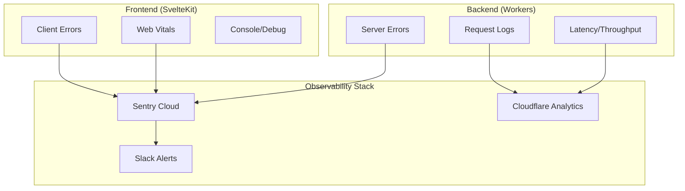
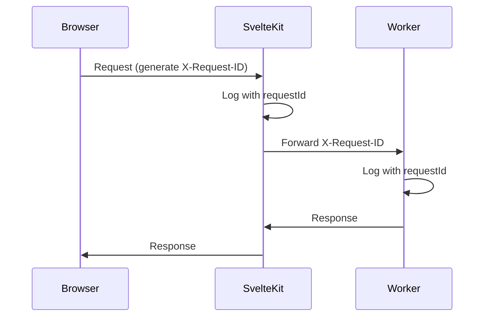

# Observability Strategy

**Status**: Design Decision
**Created**: 2026-01-12
**Updated**: 2026-01-12
**Purpose**: Define cohesive observability strategy across frontend and backend

---

## Executive Summary

**Decision**: Hybrid approach using Sentry (sampled) + Cloudflare Analytics (free tier) to balance visibility with startup budget constraints.

| Layer | Tool | Cost |
|-------|------|------|
| Error Tracking | Sentry Cloud (Team plan) | ~$26/month |
| Logs | Cloudflare Workers Analytics | Free |
| Metrics | Cloudflare Analytics + Sentry Performance | Free + included |
| Alerting | Sentry + Slack webhook | Free |

**Total estimated cost**: ~$26-50/month for Phase 1.

---

## Architecture Overview



---

## Decisions

### 1. Error Tracking: Sentry Cloud

**Decision**: Use Sentry Cloud (Team plan at $26/month for 50K events).

**Why Sentry over alternatives**:

| Alternative | Consideration | Decision |
|-------------|---------------|----------|
| **Self-hosted Sentry** | Requires infrastructure, maintenance | Reject - operational overhead |
| **Cloudflare-only** | Limited error grouping, no stack traces | Reject - insufficient for debugging |
| **Datadog** | Expensive ($15+/host/month) | Reject - overkill for startup |
| **LogRocket** | Session replay focus, higher cost | Reject - not needed Phase 1 |
| **Rollbar** | Similar to Sentry, less ecosystem | Consider if Sentry costs spike |

**Sentry Configuration**:

```typescript
// src/hooks.server.ts
import * as Sentry from '@sentry/sveltekit';

Sentry.init({
  dsn: 'https://xxx@xxx.ingest.sentry.io/xxx',
  environment: import.meta.env.MODE,

  // Sample 100% of errors in prod (low volume expected)
  sampleRate: 1.0,

  // Sample 10% of transactions for performance
  tracesSampleRate: 0.1,

  // Scrub PII
  beforeSend(event) {
    if (event.user) {
      delete event.user.email;
      delete event.user.ip_address;
    }
    return event;
  },

  // Ignore known non-actionable errors
  ignoreErrors: [
    'ResizeObserver loop',
    'Network request failed',
    'Load failed'
  ]
});

export const handleError = Sentry.handleErrorWithSentry();
```

```typescript
// src/hooks.ts (client-side)
import * as Sentry from '@sentry/sveltekit';

Sentry.init({
  dsn: 'https://xxx@xxx.ingest.sentry.io/xxx',

  // Browser-specific settings
  integrations: [
    Sentry.browserTracingIntegration(),
    Sentry.replayIntegration({
      maskAllText: true,
      blockAllMedia: true
    })
  ],

  // Performance sampling
  tracesSampleRate: 0.1,

  // Session replay only on errors (saves quota)
  replaysSessionSampleRate: 0,
  replaysOnErrorSampleRate: 1.0
});

export const handleError = Sentry.handleErrorWithSentry();
```

**Sampling Strategy**:

| Environment | Error Rate | Performance Rate | Replay |
|-------------|------------|------------------|--------|
| Production | 100% | 10% | Errors only |
| Staging | 100% | 100% | All sessions |
| Development | 0% | 0% | None |

**PII Handling**:

- Strip email addresses from user context
- Never log passwords, tokens, or payment data
- Use Sentry's data scrubbing for request bodies
- Session replays mask all text by default

### 2. Logging: Cloudflare Workers Analytics

**Decision**: Use Cloudflare's built-in analytics (free) for structured logging.

**Why not external log aggregation**:

| Option | Cost | Decision |
|--------|------|----------|
| Datadog Logs | ~$0.10/GB | Reject - expensive at scale |
| Logtail | $0.25/GB | Consider for Phase 2 |
| Self-hosted ELK | Infrastructure cost | Reject - operational burden |
| Cloudflare Logpush | Free to R2 | Future option for retention |

**Implementation**:

```typescript
// packages/observability/src/cloudflare-logger.ts
export function createLogger(env: Env) {
  return {
    info(message: string, data?: Record<string, unknown>) {
      console.log(JSON.stringify({
        level: 'info',
        message,
        timestamp: Date.now(),
        ...data
      }));
    },

    warn(message: string, data?: Record<string, unknown>) {
      console.warn(JSON.stringify({
        level: 'warn',
        message,
        timestamp: Date.now(),
        ...data
      }));
    },

    error(message: string, error?: Error, data?: Record<string, unknown>) {
      console.error(JSON.stringify({
        level: 'error',
        message,
        error: error?.message,
        stack: error?.stack,
        timestamp: Date.now(),
        ...data
      }));

      // Also send to Sentry for aggregation
      if (error) {
        Sentry.captureException(error, { extra: data });
      }
    }
  };
}
```

**Log Levels by Environment**:

| Environment | Default Level | Console Output |
|-------------|---------------|----------------|
| Production | `warn` | Structured JSON |
| Staging | `info` | Structured JSON |
| Development | `debug` | Pretty-printed |

### 3. Performance Monitoring: Web Vitals

**Decision**: Report Web Vitals to Sentry Performance (included in plan).

**Tracked Metrics**:

| Metric | Target | Alert Threshold |
|--------|--------|-----------------|
| LCP (Largest Contentful Paint) | < 2.5s | > 4.0s |
| CLS (Cumulative Layout Shift) | < 0.1 | > 0.25 |
| INP (Interaction to Next Paint) | < 200ms | > 500ms |
| TTFB (Time to First Byte) | < 800ms | > 1.5s |

**Implementation**:

```typescript
// src/lib/vitals.ts
import { onCLS, onINP, onLCP, onTTFB } from 'web-vitals';
import * as Sentry from '@sentry/sveltekit';

export function initWebVitals() {
  onCLS((metric) => {
    Sentry.metrics.distribution('web_vitals.cls', metric.value, {
      unit: 'none',
      tags: { page: window.location.pathname }
    });
  });

  onINP((metric) => {
    Sentry.metrics.distribution('web_vitals.inp', metric.value, {
      unit: 'millisecond',
      tags: { page: window.location.pathname }
    });
  });

  onLCP((metric) => {
    Sentry.metrics.distribution('web_vitals.lcp', metric.value, {
      unit: 'millisecond',
      tags: { page: window.location.pathname }
    });
  });

  onTTFB((metric) => {
    Sentry.metrics.distribution('web_vitals.ttfb', metric.value, {
      unit: 'millisecond',
      tags: { page: window.location.pathname }
    });
  });
}
```

```svelte
<!-- src/routes/+layout.svelte -->
<script>
  import { onMount } from 'svelte';
  import { browser } from '$app/environment';

  onMount(() => {
    if (browser) {
      import('$lib/vitals').then(({ initWebVitals }) => {
        initWebVitals();
      });
    }
  });
</script>
```

**Custom App Metrics**:

| Metric | Purpose | Implementation |
|--------|---------|----------------|
| `video.load_time` | Time to first frame | Player component |
| `checkout.completion_rate` | Funnel tracking | Ecom flow |
| `search.latency` | Search responsiveness | Search component |

### 4. Request Tracing: Correlation IDs

**Decision**: Use correlation IDs (not full distributed tracing). Full tracing (Jaeger, etc.) is overkill for Phase 1.

**Pattern**:



**Implementation**:

```typescript
// src/hooks.server.ts
import { sequence } from '@sveltejs/kit/hooks';
import * as Sentry from '@sentry/sveltekit';
import { nanoid } from 'nanoid';

const addRequestId: Handle = async ({ event, resolve }) => {
  const requestId = event.request.headers.get('x-request-id') || nanoid();

  event.locals.requestId = requestId;

  // Attach to Sentry
  Sentry.setTag('request_id', requestId);

  const response = await resolve(event);
  response.headers.set('x-request-id', requestId);

  return response;
};

export const handle = sequence(
  addRequestId,
  Sentry.sentryHandle()
);
```

```typescript
// API calls forward the request ID
async function fetchFromWorker(path: string, event: RequestEvent) {
  return fetch(`${WORKER_URL}${path}`, {
    headers: {
      'X-Request-ID': event.locals.requestId,
      'Cookie': event.request.headers.get('cookie') ?? ''
    }
  });
}
```

**Querying by Request ID**:

- Sentry: Search by `request_id` tag
- Cloudflare: Filter logs by `requestId` field
- Support tickets: Users can provide request ID from response headers

### 5. Infrastructure Metrics: Cloudflare Dashboard

**Decision**: Use Cloudflare's built-in dashboards (free) for infrastructure metrics.

**Available Metrics**:

| Metric | Source | Dashboard |
|--------|--------|-----------|
| Worker invocations | CF Analytics | Workers tab |
| CPU time | CF Analytics | Workers tab |
| Requests/errors | CF Analytics | Analytics tab |
| Bandwidth | CF Analytics | Analytics tab |
| Cache hit rate | CF Analytics | Caching tab |

**Custom Metrics** (via Workers Analytics Engine):

```typescript
// Track custom business metrics
export async function trackMetric(
  env: Env,
  name: string,
  value: number,
  tags: Record<string, string>
) {
  env.ANALYTICS?.writeDataPoint({
    blobs: [name, JSON.stringify(tags)],
    doubles: [value, Date.now()]
  });
}

// Usage
trackMetric(env, 'purchase.amount', 2999, {
  org: 'yoga-studio',
  content_type: 'video'
});
```

---

## Alerting Strategy

### Alert Channels

| Severity | Channel | Response Time |
|----------|---------|---------------|
| Critical | Slack #alerts + Email | < 15 min |
| Warning | Slack #alerts | < 1 hour |
| Info | Dashboard only | Next business day |

### Alert Rules (Sentry)

| Alert | Condition | Severity |
|-------|-----------|----------|
| Error spike | > 10 errors in 5 min | Critical |
| New error type | First occurrence | Warning |
| LCP degradation | p95 > 4s for 10 min | Warning |
| Payment failure | Any checkout error | Critical |

**Sentry Alert Configuration**:

```yaml
# Managed via Sentry UI or Terraform
alerts:
  - name: Error Spike
    conditions:
      - type: event_frequency
        value: 10
        interval: 5m
    actions:
      - type: slack
        channel: "#alerts"
      - type: email
        targetType: Team

  - name: Payment Failure
    conditions:
      - type: event_frequency
        value: 1
        comparisonType: count
    filters:
      - type: tagged_event
        key: transaction
        value: "/checkout/*"
    actions:
      - type: slack
        channel: "#alerts"
        severity: critical
```

---

## Dashboard Design

### Key Dashboards

**1. System Health** (Cloudflare + Sentry)
- Request volume (last 24h)
- Error rate (%)
- p50/p95/p99 latency
- Cache hit rate

**2. User Experience** (Sentry)
- Web Vitals distribution
- Error count by page
- Session replay queue

**3. Business Metrics** (Custom)
- Active users
- Purchases/day
- Content views
- Search queries

---

## Cost Projection

### Phase 1 (MVP, ~1K DAU)

| Service | Plan | Monthly Cost |
|---------|------|--------------|
| Sentry | Team (50K events) | $26 |
| Cloudflare Analytics | Free | $0 |
| Slack | Free | $0 |
| **Total** | | **~$26** |

### Phase 2 (Growth, ~10K DAU)

| Service | Plan | Monthly Cost |
|---------|------|--------------|
| Sentry | Team (100K events) | $52 |
| Cloudflare Workers Analytics | Free | $0 |
| Cloudflare Logpush to R2 | ~$0.015/GB | ~$5 |
| **Total** | | **~$57** |

### Cost Control Measures

1. **Error sampling**: Sample non-critical errors if volume spikes
2. **Session replay**: Only capture on errors (saves 90%+ quota)
3. **Log retention**: 7 days in Cloudflare, 30 days in Sentry
4. **Transaction sampling**: 10% in production

---

## Implementation Phases

### Phase 1: Core Observability (Week 1-2)

- [ ] Install `@sentry/sveltekit` in frontend
- [ ] Configure Sentry for frontend + backend
- [ ] Add request ID middleware
- [ ] Set up Slack integration
- [ ] Create error alert rules

### Phase 2: Performance Monitoring (Week 3)

- [ ] Add Web Vitals reporting
- [ ] Configure performance alerts
- [ ] Set up custom metrics for video playback
- [ ] Create system health dashboard

### Phase 3: Business Intelligence (Week 4+)

- [ ] Add purchase/checkout tracking
- [ ] Configure funnel analysis
- [ ] Set up weekly report automation
- [ ] Document runbooks for common alerts

---

## Runbooks

### High Error Rate

1. Check Sentry for error grouping
2. Identify affected users/orgs
3. Check recent deployments
4. Roll back if deployment-related
5. Create incident ticket

### LCP Degradation

1. Check Cloudflare cache hit rate
2. Verify CDN status
3. Check API worker latency
4. Review recent frontend changes
5. Optimize critical render path

### Payment Failure Spike

1. Check Stripe dashboard status
2. Verify webhook delivery
3. Review Sentry for stack traces
4. Notify on-call if systematic
5. Communicate to affected users

---

## Related Documents

- [INFRASTRUCTURE.md](./INFRASTRUCTURE.md) - Deployment and hosting
- [packages/observability/CLAUDE.md](../../packages/observability/CLAUDE.md) - Backend observability package
- [DATA.md](./DATA.md) - API error handling
