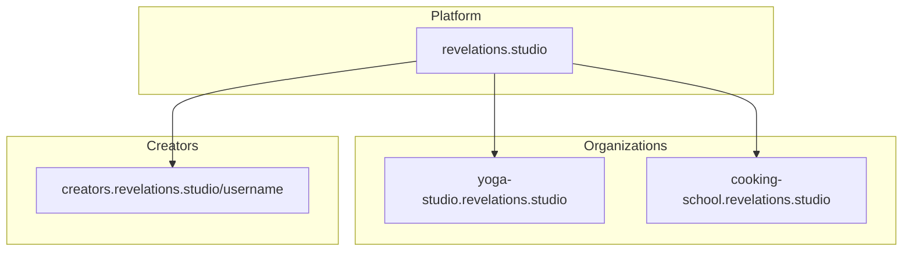
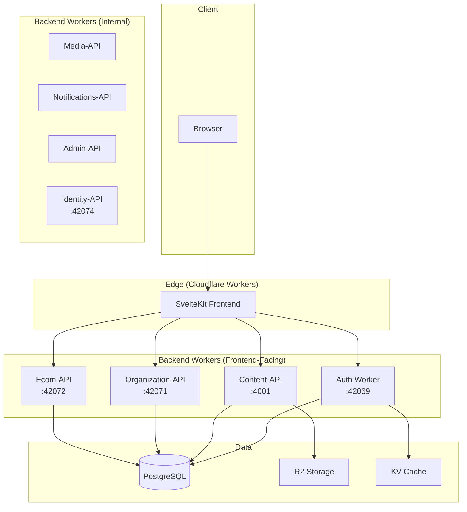

# Frontend Overview

**Status**: Design (Verified against implementation 2026-01-11)
**Last Updated**: 2026-01-11

---

## Product Context

**Codex** is a multi-tenant content monetization platform. Organizations and independent creators publish video/audio content for customers to purchase and stream.

### Key Actors

| Actor | Description |
|-------|-------------|
| **Customer** | Purchases and consumes content |
| **Creator** | Produces content; can work independently or within organizations |
| **Org Admin/Owner** | Manages organization, team, customers, billing |
| **Platform Owner** | Administers the overall Codex platform |

### Multi-Tenancy Model



- **Organizations** get branded subdomains ("spaces")
- **Creators** get personal pages at `creators.revelations.studio/{username}`
- Creators can be in **multiple organizations** (digital nomad model)
- Creators can monetize **personally** and **within organizations**

---

## Tech Stack

| Layer | Technology | Notes |
|-------|------------|-------|
| Framework | SvelteKit 2.x | File-based routing, SSR |
| UI | Svelte 5 | Runes ($state, $derived, $effect) |
| Components | Melt UI | Headless, accessible, Svelte 5 native |
| Styling | Vanilla CSS | Design tokens, CSS custom properties |
| Hosting | Cloudflare Workers | `@sveltejs/adapter-cloudflare` |
| Language | TypeScript | Strict mode |

### Why These Choices

**SvelteKit on Workers**: Edge SSR for fast global response times. SEO-friendly server rendering with client hydration for interactivity.

**Melt UI**: Headless component primitives with WAI-ARIA compliance. No styling opinions—pairs with our vanilla CSS token system.

**Vanilla CSS + Tokens**: Org branding requires dynamic theming. CSS custom properties work natively with SSR and allow runtime theme switching without build steps.

---

## Architecture Overview



**Frontend responsibility**: Presentation layer only. All business logic lives in backend workers.

See [DATA.md](./DATA.md) for complete worker documentation and API endpoints.

---

## Guiding Principles

### 1. Server-First Rendering
SSR for all public pages (SEO). Hydrate for interactivity where needed. Progressive enhancement—forms work without JavaScript.

### 2. Backend Owns Logic
Frontend calls workers via fetch. No business rule duplication. Validation schemas shared via `@codex/validation` package.

### 3. Type Safety End-to-End
TypeScript strict mode. Zod schemas for runtime validation. Types inferred from schemas, not manually duplicated.

### 4. Security by Default
HttpOnly session cookies. CSRF protection via SvelteKit. CSP headers. All queries scoped by user/org.

### 5. Minimal Client JavaScript
Svelte 5 runes for reactivity. No heavy state management libraries. Code-split by route automatically.

### 6. Accessible by Default
Melt UI provides WAI-ARIA compliance. Semantic HTML. Keyboard navigation. Screen reader support.

---

## Project Structure

```
apps/web/
├── src/
│   ├── routes/              # File-based routing
│   │   ├── (platform)/      # Platform marketing pages
│   │   ├── (auth)/          # Login, register, password reset
│   │   ├── (creators)/      # Creator personal pages
│   │   └── (org)/           # Organization-scoped routes
│   ├── lib/
│   │   ├── components/      # UI components (using Melt UI)
│   │   ├── server/          # Server-only utilities
│   │   ├── theme/           # Design tokens, theming
│   │   └── state/           # Shared reactive state
│   ├── hooks.server.ts      # Auth, org resolution
│   └── hooks.ts             # Client-side reroute
├── static/                  # Static assets
└── svelte.config.js         # Cloudflare adapter config
```

---

## Related Documents

| Document | Purpose |
|----------|---------|
| [INFRASTRUCTURE.md](./INFRASTRUCTURE.md) | Hosting, DNS, environment config |
| [ROUTING.md](./ROUTING.md) | URL structure, subdomain handling, navigation |
| [AUTH.md](./AUTH.md) | Authentication flow, session handling |
| [AUTHORIZATION.md](./AUTHORIZATION.md) | Roles, permissions, guards |
| [DATA.md](./DATA.md) | Data fetching, state management |
| [COMPONENTS.md](./COMPONENTS.md) | Component architecture, Melt UI patterns |
| [STYLING.md](./STYLING.md) | Design tokens, theming, dark mode |

---

## Open Questions

1. **Personal monetization timeline**: Phase 1 restricts monetization to org-scoped content. When does personal creator monetization ship?

2. **Platform owner dashboard**: Where does platform-level administration live? Separate subdomain?
