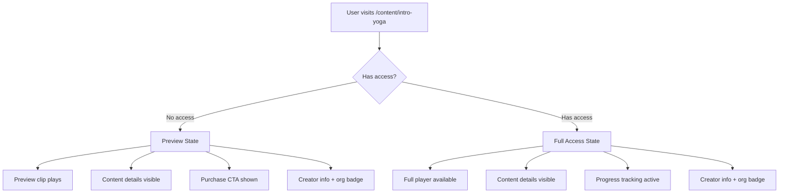
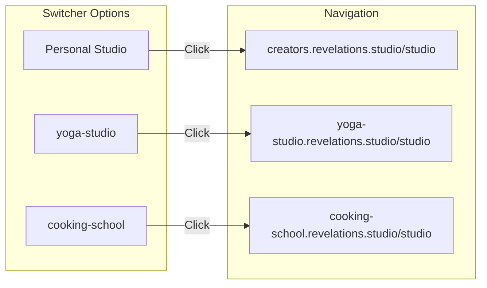
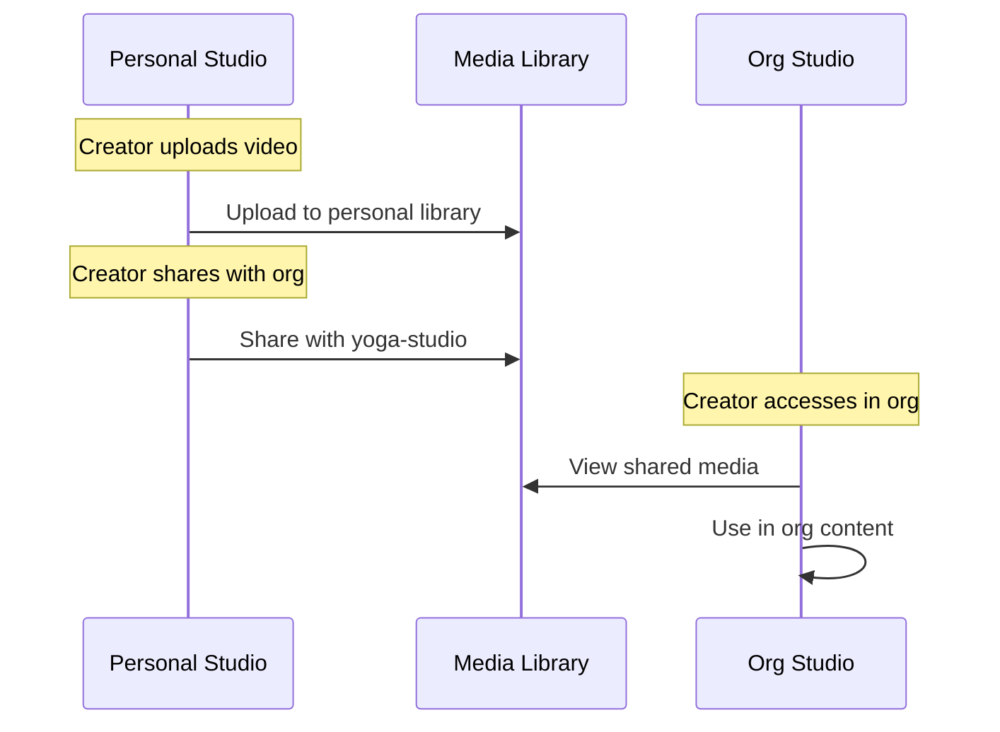
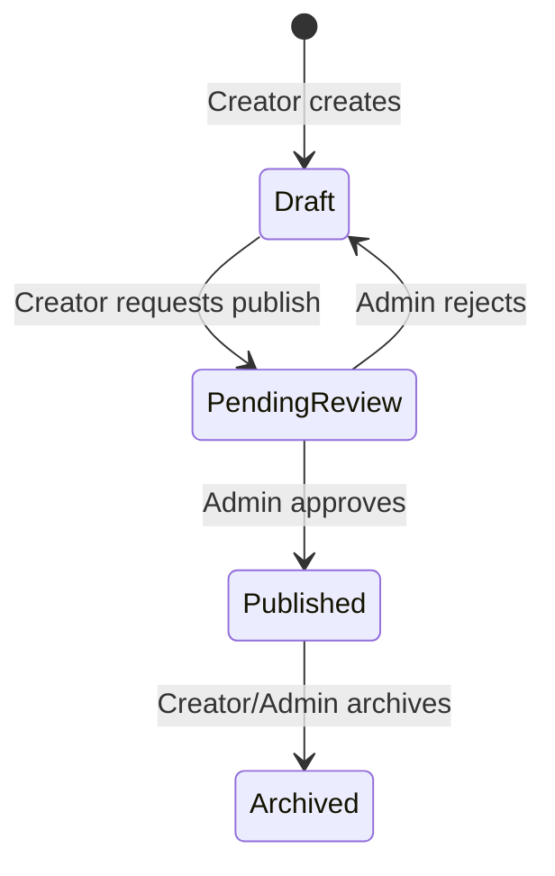
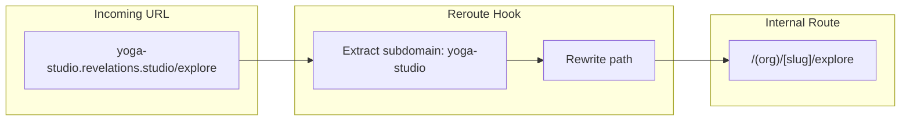
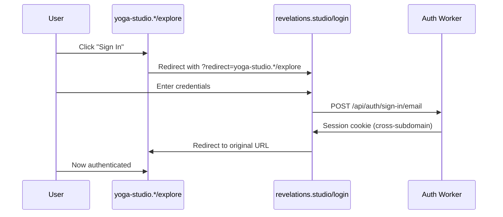

# Routing

**Status**: Design (Verified against implementation 2026-01-11)
**Last Updated**: 2026-01-11

---

## Domain Contexts

The application serves three distinct contexts based on subdomain:

```mermaid
graph TD
    subgraph "Platform Context"
        P[revelations.studio]
        P --> P1[/ - Landing]
        P --> P2[/discover - Browse orgs/creators]
        P --> P3[/library - Purchased content]
        P --> P4[/account - User settings]
    end

    subgraph "Organization Context"
        O["{slug}.revelations.studio"]
        O --> O1[/ - Org space landing]
        O --> O2[/explore - Browse content]
        O --> O3[/content/{slug} - Content + player]
        O --> O4[/studio - Creator/admin tools]
    end

    subgraph "Creator Context"
        C[creators.revelations.studio]
        C --> C1["/{username} - Public profile"]
        C --> C2[/studio - Personal studio]
    end
```

---

## Platform Routes (`revelations.studio`)

The platform domain handles marketing, discovery, and cross-org user features.

### Public Routes

| Route | Purpose | Notes |
|-------|---------|-------|
| `/` | Landing page | Marketing for creators |
| `/about` | About the platform | Mission, team, etc. |
| `/pricing` | Pricing information | Creator plans, org plans |
| `/discover` | Browse orgs and creators | Search, categories, featured |
| `/login` | Authentication | Redirects back to origin |
| `/register` | Registration | New user signup |
| `/forgot-password` | Password reset | Email-based reset flow |

### Authenticated Routes

| Route | Purpose | Notes |
|-------|---------|-------|
| `/library` | All purchased content | Aggregates purchases across all orgs |
| `/account` | Account settings | Profile, email, password |
| `/account/payment` | Payment methods | Saved cards, billing history |
| `/account/notifications` | Notification preferences | Email settings |

### Subdomain Handling

| Subdomain | Behavior |
|-----------|----------|
| `www` | Redirect to `revelations.studio` |
| `api`, `auth`, `identity`, `ecom` | Backend workers (not rewritten) |

---

## Organization Routes (`{slug}.revelations.studio`)

Each organization has a branded subdomain with public space and creator studio.

### Public Routes (Space)

| Route | Purpose | Notes |
|-------|---------|-------|
| `/` | Org landing page | Branded, marketing for org |
| `/explore` | Browse org content | All published content, creator listings |
| `/content/{slug}` | Content detail + player | Preview or full based on access |
| `/creators` | Org creator directory | List of creators in this org |

### Authenticated Routes (App)

**Note**: There is NO org-scoped library. Library is platform-level only (`revelations.studio/library`). Header "Library" link always navigates to platform library, even when on org subdomain.

### Studio Routes (Creator+ Role)

| Route | Role | Purpose |
|-------|------|---------|
| `/studio` | Creator+ | Dashboard overview |
| `/studio/content` | Creator+ | List own content (drafts + published) |
| `/studio/content/new` | Creator+ | Create new content |
| `/studio/content/{id}` | Creator+ | Edit content |
| `/studio/content/{id}/publish` | Creator+ | Request publish (admin approval) |
| `/studio/media` | Creator+ | Shared media library (media shared with org) |
| `/studio/media/import` | Creator+ | Import from personal library |
| `/studio/analytics` | Creator+ | Own content analytics |
| `/studio/team` | Admin+ | Manage org members |
| `/studio/customers` | Admin+ | View customers, purchases |
| `/studio/settings` | Admin+ | Org settings, branding |
| `/studio/billing` | Owner | Billing, subscription |

### Content Page States

The content page (`/content/{slug}`) adapts based on user access:



| User State | What They See |
|------------|---------------|
| No access (not purchased, not free) | Preview clip + details + purchase CTA |
| Has access (purchased/free/member) | Full player + details + progress |

---

## Creator Routes (`creators.revelations.studio`)

The creator subdomain hosts public profiles and personal studios.

### Public Routes

| Route | Purpose | Notes |
|-------|---------|-------|
| `/{username}` | Creator's feed/brand page | Personal content, mission, services |
| `/{username}/about` | Extended bio | Mission, how to work with them |
| `/{username}/content` | Content catalog | Personal published content |
| `/{username}/orgs` | Organizations | Orgs they create for (with avatars) |

### Creator Profile Content

The profile page (`/{username}`) is a marketing/feed page showing:

| Element | Description |
|---------|-------------|
| Personal feed | Latest content, updates |
| Mission statement | What they do, their focus |
| Services | How to work with them |
| Org affiliations | Orgs they create for (with badges/avatars) |
| Content with org badges | Shows which org content belongs to |

### Studio Routes (Authenticated, Own Profile Only)

| Route | Purpose | Notes |
|-------|---------|-------|
| `/studio` | Personal studio dashboard | Overview of all personal content |
| `/studio/content` | Personal content list | Drafts + published personal content |
| `/studio/content/new` | Create personal content | Can target personal or select org |
| `/studio/content/{id}` | Edit personal content | Full editing |
| `/studio/media` | Full media library | All personal media |
| `/studio/media/upload` | Upload new media | Add to personal library |
| `/studio/media/{id}` | Media detail | Metadata, usage |
| `/studio/media/{id}/sharing` | Manage org sharing | Share/unshare with orgs |
| `/studio/analytics` | Personal analytics | All content stats |
| `/studio/orgs` | Org memberships | Orgs user creates for, quick switch |
| `/studio/settings` | Personal settings | Profile, preferences |

---

## Studio Switcher

Creators can switch between contexts via a studio switcher in the sidebar/header.



| Element | Shows |
|---------|-------|
| Personal option | Always shown |
| Org options | Only orgs where user is Creator+ role |
| Current context | Highlighted/selected |

Switching performs full navigation to the target subdomain.

---

## Media Sharing Flow

Creators share media from personal library to org studios.



### Sharing Routes

| Action | Route | Description |
|--------|-------|-------------|
| View sharing | `/studio/media/{id}/sharing` | See which orgs have access |
| Share with org | POST action | Grant org access to media |
| Unshare from org | POST action | Revoke org access |
| Import in org | `/studio/media/import` | Browse personal library to share |

---

## Content Publishing Flow

Content goes through approval before publishing in org context.



| State | Visibility | Actions |
|-------|------------|---------|
| Draft | Creator only | Edit, delete, request publish |
| Pending Review | Creator + Admins | View, approve, reject |
| Published | Public (based on visibility) | Edit (creates new draft), archive |
| Archived | Creator + Admins | Restore to draft |

---

## Subdomain Rewriting

SvelteKit's `reroute` hook translates subdomain URLs to internal file-based routes.



### Rewrite Rules

| Subdomain | Incoming Path | Internal Route |
|-----------|---------------|----------------|
| (none) | `/about` | `/(platform)/about` |
| (none) | `/library` | `/(platform)/library` |
| `creators` | `/alice` | `/(creators)/[username]` |
| `creators` | `/studio` | `/(creators)/studio` |
| `yoga-studio` | `/` | `/(org)/[slug]/(space)` |
| `yoga-studio` | `/explore` | `/(org)/[slug]/(space)/explore` |
| `yoga-studio` | `/content/intro` | `/(org)/[slug]/(space)/content/[contentSlug]` |
| `yoga-studio` | `/studio` | `/(org)/[slug]/studio` |

---

## Route Groups

```
src/routes/
├── (platform)/              # Platform domain
│   ├── +page                # Landing
│   ├── about/
│   ├── pricing/
│   ├── discover/
│   ├── library/             # Auth required
│   └── account/             # Auth required
├── (auth)/                  # Auth pages
│   ├── login/
│   ├── register/
│   └── forgot-password/
├── (creators)/              # Creator subdomain
│   ├── [username]/          # Public profile
│   │   ├── +page            # Feed/brand page
│   │   ├── about/
│   │   ├── content/
│   │   └── orgs/
│   └── studio/              # Personal studio (auth)
│       ├── +page            # Dashboard
│       ├── content/
│       ├── media/
│       ├── analytics/
│       ├── orgs/
│       └── settings/
└── (org)/                   # Organization subdomain
    └── [slug]/
        ├── (space)/         # Public org pages
        │   ├── +page        # Org landing
        │   ├── explore/
        │   ├── content/[contentSlug]/
        │   └── creators/
        └── studio/          # Creator+ studio
            ├── +page        # Dashboard
            ├── content/
            ├── media/
            ├── analytics/
            ├── team/        # Admin+
            ├── customers/   # Admin+
            ├── settings/    # Admin+
            └── billing/     # Owner
```

### Group Access Requirements

| Group | Auth | Role | Notes |
|-------|------|------|-------|
| `(platform)` | Varies | - | Some routes public, some auth |
| `(auth)` | No | - | Redirect to origin if logged in |
| `(creators)/[username]` | No | - | Public profiles |
| `(creators)/studio` | Yes | Owner | Must be viewing own profile |
| `(org)/(space)` | No | - | Public org pages |
| `(org)/studio` | Yes | Creator+ | Role-gated features |

---

## Authentication Flow

Auth happens on platform domain with redirect back to origin.



### Auth Routes

| Route | Redirect Param | Behavior |
|-------|----------------|----------|
| `/login` | `?redirect={url}` | After login, redirect to URL |
| `/register` | `?redirect={url}` | After registration, redirect |
| `/logout` | - | Clear session, redirect to platform home |

---

## Dynamic Segments

| Segment | Validation | Example |
|---------|------------|---------|
| `[username]` | Globally unique, alphanumeric + hyphens | `alice`, `bob-smith` |
| `[slug]` (org) | Unique org slug, reserved list excluded | `yoga-studio` |
| `[contentSlug]` | Unique within org/creator context | `intro-to-yoga` |
| `[id]` | UUID format | `550e8400-...` |

### Reserved Slugs

These cannot be used as org slugs:
- `www`, `api`, `auth`, `identity`, `ecom`
- `creators`, `admin`, `support`, `help`
- Platform feature words as needed

---

## Error Handling

| Scenario | HTTP | Behavior |
|----------|------|----------|
| Org not found | 404 | "Organization not found" page |
| Content not found | 404 | "Content not found" page |
| Creator not found | 404 | "Creator not found" page |
| Not authenticated | 302 | Redirect to `/login?redirect=...` |
| Insufficient role | 403 | "Access denied" page |

---

## Future Routes (Not Phase 1)

These routes are planned but not included in Phase 1 implementation.

### Platform Future Routes

| Route | Purpose | Notes |
|-------|---------|-------|
| `/app` | User dashboard hub | Continue watching, quick actions, widgets |
| `/app/discover` | Feed of followed content | Instagram-style vertical feed |
| `/app/following` | Manage follows | List and unfollow creators/orgs |

### Following Feature (Future)

| Location | Action |
|----------|--------|
| Creator page | Follow button for creator |
| Org page | Choice: follow org OR specific creator OR both |

**Following behavior**:
- Follow creator = see all their content across all orgs
- Follow org = see all org content (all creators in that org)

### User Dashboard (Future)

The `/app` route will become a personalized hub:

| Section | Description |
|---------|-------------|
| Continue watching | Resume where you left off |
| Quick actions | Jump into meditation, etc. |
| Recommendations | Based on history, preferences, time of day |
| Favorites | Pinned content for quick access |
| Upcoming | Appointments/events (when added) |
| Feed preview | Latest from followed creators/orgs |

**Design inspiration**: Substack's clean, calm interaction with content. Single-page app feel with internal routing.

### Appointments/Services (Future)

| Route | Purpose |
|-------|---------|
| `/book/{creatorUsername}` | Book 1:1 session |
| `/events` | Browse group events |
| `/app/appointments` | User's upcoming appointments |

---

## Related Documents

- [INFRASTRUCTURE.md](./INFRASTRUCTURE.md) - DNS and subdomain configuration
- [AUTH.md](./AUTH.md) - Authentication and session handling
- [AUTHORIZATION.md](./AUTHORIZATION.md) - Role-based access control
