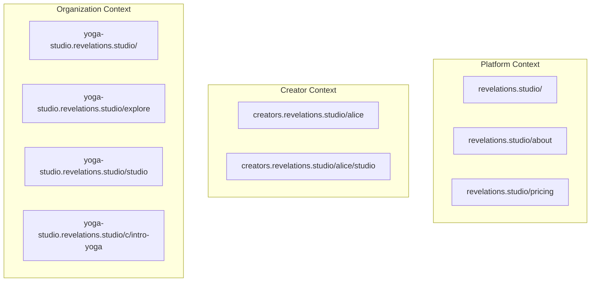
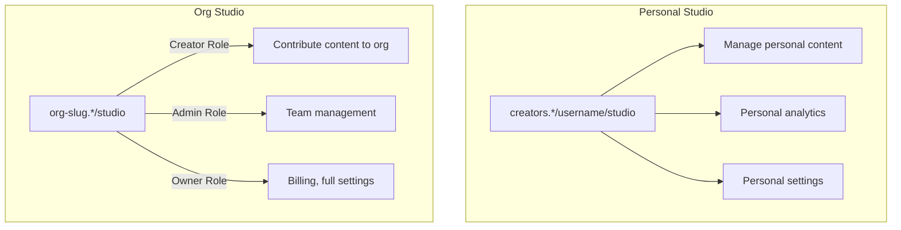

# Routing

**Status**: Design
**Last Updated**: 2026-01-10

---

## URL Structure

### Domain Contexts

The application serves different contexts based on the subdomain:



### URL Patterns

| Pattern | Context | Description |
|---------|---------|-------------|
| `revelations.studio/*` | Platform | Marketing, pricing, about |
| `creators.revelations.studio/{username}` | Creator | Creator's public profile |
| `creators.revelations.studio/{username}/studio` | Creator | Personal content studio |
| `{org-slug}.revelations.studio/` | Org | Organization space home |
| `{org-slug}.revelations.studio/explore` | Org | Browse org content |
| `{org-slug}.revelations.studio/c/{slug}` | Org | Content detail page |
| `{org-slug}.revelations.studio/studio` | Org | Creator studio (org context) |
| `{org-slug}.revelations.studio/library` | Org | User's purchased content |

---

## Subdomain Rewriting

SvelteKit's `reroute` hook translates subdomain URLs to internal file-based routes.

```mermaid
graph LR
    subgraph "Incoming URL"
        A[yoga-studio.revelations.studio/explore]
    end

    subgraph "Reroute Hook"
        B[Extract subdomain: yoga-studio]
        C[Rewrite path]
    end

    subgraph "Internal Route"
        D[/org/yoga-studio/explore]
    end

    A --> B --> C --> D
```

### Rewrite Rules

| Subdomain | Incoming Path | Internal Route |
|-----------|---------------|----------------|
| (none) | `/about` | `/(platform)/about` |
| `creators` | `/alice` | `/(creators)/alice` |
| `creators` | `/alice/studio` | `/(creators)/alice/studio` |
| `yoga-studio` | `/` | `/(org)/yoga-studio/` |
| `yoga-studio` | `/explore` | `/(org)/yoga-studio/explore` |
| `yoga-studio` | `/studio` | `/(org)/yoga-studio/studio` |

### Ignored Subdomains

These subdomains are not rewritten (they're separate workers or aliases):

- `www` → Redirects to root
- `api`, `auth`, `identity`, `ecom` → Backend workers

---

## Route Groups

Routes are organized into groups by access level and purpose:

```
src/routes/
├── (platform)/           # Platform marketing
├── (auth)/               # Authentication pages
├── (creators)/           # Creator personal pages
│   └── [username]/
│       ├── +page         # Public profile
│       └── studio/       # Personal studio (auth required)
└── (org)/                # Organization context
    └── [slug]/
        ├── (space)/      # Public org pages
        ├── (app)/        # Authenticated user pages
        └── studio/       # Creator studio (role-gated)
```

### Group Purposes

| Group | Auth Required | Purpose |
|-------|---------------|---------|
| `(platform)` | No | Marketing, pricing, about pages |
| `(auth)` | No (redirect if logged in) | Login, register, password reset |
| `(creators)/[username]` | No | Creator public profile |
| `(creators)/[username]/studio` | Yes (owner only) | Personal content management |
| `(org)/[slug]/(space)` | No | Org home, explore, content detail |
| `(org)/[slug]/(app)` | Yes | Library, settings, watch |
| `(org)/[slug]/studio` | Yes (creator+ role) | Org content management |

---

## Studio Routing

The studio is context-aware with role-based features:



### Studio Access Matrix

| Context | Role | Capabilities |
|---------|------|--------------|
| Personal | Owner (self) | Full personal content management |
| Org | Creator | Contribute content, view own analytics |
| Org | Admin | + Team management, customer support |
| Org | Owner | + Billing, org settings, full analytics |

---

## Dynamic Segments

| Segment | Validation | Example |
|---------|------------|---------|
| `[username]` | Globally unique, alphanumeric + hyphens | `alice`, `bob-smith` |
| `[slug]` (org) | Unique org slug, validated against reserved list | `yoga-studio` |
| `[contentSlug]` | Unique within org/creator | `intro-to-yoga` |
| `[contentId]` | UUID | `550e8400-e29b-41d4-a716-446655440000` |

---

## Navigation Patterns

### Primary Navigation by Context

| Context | Primary Nav Items |
|---------|-------------------|
| Platform | Home, Pricing, About, Login |
| Creator Profile | Profile, Content |
| Creator Studio | Dashboard, Content, Media, Settings |
| Org Space | Home, Explore, (Login if not auth) |
| Org App | Library, Settings, Studio (if creator+) |
| Org Studio | Dashboard, Content, Media, (Team, Settings if admin+) |

### Breadcrumb Patterns

```
Platform:     Home
Org Space:    {Org Name} > Explore > {Content Title}
Org Studio:   Studio > Content > {Content Title}
Creator:      {Username} > Studio > Content
```

---

## Navigation State

Navigation state (sidebar open/closed, current section) is managed via Svelte 5 runes in a shared state file. This state persists across route navigations but resets on full page reload.

---

## Error Routes

| Route | Purpose |
|-------|---------|
| `+error.svelte` | Global error page |
| `(org)/[slug]/+error.svelte` | Org-scoped errors (404 org, etc.) |

### Error Scenarios

| Scenario | Behavior |
|----------|----------|
| Org not found | 404 with "Organization not found" |
| Content not found | 404 with "Content not found" |
| Not authorized | Redirect to login with return URL |
| Forbidden | 403 with appropriate message |

---

## Related Documents

- [INFRASTRUCTURE.md](./INFRASTRUCTURE.md) - DNS and subdomain configuration
- [AUTH.md](./AUTH.md) - Authentication and session handling
- [AUTHORIZATION.md](./AUTHORIZATION.md) - Role-based access control
