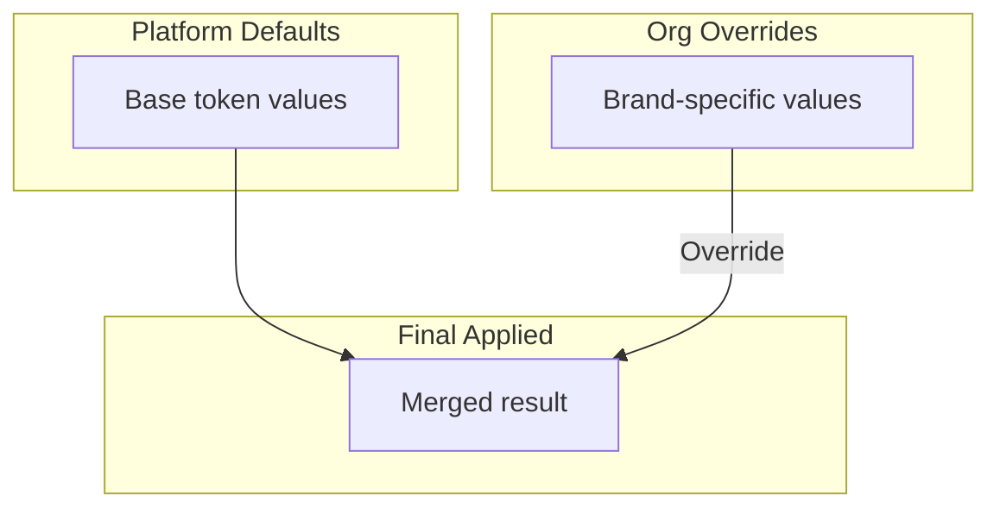
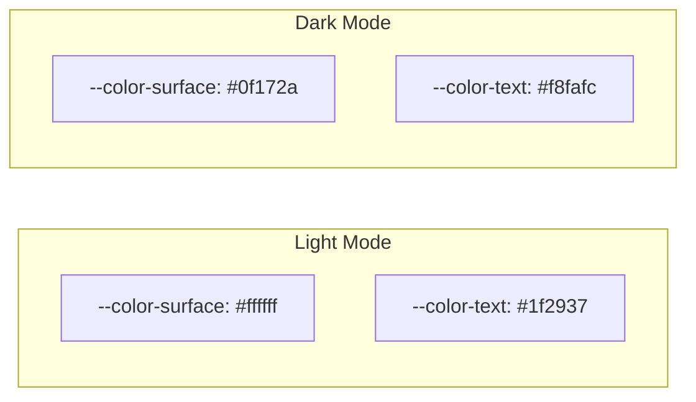
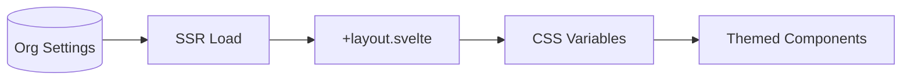
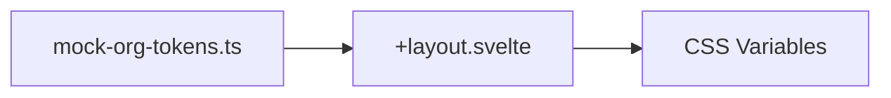
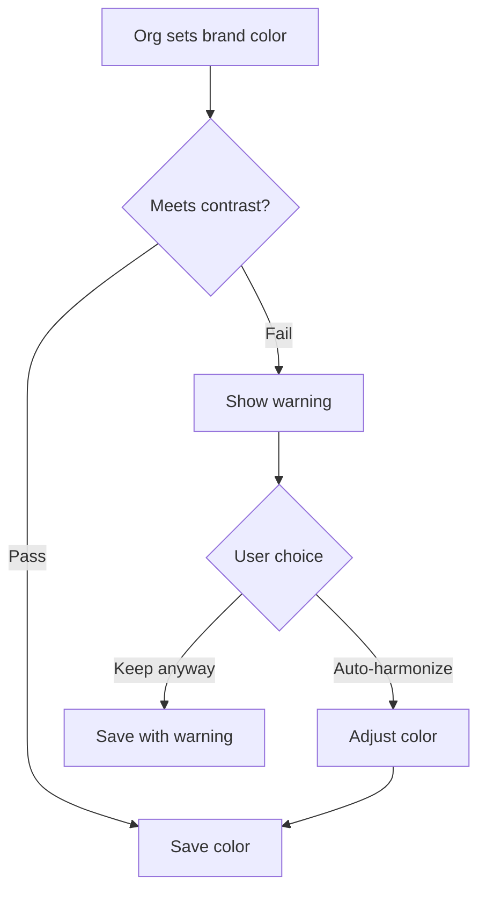
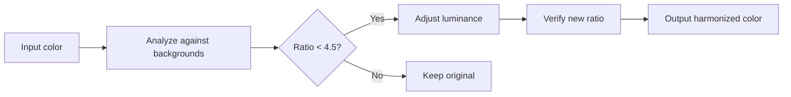
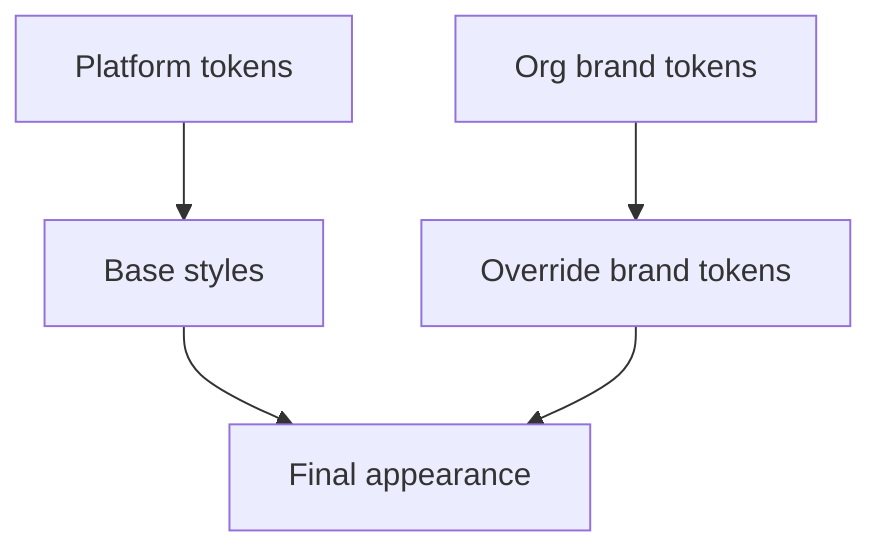

# Styling & Theming

**Status**: Design (Pre-implementation - CSS token system design)
**Last Updated**: 2026-01-11

---

## Approach

Styling uses **vanilla CSS** with **design tokens** as CSS custom properties. No Tailwind or CSS-in-JS.

### Why This Approach

| Consideration | Decision |
|---------------|----------|
| Org branding | CSS custom properties enable runtime theming |
| SSR compatibility | No build-time theme compilation needed |
| Dark mode | CSS variables switch instantly |
| Simplicity | Standard CSS, no framework lock-in |
| Performance | No runtime CSS generation |

---

## Design Token Architecture

Tokens are organized in three tiers:

```mermaid
graph TD
    subgraph "Tier 1: Primitives"
        P1[--color-blue-500: #3b82f6]
        P2[--space-4: 1rem]
        P3[--font-sans: 'Inter']
    end

    subgraph "Tier 2: Semantic"
        S1[--color-interactive: var(--color-blue-500)]
        S2[--spacing-md: var(--space-4)]
        S3[--font-body: var(--font-sans)]
    end

    subgraph "Tier 3: Component"
        C1[--button-bg: var(--color-interactive)]
        C2[--card-padding: var(--spacing-md)]
    end

    P1 --> S1 --> C1
    P2 --> S2 --> C2
    P3 --> S3
```

### Tier Purposes

| Tier | Purpose | Example |
|------|---------|---------|
| Primitives | Raw values | `--color-blue-500`, `--space-4` |
| Semantic | Meaning-based aliases | `--color-interactive`, `--color-surface` |
| Component | Component-specific slots | `--button-bg`, `--card-border` |

**Key insight**: Theme changes only modify primitives. Semantic and component tokens reference primitives, so changes cascade automatically.

---

## Token Inheritance

Org tokens override platform defaults with automatic fallback.



### Fallback Behavior

| Scenario | Result |
|----------|--------|
| Org sets `--brand-primary` | Org value used |
| Org doesn't set `--color-warning` | Platform default used |
| Org sets invalid value | Platform default used |

All semantic tokens have platform defaults. Orgs can override any token, but missing overrides gracefully fall back.

### Implementation: Scoped CSS Variables

CSS custom properties don't support multi-level fallback natively. We use **data attributes** to scope org overrides:

```css
/* Platform defaults (always applied) */
:root {
  --brand-primary: #3b82f6;
  --brand-primary-hover: #2563eb;
  --brand-accent: #8b5cf6;
  --color-surface: #ffffff;
  --color-text-primary: #1f2937;
}

/* Org overrides via data attribute */
[data-org="yoga-studio"] {
  --brand-primary: #10b981;
  --brand-primary-hover: #059669;
  --brand-accent: #f59e0b;
}

[data-org="cooking-school"] {
  --brand-primary: #ef4444;
  --brand-primary-hover: #dc2626;
}
```

**Layout Application:**

```svelte
<!-- src/routes/+layout.svelte -->
<script lang="ts">
  let { data, children } = $props();
</script>

<div data-org={data.organization?.slug}>
  {@render children()}
</div>
```

### Runtime Token Injection (Dynamic Orgs)

For orgs not known at build time, inject tokens via SSR:

```typescript
// +layout.server.ts
export async function load({ locals, platform }) {
  const org = locals.organization;

  if (!org?.brandTokens) {
    return { organization: org, brandStyles: null };
  }

  // Convert stored tokens to CSS
  const brandStyles = Object.entries(org.brandTokens)
    .map(([key, value]) => `--${key}: ${value};`)
    .join(' ');

  return {
    organization: org,
    brandStyles
  };
}
```

```svelte
<!-- +layout.svelte -->
<script lang="ts">
  let { data, children } = $props();
</script>

<svelte:head>
  {#if data.brandStyles}
    <style>
      :root { {data.brandStyles} }
    </style>
  {/if}
</svelte:head>

<div data-org={data.organization?.slug}>
  {@render children()}
</div>
```

### Token Validation

Before saving org tokens, validate:

```typescript
// lib/theme/validate-tokens.ts
const VALID_TOKEN_KEYS = [
  'brand-primary',
  'brand-primary-hover',
  'brand-accent',
  'brand-surface'
] as const;

const COLOR_REGEX = /^#[0-9a-fA-F]{6}$/;

export function validateBrandTokens(
  tokens: Record<string, string>
): { valid: boolean; errors: string[] } {
  const errors: string[] = [];

  for (const [key, value] of Object.entries(tokens)) {
    if (!VALID_TOKEN_KEYS.includes(key as any)) {
      errors.push(`Unknown token: ${key}`);
      continue;
    }

    if (!COLOR_REGEX.test(value)) {
      errors.push(`Invalid color value for ${key}: ${value}`);
    }
  }

  return { valid: errors.length === 0, errors };
}

---

## Token Categories

### Colors

| Category | Tokens |
|----------|--------|
| Brand | `--color-brand-*` (primary, shades) |
| Surface | `--color-surface-*` (backgrounds) |
| Text | `--color-text-*` (primary, secondary, muted) |
| Border | `--color-border-*` (default, strong) |
| Status | `--color-success`, `--color-error`, `--color-warning` |
| Interactive | `--color-interactive`, `--color-interactive-hover` |

### Spacing

| Token | Value | Use |
|-------|-------|-----|
| `--space-1` | 0.25rem | Tight spacing |
| `--space-2` | 0.5rem | Small gaps |
| `--space-4` | 1rem | Default spacing |
| `--space-6` | 1.5rem | Section spacing |
| `--space-8` | 2rem | Large spacing |

### Typography

| Token | Purpose |
|-------|---------|
| `--font-sans` | Body text |
| `--font-mono` | Code |
| `--text-xs` through `--text-4xl` | Font sizes |
| `--leading-tight`, `--leading-normal` | Line heights |
| `--font-normal`, `--font-medium`, `--font-bold` | Weights |

### Borders & Radius

| Token | Value | Use |
|-------|-------|-----|
| `--radius-sm` | 0.25rem | Buttons, inputs |
| `--radius-md` | 0.5rem | Cards |
| `--radius-lg` | 1rem | Modals |
| `--radius-full` | 9999px | Pills, avatars |
| `--border-width` | 1px | Default borders |

### Shadows

| Token | Use |
|-------|-----|
| `--shadow-sm` | Subtle elevation |
| `--shadow-md` | Cards |
| `--shadow-lg` | Dropdowns, modals |

### Z-Index

| Token | Value | Use |
|-------|-------|-----|
| `--z-dropdown` | 1000 | Dropdowns |
| `--z-modal` | 1100 | Modals |
| `--z-toast` | 1200 | Toast notifications |

### Motion Tokens

| Token | Value | Use |
|-------|-------|-----|
| `--duration-fast` | 150ms | Hover, toggle, fade |
| `--duration-normal` | 300ms | Modal, drawer, large moves |
| `--duration-slow` | 500ms | Page transitions |
| `--ease-in-out` | cubic-bezier(0.4, 0, 0.2, 1) | Standard movement |
| `--ease-out` | cubic-bezier(0, 0, 0.2, 1) | Entering screen |
| `--ease-in` | cubic-bezier(0.4, 0, 1, 1) | Exiting screen |

---

## View Transitions

We use the **View Transitions API** (integrated via SvelteKit) for seamless page navigation.

### Implementation

Enable view transitions in `+layout.svelte` using the `onNavigate` lifecycle function:

```svelte
<script>
  import { onNavigate } from '$app/navigation';

  onNavigate((navigation) => {
    if (!document.startViewTransition) return;

    return new Promise((resolve) => {
      document.startViewTransition(async () => {
        resolve();
        await navigation.complete;
      });
    });
  });
</script>
```

### Transition Names

Use `view-transition-name` in CSS to morph elements between pages:

```css
/* Card Thumbnail */
.card-thumbnail {
  view-transition-name: media-player;
}

/* Video Player on destination page */
.video-player {
  view-transition-name: media-player;
}
```

This causes the thumbnail to morph into the player when navigating from list to detail.

### Transition Scoping

To avoid collisions (e.g., multiple cards), use dynamic styles in the component:

```svelte
<div style="view-transition-name: media-{id}">
  <!-- ... -->
</div>
```

---

## Dark Mode

Dark mode swaps primitive tokens:



### Implementation

Dark mode is applied via a class on `<html>`:

| State | Class | Tokens |
|-------|-------|--------|
| Light | (default) | Light primitives |
| Dark | `.dark` | Dark primitives |

### Mode Detection

| Priority | Source |
|----------|--------|
| 1 | User preference (localStorage or cookie) |
| 2 | System preference (`prefers-color-scheme`) |
| 3 | Default (light) |

Dark mode preference is **global** - applies across all subdomains and contexts.

### FOUC Prevention

To prevent flash of unstyled content (FOUC) during SSR, add this script to `app.html` **before** any content:

```html
<!-- app.html <head> section -->
<script>
  (function() {
    // Check cookie first (for SSR consistency), then localStorage, then system preference
    const theme = document.cookie.match(/theme=(dark|light)/)?.[1]
      || localStorage.getItem('theme')
      || (window.matchMedia('(prefers-color-scheme: dark)').matches ? 'dark' : 'light');
    document.documentElement.classList.add(theme);
  })();
</script>
```

This inline script executes before the page renders, preventing the flash.

**For SSR consistency**: Store theme in a cookie (not just localStorage) so the server can render with the correct theme class:

```typescript
// In theme toggle handler
function setTheme(theme: 'light' | 'dark') {
  document.documentElement.classList.remove('light', 'dark');
  document.documentElement.classList.add(theme);
  localStorage.setItem('theme', theme);
  document.cookie = `theme=${theme}; path=/; max-age=31536000; SameSite=Lax`;
}
```

---

## Organization Branding

Organizations customize their space appearance via brand tokens.

### Brand Token Flow



### Brandable Tokens

| Token | Description | Default |
|-------|-------------|---------|
| `--brand-primary` | Primary brand color | Platform default |
| `--brand-primary-hover` | Hover state | Derived |
| `--brand-accent` | Secondary accent | Platform default |
| `--brand-surface` | Background tint | White |
| `--brand-logo` | Logo URL | None |

### Mock Implementation (Phase 1)

For Phase 1, brand tokens are mocked since we have a single org:



The mock file exports token values that will later come from database.

**File location**: `$lib/theme/mock-org-tokens.ts`

### SSR Compatibility

Brand tokens are applied during SSR:

1. Server load fetches (or mocks) org brand settings
2. Layout component applies tokens to wrapper element
3. HTML renders with correct brand colors
4. No flash of unstyled content

---

## Accessibility & Contrast

Platform enforces accessibility standards for all brand colors.

### Contrast Requirements (WCAG AA)

| Text Type | Minimum Ratio |
|-----------|---------------|
| Normal text (<18px) | 4.5:1 |
| Large text (18px+ or 14px+ bold) | 3:1 |
| UI components & graphics | 3:1 |

### Contrast Checking System

When orgs configure brand colors, the system validates contrast:



### Contrast Check Results

| Result | UI Treatment |
|--------|--------------|
| Pass (4.5:1+) | Green checkmark, no message |
| Warning (3:1 - 4.5:1) | Yellow warning, "May have readability issues" |
| Fail (<3:1) | Red error, "Does not meet accessibility standards" |

### Auto-Harmonize Feature

When colors fail contrast, users can enable "Auto-harmonize" which adjusts the color to meet requirements:

| Original Color | Background | Issue | Harmonized |
|----------------|------------|-------|------------|
| Light blue on white | #ffffff | 2.1:1 ratio | Darkened to 4.5:1 |
| Dark gray on black | #0f172a | 1.8:1 ratio | Lightened to 4.5:1 |

**How it works:**



### Contrast Algorithm Implementation

WCAG contrast ratio formula: `(L1 + 0.05) / (L2 + 0.05)` where L1 is lighter, L2 is darker.

```typescript
// lib/theme/contrast.ts

/**
 * Calculate relative luminance per WCAG 2.1
 * @see https://www.w3.org/WAI/WCAG21/Understanding/contrast-minimum.html
 */
export function getLuminance(hex: string): number {
  const rgb = hexToRgb(hex);
  const [r, g, b] = rgb.map((c) => {
    const s = c / 255;
    return s <= 0.03928 ? s / 12.92 : Math.pow((s + 0.055) / 1.055, 2.4);
  });
  return 0.2126 * r + 0.7152 * g + 0.0722 * b;
}

/**
 * Calculate contrast ratio between two colors
 * @returns Ratio between 1:1 and 21:1
 */
export function getContrastRatio(color1: string, color2: string): number {
  const l1 = getLuminance(color1);
  const l2 = getLuminance(color2);
  const lighter = Math.max(l1, l2);
  const darker = Math.min(l1, l2);
  return (lighter + 0.05) / (darker + 0.05);
}

/**
 * Check if contrast meets WCAG AA requirements
 */
export function meetsContrastAA(
  foreground: string,
  background: string,
  isLargeText = false
): { passes: boolean; ratio: number; required: number } {
  const ratio = getContrastRatio(foreground, background);
  const required = isLargeText ? 3 : 4.5;
  return {
    passes: ratio >= required,
    ratio: Math.round(ratio * 100) / 100,
    required
  };
}

/**
 * Auto-harmonize: Adjust color to meet contrast requirements
 * Preserves hue and saturation, adjusts lightness
 */
export function harmonizeColor(
  color: string,
  background: string,
  targetRatio = 4.5
): string {
  const current = getContrastRatio(color, background);
  if (current >= targetRatio) return color;

  const hsl = hexToHsl(color);
  const bgLuminance = getLuminance(background);
  const isDarkBg = bgLuminance < 0.5;

  // Binary search for optimal lightness
  let low = isDarkBg ? hsl.l : 0;
  let high = isDarkBg ? 100 : hsl.l;

  for (let i = 0; i < 20; i++) {
    const mid = (low + high) / 2;
    const testColor = hslToHex({ ...hsl, l: mid });
    const ratio = getContrastRatio(testColor, background);

    if (ratio >= targetRatio && ratio < targetRatio + 0.5) {
      return testColor; // Close enough
    }

    if (isDarkBg) {
      if (ratio < targetRatio) low = mid;
      else high = mid;
    } else {
      if (ratio < targetRatio) high = mid;
      else low = mid;
    }
  }

  return hslToHex({ ...hsl, l: (low + high) / 2 });
}

// Helper functions
function hexToRgb(hex: string): [number, number, number] {
  const result = /^#?([a-f\d]{2})([a-f\d]{2})([a-f\d]{2})$/i.exec(hex);
  if (!result) throw new Error(`Invalid hex color: ${hex}`);
  return [
    parseInt(result[1], 16),
    parseInt(result[2], 16),
    parseInt(result[3], 16)
  ];
}

function hexToHsl(hex: string): { h: number; s: number; l: number } {
  const [r, g, b] = hexToRgb(hex).map(c => c / 255);
  const max = Math.max(r, g, b);
  const min = Math.min(r, g, b);
  let h = 0, s = 0;
  const l = (max + min) / 2;

  if (max !== min) {
    const d = max - min;
    s = l > 0.5 ? d / (2 - max - min) : d / (max + min);
    switch (max) {
      case r: h = ((g - b) / d + (g < b ? 6 : 0)) / 6; break;
      case g: h = ((b - r) / d + 2) / 6; break;
      case b: h = ((r - g) / d + 4) / 6; break;
    }
  }

  return { h: h * 360, s: s * 100, l: l * 100 };
}

function hslToHex({ h, s, l }: { h: number; s: number; l: number }): string {
  s /= 100;
  l /= 100;
  const a = s * Math.min(l, 1 - l);
  const f = (n: number) => {
    const k = (n + h / 30) % 12;
    const color = l - a * Math.max(Math.min(k - 3, 9 - k, 1), -1);
    return Math.round(255 * color).toString(16).padStart(2, '0');
  };
  return `#${f(0)}${f(8)}${f(4)}`;
}
```

**Usage in Brand Settings UI:**

```svelte
<script lang="ts">
  import { meetsContrastAA, harmonizeColor } from '$lib/theme/contrast';

  let brandPrimary = $state('#7dd3fc'); // Light blue
  let surface = $state('#ffffff');

  let contrastCheck = $derived(meetsContrastAA(brandPrimary, surface));
  let suggestedColor = $derived(
    contrastCheck.passes ? brandPrimary : harmonizeColor(brandPrimary, surface)
  );
</script>

<input type="color" bind:value={brandPrimary} />

{#if !contrastCheck.passes}
  <div class="warning">
    <p>Contrast ratio {contrastCheck.ratio}:1 (needs {contrastCheck.required}:1)</p>
    <button onclick={() => brandPrimary = suggestedColor}>
      Auto-fix to {suggestedColor}
    </button>
  </div>
{:else}
  <p class="success">Contrast OK: {contrastCheck.ratio}:1</p>
{/if}
```

### Contrast Pairs to Check

| Foreground Token | Background Token | Minimum | Large Text |
|------------------|------------------|---------|------------|
| `--brand-primary` | `--color-surface` | 4.5:1 | 3:1 |
| `--color-text-primary` | `--color-surface` | 4.5:1 | 3:1 |
| `--color-text-secondary` | `--color-surface` | 4.5:1 | 3:1 |
| `--color-interactive` | `--color-surface` | 4.5:1 | 3:1 |
| `--brand-primary` | `--color-surface-dark` | 4.5:1 | 3:1 |

**Large text** = 18px+ regular or 14px+ bold (WCAG definition)

---

## CSS Organization

### File Structure

```
$lib/theme/
├── tokens/
│   ├── primitives.css     # Raw color, spacing values
│   ├── semantic.css       # Meaning-based aliases
│   ├── components.css     # Component-specific tokens
│   └── dark.css           # Dark mode overrides
├── base.css               # Reset, defaults
├── utilities.css          # Common utility patterns
├── contrast.ts            # Contrast checking utilities
└── mock-org-tokens.ts     # Mocked brand tokens (Phase 1)
```

### Import Order

**Critical**: CSS must load in correct order to ensure proper cascade.

```
1. Reset       → Normalize browser defaults
2. Primitives  → Raw token values (--color-blue-500)
3. Semantic    → Meaning-based aliases (--color-interactive)
4. Components  → Component-specific (--button-bg)
5. Dark        → Dark mode overrides
6. Base        → Default element styles
7. Utilities   → Optional utility classes
```

**Implementation in `app.html`:**

```html
<!DOCTYPE html>
<html lang="en">
<head>
  <meta charset="utf-8" />
  <meta name="viewport" content="width=device-width, initial-scale=1" />

  <!-- Anti-FOUC dark mode script (must be first) -->
  <script>
    (function() {
      const theme = document.cookie.match(/theme=(dark|light)/)?.[1]
        || localStorage.getItem('theme')
        || (window.matchMedia('(prefers-color-scheme: dark)').matches ? 'dark' : 'light');
      document.documentElement.classList.add(theme);
    })();
  </script>

  <!-- CSS Import Order (bundled by Vite) -->
  %sveltekit.head%
</head>
<body data-sveltekit-preload-data="hover">
  <div id="app">%sveltekit.body%</div>
</body>
</html>
```

**Main CSS entry point (`src/app.css`):**

```css
/* 1. Reset - normalize browser defaults */
@import './lib/theme/reset.css';

/* 2. Primitives - raw values */
@import './lib/theme/tokens/primitives.css';

/* 3. Semantic - meaning-based aliases */
@import './lib/theme/tokens/semantic.css';

/* 4. Components - component-specific tokens */
@import './lib/theme/tokens/components.css';

/* 5. Dark mode - primitive overrides (must come after primitives) */
@import './lib/theme/tokens/dark.css';

/* 6. Base - default element styles */
@import './lib/theme/base.css';

/* 7. Utilities - optional helper classes */
@import './lib/theme/utilities.css';
```

**Import in root layout (`+layout.svelte`):**

```svelte
<script>
  import '../app.css';
  let { children } = $props();
</script>

{@render children()}
```

**Vite handles CSS bundling** - imports are resolved at build time into a single optimized stylesheet.

### Why This Order Matters

| Step | Depends On | Overrides |
|------|------------|-----------|
| Reset | Nothing | Browser defaults |
| Primitives | Nothing | Nothing |
| Semantic | Primitives | Nothing |
| Components | Semantic | Nothing |
| Dark | Primitives | Primitives only |
| Base | Semantic, Components | Reset |
| Utilities | All tokens | Base (specificity) |

**Dark mode** must come after primitives because it overrides primitive values:

```css
/* primitives.css */
:root {
  --color-surface: #ffffff;
  --color-text-primary: #1f2937;
}

/* dark.css - must load after */
.dark {
  --color-surface: #0f172a;
  --color-text-primary: #f8fafc;
}
```

### Component Styles

Components have co-located CSS:

```
$lib/components/ContentCard/
├── ContentCard.svelte
└── styles.css (optional, can be in <style>)
```

---

## Focus States

All interactive elements have visible focus:

| State | Treatment |
|-------|-----------|
| Focus | Outline or ring |
| Focus-visible | Only show for keyboard navigation |

Focus styles use `--color-focus` token (typically brand primary or a high-contrast alternative).

```css
:focus-visible {
  outline: 2px solid var(--color-focus);
  outline-offset: 2px;
}
```

---

## Reduced Motion

Respect user preference:

| Preference | Behavior |
|------------|----------|
| Normal | Animations enabled |
| Reduced | Animations disabled/minimized |

```css
@media (prefers-reduced-motion: reduce) {
  * {
    animation-duration: 0.01ms !important;
    transition-duration: 0.01ms !important;
  }
}
```

---

## Responsive Design

### Breakpoints

| Name | Width | Target |
|------|-------|--------|
| `sm` | 640px | Large phones |
| `md` | 768px | Tablets |
| `lg` | 1024px | Laptops |
| `xl` | 1280px | Desktops |

### Mobile-First

Styles are mobile-first. Media queries add complexity for larger screens, not remove for smaller.

### Container

Content has a max-width with horizontal padding:

| Context | Max Width |
|---------|-----------|
| Content pages | 1280px |
| Studio | Full width with sidebar |
| Marketing | 1440px |

---

## Component Styling Patterns

### Using Tokens

Components reference semantic tokens, not primitives:

| Do | Don't |
|----|-------|
| `var(--color-interactive)` | `var(--color-blue-500)` |
| `var(--spacing-md)` | `var(--space-4)` |

This allows theming to work correctly.

### State Styles

| State | Token Pattern |
|-------|---------------|
| Default | `--color-*` |
| Hover | `--color-*-hover` |
| Active | `--color-*-active` |
| Disabled | `opacity: 0.5` |
| Focus | `outline: var(--focus-ring)` |

### Variant Patterns

Components with variants use data attributes:

| Variant | Selector |
|---------|----------|
| Primary | `[data-variant="primary"]` |
| Secondary | `[data-variant="secondary"]` |
| Destructive | `[data-variant="destructive"]` |

---

## Context-Specific Styling

### Platform Context

Uses platform default tokens only. No org branding.

### Organization Context

Applies org brand tokens on top of platform defaults:



### Creator Context

Creator pages use platform tokens (no personal branding in Phase 1).

Future: Creators may have limited branding options for their profile pages.

---

## Related Documents

- [COMPONENTS.md](./COMPONENTS.md) - How components use tokens
- [OVERVIEW.md](./OVERVIEW.md) - Tech stack decisions
