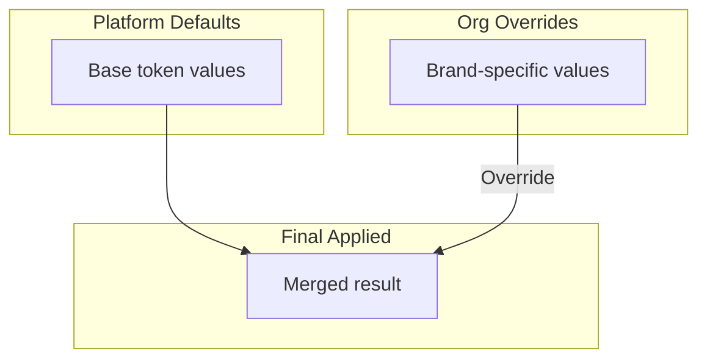
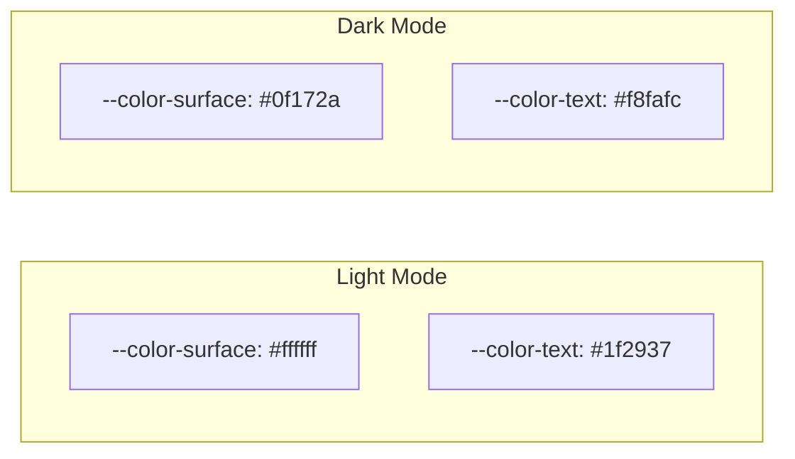
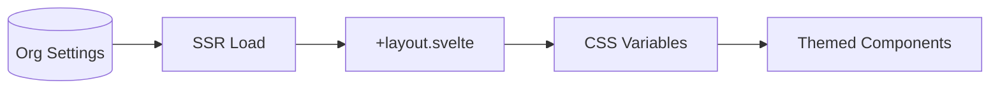
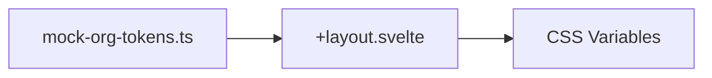
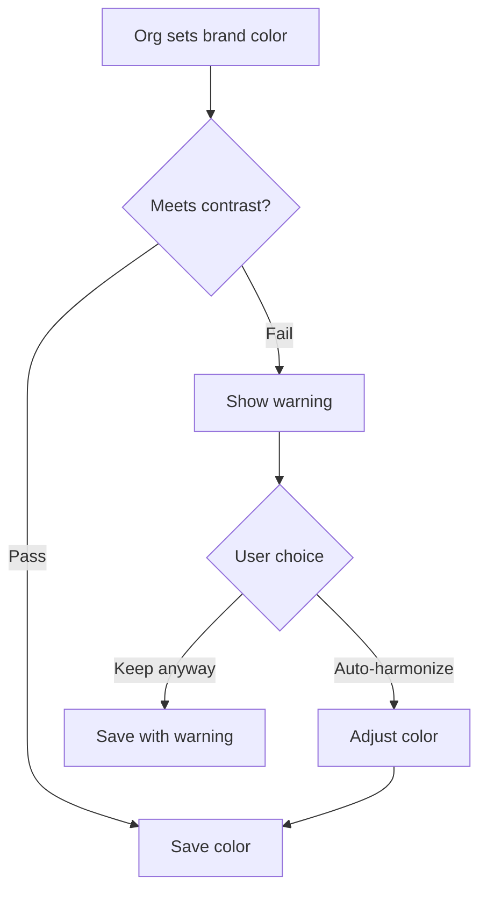
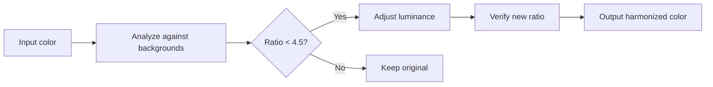
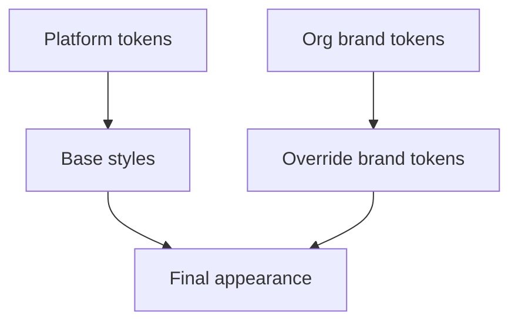

# Styling & Theming

**Status**: Design
**Last Updated**: 2026-01-10

---

## Approach

Styling uses **vanilla CSS** with **design tokens** as CSS custom properties. No Tailwind or CSS-in-JS.

### Why This Approach

| Consideration | Decision |
|---------------|----------|
| Org branding | CSS custom properties enable runtime theming |
| SSR compatibility | No build-time theme compilation needed |
| Dark mode | CSS variables switch instantly |
| Simplicity | Standard CSS, no framework lock-in |
| Performance | No runtime CSS generation |

---

## Design Token Architecture

Tokens are organized in three tiers:

```mermaid
graph TD
    subgraph "Tier 1: Primitives"
        P1[--color-blue-500: #3b82f6]
        P2[--space-4: 1rem]
        P3[--font-sans: 'Inter']
    end

    subgraph "Tier 2: Semantic"
        S1[--color-interactive: var(--color-blue-500)]
        S2[--spacing-md: var(--space-4)]
        S3[--font-body: var(--font-sans)]
    end

    subgraph "Tier 3: Component"
        C1[--button-bg: var(--color-interactive)]
        C2[--card-padding: var(--spacing-md)]
    end

    P1 --> S1 --> C1
    P2 --> S2 --> C2
    P3 --> S3
```

### Tier Purposes

| Tier | Purpose | Example |
|------|---------|---------|
| Primitives | Raw values | `--color-blue-500`, `--space-4` |
| Semantic | Meaning-based aliases | `--color-interactive`, `--color-surface` |
| Component | Component-specific slots | `--button-bg`, `--card-border` |

**Key insight**: Theme changes only modify primitives. Semantic and component tokens reference primitives, so changes cascade automatically.

---

## Token Inheritance

Org tokens override platform defaults with automatic fallback.



### Fallback Behavior

| Scenario | Result |
|----------|--------|
| Org sets `--brand-primary` | Org value used |
| Org doesn't set `--color-warning` | Platform default used |
| Org sets invalid value | Platform default used |

All semantic tokens have platform defaults. Orgs can override any token, but missing overrides gracefully fall back.

---

## Token Categories

### Colors

| Category | Tokens |
|----------|--------|
| Brand | `--color-brand-*` (primary, shades) |
| Surface | `--color-surface-*` (backgrounds) |
| Text | `--color-text-*` (primary, secondary, muted) |
| Border | `--color-border-*` (default, strong) |
| Status | `--color-success`, `--color-error`, `--color-warning` |
| Interactive | `--color-interactive`, `--color-interactive-hover` |

### Spacing

| Token | Value | Use |
|-------|-------|-----|
| `--space-1` | 0.25rem | Tight spacing |
| `--space-2` | 0.5rem | Small gaps |
| `--space-4` | 1rem | Default spacing |
| `--space-6` | 1.5rem | Section spacing |
| `--space-8` | 2rem | Large spacing |

### Typography

| Token | Purpose |
|-------|---------|
| `--font-sans` | Body text |
| `--font-mono` | Code |
| `--text-xs` through `--text-4xl` | Font sizes |
| `--leading-tight`, `--leading-normal` | Line heights |
| `--font-normal`, `--font-medium`, `--font-bold` | Weights |

### Borders & Radius

| Token | Value | Use |
|-------|-------|-----|
| `--radius-sm` | 0.25rem | Buttons, inputs |
| `--radius-md` | 0.5rem | Cards |
| `--radius-lg` | 1rem | Modals |
| `--radius-full` | 9999px | Pills, avatars |
| `--border-width` | 1px | Default borders |

### Shadows

| Token | Use |
|-------|-----|
| `--shadow-sm` | Subtle elevation |
| `--shadow-md` | Cards |
| `--shadow-lg` | Dropdowns, modals |

### Z-Index

| Token | Value | Use |
|-------|-------|-----|
| `--z-dropdown` | 1000 | Dropdowns |
| `--z-modal` | 1100 | Modals |
| `--z-toast` | 1200 | Toast notifications |

---

## Dark Mode

Dark mode swaps primitive tokens:



### Implementation

Dark mode is applied via a class on `<html>`:

| State | Class | Tokens |
|-------|-------|--------|
| Light | (default) | Light primitives |
| Dark | `.dark` | Dark primitives |

### Mode Detection

| Priority | Source |
|----------|--------|
| 1 | User preference (localStorage) |
| 2 | System preference (`prefers-color-scheme`) |
| 3 | Default (light) |

Dark mode preference is **global** - applies across all subdomains and contexts.

---

## Organization Branding

Organizations customize their space appearance via brand tokens.

### Brand Token Flow



### Brandable Tokens

| Token | Description | Default |
|-------|-------------|---------|
| `--brand-primary` | Primary brand color | Platform default |
| `--brand-primary-hover` | Hover state | Derived |
| `--brand-accent` | Secondary accent | Platform default |
| `--brand-surface` | Background tint | White |
| `--brand-logo` | Logo URL | None |

### Mock Implementation (Phase 1)

For Phase 1, brand tokens are mocked since we have a single org:



The mock file exports token values that will later come from database.

**File location**: `$lib/theme/mock-org-tokens.ts`

### SSR Compatibility

Brand tokens are applied during SSR:

1. Server load fetches (or mocks) org brand settings
2. Layout component applies tokens to wrapper element
3. HTML renders with correct brand colors
4. No flash of unstyled content

---

## Accessibility & Contrast

Platform enforces accessibility standards for all brand colors.

### Contrast Requirements (WCAG AA)

| Text Type | Minimum Ratio |
|-----------|---------------|
| Normal text (<18px) | 4.5:1 |
| Large text (18px+ or 14px+ bold) | 3:1 |
| UI components & graphics | 3:1 |

### Contrast Checking System

When orgs configure brand colors, the system validates contrast:



### Contrast Check Results

| Result | UI Treatment |
|--------|--------------|
| Pass (4.5:1+) | Green checkmark, no message |
| Warning (3:1 - 4.5:1) | Yellow warning, "May have readability issues" |
| Fail (<3:1) | Red error, "Does not meet accessibility standards" |

### Auto-Harmonize Feature

When colors fail contrast, users can enable "Auto-harmonize" which adjusts the color to meet requirements:

| Original Color | Background | Issue | Harmonized |
|----------------|------------|-------|------------|
| Light blue on white | #ffffff | 2.1:1 ratio | Darkened to 4.5:1 |
| Dark gray on black | #0f172a | 1.8:1 ratio | Lightened to 4.5:1 |

**How it works:**



The algorithm:
1. Calculate contrast ratio against target backgrounds (surface, text)
2. If below threshold, adjust luminance (darken or lighten)
3. Preserve hue and saturation where possible
4. Verify adjusted color meets requirements

### Contrast Pairs to Check

| Foreground Token | Background Token | Minimum |
|------------------|------------------|---------|
| `--brand-primary` | `--color-surface` | 4.5:1 |
| `--color-text-primary` | `--color-surface` | 4.5:1 |
| `--color-text-secondary` | `--color-surface` | 4.5:1 |
| `--color-interactive` | `--color-surface` | 4.5:1 |
| `--brand-primary` | `--color-surface-dark` | 4.5:1 (dark mode) |

---

## CSS Organization

### File Structure

```
$lib/theme/
├── tokens/
│   ├── primitives.css     # Raw color, spacing values
│   ├── semantic.css       # Meaning-based aliases
│   ├── components.css     # Component-specific tokens
│   └── dark.css           # Dark mode overrides
├── base.css               # Reset, defaults
├── utilities.css          # Common utility patterns
├── contrast.ts            # Contrast checking utilities
└── mock-org-tokens.ts     # Mocked brand tokens (Phase 1)
```

### Import Order

1. **Reset**: Normalize browser defaults
2. **Primitives**: Raw token values
3. **Semantic**: Meaning-based token aliases
4. **Components**: Component-specific tokens
5. **Dark**: Dark mode primitive overrides
6. **Base**: Default element styles

### Component Styles

Components have co-located CSS:

```
$lib/components/ContentCard/
├── ContentCard.svelte
└── styles.css (optional, can be in <style>)
```

---

## Focus States

All interactive elements have visible focus:

| State | Treatment |
|-------|-----------|
| Focus | Outline or ring |
| Focus-visible | Only show for keyboard navigation |

Focus styles use `--color-focus` token (typically brand primary or a high-contrast alternative).

```css
:focus-visible {
  outline: 2px solid var(--color-focus);
  outline-offset: 2px;
}
```

---

## Reduced Motion

Respect user preference:

| Preference | Behavior |
|------------|----------|
| Normal | Animations enabled |
| Reduced | Animations disabled/minimized |

```css
@media (prefers-reduced-motion: reduce) {
  * {
    animation-duration: 0.01ms !important;
    transition-duration: 0.01ms !important;
  }
}
```

---

## Responsive Design

### Breakpoints

| Name | Width | Target |
|------|-------|--------|
| `sm` | 640px | Large phones |
| `md` | 768px | Tablets |
| `lg` | 1024px | Laptops |
| `xl` | 1280px | Desktops |

### Mobile-First

Styles are mobile-first. Media queries add complexity for larger screens, not remove for smaller.

### Container

Content has a max-width with horizontal padding:

| Context | Max Width |
|---------|-----------|
| Content pages | 1280px |
| Studio | Full width with sidebar |
| Marketing | 1440px |

---

## Component Styling Patterns

### Using Tokens

Components reference semantic tokens, not primitives:

| Do | Don't |
|----|-------|
| `var(--color-interactive)` | `var(--color-blue-500)` |
| `var(--spacing-md)` | `var(--space-4)` |

This allows theming to work correctly.

### State Styles

| State | Token Pattern |
|-------|---------------|
| Default | `--color-*` |
| Hover | `--color-*-hover` |
| Active | `--color-*-active` |
| Disabled | `opacity: 0.5` |
| Focus | `outline: var(--focus-ring)` |

### Variant Patterns

Components with variants use data attributes:

| Variant | Selector |
|---------|----------|
| Primary | `[data-variant="primary"]` |
| Secondary | `[data-variant="secondary"]` |
| Destructive | `[data-variant="destructive"]` |

---

## Context-Specific Styling

### Platform Context

Uses platform default tokens only. No org branding.

### Organization Context

Applies org brand tokens on top of platform defaults:



### Creator Context

Creator pages use platform tokens (no personal branding in Phase 1).

Future: Creators may have limited branding options for their profile pages.

---

## Related Documents

- [COMPONENTS.md](./COMPONENTS.md) - How components use tokens
- [OVERVIEW.md](./OVERVIEW.md) - Tech stack decisions
