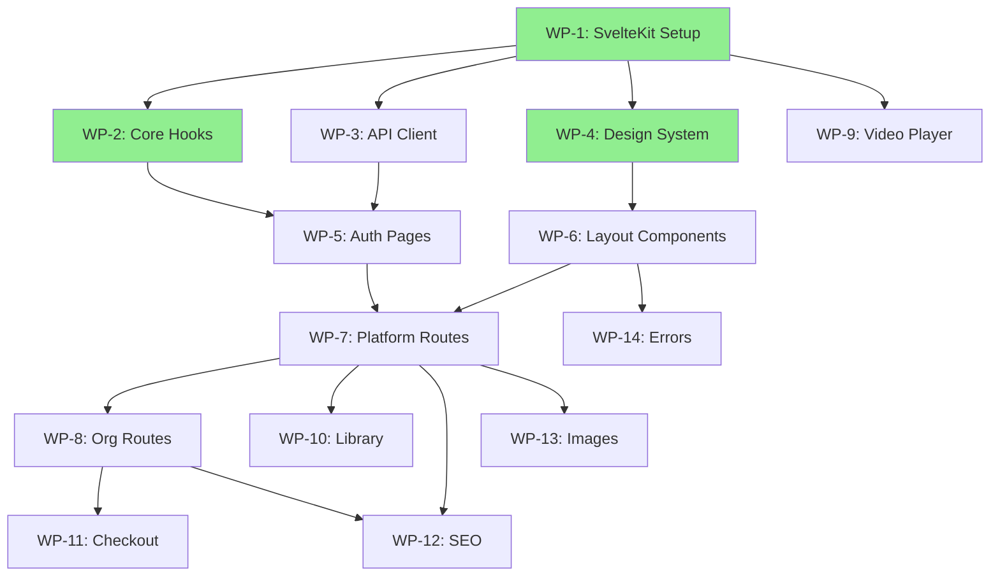

# Codex Frontend - Work Packets (WP)

**Status**: Implementation In Progress
**Created**: 2026-01-11
**Last Updated**: 2026-01-17
**Total Work Packets**: 14

---

## Executive Summary

This document contains all 14 Work Packets (WP-1 through WP-14) for the Codex Frontend implementation. Each work packet represents a discrete unit of work with clear acceptance criteria, technical specifications, and effort estimates.

### Status Overview

| Status | Count | Work Packets |
|--------|-------|--------------|
| ✅ Closed | 3 | WP-1, WP-2, WP-4 |
| 🚧 Open | 11 | WP-3, WP-5, WP-6, WP-7, WP-8, WP-9, WP-10, WP-11, WP-12, WP-13, WP-14 |

### Priority Distribution

| Priority | Count | Work Packets |
|----------|-------|--------------|
| P1 (Critical) | 5 | WP-1, WP-2, WP-3, WP-5, WP-7, WP-8 |
| P2 (High) | 6 | WP-4, WP-6, WP-9, WP-10, WP-11, WP-12 |
| P3 (Medium) | 2 | WP-13, WP-14 |

### Effort Estimates

| Size | Hours | Count | Work Packets |
|------|-------|-------|--------------|
| Small (S) | 2-5h | 4 | WP-1, WP-3, WP-12, WP-13, WP-14 |
| Medium (M) | 6-10h | 5 | WP-2, WP-4, WP-5, WP-6, WP-10, WP-11 |
| Large (L) | 12-20h | 3 | WP-7, WP-8, WP-9 |

**Total Estimated Effort**: 110-180 hours

---

## Dependency Graph



---

## Work Packet Details

---

## WP-1: SvelteKit Project Setup

**Issue ID**: Codex-d2y
**Status**: ✅ Closed
**Priority**: P1 (Critical)
**Effort**: Small (S) - 2-4 hours
**Dependencies**: None (Foundation)
**Blocks**: WP-2, WP-3, WP-4, WP-9

### Objective

Scaffold a new SvelteKit application configured for Cloudflare Workers deployment with all required tooling.

### Acceptance Criteria

- [x] SvelteKit 2.x project initialized with TypeScript
- [x] `@sveltejs/adapter-cloudflare` configured
- [x] `wrangler.jsonc` with dev/staging/production environments
- [x] Environment variables configured (`PUBLIC_AUTH_URL`, `PUBLIC_CONTENT_API_URL`, `PUBLIC_ORG_API_URL`, `PUBLIC_ECOM_API_URL`)
- [x] Svelte 5 runes enabled
- [x] Basic `app.html` template with `%sveltekit.head%` and `%sveltekit.body%`
- [x] `app.d.ts` with `App.Locals` types (user, session, organization)
- [x] ESLint + Prettier configured
- [x] `pnpm dev` runs successfully on localhost:5173

### Technical Notes

- Use `pnpm create svelte@latest` with TypeScript, ESLint, Prettier options
- Add `@codex/validation` and `@codex/shared-types` as workspace dependencies
- Configure `svelte.config.js` for Cloudflare adapter
- Set up `.env.local` for local development pointing to localhost worker ports

### File Structure

```
apps/web/
├── src/
│   ├── app.html
│   ├── app.d.ts
│   ├── routes/
│   └── lib/
├── static/
├── svelte.config.js
├── wrangler.jsonc
├── package.json
└── tsconfig.json
```

### Implementation Status

**Completed**: 2026-01-17

All acceptance criteria met. SvelteKit project scaffolded with:
- Svelte 5 runes fully enabled
- All 22 UI components migrated to Svelte 5
- Storybook integration complete
- Design system tokens implemented

---

## WP-2: Core Hooks (Session & Subdomain Routing)

**Issue ID**: Codex-6x3
**Status**: ✅ Closed
**Priority**: P1 (Critical)
**Effort**: Medium (M) - 4-8 hours
**Dependencies**: WP-1
**Blocks**: WP-5

### Objective

Implement SvelteKit hooks for session validation and subdomain-based routing.

### Acceptance Criteria

- [x] `hooks.ts` with `reroute` function that maps subdomains to route groups
- [x] `hooks.server.ts` with `handle` function for session validation
- [x] Session cookie (`codex-session`) extracted and validated against auth worker
- [x] `event.locals.user` and `event.locals.session` populated when authenticated
- [x] `event.locals.organization` populated when on org subdomain
- [x] Subdomain detection works for: platform root, `www`, `creators`, org slugs
- [x] Reserved subdomains (`auth`, `content-api`, etc.) not treated as orgs
- [x] Local development works with `localhost:5173`

### Technical Implementation

#### hooks.ts (reroute)

```typescript
export const reroute: Reroute = ({ url }) => {
  const host = url.hostname;
  const baseDomain = 'revelations.studio'; // from env in production

  // Platform root or www
  if (host === baseDomain || host === `www.${baseDomain}` || host === 'localhost') {
    return url.pathname;
  }

  // Creator subdomain: creators.revelations.studio
  if (host.startsWith('creators.')) {
    return url.pathname; // Routes to /(creators)/...
  }

  // Org subdomain: {slug}.revelations.studio
  const subdomain = host.split('.')[0];
  if (!isReservedSubdomain(subdomain)) {
    return `/${subdomain}${url.pathname}`; // Routes to /(org)/[slug]/...
  }

  return url.pathname;
};
```

#### hooks.server.ts (handle)

```typescript
export const handle: Handle = async ({ event, resolve }) => {
  const sessionCookie = event.cookies.get('codex-session');

  // Validate session with auth worker
  if (sessionCookie) {
    const res = await fetch(`${PUBLIC_AUTH_URL}/api/auth/session`, {
      headers: { Cookie: `codex-session=${sessionCookie}` }
    });
    if (res.ok) {
      const { user, session } = await res.json();
      event.locals.user = user;
      event.locals.session = session;
    }
  }

  // Resolve org from subdomain
  const subdomain = extractSubdomain(event.url.hostname);
  if (subdomain && !isReserved(subdomain) && event.locals.user) {
    const orgRes = await fetch(`${PUBLIC_ORG_API_URL}/api/organizations/slug/${subdomain}`, {
      headers: { Cookie: `codex-session=${sessionCookie}` }
    });
    if (orgRes.ok) {
      event.locals.organization = (await orgRes.json()).data;
    }
  }

  return resolve(event);
};
```

### Files to Create/Modify

- `src/hooks.ts` - reroute function
- `src/hooks.server.ts` - handle function
- `src/app.d.ts` - update App.Locals interface
- `src/lib/server/subdomain.ts` - helper functions

### Testing

- Verify session validation with valid/invalid/expired cookies
- Verify subdomain routing for all contexts
- Verify reserved subdomain handling

### Implementation Status

**Completed**: 2026-01-13

Core hooks implemented with subdomain routing and session validation working.

---

## WP-3: API Client Layer

**Issue ID**: Codex-vbr
**Status**: 🚧 Open
**Priority**: P1 (Critical)
**Effort**: Small (S) - 2-4 hours
**Dependencies**: WP-1
**Blocks**: WP-5

### Objective

Create type-safe API client utilities for both server-side and client-side data fetching.

### Acceptance Criteria

- [ ] Server-side API client that forwards session cookies
- [ ] Client-side API client with `credentials: 'include'`
- [ ] Typed responses using `@codex/shared-types`
- [ ] Consistent error handling with `ApiError` class
- [ ] Helper functions for common endpoints (auth, content, org, access)
- [ ] 204 No Content responses handled correctly

### Technical Implementation

#### Server API Client (`$lib/server/api.ts`)

```typescript
import type { Cookies } from '@sveltejs/kit';
import { PUBLIC_AUTH_URL, PUBLIC_CONTENT_API_URL, PUBLIC_ORG_API_URL, PUBLIC_ECOM_API_URL } from '$env/static/public';

const workers = {
  auth: PUBLIC_AUTH_URL,
  content: PUBLIC_CONTENT_API_URL,
  org: PUBLIC_ORG_API_URL,
  ecom: PUBLIC_ECOM_API_URL
} as const;

export function createServerApi(cookies: Cookies) {
  const sessionCookie = cookies.get('codex-session');
  const headers: HeadersInit = sessionCookie
    ? { Cookie: `codex-session=${sessionCookie}` }
    : {};

  async function request<T>(worker: keyof typeof workers, path: string, options?: RequestInit): Promise<T> {
    const url = `${workers[worker]}${path}`;
    const res = await fetch(url, { ...options, headers: { ...headers, ...options?.headers } });

    if (!res.ok) {
      const error = await res.json().catch(() => ({ message: 'Request failed' }));
      throw new ApiError(res.status, error);
    }

    if (res.status === 204) return null as T;
    return res.json();
  }

  return {
    auth: {
      getSession: () => request('auth', '/api/auth/session'),
    },
    content: {
      get: (id: string) => request('content', `/api/content/${id}`),
      list: (params?: URLSearchParams) => request('content', `/api/content?${params}`),
    },
    access: {
      getStreamingUrl: (contentId: string) => request('content', `/api/access/content/${contentId}/stream`),
      getProgress: (contentId: string) => request('content', `/api/access/content/${contentId}/progress`),
      saveProgress: (contentId: string, data: ProgressData) =>
        request('content', `/api/access/content/${contentId}/progress`, { method: 'POST', body: JSON.stringify(data) }),
      getUserLibrary: () => request('content', '/api/access/user/library'),
    },
    org: {
      getBySlug: (slug: string) => request('org', `/api/organizations/slug/${slug}`),
      getSettings: (id: string) => request('org', `/api/organizations/${id}/settings`),
    },
    checkout: {
      create: (contentId: string) => request('ecom', '/checkout/create', {
        method: 'POST',
        body: JSON.stringify({ contentId })
      }),
    }
  };
}
```

#### Client API (`$lib/api/client.ts`)

```typescript
export class ApiError extends Error {
  constructor(public status: number, public data: unknown) {
    super(`API Error: ${status}`);
  }
}

export async function api<T>(path: string, options: RequestInit = {}): Promise<T> {
  const res = await fetch(path, {
    ...options,
    credentials: 'include',
    headers: {
      'Content-Type': 'application/json',
      ...options.headers
    }
  });

  if (!res.ok) {
    throw new ApiError(res.status, await res.json().catch(() => null));
  }

  if (res.status === 204) return null as T;
  return res.json();
}
```

### Files to Create

- `$lib/server/api.ts` - Server-side API client
- `$lib/api/client.ts` - Client-side API helper
- `$lib/api/errors.ts` - ApiError class
- `$lib/api/types.ts` - Re-export types from @codex/shared-types

---

## WP-4: Design System (Tokens & Base CSS)

**Issue ID**: Codex-09l
**Status**: ✅ Closed
**Priority**: P2 (High)
**Effort**: Medium (M) - 6-8 hours
**Dependencies**: WP-1
**Blocks**: WP-6

### Objective

Implement the three-tier design token system with CSS custom properties, dark mode support, and base styles.

### Acceptance Criteria

- [x] Primitive tokens (colors, spacing, typography, borders, shadows)
- [x] Semantic tokens (surface, text, interactive, status colors)
- [x] Component tokens (button, card, input specific)
- [x] Dark mode via `.dark` class on `<html>`
- [x] Dark mode toggle persisted to localStorage
- [x] System preference detection (`prefers-color-scheme`)
- [x] CSS reset/normalize applied
- [x] Focus states with `--color-focus` token
- [x] `prefers-reduced-motion` respected
- [x] Organization brand token overrides work

### Token Structure

#### Tier 1: Primitives (`primitives.css`)

```css
:root {
  /* Colors */
  --color-gray-50: #f9fafb;
  --color-gray-900: #111827;
  --color-blue-500: #3b82f6;
  /* ... */

  /* Spacing */
  --space-1: 0.25rem;
  --space-2: 0.5rem;
  --space-4: 1rem;
  /* ... */

  /* Typography */
  --font-sans: 'Inter', system-ui, sans-serif;
  --text-sm: 0.875rem;
  --text-base: 1rem;
  /* ... */
}
```

#### Tier 2: Semantic (`semantic.css`)

```css
:root {
  --color-surface: var(--color-white);
  --color-surface-secondary: var(--color-gray-50);
  --color-text-primary: var(--color-gray-900);
  --color-text-secondary: var(--color-gray-600);
  --color-interactive: var(--color-blue-500);
  --color-interactive-hover: var(--color-blue-600);
  --color-border: var(--color-gray-200);
  --color-focus: var(--color-blue-500);
}

.dark {
  --color-surface: var(--color-gray-900);
  --color-surface-secondary: var(--color-gray-800);
  --color-text-primary: var(--color-gray-50);
  --color-text-secondary: var(--color-gray-400);
  --color-border: var(--color-gray-700);
}
```

#### Tier 3: Component (`components.css`)

```css
:root {
  --button-bg: var(--color-interactive);
  --button-text: var(--color-white);
  --card-bg: var(--color-surface);
  --card-border: var(--color-border);
  --input-bg: var(--color-surface);
  --input-border: var(--color-border);
}
```

### Dark Mode Toggle

```typescript
// $lib/theme/dark-mode.svelte.ts
let isDark = $state(false);

export function initDarkMode() {
  // Check localStorage first, then system preference
  const stored = localStorage.getItem('theme');
  if (stored) {
    isDark = stored === 'dark';
  } else {
    isDark = window.matchMedia('(prefers-color-scheme: dark)').matches;
  }
  applyTheme();
}

export function toggleDarkMode() {
  isDark = !isDark;
  localStorage.setItem('theme', isDark ? 'dark' : 'light');
  applyTheme();
}

function applyTheme() {
  document.documentElement.classList.toggle('dark', isDark);
}
```

### File Structure

```
$lib/theme/
├── tokens/
│   ├── primitives.css
│   ├── semantic.css
│   ├── components.css
│   └── dark.css
├── base.css (reset + defaults)
├── utilities.css
├── dark-mode.svelte.ts
└── index.css (imports all)
```

### Implementation Status

**Completed**: 2026-01-17

Complete 3-tier CSS token system implemented with:
- **Primary Color**: Terracotta (#e07850) - Warmth-first aesthetic
- **Accent**: Amber (#f59e0b)
- **Neutrals**: Warm grays (neutral-*) and cool slates (slate-*)
- **Typography**: Inter (sans-serif), JetBrains Mono (monospace)
- **Dark Mode**: Applied via .dark class with complete token overrides

See `design/frontend/STYLING.md` for full documentation.

---

## WP-5: Auth Pages (Login, Register, Password Reset)

**Issue ID**: Codex-4np
**Status**: ✅ Closed
**Priority**: P1 (Critical)
**Effort**: Medium (M) - 6-8 hours
**Dependencies**: WP-2, WP-3
**Blocks**: WP-7

### Objective

Implement authentication pages with progressive enhancement using SvelteKit form actions.

### Acceptance Criteria

- [x] Login page (`/login`) with email/password form
- [x] Register page (`/register`) with name/email/password
- [x] Forgot password page (`/forgot-password`)
- [x] Reset password page (`/reset-password?token=...`)
- [x] Email verification page (`/verify-email?token=...`)
- [x] All forms work without JavaScript (progressive enhancement)
- [x] Inline validation errors displayed
- [x] Rate limit errors handled gracefully
- [x] `?redirect=` parameter respected after auth
- [x] Loading states during submission

### Routes Structure

```
src/routes/(auth)/
├── login/
│   ├── +page.svelte
│   └── +page.server.ts
├── register/
│   ├── +page.svelte
│   └── +page.server.ts
├── forgot-password/
│   ├── +page.svelte
│   └── +page.server.ts
├── reset-password/
│   ├── +page.svelte
│   └── +page.server.ts
└── verify-email/
    └── +page.server.ts (redirect only)
```

### Form Action Pattern

```typescript
// +page.server.ts
import { fail, redirect } from '@sveltejs/kit';
import { createServerApi } from '$lib/server/api';

export const actions = {
  default: async ({ request, cookies, url }) => {
    const formData = await request.formData();
    const email = formData.get('email') as string;
    const password = formData.get('password') as string;

    // Validate
    if (!email || !password) {
      return fail(400, { email, error: 'Email and password required' });
    }

    // Call auth worker
    const res = await fetch(`${PUBLIC_AUTH_URL}/api/auth/email/login`, {
      method: 'POST',
      headers: { 'Content-Type': 'application/json' },
      body: JSON.stringify({ email, password })
    });

    if (!res.ok) {
      const error = await res.json();
      if (res.status === 429) {
        return fail(429, { email, error: 'Too many attempts. Please wait 15 minutes.' });
      }
      return fail(400, { email, error: error.message || 'Invalid credentials' });
    }

    // Extract and set cookie
    const setCookie = res.headers.get('set-cookie');
    if (setCookie) {
      // Parse and set cookie via SvelteKit
      cookies.set('codex-session', extractCookieValue(setCookie), {
        path: '/',
        httpOnly: true,
        secure: true,
        sameSite: 'strict'
      });
    }

    // Redirect
    const redirectTo = url.searchParams.get('redirect') || '/';
    throw redirect(303, redirectTo);
  }
};
```

### Form Component Pattern

```svelte
<!-- +page.svelte -->
<script>
  import { enhance } from '$app/forms';
  let { form } = $props();
  let loading = $state(false);
</script>

<form method="POST" use:enhance={() => {
  loading = true;
  return async ({ update }) => {
    loading = false;
    await update();
  };
}}>
  <input type="email" name="email" value={form?.email ?? ''} required />

  {#if form?.error}
    <p class="error">{form.error}</p>
  {/if}

  <input type="password" name="password" required />

  <button type="submit" disabled={loading}>
    {loading ? 'Signing in...' : 'Sign In'}
  </button>
</form>
```

### Page Layouts

- Clean, centered card layout
- Platform logo at top
- Link to alternative action (Login ↔ Register)
- "Forgot password?" link on login page

### Implementation Status

**Completed**: 2026-01-13

Auth pages complete: Login, Register, Forgot Password, Reset Password, Verify Email implemented.

---

## WP-6: Layout Components (Header, Footer, Sidebar)

**Issue ID**: Codex-d2m
**Status**: 🚧 Open
**Priority**: P2 (High)
**Effort**: Medium (M) - 6-8 hours
**Dependencies**: WP-4
**Blocks**: WP-7, WP-14

### Objective

Build the core layout components that provide consistent structure across all pages.

### Acceptance Criteria

- [ ] `Header` component with context-aware variants (platform, org, studio)
- [ ] `Footer` component with links and copyright
- [ ] `StudioSidebar` component with role-based navigation
- [ ] `PageContainer` component with max-width and padding
- [ ] Mobile-responsive header with hamburger menu
- [ ] Dark mode toggle in header
- [ ] User menu dropdown (avatar, name, logout)
- [ ] Studio switcher in sidebar (personal + org contexts)

### Header Variants

#### Platform Header

- Logo (links to /)
- Platform nav: Discover, Pricing
- Library link (always → platform /library)
- User menu OR Sign In/Register buttons

#### Org Space Header

- Org logo (links to org root)
- Nav: Explore, Creators
- Library link (→ platform /library)
- User menu OR Sign In

#### Studio Header

- Context logo (org or personal)
- Studio switcher dropdown
- User menu

### StudioSidebar

```svelte
<script>
  let { role, context } = $props(); // context: 'personal' | 'org'
</script>

<aside class="studio-sidebar">
  <nav>
    <a href="/studio">Dashboard</a>
    <a href="/studio/content">Content</a>
    <a href="/studio/media">Media</a>
    <a href="/studio/analytics">Analytics</a>

    {#if role === 'admin' || role === 'owner'}
      <hr />
      <a href="/studio/team">Team</a>
      <a href="/studio/customers">Customers</a>
      <a href="/studio/settings">Settings</a>
    {/if}

    {#if role === 'owner'}
      <a href="/studio/billing">Billing</a>
    {/if}
  </nav>
</aside>
```

### Component Structure

```
$lib/components/layout/
├── Header/
│   ├── Header.svelte
│   ├── PlatformHeader.svelte
│   ├── OrgHeader.svelte
│   ├── StudioHeader.svelte
│   ├── UserMenu.svelte
│   └── MobileNav.svelte
├── Footer/
│   └── Footer.svelte
├── StudioSidebar/
│   ├── StudioSidebar.svelte
│   └── StudioSwitcher.svelte
└── PageContainer/
    └── PageContainer.svelte
```

### Layout Files

```
src/routes/
├── +layout.svelte (root - dark mode init)
├── (platform)/
│   └── +layout.svelte (PlatformHeader + Footer)
├── (org)/[slug]/
│   ├── (space)/
│   │   └── +layout.svelte (OrgHeader + Footer)
│   └── studio/
│       └── +layout.svelte (StudioHeader + Sidebar)
└── (creators)/
    └── +layout.svelte (CreatorHeader + Footer)
```

---

## WP-7: Platform Routes (Landing, Discover, Account)

**Issue ID**: Codex-9ij
**Status**: 🚧 Open
**Priority**: P1 (Critical)
**Effort**: Large (L) - 10-16 hours
**Dependencies**: WP-5, WP-6
**Blocks**: WP-8, WP-10, WP-12, WP-13

### Objective

Implement the platform-level routes that users access on the root domain.

### Acceptance Criteria

- [ ] Landing page (`/`) with marketing content
- [ ] Discover page (`/discover`) with org/creator search
- [ ] About page (`/about`)
- [ ] Pricing page (`/pricing`) - can be placeholder
- [ ] Account page (`/account`) with profile settings
- [ ] Account payment page (`/account/payment`)
- [ ] Account notifications page (`/account/notifications`)
- [ ] All pages have proper SEO meta tags
- [ ] Authenticated routes redirect to login if not authenticated

### Routes Structure

```
src/routes/(platform)/
├── +page.svelte               # Landing
├── +layout.svelte             # Platform layout
├── +layout.server.ts          # Load user for nav
├── about/
│   └── +page.svelte
├── pricing/
│   └── +page.svelte
├── discover/
│   ├── +page.svelte
│   └── +page.server.ts        # Load orgs/creators
└── account/
    ├── +layout.svelte         # Auth guard
    ├── +layout.server.ts      # Require auth
    ├── +page.svelte           # Profile settings
    ├── payment/
    │   └── +page.svelte
    └── notifications/
        └── +page.svelte
```

### Landing Page Sections

- Hero: Value proposition for creators
- Features: What Codex offers
- How it works: Simple steps
- CTA: Create your space / Sign up

### Discover Page

- Search bar (org name, creator name)
- Featured orgs grid
- Featured creators grid
- Categories (future)

### Account Pages

- Profile: Name, email, avatar
- Payment: Saved cards, billing history (read from Stripe)
- Notifications: Email preferences

### Auth Guard Pattern

```typescript
// +layout.server.ts
import { redirect } from '@sveltejs/kit';

export async function load({ locals }) {
  if (!locals.user) {
    throw redirect(303, '/login?redirect=/account');
  }
  return { user: locals.user };
}
```

### SEO Pattern

```typescript
// +page.server.ts
export async function load() {
  return {
    seo: {
      title: 'Discover Creators & Organizations | Codex',
      description: 'Find amazing content creators and organizations on Codex.',
    }
  };
}
```

---

## WP-8: Organization Routes (Space & Content Pages)

**Issue ID**: Codex-nib
**Status**: 🚧 Open
**Priority**: P1 (Critical)
**Effort**: Large (L) - 12-20 hours
**Dependencies**: WP-7
**Blocks**: WP-11, WP-12

### Objective

Implement organization subdomain routes for public space and content viewing.

### Acceptance Criteria

- [ ] Org landing page (`/` on subdomain) with branding
- [ ] Explore page (`/explore`) with content grid
- [ ] Content detail page (`/content/{slug}`) with player/preview
- [ ] Creators directory (`/creators`) for org
- [ ] Org branding tokens applied (logo, primary color)
- [ ] Content page shows preview for unpurchased, full player for purchased
- [ ] Purchase CTA for paid content
- [ ] SEO meta tags for all pages
- [ ] 404 handling for non-existent org slugs

### Routes Structure

```
src/routes/(org)/[slug]/
├── +layout.svelte             # Org layout with branding
├── +layout.server.ts          # Load org data
├── (space)/
│   ├── +page.svelte           # Org landing
│   ├── explore/
│   │   ├── +page.svelte       # Content grid
│   │   └── +page.server.ts    # Load content list
│   ├── content/[contentSlug]/
│   │   ├── +page.svelte       # Content detail + player
│   │   └── +page.server.ts    # Load content, check access
│   └── creators/
│       ├── +page.svelte       # Creator directory
│       └── +page.server.ts    # Load org creators
└── studio/
    └── ... (WP-11)
```

### Org Layout with Branding

```typescript
// +layout.server.ts
export async function load({ locals, params }) {
  const api = createServerApi(locals.cookies);

  // Org already loaded in hooks.server.ts
  const org = locals.organization;
  if (!org) {
    throw error(404, 'Organization not found');
  }

  // Load branding settings
  let branding = { primaryColorHex: '#000000', logoUrl: null };
  if (locals.user) {
    try {
      const settings = await api.org.getSettings(org.id);
      branding = settings.branding;
    } catch (e) {
      // Use defaults if settings fail
    }
  }

  return { org, branding };
}
```

```svelte
<!-- +layout.svelte -->
<script>
  let { data, children } = $props();
</script>

<div style="--brand-primary: {data.branding.primaryColorHex}">
  <OrgHeader org={data.org} />
  {@render children()}
  <Footer />
</div>
```

### Content Detail Page States

```svelte
<script>
  let { data } = $props();
  const { content, hasAccess, streamingUrl, progress } = data;
</script>

{#if hasAccess}
  <VideoPlayer
    src={streamingUrl}
    initialProgress={progress?.positionSeconds ?? 0}
    contentId={content.id}
  />
{:else}
  <PreviewPlayer
    previewUrl={content.previewUrl}
    thumbnailUrl={content.thumbnailUrl}
  />
  <PurchaseCTA content={content} />
{/if}

<ContentInfo content={content} />
```

---

## WP-9: Video Player Component

**Issue ID**: Codex-9d7
**Status**: 🚧 Open
**Priority**: P2 (High)
**Effort**: Large (L) - 12-16 hours
**Dependencies**: WP-1
**Blocks**: None

### Objective

Build a full-featured video player using Media Chrome and HLS.js with progress tracking.

### Acceptance Criteria

- [ ] HLS.js for Chrome/Firefox/Edge, native HLS for Safari
- [ ] Media Chrome for accessible, customizable controls
- [ ] Quality selector (auto + manual quality levels)
- [ ] Playback speed selector (0.5x, 1x, 1.5x, 2x)
- [ ] Volume control with mute toggle
- [ ] Fullscreen support
- [ ] Keyboard shortcuts (space=play/pause, arrows=seek, m=mute)
- [ ] Progress bar with seek capability
- [ ] Resume from saved position
- [ ] Progress saving (pause, visibility change, periodic)
- [ ] Branded styling using design tokens
- [ ] Loading state with skeleton
- [ ] Error state with retry option

### Technical Implementation

#### HLS Setup

```typescript
// $lib/components/VideoPlayer/hls.ts
import Hls from 'hls.js';

export function createHlsPlayer(video: HTMLVideoElement, src: string): Hls | null {
  // Safari: native HLS
  if (video.canPlayType('application/vnd.apple.mpegurl')) {
    video.src = src;
    return null;
  }

  // Other browsers: HLS.js
  if (Hls.isSupported()) {
    const hls = new Hls({
      enableWorker: true,
      lowLatencyMode: false,
      startLevel: -1, // Auto quality
    });

    hls.loadSource(src);
    hls.attachMedia(video);

    hls.on(Hls.Events.ERROR, (event, data) => {
      if (data.fatal) {
        switch (data.type) {
          case Hls.ErrorTypes.NETWORK_ERROR:
            hls.startLoad(); // Retry
            break;
          case Hls.ErrorTypes.MEDIA_ERROR:
            hls.recoverMediaError();
            break;
          default:
            hls.destroy();
            break;
        }
      }
    });

    return hls;
  }

  throw new Error('HLS not supported in this browser');
}
```

#### Media Chrome Integration

```svelte
<script>
  import 'media-chrome';
  import { onMount, onDestroy } from 'svelte';
  import { createHlsPlayer } from './hls';

  let { src, contentId, initialProgress = 0 } = $props();
  let videoEl: HTMLVideoElement;
  let hls: Hls | null = null;

  onMount(() => {
    hls = createHlsPlayer(videoEl, src);

    // Resume from saved position
    if (initialProgress > 0) {
      videoEl.currentTime = initialProgress;
    }
  });

  onDestroy(() => {
    hls?.destroy();
  });
</script>

<media-controller>
  <video
    bind:this={videoEl}
    slot="media"
    crossorigin="anonymous"
  ></video>

  <media-control-bar>
    <media-play-button></media-play-button>
    <media-mute-button></media-mute-button>
    <media-volume-range></media-volume-range>
    <media-time-range></media-time-range>
    <media-time-display show-duration></media-time-display>
    <media-playback-rate-button rates="0.5 1 1.5 2"></media-playback-rate-button>
    <media-fullscreen-button></media-fullscreen-button>
  </media-control-bar>
</media-controller>
```

#### Progress Tracking

```typescript
// $lib/components/VideoPlayer/progress.svelte.ts
let cachedProgress = $state({ positionSeconds: 0, durationSeconds: 0 });

export function useProgressTracking(contentId: string, video: HTMLVideoElement) {
  // Update cache every 30 seconds
  $effect(() => {
    const interval = setInterval(() => {
      if (!video.paused) {
        cachedProgress = {
          positionSeconds: Math.floor(video.currentTime),
          durationSeconds: Math.floor(video.duration),
        };
      }
    }, 30000);
    return () => clearInterval(interval);
  });

  // Save on pause
  video.addEventListener('pause', () => saveProgress(contentId));

  // Save on visibility change
  document.addEventListener('visibilitychange', () => {
    if (document.hidden) saveProgress(contentId);
  });

  // Save on unload (best effort)
  window.addEventListener('beforeunload', () => {
    navigator.sendBeacon(
      `/api/access/content/${contentId}/progress`,
      JSON.stringify(cachedProgress)
    );
  });
}

async function saveProgress(contentId: string) {
  await fetch(`/api/access/content/${contentId}/progress`, {
    method: 'POST',
    credentials: 'include',
    body: JSON.stringify(cachedProgress),
    headers: { 'Content-Type': 'application/json' }
  });
}
```

### File Structure

```
$lib/components/VideoPlayer/
├── VideoPlayer.svelte
├── hls.ts
├── progress.svelte.ts
├── quality-selector.ts
└── styles.css
```

---

## WP-10: Library Page

**Issue ID**: Codex-0vf
**Status**: 🚧 Open
**Priority**: P2 (High)
**Effort**: Medium (M) - 6-10 hours
**Dependencies**: WP-7
**Blocks**: None

### Objective

Implement the user's content library showing all purchased content with progress tracking.

### Acceptance Criteria

- [ ] Library page at `/library` (platform level)
- [ ] Shows all purchased content across all orgs
- [ ] "Continue Watching" section with in-progress content
- [ ] Search by title, creator name, org name
- [ ] Filter by: organization, content type, progress status
- [ ] Sort by: recently purchased, recently watched, alphabetical
- [ ] Content cards show progress bars
- [ ] Click navigates to content on appropriate org subdomain
- [ ] Empty state for new users
- [ ] Pagination or infinite scroll
- [ ] SEO meta tags

### Route Structure

```
src/routes/(platform)/library/
├── +page.svelte
├── +page.server.ts
└── +layout.server.ts (auth guard)
```

### Data Loading

```typescript
// +page.server.ts
export async function load({ locals, url }) {
  if (!locals.user) {
    throw redirect(303, '/login?redirect=/library');
  }

  const api = createServerApi(locals.cookies);

  // Parse query params
  const search = url.searchParams.get('search') ?? '';
  const orgFilter = url.searchParams.get('org') ?? '';
  const typeFilter = url.searchParams.get('type') ?? '';
  const progressFilter = url.searchParams.get('progress') ?? '';
  const sort = url.searchParams.get('sort') ?? 'recently_purchased';
  const page = parseInt(url.searchParams.get('page') ?? '1');

  const library = await api.access.getUserLibrary();

  // Client-side filtering (or add query params to API)
  let items = library.items;

  if (search) {
    items = items.filter(i =>
      i.content.title.toLowerCase().includes(search.toLowerCase())
    );
  }

  // Sort
  if (sort === 'recently_watched') {
    items.sort((a, b) =>
      new Date(b.progress?.updatedAt ?? 0).getTime() -
      new Date(a.progress?.updatedAt ?? 0).getTime()
    );
  }

  // Split continue watching
  const continueWatching = items.filter(i =>
    i.progress && !i.progress.completed && i.progress.positionSeconds > 0
  );

  return {
    items,
    continueWatching,
    filters: { search, orgFilter, typeFilter, progressFilter, sort },
    seo: {
      title: 'My Library | Codex',
      description: 'Your purchased content on Codex.',
    }
  };
}
```

### Page Layout

```svelte
<script>
  let { data } = $props();
</script>

<svelte:head>
  <title>{data.seo.title}</title>
</svelte:head>

<PageContainer>
  <h1>My Library</h1>

  <!-- Continue Watching -->
  {#if data.continueWatching.length > 0}
    <section>
      <h2>Continue Watching</h2>
      <ContentGrid items={data.continueWatching} showProgress />
    </section>
  {/if}

  <!-- Filters & Search -->
  <LibraryFilters filters={data.filters} />

  <!-- All Content -->
  <section>
    <h2>All Content</h2>
    {#if data.items.length === 0}
      <EmptyState
        title="No content yet"
        description="Content you purchase will appear here."
        action={{ href: '/discover', label: 'Discover content' }}
      />
    {:else}
      <ContentGrid items={data.items} showProgress />
    {/if}
  </section>
</PageContainer>
```

### Components Needed

- `LibraryFilters` - Search, filter dropdowns
- `ContentGrid` - Grid of content cards
- `ContentCard` - Card with thumbnail, title, progress
- `EmptyState` - Empty state with CTA

---

## WP-11: Checkout Flow (Stripe Integration)

**Issue ID**: Codex-4dz
**Status**: 🚧 Open
**Priority**: P2 (High)
**Effort**: Medium (M) - 6-8 hours
**Dependencies**: WP-8
**Blocks**: None

### Objective

Implement the purchase flow using Stripe Checkout with success/cancel handling.

### Acceptance Criteria

- [ ] Purchase button on content detail page
- [ ] Creates Stripe Checkout session via ecom-api
- [ ] Redirects to Stripe Checkout page
- [ ] Success page (`/checkout/success`) after payment
- [ ] Cancel page (`/checkout/cancel`) if user cancels
- [ ] Library invalidated after successful purchase
- [ ] Loading state during checkout creation
- [ ] Error handling for failed checkout creation
- [ ] Prevents duplicate purchases (already owned)

### Flow

```
1. User clicks "Buy Now" on content page
2. Form action calls POST /checkout/create
3. Backend creates Stripe Checkout session
4. User redirected to Stripe Checkout
5. After payment → /checkout/success?session_id=...
6. Success page shows confirmation, links to content
```

### Routes

```
src/routes/(org)/[slug]/(space)/content/[contentSlug]/
├── +page.svelte       # Has purchase button
└── +page.server.ts    # Actions for purchase

src/routes/checkout/
├── success/
│   ├── +page.svelte
│   └── +page.server.ts
└── cancel/
    └── +page.svelte
```

### Purchase Action

```typescript
// content/[contentSlug]/+page.server.ts
export const actions = {
  purchase: async ({ locals, params, cookies }) => {
    if (!locals.user) {
      throw redirect(303, `/login?redirect=/content/${params.contentSlug}`);
    }

    const api = createServerApi(cookies);

    try {
      const { checkoutUrl } = await api.checkout.create(params.contentId);
      throw redirect(303, checkoutUrl);
    } catch (e) {
      if (e instanceof ApiError && e.status === 409) {
        return fail(409, { error: 'You already own this content' });
      }
      return fail(500, { error: 'Failed to create checkout' });
    }
  }
};
```

### Purchase Button Component

```svelte
<script>
  import { enhance } from '$app/forms';
  let { content, hasAccess } = $props();
  let loading = $state(false);
</script>

{#if hasAccess}
  <a href="#player" class="btn btn-primary">Watch Now</a>
{:else if content.priceCents === 0}
  <span class="badge">Free</span>
{:else}
  <form method="POST" action="?/purchase" use:enhance={() => {
    loading = true;
    return async ({ update }) => {
      loading = false;
      await update();
    };
  }}>
    <button type="submit" class="btn btn-primary" disabled={loading}>
      {loading ? 'Processing...' : `Buy for $${(content.priceCents / 100).toFixed(2)}`}
    </button>
  </form>
{/if}
```

### Success Page

```typescript
// checkout/success/+page.server.ts
export async function load({ url, locals }) {
  const sessionId = url.searchParams.get('session_id');

  // Optionally verify session with backend
  // For now, just show success message

  // Invalidate library cache
  return {
    seo: {
      title: 'Purchase Complete | Codex',
      description: 'Thank you for your purchase!',
    }
  };
}
```

```svelte
<!-- checkout/success/+page.svelte -->
<PageContainer>
  <div class="success-message">
    <CheckCircleIcon />
    <h1>Purchase Complete!</h1>
    <p>Thank you for your purchase. Your content is now available.</p>
    <a href="/library" class="btn btn-primary">Go to Library</a>
  </div>
</PageContainer>
```

### Cancel Page

```svelte
<!-- checkout/cancel/+page.svelte -->
<PageContainer>
  <div class="cancel-message">
    <h1>Purchase Cancelled</h1>
    <p>Your purchase was cancelled. No charges were made.</p>
    <a href="/" class="btn">Return Home</a>
  </div>
</PageContainer>
```

---

## WP-12: SEO Implementation

**Issue ID**: Codex-2zy
**Status**: 🚧 Open
**Priority**: P2 (High)
**Effort**: Small (S) - 3-5 hours
**Dependencies**: WP-7, WP-8
**Blocks**: None

### Objective

Implement comprehensive SEO with meta tags, OpenGraph, Twitter cards, and structured data.

### Acceptance Criteria

- [ ] Every page has unique `<title>` and `<meta description>`
- [ ] OpenGraph tags for social sharing (og:title, og:description, og:image, og:type)
- [ ] Twitter card tags (twitter:card, twitter:title, twitter:image)
- [ ] Canonical URLs set correctly
- [ ] Structured data (JSON-LD) for content pages
- [ ] Robots meta for appropriate indexing
- [ ] Root layout provides defaults
- [ ] Favicon and app icons configured

### SEO Component

```svelte
<!-- $lib/components/SEO.svelte -->
<script>
  let {
    title,
    description,
    image,
    type = 'website',
    canonical,
    noindex = false,
  } = $props();

  import { page } from '$app/stores';

  const siteTitle = 'Codex';
  const fullTitle = title ? `${title} | ${siteTitle}` : siteTitle;
  const canonicalUrl = canonical || $page.url.href;
</script>

<svelte:head>
  <title>{fullTitle}</title>
  <meta name="description" content={description} />

  {#if noindex}
    <meta name="robots" content="noindex,nofollow" />
  {/if}

  <link rel="canonical" href={canonicalUrl} />

  <!-- OpenGraph -->
  <meta property="og:title" content={fullTitle} />
  <meta property="og:description" content={description} />
  <meta property="og:type" content={type} />
  <meta property="og:url" content={canonicalUrl} />
  {#if image}
    <meta property="og:image" content={image} />
  {/if}

  <!-- Twitter -->
  <meta name="twitter:card" content={image ? 'summary_large_image' : 'summary'} />
  <meta name="twitter:title" content={fullTitle} />
  <meta name="twitter:description" content={description} />
  {#if image}
    <meta name="twitter:image" content={image} />
  {/if}
</svelte:head>
```

### Page-Specific SEO

#### Content Detail Page

```typescript
// +page.server.ts
export async function load({ params }) {
  const content = await getContent(params.contentSlug);

  return {
    content,
    seo: {
      title: content.title,
      description: content.description?.slice(0, 160) || `Watch ${content.title}`,
      image: content.thumbnailUrl,
      type: 'video.other',
    },
    structuredData: {
      '@context': 'https://schema.org',
      '@type': 'VideoObject',
      name: content.title,
      description: content.description,
      thumbnailUrl: content.thumbnailUrl,
      duration: `PT${Math.floor(content.durationSeconds / 60)}M`,
      uploadDate: content.createdAt,
    }
  };
}
```

#### Org Landing Page

```typescript
export async function load({ locals }) {
  const org = locals.organization;

  return {
    org,
    seo: {
      title: org.name,
      description: org.description || `Explore content from ${org.name}`,
      image: org.logoUrl,
      type: 'website',
    },
    structuredData: {
      '@context': 'https://schema.org',
      '@type': 'Organization',
      name: org.name,
      description: org.description,
      logo: org.logoUrl,
      url: `https://${org.slug}.revelations.studio`,
    }
  };
}
```

### Structured Data Component

```svelte
<!-- $lib/components/StructuredData.svelte -->
<script>
  let { data } = $props();
</script>

<svelte:head>
  {@html `<script type="application/ld+json">${JSON.stringify(data)}</script>`}
</svelte:head>
```

### Usage in Pages

```svelte
<script>
  import SEO from '$lib/components/SEO.svelte';
  import StructuredData from '$lib/components/StructuredData.svelte';
  let { data } = $props();
</script>

<SEO {...data.seo} />
{#if data.structuredData}
  <StructuredData data={data.structuredData} />
{/if}
```

### Static Assets

- `static/favicon.ico`
- `static/apple-touch-icon.png`
- `static/og-default.png` (default social image)
- `static/manifest.json`

---

## WP-13: Image Optimization

**Issue ID**: Codex-gg9
**Status**: 🚧 Open
**Priority**: P3 (Medium)
**Effort**: Small (S) - 3-5 hours
**Dependencies**: WP-7, Codex-zjq (thumbnail generation)
**Blocks**: None

### Objective

Implement image optimization for static and dynamic images across the platform.

### Acceptance Criteria

- [ ] `@sveltejs/enhanced-img` configured for static images
- [ ] Dynamic thumbnails served with responsive sizes
- [ ] Lazy loading for below-fold images
- [ ] Blur placeholder or skeleton during load
- [ ] AVIF/WebP format support
- [ ] Proper `sizes` attribute for responsive images
- [ ] Cloudflare Image Resizing configured (or fallback)

### Static Images (enhanced-img)

#### Vite Config

```typescript
// vite.config.ts
import { enhancedImages } from '@sveltejs/enhanced-img';
import { sveltekit } from '@sveltejs/kit/vite';

export default {
  plugins: [
    enhancedImages(),
    sveltekit()
  ]
};
```

#### Usage

```svelte
<!-- Automatically generates AVIF/WebP + srcset -->
<enhanced:img
  src="./hero.jpg"
  alt="Hero image"
  sizes="(max-width: 768px) 100vw, 50vw"
/>
```

### Dynamic Images (Thumbnails from R2)

#### Option 1: Cloudflare Image Resizing

```typescript
// $lib/utils/image.ts
export function getOptimizedImageUrl(
  originalUrl: string,
  width: number,
  format: 'auto' | 'webp' | 'avif' = 'auto'
): string {
  // If using Cloudflare CDN
  const url = new URL(originalUrl);
  return `${url.origin}/cdn-cgi/image/width=${width},format=${format}${url.pathname}`;
}
```

#### Option 2: Pre-generated Sizes

```typescript
// If thumbnails are pre-generated during upload
export function getThumbnailUrl(contentId: string, size: 'sm' | 'md' | 'lg'): string {
  const sizes = { sm: 200, md: 400, lg: 800 };
  return `${PUBLIC_CONTENT_CDN}/thumbnails/${contentId}-${sizes[size]}.webp`;
}
```

### Responsive Image Component

```svelte
<!-- $lib/components/ResponsiveImage.svelte -->
<script>
  let {
    src,
    alt,
    sizes = '100vw',
    widths = [400, 800, 1200],
    loading = 'lazy',
    class: className = ''
  } = $props();

  import { getOptimizedImageUrl } from '$lib/utils/image';

  const srcset = widths
    .map(w => `${getOptimizedImageUrl(src, w)} ${w}w`)
    .join(', ');
</script>


```

### Content Card Thumbnail

```svelte
<!-- ContentCard.svelte -->
<article class="content-card">
  <div class="thumbnail-wrapper">
    <ResponsiveImage
      src={content.thumbnailUrl}
      alt={content.title}
      sizes="(max-width: 640px) 100vw, (max-width: 1024px) 50vw, 33vw"
      widths={[300, 600, 900]}
    />
    {#if content.durationSeconds}
      <span class="duration">{formatDuration(content.durationSeconds)}</span>
    {/if}
  </div>
  <!-- ... -->
</article>
```

### Skeleton Placeholder

```css
.thumbnail-wrapper {
  aspect-ratio: 16 / 9;
  background: var(--color-surface-secondary);
  overflow: hidden;
}

.thumbnail-wrapper img {
  width: 100%;
  height: 100%;
  object-fit: cover;
  opacity: 0;
  transition: opacity 0.3s;
}

.thumbnail-wrapper img[src] {
  opacity: 1;
}
```

---

## WP-14: Error Pages & Feedback Components

**Issue ID**: Codex-cog
**Status**: 🚧 Open
**Priority**: P3 (Medium)
**Effort**: Small (S) - 3-5 hours
**Dependencies**: WP-6
**Blocks**: None

### Objective

Implement error pages, loading states, toast notifications, and confirmation dialogs.

### Acceptance Criteria

- [ ] Custom 404 page with navigation options
- [ ] Custom 500 error page
- [ ] 403 Forbidden page
- [ ] Toast notification system (success, error, warning, info)
- [ ] Confirmation dialog component (simple + type-to-confirm)
- [ ] Content-aware skeleton components
- [ ] Error banner component for inline errors
- [ ] Loading spinner component

### Error Pages

#### 404 Page

```
src/routes/+error.svelte
```

```svelte
<script>
  import { page } from '$app/stores';
</script>

<div class="error-page">
  <h1>
    {#if $page.status === 404}
      Page Not Found
    {:else if $page.status === 403}
      Access Denied
    {:else}
      Something Went Wrong
    {/if}
  </h1>

  <p>{$page.error?.message || 'An unexpected error occurred.'}</p>

  <div class="actions">
    <a href="/" class="btn btn-primary">Go Home</a>
    <button onclick={() => history.back()} class="btn btn-secondary">Go Back</button>
  </div>
</div>
```

### Toast System

#### Toast Store

```typescript
// $lib/stores/toast.svelte.ts
interface Toast {
  id: string;
  type: 'success' | 'error' | 'warning' | 'info';
  message: string;
  duration?: number;
}

let toasts = $state<Toast[]>([]);

export function addToast(toast: Omit<Toast, 'id'>) {
  const id = crypto.randomUUID();
  toasts = [...toasts, { ...toast, id }];

  setTimeout(() => {
    removeToast(id);
  }, toast.duration ?? 5000);
}

export function removeToast(id: string) {
  toasts = toasts.filter(t => t.id !== id);
}

export function getToasts() {
  return toasts;
}
```

#### Toast Container

```svelte
<!-- $lib/components/feedback/ToastContainer.svelte -->
<script>
  import { getToasts, removeToast } from '$lib/stores/toast.svelte';
</script>

<div class="toast-container" aria-live="polite">
  {#each getToasts() as toast (toast.id)}
    <div class="toast toast--{toast.type}">
      <span>{toast.message}</span>
      <button onclick={() => removeToast(toast.id)} aria-label="Dismiss">×</button>
    </div>
  {/each}
</div>

<style>
  .toast-container {
    position: fixed;
    bottom: var(--space-4);
    right: var(--space-4);
    z-index: var(--z-toast);
    display: flex;
    flex-direction: column;
    gap: var(--space-2);
  }

  .toast {
    padding: var(--space-3) var(--space-4);
    border-radius: var(--radius-md);
    display: flex;
    align-items: center;
    gap: var(--space-2);
    animation: slide-in 0.2s ease-out;
  }

  .toast--success { background: var(--color-success); color: white; }
  .toast--error { background: var(--color-error); color: white; }
  .toast--warning { background: var(--color-warning); color: black; }
  .toast--info { background: var(--color-info); color: white; }
</style>
```

### Confirmation Dialog

#### Using Melt UI Dialog

```svelte
<!-- $lib/components/feedback/ConfirmDialog.svelte -->
<script>
  import { Dialog } from 'melt/builders';

  let {
    title,
    message,
    confirmLabel = 'Confirm',
    cancelLabel = 'Cancel',
    variant = 'default', // 'default' | 'destructive' | 'critical'
    confirmText, // For type-to-confirm, e.g., 'DELETE'
    onConfirm,
    onCancel,
  } = $props();

  const dialog = new Dialog();
  let typedText = $state('');

  const canConfirm = $derived(
    variant !== 'critical' || typedText === confirmText
  );
</script>

{#if dialog.open}
  <div {...dialog.overlay} class="dialog-overlay">
    <div {...dialog.content} class="dialog-content">
      <h2>{title}</h2>
      <p>{message}</p>

      {#if variant === 'critical'}
        <label>
          Type <strong>{confirmText}</strong> to confirm:
          <input type="text" bind:value={typedText} />
        </label>
      {/if}

      <div class="dialog-actions">
        <button onclick={onCancel} class="btn btn-secondary">
          {cancelLabel}
        </button>
        <button
          onclick={onConfirm}
          class="btn btn-{variant === 'destructive' ? 'danger' : 'primary'}"
          disabled={!canConfirm}
        >
          {confirmLabel}
        </button>
      </div>
    </div>
  </div>
{/if}
```

### Skeleton Components

```svelte
<!-- $lib/components/feedback/Skeleton.svelte -->
<script>
  let { variant = 'text', width, height } = $props();
</script>

<div
  class="skeleton skeleton--{variant}"
  style:width
  style:height
/>

<style>
  .skeleton {
    background: linear-gradient(
      90deg,
      var(--color-surface-secondary) 25%,
      var(--color-surface) 50%,
      var(--color-surface-secondary) 75%
    );
    background-size: 200% 100%;
    animation: shimmer 1.5s infinite;
    border-radius: var(--radius-sm);
  }

  .skeleton--text { height: 1em; }
  .skeleton--avatar { border-radius: 50%; }
  .skeleton--card { aspect-ratio: 16/9; }

  @keyframes shimmer {
    0% { background-position: 200% 0; }
    100% { background-position: -200% 0; }
  }

  @media (prefers-reduced-motion: reduce) {
    .skeleton { animation: none; }
  }
</style>
```

### File Structure

```
$lib/components/feedback/
├── ToastContainer.svelte
├── ConfirmDialog.svelte
├── Skeleton.svelte
├── ErrorBanner.svelte
└── Spinner.svelte
```

---

## Appendix A: Critical Path

The critical path for frontend implementation (P1 work packets only):

```
WP-1 → WP-2 → WP-5 → WP-7 → WP-8
       ↓
     WP-3 ──┘
```

**Timeline estimate**: 42-62 hours (Critical path only)

---

## Appendix B: Beads Issue IDs Reference

| Work Packet | Beads ID | Status |
|-------------|----------|--------|
| WP-1 | Codex-d2y | Closed |
| WP-2 | Codex-6x3 | Closed |
| WP-3 | Codex-vbr | Open |
| WP-4 | Codex-09l | Closed |
| WP-5 | Codex-4np | Closed |
| WP-6 | Codex-d2m | Open |
| WP-7 | Codex-9ij | Open |
| WP-8 | Codex-nib | Open |
| WP-9 | Codex-9d7 | Open |
| WP-10 | Codex-0vf | Open |
| WP-11 | Codex-4dz | Open |
| WP-12 | Codex-2zy | Open |
| WP-13 | Codex-gg9 | Open |
| WP-14 | Codex-cog | Open |

---

## Document History

- **2026-01-11**: Initial work packet creation
- **2026-01-13**: WP-2 and WP-5 completed
- **2026-01-17**: WP-1 and WP-4 completed (Svelte 5 migration + Storybook)
- **2026-01-17**: This comprehensive document created

---

**End of Document**
