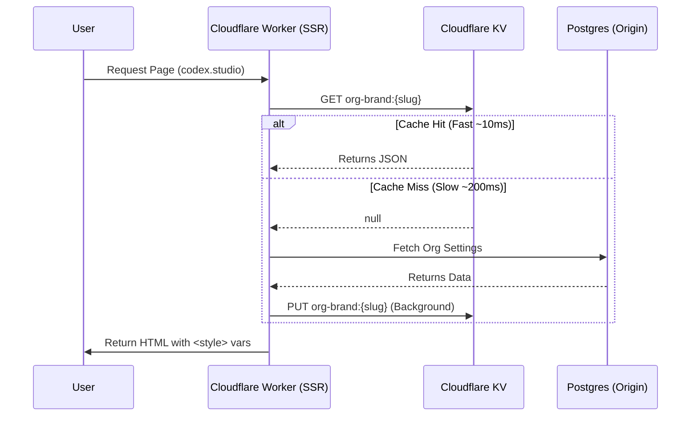

# P1-BE-CACHE-001: Branding Edge Cache (KV)

**Objective**: Implement a zero-latency caching layer for Organization Brand Tokens using Cloudflare KV. This ensures that every page load receives branding data instantly without hitting the primary database (Postgres), eliminating the "Flash of Unstyled Content" (FOUC) and scaling gracefully to millions of requests.

## 1. Architecture

We utilize the "Read-Through" caching pattern at the Edge.



## 2. Infrastructure

### KV Namespace
- **Binding Name**: `BRAND_KV`
- **Purpose**: Stores processed, public-safe branding definitions (CSS tokens + Asset URLs).
- **TTL**: 7 days (604800 seconds).
- **Invalidation Strategy**: Write-on-Update (Admin Settings API writes to KV immediately on save).

## 3. Data Schema

The value stored in KV is a simplified, "Frontend-Ready" JSON object. It does NOT contain sensitive data (billing info, private keys).

**Key**: `brand:{org_slug}` (e.g. `brand:acme-corp`)

**Value**:
```json
{
  "version": 1,
  "updatedAt": "2026-01-12T12:00:00Z",
  "tokens": {
    "brand-primary": "#e85a3f",
    "brand-accent": "#10b981",
    "brand-font-body": "Inter",
    "brand-font-heading": "Playfair Display",
    "brand-radius-base": "0.5rem",
    "brand-density-scale": 1,
    "brand-glass-blur": "12px",
    "brand-glass-opacity": 0.8,
    "brand-base-border-width": "1px",
    "brand-texture-url": "https://cdn.codex.studio/textures/noise.png"
  },
  "assets": {
    "logoUrl": "https://cdn.codex.studio/logos/acme.png",
    "faviconUrl": "https://cdn.codex.studio/favicons/acme.ico"
  }
}
```

## 4. Implementation Details

### A. KV Binding
In `apps/web/wrangler.toml`:
```toml
[[kv_namespaces]]
binding = "BRAND_KV"
id = "prod_kv_id"
preview_id = "preview_kv_id"
```

### B. The Cache Service (`src/lib/server/brand-cache.ts`)

```typescript
import type { KVNamespace } from '@cloudflare/workers-types';

export async function getBrandConfig(platform: App.Platform, slug: string) {
  if (!platform?.env?.BRAND_KV) return null;

  // Fast Path
  const cached = await platform.env.BRAND_KV.get(`brand:${slug}`, 'json');
  if (cached) return cached;

  // Slow Path (Caller handles DB fetch + calling setBrandConfig)
  return null;
}

export async function setBrandConfig(platform: App.Platform, slug: string, data: any) {
  if (!platform?.env?.BRAND_KV) return;

  // Non-blocking write using waitUntil
  const promise = platform.env.BRAND_KV.put(
    `brand:${slug}`,
    JSON.stringify(data),
    { expirationTtl: 604800 } // 7 days
  );

  platform.context.waitUntil(promise);
}
```

### C. Admin API Integration
When `P1-FE-ADMIN-002` (Settings) updates the database, it must also update the cache.

In `src/routes/api/org/[slug]/settings/+server.ts` (or Remote Function):
1. Update Postgres.
2. Construct the "Public Brand Object".
3. Call `setBrandConfig(platform, slug, object)`.

## 5. Implementation Checklist

- [ ] **Infrastructure**
  - [ ] Create KV Namespace `codex-brand-kv-prod` via Wrangler
  - [ ] Add binding to `wrangler.toml` (Web App)
  - [ ] Add binding to `pnpm-workspace.yaml` / Types

- [ ] **Service Layer**
  - [ ] Create `src/lib/server/brand-cache.ts`
  - [ ] Implement `getBrandConfig` (Read)
  - [ ] Implement `setBrandConfig` (Write with `waitUntil`)

- [ ] **Integration**
  - [ ] Update `+layout.server.ts` to use `getBrandConfig` before DB fetch
  - [ ] Update Admin Settings Action to call `setBrandConfig` on save
  - [ ] Add "Clear Cache" button in Admin Dashboard (optional utility)

- [ ] **Verification**
  - [ ] Verify <10ms response time for cached keys
  - [ ] Verify cache updates immediately after Admin Save
