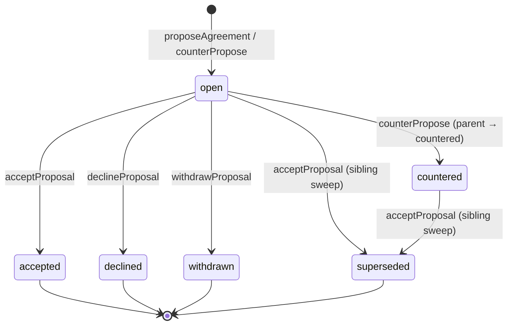
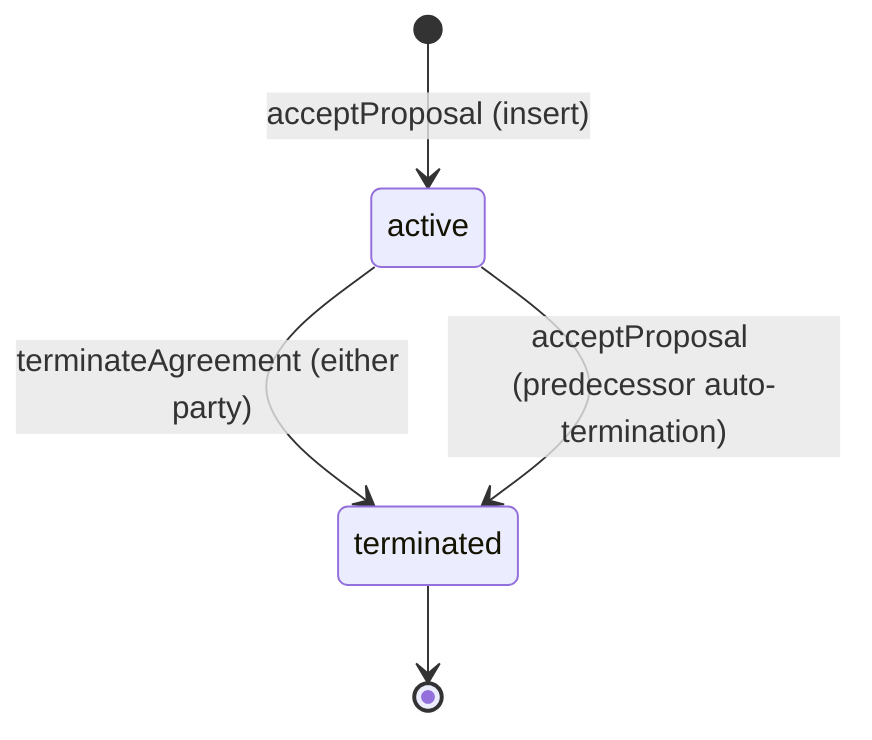

# Revenue-Share Agreements

Two-sided owner ↔ creator negotiation for per-creator revenue splits on
subscription and content-purchase revenue streams.

## TL;DR

Organizations can host multiple creators. Subscription and content-purchase
revenue is split between the platform, the org, and (optionally) named
creators via per-revenue-type agreements. Each agreement is the result of
a negotiation thread of immutable `agreement_proposals` rows produced by
either party countering the other; the accepted proposal seeds a single
`creator_organization_agreements` row that the payout pipeline reads at
invoice fire time.

## Data Model

### `creator_organization_agreements`

One row per `(organization_id, creator_id, revenue_type)` where
`status='active'` (enforced by partial unique index). Terminated rows
persist for audit; multiple terminated rows for the same triple are
allowed.

| Column | Type | Nullable | Purpose |
|---|---|---|---|
| `id` | uuid PK | NO | Generated UUID. |
| `creator_id` | text FK `users.id` | NO | The named creator on the agreement. `onDelete: cascade`. |
| `organization_id` | uuid FK `organizations.id` | NO | The org. `onDelete: cascade`. |
| `organization_fee_percentage` | integer (basis points) | NO | LEGACY column. `10000 - creator_share`. Dual-written by `acceptProposal`. Kept NOT NULL during transition; future migration drops it. |
| `revenue_type` | varchar(32) | NO | `'subscription' \| 'content_purchase'`. Defaults to `'subscription'`. |
| `status` | varchar(16) | NO | `'active' \| 'terminated' \| 'expired'`. Defaults to `'active'`. |
| `terminated_at` | timestamptz | YES | Set when status flips to `terminated`. Schema CHECK enforces `(status='terminated') ⇔ (terminatedAt IS NOT NULL)`. |
| `terminated_by_user_id` | text FK `users.id` | YES | Actor who terminated. `onDelete: set null`. |
| `termination_reason` | text | YES | Free-text reason captured at termination. |
| `current_proposal_id` | uuid FK `agreement_proposals.id` | YES | The accepted proposal that seeded this row's economics. `onDelete: set null` — see [FK semantics](#fk-semantics) below. |
| `effective_from` | timestamptz | NO | Start of the agreement. Inherited from `agreement_proposals.proposed_effective_from`. |
| `effective_until` | timestamptz | YES | Calculated from `proposed_term_months`. `NULL` = indefinite. |
| `created_at` / `updated_at` | timestamptz | NO | Audit timestamps. |

Indexes:

- `idx_creator_org_agreement_creator_id (creator_id)`
- `idx_creator_org_agreement_org_id (organization_id)`
- `idx_creator_org_agreement_effective (effective_from, effective_until)`
- `idx_creator_org_agreement_active_lookup (organization_id, creator_id, revenue_type, status)` — composite for the hot payout-pipeline lookup
- `uq_creator_org_agreement_active_per_type (organization_id, creator_id, revenue_type) WHERE status='active'` — partial unique

CHECK constraints:

- `check_org_fee_percentage` — basis points 0–10000
- `check_creator_org_agreement_revenue_type` — `IN ('subscription', 'content_purchase')`
- `check_creator_org_agreement_status` — `IN ('active', 'terminated', 'expired')`
- `check_creator_org_agreement_terminated_shape` — `(status='terminated') ⇔ (terminatedAt IS NOT NULL)`

### `agreement_proposals`

The immutable negotiation log. Each round (initial offer + every counter)
inserts a new row; rows are only ever UPDATEd to mark their lifecycle
status (`open → accepted | declined | countered | withdrawn | superseded`).

| Column | Type | Nullable | Purpose |
|---|---|---|---|
| `id` | uuid PK | NO | Generated UUID. |
| `organization_id` | uuid FK `organizations.id` | NO | The org. `onDelete: cascade`. |
| `creator_id` | text FK `users.id` | NO | The named creator. `onDelete: cascade`. |
| `revenue_type` | varchar(32) | NO | `'subscription' \| 'content_purchase'`. |
| `parent_proposal_id` | uuid self-FK | YES | The proposal this is countering. `NULL` = round-1 initial offer. `onDelete: set null`. |
| `round_number` | integer | NO | `1` for initial offer; `+1` per counter. |
| `proposed_by_user_id` | text FK `users.id` | NO | Actor who created this round. `onDelete: cascade`. |
| `proposed_by_role` | varchar(16) | NO | `'owner' \| 'creator'`. |
| `proposed_creator_share_percent` | integer (basis points) | NO | The creator's slice of the **post-platform** pool (0–10000). |
| `proposed_term_months` | integer | YES | Proposed soft-lock review window in months. `NULL` = indefinite. |
| `proposed_effective_from` | timestamptz | NO | Start date carried forward into the agreement on acceptance. |
| `note` | text | YES | Free-text context from the proposing party. |
| `status` | varchar(16) | NO | `'open' \| 'accepted' \| 'declined' \| 'countered' \| 'withdrawn' \| 'superseded'`. |
| `responded_at` | timestamptz | YES | Set when status flips off `'open'`. |
| `responded_by_user_id` | text FK `users.id` | YES | Actor who closed out this row. `onDelete: set null`. |
| `decline_reason` | text | YES | Free-text decline reason. |
| `created_at` / `updated_at` | timestamptz | NO | Audit timestamps. |

Indexes:

- `idx_agreement_proposals_thread (organization_id, creator_id, revenue_type)` — thread lookup
- `idx_agreement_proposals_creator_status (creator_id, status)` — creator portfolio
- `idx_agreement_proposals_org_status (organization_id, status)` — owner pending

CHECK constraints enforce the same enums + numeric bounds at the DB layer.

### FK semantics

`creator_organization_agreements.current_proposal_id` references
`agreement_proposals.id` with **`onDelete: 'set null'`** — deliberate.
Proposals are an immutable audit log that may need pruning for GDPR
right-to-erasure or history compaction; the parent agreement (currently
active) MUST NOT be deleted with them. Query implication: every reader
that joins these tables uses `leftJoin` and treats a NULL `currentProposalId`
as "agreement misconfigured / proposal deleted" — graceful fallback to
the legacy `organization_fee_percentage` column or to the org-keeps-all
default in the payout pipeline.

DO NOT add `.notNull()` to `currentProposalId` — that would break
proposal deletes. DO NOT use `innerJoin` against proposals from the
agreement side — that silently loses rows.

## State Machine

### Proposal lifecycle



Transitions table:

| Event | Method | From-status | To-status | Side-effects |
|---|---|---|---|---|
| Initial offer | `proposeAgreement` | (none) | `open` | Insert new row with `round_number=1`, `proposed_by_role='owner'`. |
| Counter | `counterPropose` | `open` (parent) → `countered` | New row `open` | Parent's `responded_at` / `responded_by_user_id` set. Child has `parent_proposal_id`, `round_number = parent.round + 1`, flipped `proposed_by_role`. |
| Accept | `acceptProposal` | `open` | `accepted` | (1) Mark this row accepted, (2) sibling `open` / `countered` rows in the same thread → `'superseded'`, (3) prior active agreement → `'terminated'` (`terminationReason='Superseded by accepted proposal'`), (4) INSERT new `creator_organization_agreements` row. |
| Decline | `declineProposal` | `open` | `declined` | `decline_reason` captured. No agreement row created. |
| Withdraw | `withdrawProposal` | `open` | `withdrawn` | Proposing party only. No agreement row created. |

Critical: `'superseded'` is set in TWO places — when a counter is created
(parent transitions `open → countered → eventually superseded` on accept of
any descendant) AND at accept time on every still-open/countered sibling
in the thread. The accept-time sweep is non-negotiable: without it the
read path would see stale `'countered'` parents that look like live
negotiation rounds but are actually historical.

For thread-rendering UI: DO NOT show rows with `status='superseded'` as
live offers. Group them under "Previous offers" or hide entirely. The
current proposal is the one referenced by
`creator_organization_agreements.current_proposal_id`.

### Agreement lifecycle



Soft-lock semantics. Either party may terminate at any time — there is no
hard contract. `effective_until` is a "review by" date, not a hard
expiry.

Concurrency: all five proposal-mutating methods and the agreement
`terminate` method acquire row-level `SELECT FOR UPDATE` locks on the
target row inside the transaction before the status check, closing the
READ COMMITTED race window where two concurrent callers could both
observe `status='open'` and both proceed.

## Unit Semantics (LOAD-BEARING)

Quoted verbatim from the `agreement-math.ts` ADR header — the source of
truth. Any change here must update both this doc and the file:

> **Unit semantics (load-bearing for WP-4 payout pipeline):**
>
> `proposed_creator_share_percent` is the creator's slice of the
> POST-PLATFORM pool, in basis points (0-10000). This matches the
> schema column comment in `ecommerce.ts` and the legacy
> `calculateRevenueSplit` in @codex/purchase, which treats
> `organization_fee_percentage` as a fraction of (gross - platform_fee).
>
> Therefore: dual-write `organization_fee_percentage = 10000 - share`
> (both quantities in the same post-platform unit), and validation
> checks `sum(active creator shares) <= 10000` — the platform fee is
> already accounted for upstream of this pool and does NOT enter share
> validation.

In human terms: the platform takes its cut off the top (configured via
[`fee-configuration.md`](../payouts/fee-configuration.md), version-cache
invalidated, NOT snapshotted). What remains is the **post-platform pool**.
Creator shares — and the implicit org residual — live entirely inside that
pool. A "30% creator share" means 30% of the post-platform pool, not 30%
of gross.

This means the math in `agreement-math.ts` reasons about a single number
line `[0, 10000]` basis points and validates `sum(active creator shares)
≤ 10000`. The platform fee is upstream and irrelevant to share
validation; the org's slice is whatever is left over.

The payout pipeline's `calculateRevenueSplit(gross, platformFee, orgFee)`
in `@codex/subscription` (see
[`packages/subscription/src/services/revenue-split.ts`](../../packages/subscription/src/services/revenue-split.ts))
keeps the units consistent — it computes `platformFee` against gross
first, then divides the post-platform pool per creator-share basis points.

## Math

### Subscription payout

```
gross
  − platformFee (current org config, NOT snapshotted)         = postPlatform
  − Σ(active creator shares × postPlatform ÷ 10000)           = orgResidual
```

For each active `(org, creator, revenue_type='subscription')` agreement
in the org at invoice fire time:

```
creatorCut = floor(postPlatform × proposedCreatorSharePercent ÷ 10000)
```

The org residual is `postPlatform − Σ(creatorCut)`, paid to the org via
the `${chargeId}_org_fee` Stripe transfer.

**Worked example** (the regression-test scenario):

- gross = 1000 pence (£10.00)
- platform fee = 10% → 100 pence
- post-platform = 900 pence
- One co-creator with a 30% subscription agreement (3000 bp)
- `coCreatorCut = floor(900 × 3000 / 10000) = 270` pence
- `orgResidual = 900 − 270 = 630` pence

### Content-purchase payout

Per locked decision Q1, content-purchase revenue is attributed to the
content's uploader (`content.creatorId`), and only THAT creator's
`revenue_type='content_purchase'` agreement applies — never a pooled
calculation across the org's creators.

```
gross
  − platformFee                                               = postPlatform
  − (uploader's creator share × postPlatform ÷ 10000)         = orgResidual
```

If the uploader has no active `content_purchase` agreement, the org keeps
100% of the post-platform pool — matching the pre-agreements baseline.

### Active-as-of-invoice filter (Q3 — no pro-rating)

Per locked decision Q3, whoever holds an active agreement at invoice
fire time receives the full cut for that period. The SQL predicate is:

```
status = 'active'
OR (status = 'terminated' AND terminated_at > invoiceAt)
```

The naïve `status='active' AND (terminated_at IS NULL OR terminated_at > invoiceAt)`
form is broken — the schema CHECK enforces
`(status='terminated') ⇔ (terminatedAt IS NOT NULL)`, so the second
branch can never match. See
[`AgreementService.getActiveAgreements`](../../packages/agreements/src/services/agreement-service.ts)
for the canonical implementation.

## Locked Decisions (Q1 / Q2 / Q3 from 2026-05-17)

### Q1 — Content-purchase split scope: creator's-own-content only

Content-purchase revenue is attributed to the uploader
(`content.creatorId`), and that creator's
`revenue_type='content_purchase'` agreement determines the split.

- Multi-creator orgs: each creator's content earns under THEIR agreement,
  not a pooled bucket.
- Fallback when uploader has no active `content_purchase` agreement: org
  keeps 100% of revenue (after platform fee) — matches today's
  pre-agreements behaviour.
- Per-content overrides (e.g. "this one piece is 70/30") are deferred to
  a future epic.
- Subscription revenue is unaffected by this decision — subscriptions
  remain pooled at the org level and split via the creator's
  `revenue_type='subscription'` agreement.

WP-4 payout pipeline for content-purchase joins `content` →
`creator_organization_agreements` per purchase. The agreement lookup is
cached keyed on `(content.creatorId, revenue_type='content_purchase',
status='active')` to avoid N+1 on bulk invoice processing.

### Q2 — Platform fee snapshot policy: creator share snapshotted, platform fee current

At acceptance, `agreement_proposals.proposed_creator_share_percent` is
locked onto the agreement and honoured forever. Platform fee is always
read from the current org config at invoice time — never snapshotted on
the agreement.

- Rationale: creator share is a two-party contract; platform fee is the
  platform's operational lever. Letting the platform fee change reach
  legacy agreements avoids long-tail grandfathered economics.
- Implementation: the agreement row + linked accepted proposal are the
  source of truth for the share; platform fee comes from the existing
  fee-config lookup (version-bump invalidation, NOT TTL — see
  [`fee-configuration.md`](../payouts/fee-configuration.md)).

### Q3 — Mid-invoice termination: no pro-rating, active-as-of-invoice-date

Whoever holds an active agreement at invoice fire time receives the full
cut for that period. Termination on day 15 of a 30-day subscription
period → no share for that invoice.

- Implementation: payout query filters per the [active-as-of-invoice
  filter](#active-as-of-invoice-filter-q3--no-pro-rating) above. Single
  SQL predicate, no time-windowed math.
- UI must state plainly: "Active during invoice period → full share.
  Terminated before invoice → no share for that invoice."
- Notification template for termination includes the next-invoice date
  and the consequence ("Your last invoice will fire on [date].
  Termination after that date receives no further shares.").

## API Reference

### Service layer — `@codex/agreements` `AgreementService`

Constructor: `new AgreementService(config: AgreementServiceConfig)`
where `AgreementServiceConfig extends ServiceConfig` with optional
`mailer` (lifecycle notification thunk) and optional `webAppUrl`
(absolute base for email deep links).

Mutations (each runs inside `db.transaction()` and acquires
`SELECT FOR UPDATE` row locks):

| Method | Params (subset) | Returns | Throws |
|---|---|---|---|
| `proposeAgreement` | `organizationId`, `creatorId`, `revenueType`, `sharePercent`, `termMonths`, `note?`, `proposedByUserId`, `effectiveFrom?` | `AgreementProposal` | `ForbiddenError`, `NotFoundError`, `InvalidProposalStateError`, `ShareExceedsAvailableError` |
| `counterPropose` | `proposalId`, `sharePercent`, `termMonths`, `note?`, `counteredByUserId` | `AgreementProposal` (child) | `AgreementNotFoundError`, `ForbiddenError`, `InvalidProposalStateError`, `ShareExceedsAvailableError` |
| `acceptProposal` | `proposalId`, `acceptedByUserId` | `CreatorOrganizationAgreement` | `AgreementNotFoundError`, `ForbiddenError`, `InvalidProposalStateError`, `ShareExceedsAvailableError` |
| `declineProposal` | `proposalId`, `declinedByUserId`, `reason?` | `AgreementProposal` (declined) | `AgreementNotFoundError`, `ForbiddenError`, `InvalidProposalStateError` |
| `withdrawProposal` | `proposalId`, `withdrawnByUserId` | `AgreementProposal` (withdrawn) | `AgreementNotFoundError`, `ForbiddenError`, `InvalidProposalStateError` |
| `terminateAgreement` | `agreementId`, `terminatedByUserId`, `reason?` | `CreatorOrganizationAgreement` (terminated) | `AgreementNotFoundError`, `ForbiddenError`, `InvalidProposalStateError` |

Reads:

| Method | Params | Returns |
|---|---|---|
| `getActiveAgreements` | `organizationId`, `revenueType?`, `activeAt?` | `CreatorOrganizationAgreement[]` |
| `getActiveAgreement` | `organizationId`, `creatorId`, `revenueType`, `activeAt?` | `CreatorOrganizationAgreement \| null` |
| `getActiveAgreementsForCreator` | `creatorId`, `revenueType?`, `activeAt?` | `CreatorOrganizationAgreement[]` |
| `getNegotiationThread` | `organizationId`, `creatorId`, `revenueType` | `AgreementProposal[]` (chronological) |
| `getProposalsForCreator` | `creatorId`, `status?` | `AgreementProposal[]` |
| `getOrgName` | `organizationId` | `string \| null` |

All reads default `activeAt` to `new Date()`. The payout pipeline always
passes the invoice's `created` timestamp so a webhook replay against the
same invoice surfaces the same set of agreements regardless of clock
drift.

Lifecycle notifications fire post-commit through the configured `mailer`
thunk — failures are caught + logged but never roll back the agreement
mutation (the agreement row is source of truth, notification is
observation).

### Worker routes — `workers/ecom-api/src/routes/agreements.ts`

All routes use `procedure()` and consume the service via
`ctx.services.agreements`.

| Method + Path | Policy | Body / Params | Response | Notes |
|---|---|---|---|---|
| `POST /agreements/propose?organizationId=<uuid>` | `auth: 'required', requireOrgMembership: true` | body: creator + revenue-type + share + term + note + effectiveFrom | `{ data: AgreementProposal }` 201 | Owner-only enforced in service. `organizationId` is QUERY (not body) — `procedure()` resolves into `ctx.organizationId`. |
| `POST /agreements/:proposalId/counter` | `auth: 'required'` | params: `proposalId`; body: share + term + note | `{ data: AgreementProposal }` 201 | Counterparty enforced in service. |
| `POST /agreements/:proposalId/accept` | `auth: 'required'` | params: `proposalId` | `{ data: CreatorOrganizationAgreement }` 201 | Counterparty enforced in service. Creates the active agreement row. |
| `POST /agreements/:proposalId/decline` | `auth: 'required'` | params: `proposalId`; body: optional `reason` | `{ data: AgreementProposal }` 200 | Counterparty enforced in service. |
| `POST /agreements/:proposalId/withdraw` | `auth: 'required'` | params: `proposalId` | `{ data: AgreementProposal }` 200 | Proposing party enforced in service. |
| `POST /agreements/:agreementId/terminate` | `auth: 'required'` | params: `agreementId`; body: optional `reason` | `{ data: CreatorOrganizationAgreement }` 200 | Either party — service enforces. |
| `GET /agreements?organizationId=...&revenueType=...` | `auth: 'required', requireOrgManagement: true` | query: optional `revenueType` filter | `{ items, pagination }` 200 | Owner/admin view. Full visibility — no anonymisation. |
| `GET /agreements/threads/:creatorId?revenueType=...` | `auth: 'required', requireOrgManagement: true` | params: `creatorId`; query: `revenueType` | `AgreementProposal[]` chronological | Owner/admin view of one negotiation thread. |
| `GET /agreements/me` | `auth: 'required'` | — | `{ items, pagination }` 200 | Creator view of own active rows ENRICHED with `peers: { count, aggregateSharePercent }`. |
| `GET /agreements/me/threads/:proposalId` | `auth: 'required'` | params: `proposalId` | `AgreementProposal[]` | Creator view of one thread, resolved via `getProposalsForCreator` (covers pending threads with no agreement row yet). |
| `GET /agreements/me/portfolio` | `auth: 'required'` | — | `CreatorPortfolioPayload` 200 | Single round-trip for the creator-studio /negotiations page — `{ active, pendingActionRequired, pendingWaitingOnOrg, past }`. |

Authorisation layering: route layer gates the minimum (`auth: 'required'`,
optional `requireOrgMembership` / `requireOrgManagement`). The
**service** enforces role-on-this-row (owner / counterparty / proposing
party) via `assertActiveOwner` and the per-method counterparty checks.
Reasoning: row-state-dependent authz cannot live in `policy.roles`
because it depends on the proposal's `proposed_by_role`. Don't
pre-filter actions on the client — let the route fail with 403 and
surface the error.

Cross-org safety: `ctx.organizationId` (resolved by `procedure()` from
the URL / query) WINS over any body-level `organizationId`. Body-level
orgId fields are an anti-pattern — they let a user with membership in
org A forge `organizationId=B` to operate on org B's data. Every
mutation reads orgId from `ctx`, never from request payload.

## UX Flows

### Owner proposes

1. Owner visits `studio-alpha.lvh.me:3000/studio/settings/revenue-share`.
2. Navigates to the **Revenue share** tab in the settings layout.
3. Sees the **Team budget pie** (`RevenueSplitPie.svelte`) showing
   platform fee + per-creator slices + org residual + each creator's
   agreement card.
4. Clicks "Propose" on the target creator's card → `ProposeAgreementDialog`
   opens with slider + term picker + note field + revenue-type
   selector.
5. Submits → `POST /agreements/propose?organizationId=<uuid>` with
   `{ creatorId, revenueType, sharePercent, termMonths, note }`.
6. UI returns to the tab; the new proposal appears on the creator's
   agreement card as "Pending creator response".
7. Email fires to the creator (`agreement-proposed-by-owner`).

### Creator counters

1. Creator visits `creators.lvh.me:3000/studio/negotiations`.
2. Sees the proposal in **Action required** with the proposed share +
   term + note.
3. Clicks "View details" → detail page renders the anonymised
   `RevenueSplitPie` + the negotiation thread + the
   `Accept / Counter / Decline` controls.
4. Clicks "Counter" → counter-proposal dialog with prefilled values.
5. Submits → `POST /agreements/:proposalId/counter` with new share +
   term + note.
6. The parent proposal flips `open → countered`; a new child proposal
   row is inserted with the flipped role and `round_number + 1`.
7. Email fires to the owner (`agreement-countered-by-creator`); the
   owner's dashboard FocusRail surfaces a `"[Creator] sent a counter"`
   card.

### Either party terminates

1. Either side opens the agreement detail page.
2. Clicks "Terminate". Confirmation dialog explains the Q3 semantic:
   "Active during invoice period → full share. Terminated before invoice
   → no share for that invoice."
3. Submits → `POST /agreements/:agreementId/terminate` with optional
   reason.
4. Agreement row flips `active → terminated` with `terminated_at`,
   `terminated_by_user_id`, `termination_reason` captured.
5. Email fires to the other party (`agreement-terminated`).
6. The next invoice payout query excludes the terminated row per the
   Q3 filter.

### Agreement expiring 30d

A cron-driven email warns both parties when `effective_until - 30d`
elapses. Currently DEFERRED to follow-up bead **Codex-tugez** — the
template exists (`agreement-expiring-soon`) but the cron-fire wiring is
not yet implemented. Until then, the UI surfaces a "Review by [date]"
indicator on the agreement card.

## Visibility & Anonymisation

| View | Sees |
|---|---|
| Owner (`requireOrgManagement` — owner OR admin) | Every creator's full share + identifying info on the org's team budget pie + per-creator cards + threads. |
| Creator (`auth: 'required'`, scoped on `ctx.user.id`) | Own share + aggregate `peers: { count, aggregateSharePercent }` per `(orgId, revenueType)` bucket. NEVER peer `creatorId` / `userId` / display fields. |

Subscription peers and content-purchase peers are NEVER combined — they
are separate revenue pools per Q1 (see [Locked Decisions](#q1--content-purchase-split-scope-creators-own-content-only)).

Enforced server-side at:

- `GET /agreements/me` — adds `peers` aggregate to every row
- `GET /agreements/me/threads/:proposalId` — single-creator thread, no
  peers exposed
- `GET /agreements/me/portfolio` — `active` section reuses the same
  `peers` shape; `pendingActionRequired` / `pendingWaitingOnOrg` /
  `past` sections never include peer rows at all

The anonymisation contract is locked by test coverage — explicit pin
tests in the route test suite assert peer identifying fields never
appear in creator-view responses.

## Pending Proposals vs Active Agreements (LOAD-BEARING)

Round-1 proposals exist ONLY as `agreement_proposals` rows — there is
NO `creator_organization_agreements` row until acceptance.

The data-flow implication for creator-side UI:

1. A creator clicks an email link to a pending owner-proposal.
2. The detail page calls `getActiveAgreementsForCreator({ creatorId })`
   to find the agreement.
3. The query returns nothing — there's no `creator_organization_agreements`
   row yet.
4. The page 404s, even though the proposal is live and waiting on the
   creator's response.

**Pattern that works:** code that enumerates "what proposals/agreements
does this user have" MUST query BOTH tables.

- Active agreements: query `creator_organization_agreements` joined
  `leftJoin` to `agreement_proposals` (per WP-4 read path).
- Pending proposals (no agreement row yet): query `agreement_proposals`
  directly with `creator_id = $1 AND status IN ('open', 'countered')`
  via `AgreementService.getProposalsForCreator()`.

The `GET /agreements/me/portfolio` endpoint aggregates both into a
unified response shape for the /studio/negotiations page; the `GET
/agreements/me/threads/:proposalId` endpoint enumerates threads via
`getProposalsForCreator` so a creator clicking a pending-action notice
doesn't 404 on the detail page.

## Notifications

Seven email templates fire on lifecycle events via the `mailer` thunk
configured on `AgreementService`. All copy explicitly references
"post-platform" revenue per the unit semantic. English-only for v1.

| Template name | Trigger | Recipient |
|---|---|---|
| `agreement-proposed-by-owner` | `proposeAgreement` succeeds | Named creator |
| `agreement-countered-by-creator` | `counterPropose` where new `counteringRole='creator'` | Original owner proposer |
| `agreement-countered-by-owner` | `counterPropose` where new `counteringRole='owner'` | Named creator |
| `agreement-accepted` | `acceptProposal` succeeds (both sides notified) | Both parties |
| `agreement-declined` | `declineProposal` succeeds (both sides notified) | Both parties |
| `agreement-terminated` | `terminateAgreement` succeeds | The OTHER party (not the terminator) |
| `agreement-expiring-soon` | Cron at `effective_until - 30d` (DEFERRED — Codex-tugez) | Both parties |

Each email body carries `recipientName`, `orgName`, `otherPartyName`,
`revenueTypeLabel` (`'subscription'` / `'content-purchase'`),
`sharePercentDisplay`, `termMonthsDisplay`, `deepLinkUrl`, and `note`.

When the `mailer` thunk is absent (narrow unit tests / legacy
harnesses), all mutations still succeed — only the email side-effect is
skipped. Mailer failures are caught and logged via the service's
`ObservabilityClient` — they never roll back the (already committed)
agreement state.

## Manual Verification (Stripe CLI)

The full lifecycle is integration-tested in
`packages/agreements/src/services/__tests__/agreement-service.test.ts`
and the payout-pipeline crossover is covered by
`packages/subscription/src/services/__tests__/subscription-service.test.ts`
(see WP-4 "original bug repro" test).

For end-to-end manual verification (per
[`feedback_stripe_cli_account_mismatch`](../../README.md)):

```bash
# Same account in both invocations — Stripe CLI account mismatch is the
# silent failure mode where `resend` returns event JSON but the local
# listener never receives it.
stripe listen --forward-to http://localhost:42072/webhooks/stripe/dev
stripe trigger invoice.payment_succeeded
```

Then verify:

1. The `agreements` table contains the active rows you set up via the
   owner UI.
2. The `payouts` table after the invoice fire shows one row per active
   agreement at the expected share, plus one org residual row.
3. The Stripe transfer log shows the matching transfers with the
   `${chargeId}_creator_${creatorId}` / `${chargeId}_org_fee`
   idempotency keys.

## Out of Scope (Future Epics)

- **Hard-locked contracts** (no early termination) — soft lock chosen
  for v1. Future column: `lock_type`.
- **Multi-tier subscription splits** — different splits per
  subscription tier (£5/mo vs £50/mo). Adds a per-tier dimension.
- **Per-content-piece splits** — override the org-wide content-purchase
  agreement for specific media. Significantly more complex.
- **Owner-configurable visibility** — currently locked to
  "owner-all, creator-anonymised". Could become a setting later.
- **Agreement templates** — reusable proposal templates owners can
  save. Nice-to-have.
- **Revenue forecasting widget** — show projected earnings under
  proposed terms. Could ship as a follow-up if time permits.
- **Expiring-soon cron** — template exists, cron-fire deferred to
  follow-up bead Codex-tugez.

## Related

- [../payouts/README.md](../payouts/README.md) — payouts hub
- [../payouts/payout-pipeline.md](../payouts/payout-pipeline.md) — end-to-end invoice → transfer → pending → drain flow
- [../payouts/fee-configuration.md](../payouts/fee-configuration.md) — platform/org/creator-override fee rates (the OTHER side of the math)
- [../../packages/agreements/src/services/agreement-math.ts](../../packages/agreements/src/services/agreement-math.ts) — the canonical ADR for unit semantics
- [../../packages/agreements/src/services/agreement-service.ts](../../packages/agreements/src/services/agreement-service.ts) — service implementation
- [../../workers/ecom-api/src/routes/agreements.ts](../../workers/ecom-api/src/routes/agreements.ts) — worker routes
- [../../packages/database/src/schema/ecommerce.ts](../../packages/database/src/schema/ecommerce.ts) — schema
- Epic plan: `~/.claude/plans/ok-awesome-we-unified-flamingo.md`
- Beads epic: `Codex-nk4km`
