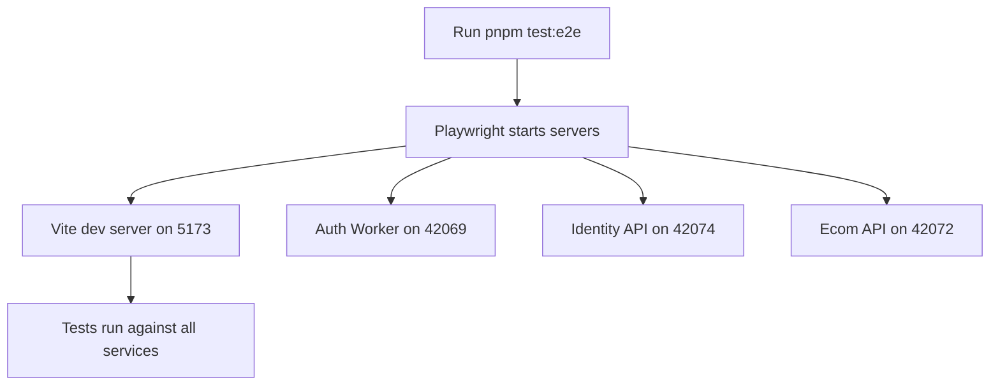
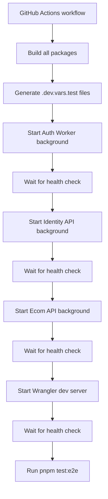

# CI E2E Environment Analysis Report

## Executive Summary

E2E tests are experiencing timeouts in CI due to several key differences between local development and CI environments. This analysis identifies the root causes and provides recommendations for improving test reliability.

## Key Findings

### 1. **Server Startup Sequence Differences**

#### Local Development (Vite)
- **Command**: `pnpm dev` → Vite server on port 5173
- **Timeout**: 180 seconds (3 minutes) in playwright.config.ts
- **Dev Mode**: Hot reload, fast startup
- **Worker Servers**: Started via Playwright's `webServer` feature in parallel

#### CI Environment (Wrangler)
- **Command**: `pnpm wrangler dev --env test --port 8787 --local`
- **Timeout**: 60 seconds per worker startup (via `timeout` command)
- **Dev Mode**: Full Cloudflare Workers emulation, slower startup
- **Worker Servers**: Started manually with background processes and PID files

### 2. **Worker Dependency Chain in CI**

The E2E workflow starts multiple workers sequentially:

1. **Auth Worker** (port 42069) - Starts first
2. **Identity API** (port 42074) - Starts second
3. **Ecom API** (port 42072) - Starts third
4. **Web App** (port 8787) - Starts last

Each worker waits up to 60 seconds for health checks to pass.

### 3. **Network and Resource Constraints**

#### GitHub Actions Runner Limitations
- Limited CPU/RAM compared to local machine
- Network latency between services
- Concurrent processes compete for resources

#### Build Process Overhead
- Turborepo builds all packages before workers start
- Wrangler dev server builds SvelteKit + Cloudflare adapter
- Workers load entire Cloudflare runtime

### 4. **Configuration Differences**

#### Environment Variables
- **Local**: Uses `.env.test` with LOCAL_PROXY for database
- **CI**: Uses Neon ephemeral branch with direct DATABASE_URL
- **R2**: Same test buckets used in both environments

#### Service URLs
- **Local**: `http://localhost:5173`
- **CI**: `http://localhost:8787`
- **Worker URLs**: Fixed ports in wrangler.jsonc

### 5. **Test Execution Flow**

#### Local Flow


#### CI Flow


## Specific Points of Failure

### 1. **Race Conditions in Worker Startup**

The CI starts workers sequentially with health checks:
```bash
# Each worker startup includes:
pnpm wrangler dev --env test --port 42069 --local &
echo $! > auth-worker.pid
timeout 60 bash -c 'until curl -f http://localhost:42069/health; do sleep 1; done'
```

Problems:
- Timeout is hardcoded at 60 seconds
- No exponential backoff for retries
- Workers may not be fully ready when tests start

### 2. **Wrangler Dev Server Slow Startup**

The web app takes longer to start in CI because:
- Cloudflare adapter needs to build
- Workers emulation layer initializes
- Assets need to be processed
- Database connections establish

### 3. **Database Connection Timing**

In CI:
- Neon ephemeral branch creation takes time
- Database connections pool slowly
- Query performance may be slower due to network distance

### 4. **Missing Error Handling**

Current startup script lacks:
- Graceful error recovery
- Detailed logging of startup failures
- Fallback mechanisms for health checks

## Recommendations

### 1. **Increase Timeouts and Add Retries**

```yaml
# In .github/workflows/testing.yml
- name: Start Auth Worker in background
  run: |
    cd workers/auth
    pnpm wrangler dev --env test --port 42069 --local &
    echo $! > auth-worker.pid
    # Increase timeout and add retry logic
    timeout 120 bash -c '
      for i in {1..12}; do
        if curl -f http://localhost:42069/health; then
          echo "Auth Worker ready after $i attempts"
          exit 0
        fi
        echo "Attempt $i/12 failed, waiting 10s..."
        sleep 10
      done
      echo "Auth Worker failed to start"
      exit 1
    '
```

### 2. **Parallel Worker Startup with Readiness Probes**

```yaml
- name: Start all workers in parallel
  run: |
    # Start all workers simultaneously
    cd workers/auth && pnpm wrangler dev --env test --port 42069 --local & auth_pid=$!
    cd workers/identity-api && pnpm wrangler dev --env test --port 42074 --local & identity_pid=$!
    cd workers/ecom-api && pnpm wrangler dev --env test --port 42072 --local & ecom_pid=$!

    # Function to check readiness
    check_ready() {
      local port=$1
      local name=$2
      for i in {1..24}; do
        if curl -f http://localhost:$port/health; then
          echo "$name ready after $i attempts"
          return 0
        fi
        echo "Waiting for $name... ($i/24)"
        sleep 5
      done
      echo "$name failed to start"
      return 1
    }

    # Wait for all workers
    check_ready 42069 "Auth" && check_ready 42074 "Identity" && check_ready 42072 "Ecom"

    # Store PIDs
    echo $auth_pid > workers/auth/auth-worker.pid
    echo $identity_pid > workers/identity-api/identity-api-worker.pid
    echo $ecom_pid > workers/ecom-api/ecom-api-worker.pid
```

### 3. **Add Startup Health Checks**

```yaml
- name: Verify all workers are healthy
  run: |
    # Verify all endpoints are responding
    curl -f http://localhost:42069/health || exit 1
    curl -f http://localhost:42074/health || exit 1
    curl -f http://localhost:42072/health || exit 1
    curl -f http://localhost:8787 || exit 1
```

### 4. **Optimize Wrangler Startup**

```yaml
- name: Start Wrangler dev server with optimizations
  run: |
    cd apps/web
    # Use --persist-to for better performance
    pnpm wrangler dev --env test --port 8787 --local --persist-to=.wrangler-dev &
    echo $! > wrangler.pid

    # Wait with increased timeout
    timeout 300 bash -c 'until curl -f http://localhost:8787; do sleep 5; done'
```

### 5. **Implement Circuit Breaker Pattern**

```yaml
- name: Health check circuit breaker
  run: |
    MAX_ATTEMPTS=30
    ATTEMPT_DELAY=10

    for i in $(seq 1 $MAX_ATTEMPTS); do
      if curl -f http://localhost:8787 > /dev/null 2>&1; then
        echo "Server is ready after $i attempts"
        exit 0
      fi

      if [ $i -eq $MAX_ATTEMPTS ]; then
        echo "Server failed to start after $MAX_ATTEMPTS attempts"
        # Dump logs if available
        if [ -f apps/web/wrangler.log ]; then
          echo "=== Wrangler logs ==="
          tail -50 apps/web/wrangler.log
        fi
        exit 1
      fi

      echo "Attempt $i/$MAX_ATTEMPTS failed, waiting ${ATTEMPT_DELAY}s..."
      sleep $ATTEMPT_DELAY
    done
```

### 6. **Add Diagnostic Information**

```yaml
- name: Collect diagnostic info on failure
  if: failure()
  run: |
    echo "=== Worker Status ==="
    ps aux | grep -E "(wrangler|auth|identity|ecom)" | grep -v grep

    echo -e "\n=== Port Usage ==="
    netstat -tlnp 2>/dev/null | grep -E "(42069|42074|42072|8787)" || echo "netstat not available"

    echo -e "\n=== Recent Logs ==="
    find . -name "*.log" -type f 2>/dev/null | head -5 | xargs -I {} sh -c 'echo "=== {} ==="; tail -10 "$1" _ {}'
```

### 7. **Consider Prebuilding for CI**

```yaml
# Add to workflow before starting workers
- name: Prebuild Wrangler projects
  run: |
    cd workers/auth && pnpm wrangler build --env test
    cd workers/identity-api && pnpm wrangler build --env test
    cd workers/ecom-api && pnpm wrangler build --env test
    cd apps/web && pnpm build
```

### 8. **Environment-Specific Playwright Config**

Create a separate playwright.config.ci.ts that:
- Increases timeouts
- Disables parallel tests
- Uses stricter error handling

## Timeline Analysis

### Current CI Startup Timeline
1. Worker builds: ~2-3 minutes
2. Auth Worker startup: ~1 minute
3. Identity API startup: ~1 minute
4. Ecom API startup: ~1 minute
5. Wrangler dev server: ~3-5 minutes
6. Health checks: ~1 minute
7. **Total**: ~9-12 minutes before tests can start

### Recommended Improvements
1. Parallel worker startup: ~3 minutes
2. Increased timeouts with retries: ~2 minutes
3. Prebuilding: ~1 minute (done in parallel with other steps)
4. **Total**: ~6 minutes before tests start

## Conclusion

The E2E test timeouts are primarily caused by:
1. Sequential worker startup in CI vs parallel in local
2. Wrangler dev server slower startup than Vite
3. Insufficient timeouts and retry logic
4. Lack of proper error handling and diagnostics

Implementing the recommended changes should significantly improve test reliability and reduce CI execution time.