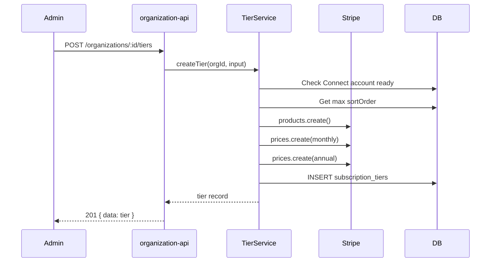
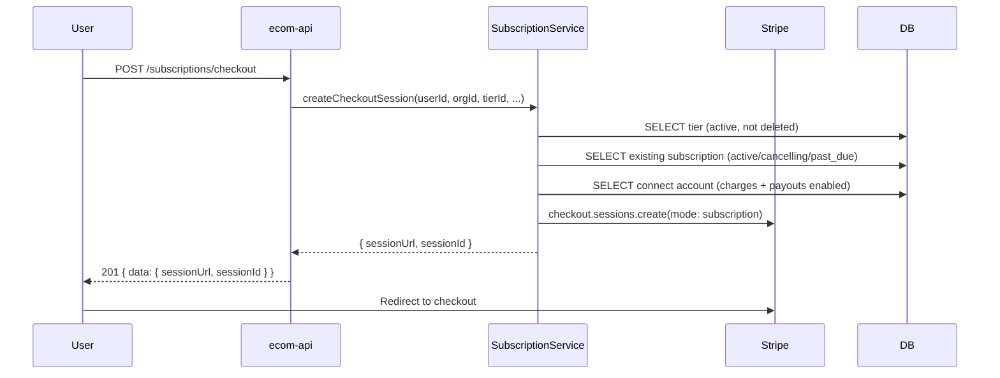
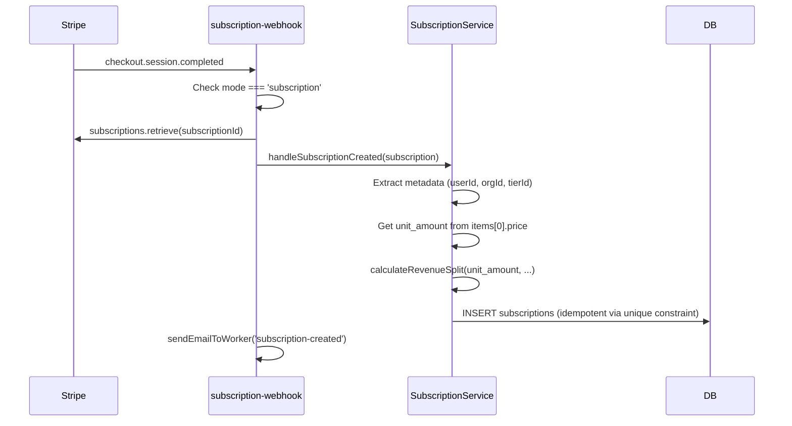
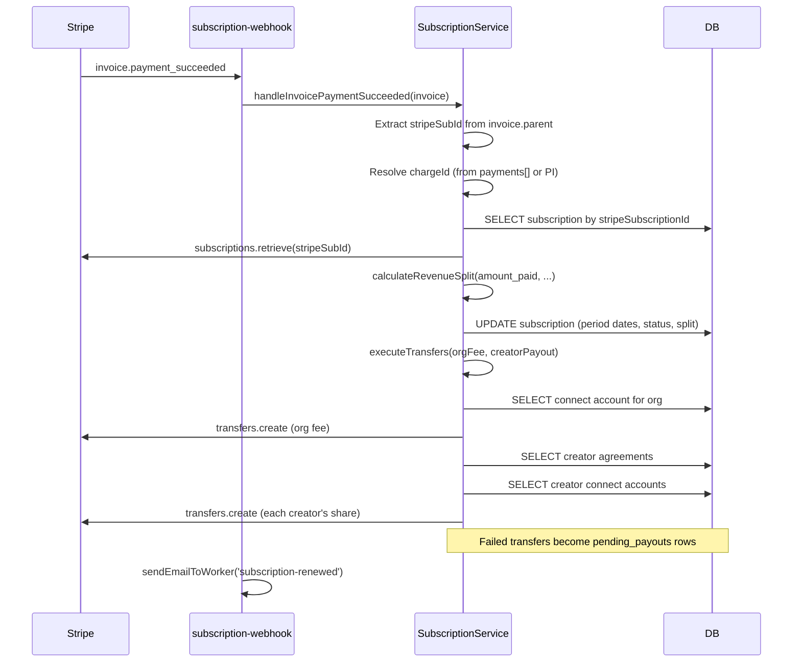
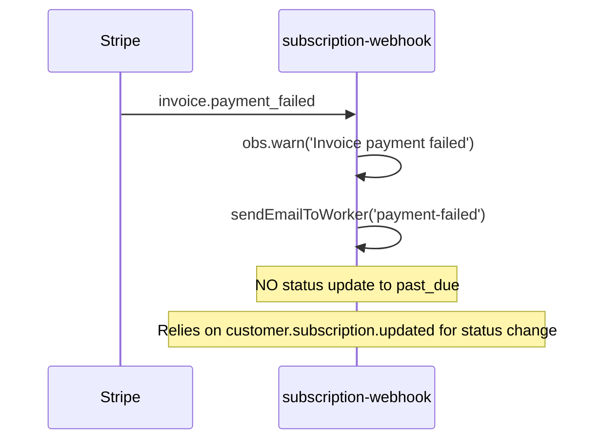
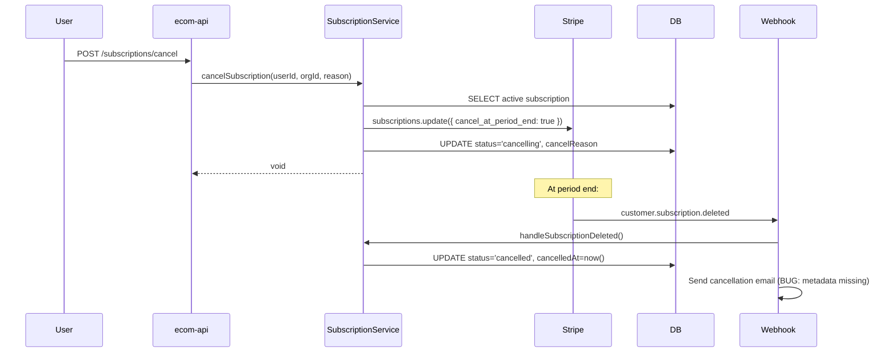
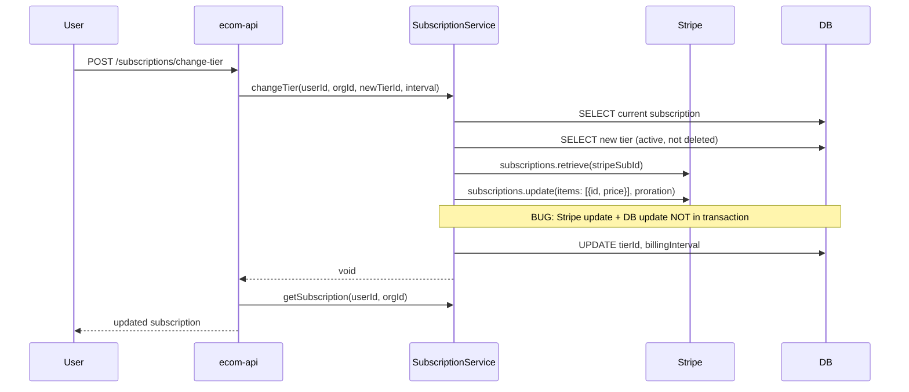

# Subscription Service Audit

## Overview

The subscription service domain manages the entire subscription lifecycle for the Codex platform -- tier configuration, Stripe Checkout in subscription mode, webhook processing (creation, renewal, tier change, cancellation), multi-party revenue transfers (platform / organization / creator pool), and pending payout accumulation.

### Key Files

| File | Purpose |
|---|---|
| `packages/subscription/src/services/subscription-service.ts` | Core lifecycle: checkout, webhooks, transfers, queries |
| `packages/subscription/src/services/tier-service.ts` | Tier CRUD + Stripe Product/Price sync |
| `packages/subscription/src/services/revenue-split.ts` | Three-way revenue split calculator |
| `packages/subscription/src/services/connect-account-service.ts` | Stripe Connect Express onboarding |
| `packages/subscription/src/errors.ts` | Domain error classes |
| `packages/subscription/src/index.ts` | Barrel exports |
| `packages/validation/src/schemas/subscription.ts` | Zod validation schemas |
| `packages/database/src/schema/subscriptions.ts` | DB schema: tiers, subscriptions, connect, payouts |
| `packages/constants/src/commerce.ts` | Fee constants, status enums |
| `workers/ecom-api/src/routes/subscriptions.ts` | Customer-facing API endpoints |
| `workers/ecom-api/src/handlers/subscription-webhook.ts` | Stripe webhook handler |
| `workers/organization-api/src/routes/tiers.ts` | Tier management API endpoints |
| `workers/ecom-api/src/utils/dev-webhook-router.ts` | Dev webhook dispatch |
| `packages/worker-utils/src/procedure/service-registry.ts` | Service lazy-loading |

### Architecture

```
User -> POST /subscriptions/checkout -> SubscriptionService.createCheckoutSession()
                                         -> Stripe Checkout (subscription mode)

Stripe -> POST /webhooks/stripe/dev -> dev-webhook-router -> handleSubscriptionWebhook()
           |
           +-- checkout.session.completed (mode=subscription)
           |     -> SubscriptionService.handleSubscriptionCreated()
           |
           +-- invoice.payment_succeeded
           |     -> SubscriptionService.handleInvoicePaymentSucceeded()
           |     -> SubscriptionService.executeTransfers()
           |
           +-- customer.subscription.updated
           |     -> SubscriptionService.handleSubscriptionUpdated()
           |
           +-- customer.subscription.deleted
           |     -> SubscriptionService.handleSubscriptionDeleted()
           |
           +-- invoice.payment_failed
                 -> (logs + email only, NO status update)
```

## Flow Diagrams

### Tier Creation Flow



### Checkout Flow



### Webhook: checkout.session.completed (subscription mode)



### Webhook: invoice.payment_succeeded (renewal)



### Webhook: invoice.payment_failed



### Cancellation Flow



### Tier Change Flow



---

## Bugs Found

### [BUG-SUB-001] Seed tiers have no Stripe Price IDs -- checkout will 422

- **Severity**: Critical
- **File**: `packages/database/scripts/seed/commerce.ts:205-242`
- **Description**: All three seed tiers (`alphaStandard`, `alphaPro`, `betaStandard`) are inserted with `stripeProductId`, `stripePriceMonthlyId`, and `stripePriceAnnualId` all defaulting to `null`. When a user attempts to subscribe to a seed tier, `createCheckoutSession()` reaches lines 160-169 of `subscription-service.ts` and finds `stripePriceId` is null, throwing `SubscriptionCheckoutError` ("Stripe Price not configured for this tier and interval").
- **Impact**: No subscription checkout works for seeded data. Local development and staging environments cannot test the subscription flow without manually creating tiers through the API (which creates real Stripe Products/Prices).
- **Root Cause**: The seed script inserts tier records directly into the database bypassing `TierService.createTier()`, which is what creates the Stripe Product and Prices. The comment on line 204 acknowledges this: `// Stripe IDs left null -- real Stripe products/prices are created via tier API.`
- **Fix**: The seed script should create tiers via the Stripe API (similar to how it creates Connect accounts), or at minimum use test Stripe Prices:

```typescript
// OLD (packages/database/scripts/seed/commerce.ts:205-242)
// Stripe IDs left null — real Stripe products/prices are created via tier API.
await db.insert(schema.subscriptionTiers).values([
  {
    id: TIERS.alphaStandard.id,
    organizationId: ORGS.alpha.id,
    name: TIERS.alphaStandard.name,
    // ... no stripeProductId, stripePriceMonthlyId, stripePriceAnnualId
  },
  // ...
]);

// NEW — create Stripe Products + Prices like Connect accounts
if (stripeKey) {
  const stripe = new Stripe(stripeKey);

  for (const [key, tierDef] of Object.entries(TIERS)) {
    const orgId = tierDef === TIERS.betaStandard ? ORGS.beta.id : ORGS.alpha.id;
    const product = await stripe.products.create({
      name: tierDef.name,
      description: tierDef.description,
      metadata: { codex_organization_id: orgId, codex_type: 'subscription_tier', codex_seed: 'true' },
    });
    const [monthlyPrice, annualPrice] = await Promise.all([
      stripe.prices.create({
        product: product.id,
        unit_amount: tierDef.priceMonthly,
        currency: 'gbp',
        recurring: { interval: 'month' },
      }),
      stripe.prices.create({
        product: product.id,
        unit_amount: tierDef.priceAnnual,
        currency: 'gbp',
        recurring: { interval: 'year' },
      }),
    ]);

    await db.insert(schema.subscriptionTiers).values({
      id: tierDef.id,
      organizationId: orgId,
      name: tierDef.name,
      description: tierDef.description,
      sortOrder: tierDef.sortOrder,
      priceMonthly: tierDef.priceMonthly,
      priceAnnual: tierDef.priceAnnual,
      stripeProductId: product.id,
      stripePriceMonthlyId: monthlyPrice.id,
      stripePriceAnnualId: annualPrice.id,
      isActive: true,
      createdAt: now,
      updatedAt: now,
    });
  }
} else {
  // Fallback: insert without Stripe IDs (existing behavior)
  // ...
}
```

---

### [BUG-SUB-002] invoice.payment_failed does not update subscription status to past_due

- **Severity**: High
- **File**: `workers/ecom-api/src/handlers/subscription-webhook.ts:174-200`
- **Description**: The `INVOICE_PAYMENT_FAILED` handler only logs a warning and sends a payment-failed email. It does NOT call any service method to update the subscription status to `past_due`. The webhook handler's own JSDoc (line 9) states: `invoice.payment_failed -> update status to past_due`, but the implementation just logs and emails.
- **Impact**: Subscription status remains `active` after a failed payment. Access control checks that rely on the subscription status will continue granting access despite non-payment. The platform will rely entirely on `customer.subscription.updated` (which Stripe sends separately) to transition the status -- but this creates a window where the status is stale.
- **Root Cause**: The webhook handler was implemented with email notifications but the status update was omitted. The `customer.subscription.updated` webhook does handle `past_due` status (line 429 of `subscription-service.ts`), but there's a race condition window between the failed invoice event and the subscription updated event.
- **Fix**: Add a service call to update subscription status:

```typescript
// OLD (subscription-webhook.ts:174-200)
case STRIPE_EVENTS.INVOICE_PAYMENT_FAILED: {
  const invoice = event.data.object as Stripe.Invoice;
  obs?.warn('Invoice payment failed', {
    invoiceId: invoice.id,
    amountDue: invoice.amount_due,
  });

  // Send payment-failed email
  if (invoice.customer_email) {
    sendEmailToWorker(c.env, c.executionCtx, { /* ... */ });
  }
  break;
}

// NEW
case STRIPE_EVENTS.INVOICE_PAYMENT_FAILED: {
  const invoice = event.data.object as Stripe.Invoice;
  obs?.warn('Invoice payment failed', {
    invoiceId: invoice.id,
    amountDue: invoice.amount_due,
  });

  // Update subscription status to past_due
  await service.handleInvoicePaymentFailed(invoice);

  // Send payment-failed email
  if (invoice.customer_email) {
    sendEmailToWorker(c.env, c.executionCtx, { /* ... */ });
  }
  break;
}
```

And add the service method to `subscription-service.ts`:

```typescript
/**
 * Handle invoice.payment_failed — set subscription status to past_due.
 */
async handleInvoicePaymentFailed(stripeInvoice: Stripe.Invoice): Promise<void> {
  const subDetails = stripeInvoice.parent?.subscription_details;
  const stripeSubId =
    typeof subDetails?.subscription === 'string'
      ? subDetails.subscription
      : (subDetails?.subscription?.id ?? null);
  if (!stripeSubId) return;

  const [sub] = await this.db
    .select()
    .from(subscriptions)
    .where(eq(subscriptions.stripeSubscriptionId, stripeSubId))
    .limit(1);

  if (!sub) {
    this.obs.warn('Failed invoice for unknown subscription', {
      stripeSubscriptionId: stripeSubId,
    });
    return;
  }

  // Only transition active -> past_due (don't overwrite cancelled/incomplete)
  if (sub.status === SUBSCRIPTION_STATUS.ACTIVE || sub.status === SUBSCRIPTION_STATUS.CANCELLING) {
    await this.db
      .update(subscriptions)
      .set({
        status: SUBSCRIPTION_STATUS.PAST_DUE,
        updatedAt: new Date(),
      })
      .where(eq(subscriptions.id, sub.id));

    this.obs.info('Subscription set to past_due after payment failure', {
      subscriptionId: sub.id,
      stripeSubscriptionId: stripeSubId,
    });
  }
}
```

---

### [BUG-SUB-003] Cancellation email never fires -- metadata missing customerEmail/customerName/planName

- **Severity**: High
- **File**: `workers/ecom-api/src/handlers/subscription-webhook.ts:118-137`
- **Description**: The `SUBSCRIPTION_DELETED` handler reads `subscription.metadata.customerEmail` (line 120), `subscription.metadata.customerName`, and `subscription.metadata.planName`. However, the subscription metadata set at checkout (lines 184-189 of `subscription-service.ts`) only contains `codex_user_id`, `codex_organization_id`, and `codex_tier_id`. The keys `customerEmail`, `customerName`, and `planName` are never populated.
- **Impact**: The cancellation email is never sent. The `if (cancelMeta?.customerEmail)` check on line 120 always evaluates to false because `customerEmail` is undefined in the metadata.
- **Root Cause**: The metadata keys expected by the webhook handler do not match the metadata keys set during checkout session creation. The checkout sets `codex_*` prefixed keys; the webhook handler expects unprefixed keys.
- **Fix**: Option A (preferred) -- look up the customer info from the DB instead of relying on metadata:

```typescript
// OLD (subscription-webhook.ts:111-137)
case STRIPE_EVENTS.SUBSCRIPTION_DELETED: {
  const subscription = event.data.object as Stripe.Subscription;
  await service.handleSubscriptionDeleted(subscription);
  // ...
  const cancelMeta = subscription.metadata;
  if (cancelMeta?.customerEmail) {
    // This never executes
  }
  break;
}

// NEW
case STRIPE_EVENTS.SUBSCRIPTION_DELETED: {
  const subscription = event.data.object as Stripe.Subscription;
  await service.handleSubscriptionDeleted(subscription);
  // ...

  // Look up user info from our DB using metadata we DID set
  const cancelUserId = subscription.metadata?.codex_user_id;
  const cancelOrgId = subscription.metadata?.codex_organization_id;
  const cancelTierId = subscription.metadata?.codex_tier_id;

  if (cancelUserId) {
    // Retrieve customer info from the Stripe customer object
    const customerId =
      typeof subscription.customer === 'string'
        ? subscription.customer
        : subscription.customer?.id;

    if (customerId) {
      try {
        const customer = await stripe.customers.retrieve(customerId);
        if (customer && !customer.deleted) {
          const customerEmail = customer.email;
          const customerName = customer.name || 'there';

          // Get tier name from our DB
          const tierName = cancelTierId
            ? (await service.getTierName(cancelTierId)) ?? 'Subscription'
            : 'Subscription';

          if (customerEmail) {
            sendEmailToWorker(c.env, c.executionCtx, {
              to: customerEmail,
              templateName: 'subscription-cancelled',
              category: 'transactional',
              data: {
                userName: customerName,
                planName: tierName,
                accessEndDate: subscription.cancel_at
                  ? new Date(subscription.cancel_at * 1000).toLocaleDateString('en-GB')
                  : 'Immediately',
                resubscribeUrl: `${c.env.WEB_APP_URL || ''}/account/subscriptions`,
              },
            });
          }
        }
      } catch (err) {
        obs?.warn('Failed to send cancellation email', {
          error: (err as Error).message,
        });
      }
    }
  }
  break;
}
```

---

### [BUG-SUB-004] Renewal email uses invoice.next_payment_attempt (null on success) instead of period end

- **Severity**: Medium
- **File**: `workers/ecom-api/src/handlers/subscription-webhook.ts:162-165`
- **Description**: The renewal email template data sets `nextBillingDate` from `invoice.next_payment_attempt`. For a successfully paid invoice, `next_payment_attempt` is `null` because there is no retry needed. This results in the email showing "N/A" for the next billing date.
- **Impact**: Users receive renewal confirmation emails with "N/A" as their next billing date, which is confusing and unprofessional.
- **Root Cause**: `next_payment_attempt` is only populated when Stripe is scheduling a retry for a failed payment. For successful payments, it is null.
- **Fix**: Use the subscription's `current_period_end` instead:

```typescript
// OLD (subscription-webhook.ts:162-165)
nextBillingDate: invoice.next_payment_attempt
  ? new Date(
      invoice.next_payment_attempt * 1000
    ).toLocaleDateString('en-GB')
  : 'N/A',

// NEW — retrieve subscription period end from Stripe
// Note: The service already retrieves the subscription in handleInvoicePaymentSucceeded,
// so we can also extract the period end from invoice.parent.subscription_details
const subId = invoice.parent?.subscription_details?.subscription;
const stripeSubForEmail =
  typeof subId === 'string'
    ? await stripe.subscriptions.retrieve(subId)
    : null;
const nextPeriodEnd = stripeSubForEmail?.items?.data?.[0]?.current_period_end;

// ... inside sendEmailToWorker data:
nextBillingDate: nextPeriodEnd
  ? new Date(nextPeriodEnd * 1000).toLocaleDateString('en-GB')
  : 'See account page',
```

---

### [BUG-SUB-005] Revenue split on creation uses unit_amount (list price) not actual charged amount

- **Severity**: High
- **File**: `packages/subscription/src/services/subscription-service.ts:238-239`
- **Description**: `handleSubscriptionCreated()` uses `stripeSubscription.items.data[0]?.price?.unit_amount` as the `amountCents` for the revenue split. This is the list price of the subscription, not the actual amount charged. If the subscription was created with a coupon, trial, or promotional discount, the actual charge will be different from the list price. The revenue split and DB record will reflect inflated amounts.
- **Impact**: Revenue tracking is inaccurate when coupons or trials are used. The DB `amountCents` and the split values (`platformFeeCents`, `organizationFeeCents`, `creatorPayoutCents`) will not match actual Stripe charges. The CHECK constraint `check_sub_revenue_split_equals_total` will pass (split sums to amountCents), but the amounts will be economically wrong.
- **Root Cause**: The first invoice for a new subscription may include discounts or a $0 trial. `unit_amount` on the price is the recurring list price, not the amount actually charged.
- **Fix**: Use the latest invoice's `amount_paid` instead:

```typescript
// OLD (subscription-service.ts:238-239)
const amountCents =
  stripeSubscription.items.data[0]?.price?.unit_amount ?? 0;

// NEW — use the latest invoice amount for accurate revenue tracking
// The subscription object includes latest_invoice in the expand
// Alternatively, retrieve the latest invoice
let amountCents = 0;
const latestInvoice = stripeSubscription.latest_invoice;
if (typeof latestInvoice === 'string') {
  // Need to retrieve the invoice to get amount_paid
  const invoice = await this.stripe.invoices.retrieve(latestInvoice);
  amountCents = invoice.amount_paid;
} else if (latestInvoice && typeof latestInvoice === 'object') {
  amountCents = (latestInvoice as Stripe.Invoice).amount_paid;
} else {
  // Fallback to unit_amount if no invoice available
  amountCents = stripeSubscription.items.data[0]?.price?.unit_amount ?? 0;
}
```

Note: The webhook handler in `subscription-webhook.ts:62-64` retrieves the subscription via `stripe.subscriptions.retrieve(subscriptionId)` but does not expand `latest_invoice`. Either expand it or retrieve it separately.

---

### [BUG-SUB-006] changeTier() race condition -- Stripe update and DB update are not atomic

- **Severity**: Medium
- **File**: `packages/subscription/src/services/subscription-service.ts:529-557`
- **Description**: `changeTier()` performs two sequential non-transactional operations: (1) `this.stripe.subscriptions.update()` on line 539 and (2) `this.db.update()` on line 550. If the Stripe call succeeds but the DB update fails (e.g., connection error, constraint violation), the Stripe subscription will be on the new tier but the DB record will still reference the old tier. This creates a state mismatch.
- **Impact**: The user's Stripe billing changes but the platform's DB record doesn't match. Access control checks relying on `subscriptions.tierId` would grant the wrong content access. Additionally, the `customer.subscription.updated` webhook will eventually fire and update the tier if the metadata matches, but this depends on webhook delivery timing.
- **Root Cause**: The service uses `this.db` (which is an HTTP client in production) and cannot wrap the Stripe + DB operations in a single transaction. The Stripe API call is inherently non-transactional.
- **Fix**: The DB update should be performed first with optimistic locking, or a compensation mechanism should be in place. The pragmatic fix is to wrap the DB update in a try/catch and compensate on Stripe if it fails:

```typescript
// NEW (subscription-service.ts changeTier method)
// After the Stripe update succeeds:
try {
  await this.db
    .update(subscriptions)
    .set({
      tierId: newTierId,
      billingInterval,
      updatedAt: new Date(),
    })
    .where(eq(subscriptions.id, sub.id));
} catch (dbError) {
  // Compensate: revert Stripe to old price
  this.obs.error('DB update failed after Stripe tier change, reverting Stripe', {
    subscriptionId: sub.id,
    oldTierId: sub.tierId,
    newTierId,
    error: (dbError as Error).message,
  });
  try {
    const oldPriceId =
      sub.billingInterval === 'month'
        ? /* retrieve old tier's monthly price */ null
        : /* retrieve old tier's annual price */ null;
    // Note: In practice, rely on customer.subscription.updated webhook
    // as the compensating mechanism. Log the inconsistency clearly.
  } catch {
    // Double failure -- log as critical for manual intervention
  }
  throw dbError;
}
```

The realistic mitigation is: (1) always let the `customer.subscription.updated` webhook be the source of truth for tier changes, and (2) add a reconciliation check. See IMP-SUB-004.

---

### [BUG-SUB-007] creatorOrganizationAgreements.organizationFeePercentage semantically repurposed

- **Severity**: Medium
- **File**: `packages/subscription/src/services/subscription-service.ts:900-963`
- **Description**: The `executeTransfers()` method reads `creatorOrganizationAgreements.organizationFeePercentage` (line 905) and uses it as each creator's share percentage for splitting the creator pool. The column is documented in the DB schema (`packages/database/src/schema/ecommerce.ts:178-179`) as "Organization's cut of post-platform-fee revenue (basis points)". However, in the subscription context, it's treated as a creator's proportional share of the pool (not an org fee at all). The code comment on lines 958-959 acknowledges this: "Note: creatorOrganizationAgreements.organizationFeePercentage is repurposed as the creator's share percentage in basis points for subscription context".
- **Impact**: Confusion for anyone reading the schema. The column name suggests it controls how much the org takes from a creator; the subscription code uses it as the creator's pro-rata share weight. If new code is written for the ecommerce module using the same column with its original semantics, it will conflict with the subscription module's interpretation.
- **Root Cause**: Column reuse to avoid a schema migration. The original `organizationFeePercentage` column was designed for the purchase flow (Phase 1: 0% org fee, all to creator). The subscription flow needs per-creator share weights but used the same column with different semantics.
- **Fix**: See IMP-SUB-005 -- add a dedicated `creatorShareBps` column or a separate `subscriptionCreatorShares` table.

---

### [BUG-SUB-008] Pending payout insert on line 945-951 not wrapped in try/catch

- **Severity**: Low
- **File**: `packages/subscription/src/services/subscription-service.ts:945-951`
- **Description**: In the `executeTransfers()` method, when the creator pool transfer to the org owner fails (no creator agreements), the pending payout insert on lines 945-951 is not wrapped in a try/catch, unlike the similar inserts on lines 864-878, 883-898. If this insert fails (e.g., DB connection issue), the error will propagate up and potentially abort the entire webhook handler, causing Stripe to retry the event.
- **Impact**: An unhandled DB error during a fallback payout recording could cause webhook processing to fail entirely. The transfer failure would be logged (line 938-944) but the pending payout record would not be created, and the money would be untracked.
- **Root Cause**: Inconsistent error handling -- other pending payout inserts in the same method have try/catch, but this one was missed.
- **Fix**:

```typescript
// OLD (subscription-service.ts:945-951)
await this.db.insert(pendingPayouts).values({
  userId: orgConnect.userId,
  organizationId: orgId,
  subscriptionId,
  amountCents: creatorPayoutCents,
  reason: 'transfer_failed',
});

// NEW
try {
  await this.db.insert(pendingPayouts).values({
    userId: orgConnect.userId,
    organizationId: orgId,
    subscriptionId,
    amountCents: creatorPayoutCents,
    reason: 'transfer_failed',
  });
} catch (insertError) {
  this.obs.error('Failed to record pending payout for creator pool to owner', {
    subscriptionId,
    organizationId: orgId,
    amountCents: creatorPayoutCents,
    error: (insertError as Error).message,
  });
}
```

---

### [BUG-SUB-009] Pending payout insert for creators (lines 1021-1027) not wrapped in try/catch

- **Severity**: Low
- **File**: `packages/subscription/src/services/subscription-service.ts:1021-1027`
- **Description**: When a creator's Connect account is not ready, the pending payout insert on lines 1021-1027 (the `else` branch of the creator loop) is not wrapped in a try/catch. Compare with lines 1011-1018 where the transfer-failed pending payout IS inside a try/catch implicitly via the outer catch. However, the `else` branch (connect not ready) has a bare `await this.db.insert(...)` that will throw on DB failure.
- **Impact**: Same as BUG-SUB-008 -- unhandled DB error could abort the webhook handler and prevent recording of the pending payout.
- **Root Cause**: Inconsistent error handling in the transfer distribution loop.
- **Fix**: Wrap in try/catch matching the pattern used elsewhere in the method.

---

### [BUG-SUB-010] listSubscribers query does not filter soft-deleted subscriptions

- **Severity**: Medium
- **File**: `packages/subscription/src/services/subscription-service.ts:691-727`
- **Description**: The `listSubscribers()` method builds conditions based on `orgId`, optional `tierId`, and optional `status`, but never filters out subscriptions by any deletion mechanism. While the `subscriptions` table does not have a `deletedAt` column (subscriptions use status-based lifecycle), the method also does not enforce status filtering by default. If called without a status filter, it returns ALL subscriptions including `cancelled` and `incomplete` ones.
- **Impact**: Admin subscriber lists include cancelled and incomplete subscriptions alongside active ones, which inflates subscriber counts and creates a confusing admin view. The `totalResult.count` includes all statuses.
- **Root Cause**: No default status filter. The endpoint passes through the query params from `listSubscribersQuerySchema`, which makes `status` optional.
- **Fix**: Add a default filter for non-cancelled statuses unless an explicit status filter is provided:

```typescript
// OLD (subscription-service.ts:698-700)
const conditions = [eq(subscriptions.organizationId, orgId)];
if (tierId) conditions.push(eq(subscriptions.tierId, tierId));
if (status) conditions.push(eq(subscriptions.status, status));

// NEW — default to non-cancelled if no status filter provided
const conditions = [eq(subscriptions.organizationId, orgId)];
if (tierId) conditions.push(eq(subscriptions.tierId, tierId));
if (status) {
  conditions.push(eq(subscriptions.status, status));
} else {
  // Default: exclude cancelled subscriptions from admin list
  conditions.push(
    inArray(subscriptions.status, [
      SUBSCRIPTION_STATUS.ACTIVE,
      SUBSCRIPTION_STATUS.CANCELLING,
      SUBSCRIPTION_STATUS.PAST_DUE,
      SUBSCRIPTION_STATUS.INCOMPLETE,
    ])
  );
}
```

---

### [BUG-SUB-011] getSubscriptionStats counts ALL subscriptions for totalSubscribers, including cancelled

- **Severity**: Low
- **File**: `packages/subscription/src/services/subscription-service.ts:733-741`
- **Description**: The `getSubscriptionStats()` method's `total` count uses `count(*)` without any status filter (line 735), while `active` correctly uses a FILTER clause for `active` and `cancelling` (line 736). The `totalSubscribers` field thus includes `cancelled`, `incomplete`, and `past_due` subscriptions.
- **Impact**: Dashboard stats show a misleading `totalSubscribers` number that includes churned users. Org admins may believe they have more subscribers than they actually do.
- **Root Cause**: The SQL `count(*)` on line 735 is unfiltered.
- **Fix**: Either rename the field to `totalSubscriptionsEver` (if that's the intent) or filter:

```typescript
// Option A: rename for clarity
total: sql<number>`count(*)::int`, // -> totalSubscriptionsEver

// Option B: filter to meaningful statuses
total: sql<number>`count(*) FILTER (WHERE ${subscriptions.status} NOT IN ('cancelled'))::int`,
```

---

### [BUG-SUB-012] Validation schema allows annual price less than monthly price

- **Severity**: Low
- **File**: `packages/validation/src/schemas/subscription.ts:46-65`
- **Description**: The `createTierSchema` validates `priceMonthly` and `priceAnnual` independently (both must be >= 100 pence). There is no cross-field validation to ensure `priceAnnual` is less than `priceMonthly * 12` (the whole point of an annual discount). An org admin could create a tier where the annual price is MORE than 12x the monthly price, which would be economically irrational.
- **Impact**: Poor UX -- users could be offered an "annual plan" that costs more than paying monthly. No financial damage, but confusing.
- **Root Cause**: No `.refine()` or `.superRefine()` cross-field validation on the schema.
- **Fix**:

```typescript
// NEW (subscription.ts)
export const createTierSchema = z
  .object({
    name: z.string().trim().min(1, 'Tier name is required').max(100),
    description: z.string().trim().max(500).optional(),
    priceMonthly: z.number().int().min(100, 'Minimum price is £1.00'),
    priceAnnual: z.number().int().min(100, 'Minimum price is £1.00'),
  })
  .refine((data) => data.priceAnnual <= data.priceMonthly * 12, {
    message: 'Annual price should not exceed 12x the monthly price',
    path: ['priceAnnual'],
  });
```

---

## Improvements

### [IMP-SUB-001] No pending payout resolution mechanism

- **Priority**: P1
- **Files**: `packages/subscription/src/services/subscription-service.ts`, `packages/database/src/schema/subscriptions.ts`
- **Description**: The `pending_payouts` table has `resolvedAt` and `stripeTransferId` columns but there is no method in any service to resolve pending payouts. The table is write-only -- payouts are recorded when transfers fail or Connect accounts are not ready, but there is no mechanism to retry them when the creator reconnects their Stripe account. The schema comment (line 252 of `subscriptions.ts`) says: "Paid out when the creator reconnects their Stripe account." but this functionality does not exist.
- **Suggested Implementation**: Add a `resolvePendingPayouts(userId, orgId)` method to `SubscriptionService` or a new `PayoutService`:

```typescript
async resolvePendingPayouts(userId: string, orgId: string): Promise<number> {
  // 1. Get unresolved payouts for this user + org
  const unresolved = await this.db
    .select()
    .from(pendingPayouts)
    .where(
      and(
        eq(pendingPayouts.userId, userId),
        eq(pendingPayouts.organizationId, orgId),
        isNull(pendingPayouts.resolvedAt)
      )
    );

  if (unresolved.length === 0) return 0;

  // 2. Get Connect account
  const [connect] = await this.db
    .select()
    .from(stripeConnectAccounts)
    .where(
      and(
        eq(stripeConnectAccounts.userId, userId),
        eq(stripeConnectAccounts.organizationId, orgId)
      )
    )
    .limit(1);

  if (!connect?.chargesEnabled) return 0;

  // 3. Execute transfers and mark resolved
  let resolved = 0;
  for (const payout of unresolved) {
    try {
      const transfer = await this.stripe.transfers.create({
        amount: payout.amountCents,
        currency: 'gbp',
        destination: connect.stripeAccountId,
        metadata: {
          pending_payout_id: payout.id,
          subscription_id: payout.subscriptionId,
          type: 'pending_payout_resolution',
        },
      });

      await this.db
        .update(pendingPayouts)
        .set({
          resolvedAt: new Date(),
          stripeTransferId: transfer.id,
        })
        .where(eq(pendingPayouts.id, payout.id));

      resolved++;
    } catch (err) {
      this.obs.error('Failed to resolve pending payout', {
        payoutId: payout.id,
        error: (err as Error).message,
      });
    }
  }
  return resolved;
}
```

Trigger this from the `account.updated` webhook when a Connect account becomes active.

---

### [IMP-SUB-002] Double DB round-trip in subscription management endpoints

- **Priority**: P2
- **Files**: `workers/ecom-api/src/routes/subscriptions.ts:89-107`, `workers/ecom-api/src/routes/subscriptions.ts:113-130`, `workers/ecom-api/src/routes/subscriptions.ts:136-152`
- **Description**: The `change-tier`, `cancel`, and `reactivate` endpoints each perform the mutation then separately call `getSubscription()` to return the updated state. This is two round-trips to the database when the service methods could return the updated record directly.
- **Suggested Implementation**: Have `changeTier()`, `cancelSubscription()`, and `reactivateSubscription()` return `SubscriptionWithTier` instead of `void`. Use `RETURNING` in the update queries and join with the tier table.

---

### [IMP-SUB-003] No subscription access revocation on cancellation

- **Priority**: P2
- **Files**: `packages/subscription/src/services/subscription-service.ts`, potentially `packages/access/`
- **Description**: When a subscription is cancelled (status -> `cancelled` via `handleSubscriptionDeleted`), there is no mechanism to revoke content access. The `subscriptions.status` is updated but the `contentAccess` table likely still grants access. The access control service needs to check subscription status when determining if a user can access subscriber-only content.
- **Suggested Implementation**: Either (a) the access service checks `subscriptions.status` and `currentPeriodEnd` at query time, or (b) `handleSubscriptionDeleted` explicitly revokes content access records. Option (a) is preferred as it's a read-time check with no data mutation.

---

### [IMP-SUB-004] Webhook-based reconciliation for tier changes

- **Priority**: P2
- **Files**: `packages/subscription/src/services/subscription-service.ts`
- **Description**: `changeTier()` updates both Stripe and the local DB non-atomically (BUG-SUB-006). The `handleSubscriptionUpdated` webhook handler does detect tier changes via metadata (line 438), but it only updates `tierId` if the metadata tier differs from the current DB tier. This serves as a natural reconciliation mechanism. However, there is no explicit reconciliation job or admin tool to detect and fix mismatches.
- **Suggested Implementation**: Add a `reconcileSubscription(stripeSubId)` method that compares Stripe state to DB state and corrects any differences. Trigger it from an admin endpoint or periodic cron.

---

### [IMP-SUB-005] Dedicated creator share table for subscriptions

- **Priority**: P3
- **Files**: `packages/database/src/schema/subscriptions.ts`, `packages/subscription/src/services/subscription-service.ts`
- **Description**: Per BUG-SUB-007, `creatorOrganizationAgreements.organizationFeePercentage` is semantically overloaded. A dedicated `subscriptionCreatorShares` table (or a new column `creatorShareBps` on the agreements table) would clarify the intent and prevent future semantic conflicts.
- **Suggested Implementation**:

```sql
CREATE TABLE subscription_creator_shares (
  id UUID PRIMARY KEY DEFAULT gen_random_uuid(),
  organization_id UUID NOT NULL REFERENCES organizations(id),
  creator_id TEXT NOT NULL REFERENCES users(id),
  share_bps INTEGER NOT NULL,  -- creator's proportional weight in basis points
  effective_from TIMESTAMPTZ NOT NULL DEFAULT now(),
  effective_until TIMESTAMPTZ,
  created_at TIMESTAMPTZ NOT NULL DEFAULT now()
);
```

---

### [IMP-SUB-006] Test coverage gaps

- **Priority**: P2
- **Files**: `packages/subscription/src/services/__tests__/subscription-service.test.ts`
- **Description**: Several scenarios are not tested:
  1. **executeTransfers()** -- no test for the multi-creator distribution path (only org-owner fallback is tested implicitly)
  2. **executeTransfers()** -- no test for pending payout creation when Connect is not ready
  3. **handleInvoicePaymentSucceeded()** -- no test for charge resolution via PaymentIntent
  4. **changeTier()** with Stripe API failure (Stripe throws, verify DB is not updated)
  5. **Revenue split accuracy** through the full webhook flow (end-to-end from invoice to DB amounts)
  6. **Concurrent webhook events** -- what happens if `customer.subscription.updated` and `invoice.payment_succeeded` arrive simultaneously for the same subscription

---

### [IMP-SUB-007] Missing index on pending_payouts for resolution queries

- **Priority**: P3
- **Files**: `packages/database/src/schema/subscriptions.ts:282-286`
- **Description**: There is an index `idx_pending_payouts_unresolved` on `(userId, resolvedAt)` which is good for finding a specific user's unresolved payouts. However, there is no index for an admin query like "all unresolved payouts across the platform" or "all unresolved payouts for an org". An index on `(organizationId, resolvedAt)` would support the latter.
- **Suggested Implementation**: Add a composite index:

```typescript
index('idx_pending_payouts_org_unresolved').on(table.organizationId, table.resolvedAt),
```

---

### [IMP-SUB-008] No maximum tier count enforcement

- **Priority**: P3
- **Files**: `packages/subscription/src/services/tier-service.ts`, `packages/validation/src/schemas/subscription.ts`
- **Description**: There is no limit on how many tiers an org can create. An org admin could create hundreds of tiers, which would create hundreds of Stripe Products and Prices. Consider adding a reasonable limit (e.g., 10 tiers per org).
- **Suggested Implementation**: Check tier count before creation in `TierService.createTier()`:

```typescript
const [countResult] = await this.db
  .select({ count: sql<number>`count(*)::int` })
  .from(subscriptionTiers)
  .where(
    and(
      eq(subscriptionTiers.organizationId, orgId),
      isNull(subscriptionTiers.deletedAt)
    )
  );
if (countResult && countResult.count >= 10) {
  throw new BusinessLogicError('Maximum of 10 tiers per organization', {
    code: 'MAX_TIERS_EXCEEDED',
  });
}
```

---

### [IMP-SUB-009] subscription-created email uses Stripe Product ID as planName

- **Priority**: P2
- **File**: `workers/ecom-api/src/handlers/subscription-webhook.ts:85-87`
- **Description**: The subscription-created email template data sets `planName` to `String(item.price.product)` which resolves to a Stripe Product ID (e.g., `prod_Q1234abc`), not a human-readable name. The user receives an email saying "You've subscribed to prod_Q1234abc".
- **Root Cause**: `item.price.product` is a string ID when the product is not expanded.
- **Fix**: Retrieve the product name from Stripe or from the local tier record:

```typescript
// NEW
// Get tier name from our DB (we have the tier ID in subscription metadata)
const tierIdForEmail = subscription.metadata?.codex_tier_id;
let planNameForEmail = 'Subscription';
if (tierIdForEmail) {
  const [tierRecord] = await db
    .select({ name: schema.subscriptionTiers.name })
    .from(schema.subscriptionTiers)
    .where(eq(schema.subscriptionTiers.id, tierIdForEmail))
    .limit(1);
  planNameForEmail = tierRecord?.name ?? 'Subscription';
}
```

---

### [IMP-SUB-010] Stripe API calls in webhook handler are not protected against rate limits

- **Priority**: P3
- **Files**: `workers/ecom-api/src/handlers/subscription-webhook.ts`, `packages/subscription/src/services/subscription-service.ts`
- **Description**: `handleInvoicePaymentSucceeded()` makes several Stripe API calls: `paymentIntents.retrieve()`, `subscriptions.retrieve()`, and up to N+1 `transfers.create()` calls (1 for org + 1 per creator). Under high volume (many renewals at once), this could hit Stripe rate limits. The transfers are sequential (not parallelized), which is good for avoiding thundering herd, but there is no retry/backoff logic.
- **Suggested Implementation**: Add exponential backoff retry wrapper for Stripe calls, or batch transfers using Stripe's batch operations.

---

## Work Packets

### WP-SUB-01: Critical Seed Data and Checkout Fix

- **Fixes**: BUG-SUB-001
- **Files to modify**:
  - `packages/database/scripts/seed/commerce.ts`
- **Estimated complexity**: Small
- **Dependencies**: None
- **Acceptance criteria**:
  - Running `pnpm db:seed` with `STRIPE_SECRET_KEY` set creates tiers with real Stripe Product/Price IDs
  - `POST /subscriptions/checkout` with a seed tier ID returns a valid `sessionUrl`
  - Existing fallback (no STRIPE_SECRET_KEY) still works without Stripe IDs

---

### WP-SUB-02: Payment Failure Status Update + Email Fixes

- **Fixes**: BUG-SUB-002, BUG-SUB-003, BUG-SUB-004, IMP-SUB-009
- **Files to modify**:
  - `packages/subscription/src/services/subscription-service.ts` (add `handleInvoicePaymentFailed`, add `getTierName` helper)
  - `workers/ecom-api/src/handlers/subscription-webhook.ts` (fix all 4 email issues)
  - `workers/ecom-api/src/handlers/__tests__/subscription-webhook.test.ts` (update tests)
  - `packages/subscription/src/services/__tests__/subscription-service.test.ts` (add test for `handleInvoicePaymentFailed`)
- **Estimated complexity**: Medium
- **Dependencies**: None
- **Acceptance criteria**:
  - `invoice.payment_failed` updates subscription status to `past_due` in DB
  - Cancellation email fires with correct customer name, email, and tier name
  - Renewal email shows correct next billing date (period end, not retry date)
  - Subscription-created email shows human-readable tier name, not Stripe Product ID
  - All four webhook email paths have test coverage

---

### WP-SUB-03: Revenue Split Accuracy

- **Fixes**: BUG-SUB-005
- **Files to modify**:
  - `packages/subscription/src/services/subscription-service.ts` (`handleSubscriptionCreated`)
  - `workers/ecom-api/src/handlers/subscription-webhook.ts` (expand subscription with latest_invoice)
  - `packages/subscription/src/services/__tests__/subscription-service.test.ts` (test with discounted amounts)
- **Estimated complexity**: Small
- **Dependencies**: None
- **Acceptance criteria**:
  - `handleSubscriptionCreated` uses `latest_invoice.amount_paid` (not `unit_amount`)
  - Revenue split reflects actual charged amount, not list price
  - Test covers coupon/discount scenario where `amount_paid < unit_amount`

---

### WP-SUB-04: Tier Change Atomicity + Pending Payout Error Handling

- **Fixes**: BUG-SUB-006, BUG-SUB-008, BUG-SUB-009
- **Files to modify**:
  - `packages/subscription/src/services/subscription-service.ts` (`changeTier`, `executeTransfers`)
  - `packages/subscription/src/services/__tests__/subscription-service.test.ts`
- **Estimated complexity**: Medium
- **Dependencies**: None
- **Acceptance criteria**:
  - `changeTier()` logs an error and does not silently leave DB in stale state if Stripe succeeds but DB fails
  - All `pendingPayouts.insert()` calls are wrapped in try/catch
  - `customer.subscription.updated` webhook reconciles any tier mismatches
  - Test: Stripe API throws during tier change -- verify DB is unchanged

---

### WP-SUB-05: Pending Payout Resolution System

- **Fixes**: IMP-SUB-001, IMP-SUB-007
- **Files to modify**:
  - `packages/subscription/src/services/subscription-service.ts` (add `resolvePendingPayouts`)
  - `packages/subscription/src/services/connect-account-service.ts` (trigger resolution on account.updated)
  - `workers/ecom-api/src/handlers/connect-webhook.ts` (call resolution after account becomes active)
  - `packages/database/src/schema/subscriptions.ts` (add index)
  - `packages/subscription/src/services/__tests__/subscription-service.test.ts`
- **Estimated complexity**: Large
- **Dependencies**: WP-SUB-04 (error handling in transfers must be solid first)
- **Acceptance criteria**:
  - When a Connect account transitions to `active`, all pending payouts for that user/org are resolved
  - Resolved payouts have `resolvedAt` timestamp and `stripeTransferId`
  - Failed resolution attempts are logged but do not block other resolutions
  - Admin can see unresolved payouts count in dashboard stats

---

### WP-SUB-06: Subscriber List and Stats Accuracy

- **Fixes**: BUG-SUB-010, BUG-SUB-011
- **Files to modify**:
  - `packages/subscription/src/services/subscription-service.ts` (`listSubscribers`, `getSubscriptionStats`)
  - `packages/subscription/src/services/__tests__/subscription-service.test.ts`
- **Estimated complexity**: Small
- **Dependencies**: None
- **Acceptance criteria**:
  - `listSubscribers` without status filter excludes cancelled subscriptions by default
  - `getSubscriptionStats.totalSubscribers` counts only non-cancelled subscriptions
  - Both changes are tested with mixed-status subscription data

---

### WP-SUB-07: Validation and Business Rule Hardening

- **Fixes**: BUG-SUB-012, IMP-SUB-008
- **Files to modify**:
  - `packages/validation/src/schemas/subscription.ts` (add cross-field validation)
  - `packages/subscription/src/services/tier-service.ts` (add max tier count check)
  - Tests for both
- **Estimated complexity**: Small
- **Dependencies**: None
- **Acceptance criteria**:
  - `createTierSchema` rejects annual price > 12x monthly price
  - `TierService.createTier` throws when org already has 10 active tiers
  - Both constraints have test coverage

---

### WP-SUB-08: Test Coverage Expansion

- **Fixes**: IMP-SUB-006
- **Files to modify**:
  - `packages/subscription/src/services/__tests__/subscription-service.test.ts`
  - `workers/ecom-api/src/handlers/__tests__/subscription-webhook.test.ts`
- **Estimated complexity**: Medium
- **Dependencies**: WP-SUB-02, WP-SUB-04 (tests depend on the fixes)
- **Acceptance criteria**:
  - Test: Multi-creator revenue distribution (3 creators with different share weights)
  - Test: Pending payout creation when Connect account is not ready
  - Test: Charge resolution via PaymentIntent (no direct charge)
  - Test: Stripe API failure during tier change preserves DB state
  - Test: End-to-end revenue split accuracy (invoice -> DB amounts)

---

### WP-SUB-09: Schema Cleanup (Lower Priority)

- **Fixes**: BUG-SUB-007, IMP-SUB-005
- **Files to modify**:
  - `packages/database/src/schema/` (new table or column)
  - `packages/database/src/migrations/` (new migration)
  - `packages/subscription/src/services/subscription-service.ts` (use new column/table)
- **Estimated complexity**: Large
- **Dependencies**: WP-SUB-05 (pending payout system should be stable first)
- **Acceptance criteria**:
  - Creator share weights use a dedicated column or table, not `organizationFeePercentage`
  - Existing purchase flow using `organizationFeePercentage` is unaffected
  - Migration is backwards-compatible
  - Revenue distribution tests pass with new schema
