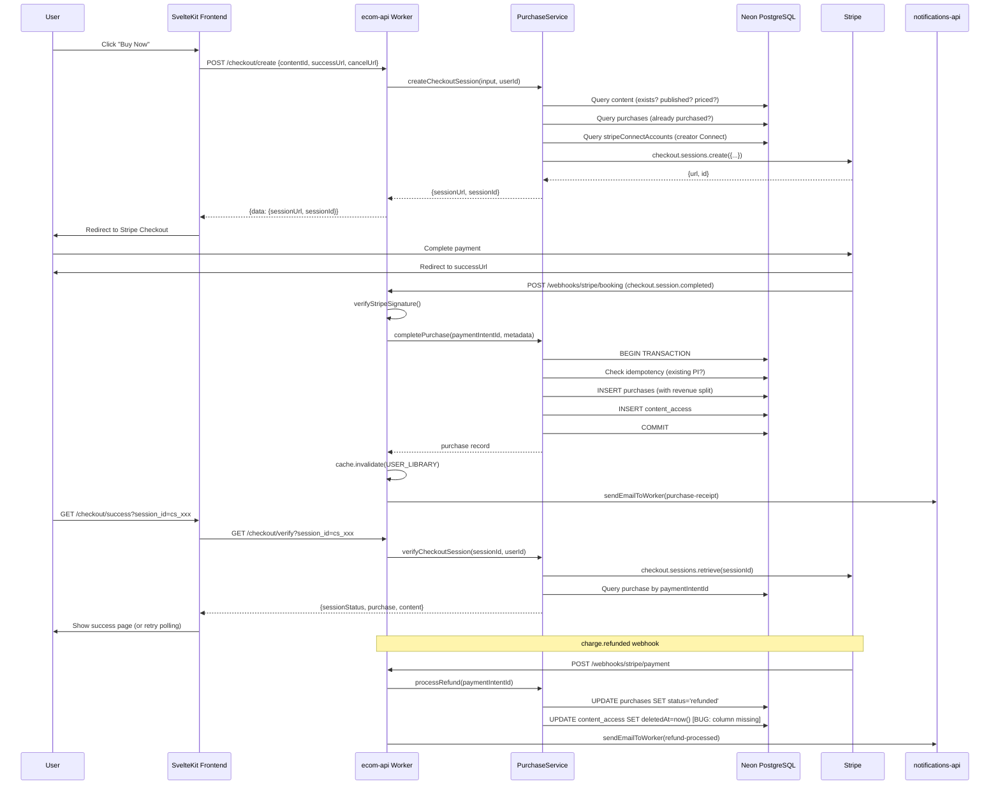

# One-Time Purchase Flow Audit

## Overview

This audit covers the complete one-time purchase lifecycle: from the user clicking "Buy" through Stripe Checkout, webhook processing, purchase completion, access grant, and the success page experience. It also covers refund processing and revenue calculation.

**Files audited:**
- `packages/purchase/src/services/purchase-service.ts` (908 lines)
- `packages/purchase/src/services/revenue-calculator.ts` (172 lines)
- `packages/purchase/src/index.ts` (84 lines)
- `packages/purchase/src/errors.ts` (110 lines)
- `packages/purchase/src/types.ts` (109 lines)
- `packages/purchase/src/stripe-client.ts` (110 lines)
- `packages/validation/src/schemas/purchase.ts` (208 lines)
- `packages/database/src/schema/ecommerce.ts` (440 lines)
- `workers/ecom-api/src/routes/checkout.ts` (194 lines)
- `workers/ecom-api/src/routes/purchases.ts` (110 lines)
- `workers/ecom-api/src/handlers/checkout.ts` (188 lines)
- `workers/ecom-api/src/handlers/payment-webhook.ts` (89 lines)
- `workers/ecom-api/src/utils/webhook-handler.ts` (85 lines)
- `workers/ecom-api/src/utils/error-classification.ts` (72 lines)
- `apps/web/src/lib/server/content-detail.ts` (190 lines)
- `apps/web/src/lib/remote/checkout.remote.ts` (123 lines)
- `apps/web/src/routes/_org/[slug]/(space)/checkout/success/+page.server.ts` (58 lines)
- `apps/web/src/lib/components/ui/CheckoutSuccess/CheckoutSuccess.svelte` (412 lines)
- `packages/purchase/src/__tests__/purchase-service.test.ts` (~700 lines)
- `packages/purchase/src/__tests__/revenue-calculator.test.ts` (292 lines)

---

## Flow Diagram



---

## Bugs Found

### BUG-PUR-001: `content_access.deletedAt` column does not exist -- refund silently fails

**Severity:** Critical
**File:** `packages/purchase/src/services/purchase-service.ts`, lines 696-705
**File:** `packages/database/src/schema/ecommerce.ts`, lines 24-75

The `processRefund()` method attempts to soft-delete the `content_access` record:

```typescript
// Line 697-704
await this.db
  .update(contentAccess)
  .set({ deletedAt: new Date() })
  .where(
    and(
      eq(contentAccess.userId, purchase.customerId),
      eq(contentAccess.contentId, purchase.contentId),
      isNull(contentAccess.deletedAt)
    )
  );
```

The `content_access` table schema (ecommerce.ts lines 24-75) has NO `deletedAt` column. The columns are: `id`, `userId`, `contentId`, `organizationId`, `accessType`, `expiresAt`, `createdAt`, `updatedAt`. This means:

1. The Drizzle `.set({ deletedAt: new Date() })` will fail at runtime with a column-not-found error (or be silently ignored depending on Drizzle version).
2. The `.where(isNull(contentAccess.deletedAt))` will similarly fail.
3. Refunded users **retain access** to content they were refunded for.

**Fix:** Either (a) add a `deletedAt` column to `content_access` via migration, or (b) use `DELETE` to hard-remove the access row (since access records are not user-owned content and hard-delete is acceptable here), or (c) set `expiresAt` to past date to revoke access.

---

### BUG-PUR-002: `processRefund()` is not transactional -- partial state on failure

**Severity:** High
**File:** `packages/purchase/src/services/purchase-service.ts`, lines 669-716

The refund method performs two independent database operations:

1. Line 690-692: `UPDATE purchases SET status='refunded'`
2. Line 697-704: `UPDATE content_access SET deletedAt=now()` (broken, see BUG-PUR-001)

These are NOT wrapped in `db.transaction()`. If the first update succeeds but the second fails (or vice versa), the data is left in an inconsistent state: purchase marked as refunded but access still granted, or access revoked but purchase still showing as completed.

Per CLAUDE.md rules: "MUST use db.transaction() for multi-step operations."

**Fix:** Wrap both operations in `this.db.transaction(async (tx) => { ... })`. Note this requires the service to be initialized with a WebSocket-capable DB client (`dbWs`), which webhook handlers already do via `createPerRequestDbClient()`.

---

### BUG-PUR-003: `content_access` unique constraint blocks re-purchase after refund

**Severity:** High
**File:** `packages/database/src/schema/ecommerce.ts`, lines 69-73
**File:** `packages/purchase/src/services/purchase-service.ts`, lines 433-439

The `content_access` table has:
```sql
UNIQUE("user_id", "content_id")
```

When a purchase is completed, `completePurchase()` inserts a `content_access` row. When a refund happens, `processRefund()` attempts to soft-delete it (BUG-PUR-001: this is broken). Even if soft-delete worked, the row still physically exists, so a subsequent re-purchase would hit a unique constraint violation on the `contentAccess` insert at line 433.

The `purchases` table deliberately has NO `(customerId, contentId)` unique constraint (comment at line 352-354 in ecommerce.ts) to allow re-purchase, but `content_access` blocks it.

**Fix:** Use `ON CONFLICT (userId, contentId) DO UPDATE SET accessType='purchased', expiresAt=null` in the `completePurchase()` insert, or delete the old access row during refund and re-insert on re-purchase.

---

### BUG-PUR-004: Receipt email references metadata fields that are never set

**Severity:** Medium
**File:** `workers/ecom-api/src/handlers/checkout.ts`, lines 166-167
**File:** `packages/purchase/src/services/purchase-service.ts`, lines 271-276

The checkout handler reads receipt data from Stripe session metadata:

```typescript
// checkout.ts line 166-167
const contentTitle =
  metadata?.contentTitle || metadata?.contentName || 'Content purchase';
```

But `createCheckoutSession()` (purchase-service.ts lines 271-276) only sets these metadata fields:
- `contentId`
- `customerId`
- `organizationId`
- `creatorId`

Neither `contentTitle` nor `contentName` is set. The receipt email will always show "Content purchase" as the title, not the actual content name. This is a poor customer experience -- the customer receives a receipt for "Content purchase" instead of "Premium Tutorial" or whatever they bought.

**Fix:** Add `contentTitle: contentRecord.title` to the metadata object at line 271 in purchase-service.ts.

---

### BUG-PUR-005: `processRefund()` does not set refund tracking fields

**Severity:** Medium
**File:** `packages/purchase/src/services/purchase-service.ts`, lines 690-692
**File:** `packages/database/src/schema/ecommerce.ts`, lines 275-278

The `purchases` table has four refund tracking columns:
- `refundedAt` (timestamp)
- `refundReason` (text)
- `refundAmountCents` (integer)
- `stripeRefundId` (varchar)

But `processRefund()` only sets:
```typescript
.set({ status: PURCHASE_STATUS.REFUNDED, updatedAt: new Date() })
```

It does not set `refundedAt`, `refundReason`, `refundAmountCents`, or `stripeRefundId`. The `charge.refunded` event from Stripe provides all of this information (charge object has `amount_refunded`, refund ID via `charge.refunds.data[0].id`, etc.), but the handler at `payment-webhook.ts` only passes `paymentIntentId` to `processRefund()`.

**Fix:** Extend `processRefund()` signature to accept refund details and populate all tracking fields.

---

### BUG-PUR-006: Application fee calculation duplicated and potentially divergent from revenue split

**Severity:** Medium
**File:** `packages/purchase/src/services/purchase-service.ts`, lines 215-218 vs 362-371

The application fee for Stripe Connect destination charges is calculated inline at checkout creation:

```typescript
// Line 215-218
const applicationFeeCents = creatorConnect?.chargesEnabled
  ? Math.ceil(
      (contentRecord.priceCents * DEFAULT_PLATFORM_FEE_PERCENTAGE) / 10000
    )
  : undefined;
```

Then in `completePurchase()`, the revenue split is calculated independently via `calculateRevenueSplit()` at line 367-371. These two calculations:

1. Use the same formula (`Math.ceil(amount * percentage / 10000)`) but are maintained separately.
2. Could diverge if `DEFAULT_PLATFORM_FEE_PERCENTAGE` is changed in only one location (though currently both use the same constant).
3. The Stripe application fee (what Stripe withholds) and the recorded `platformFeeCents` in the purchase record could differ if the webhook `amountPaidCents` differs from the content's `priceCents` (e.g., Stripe applies currency conversion, or amount differs due to promotions).

**Fix:** Extract the application fee calculation to use `calculateRevenueSplit()` at checkout time too, or at minimum add a reconciliation check in `completePurchase()` that compares the stored split with the Stripe-reported application fee.

---

### BUG-PUR-007: No Stripe Customer object linkage -- anonymous checkout sessions

**Severity:** Low (Phase 1) / Medium (Phase 2+)
**File:** `packages/purchase/src/services/purchase-service.ts`, lines 237-278

`createCheckoutSession()` does not set a `customer` field on the Stripe Checkout Session. Each purchase creates an anonymous guest session. This means:

1. Stripe Dashboard cannot correlate purchases to a single customer.
2. The billing portal (`createPortalSession()` at line 863) does a customer lookup by email, which is fragile (email changes, multiple emails).
3. No ability to prefill returning customer payment methods.
4. Stripe's fraud detection is less effective without customer continuity.

The `client_reference_id` is set (line 277), but this is only for Stripe's reference, not for customer object linkage.

**Fix:** Look up or create a Stripe Customer object (by Codex userId metadata) and pass it as `customer: stripeCustomerId` in the session create call. Store the mapping in a `stripe_customers` table or extend the user record.

---

## Improvements

### IMP-PUR-001: `completePurchase()` idempotency check should verify metadata consistency

**Priority:** Medium
**File:** `packages/purchase/src/services/purchase-service.ts`, lines 351-357

The idempotency check returns the existing purchase without verifying that the metadata matches:

```typescript
if (existing) {
  return existing;  // Returns even if metadata differs
}
```

If Stripe sends the same `paymentIntentId` but with different metadata (unlikely but theoretically possible in error scenarios), the service silently returns stale data. A defensive check should log a warning if the metadata differs:

```typescript
if (existing) {
  if (existing.contentId !== metadata.contentId || existing.customerId !== metadata.customerId) {
    this.obs.warn('Idempotent purchase metadata mismatch', { ... });
  }
  return existing;
}
```

---

### IMP-PUR-002: Missing `creatorId` in `checkoutSessionMetadataSchema` and `CompletePurchaseMetadata`

**Priority:** Medium
**File:** `packages/validation/src/schemas/purchase.ts`, lines 150-154
**File:** `packages/purchase/src/types.ts`, lines 48-59

The checkout metadata includes `creatorId` (set at purchase-service.ts line 275), but the validation schema `checkoutSessionMetadataSchema` only validates `customerId`, `contentId`, and `organizationId`. The `creatorId` field is silently stripped during validation. It is also absent from `CompletePurchaseMetadata` type.

While `creatorId` is not currently needed for purchase completion (the purchase record stores it via the content join), this means the webhook handler has no validated creator context for logging, email personalization, or future use.

**Fix:** Add `creatorId` to the metadata schema and `CompletePurchaseMetadata` type.

---

### IMP-PUR-003: `createCheckoutSession()` does not check if user is the content creator (self-purchase)

**Priority:** Low
**File:** `packages/purchase/src/services/purchase-service.ts`, lines 134-308

A creator can purchase their own content. While not technically harmful, it creates a real Stripe charge and a revenue split that pays the creator back (minus platform fee). This could be used to test the flow but is wasteful for real money.

**Fix:** Add an optional guard that warns or blocks self-purchase:
```typescript
if (contentRecord.creatorId === customerId) {
  throw new ContentNotPurchasableError(validated.contentId, 'self_purchase');
}
```

---

### IMP-PUR-004: Webhook handler returns 200 even on permanent failure -- no alerting

**Priority:** Medium
**File:** `workers/ecom-api/src/utils/webhook-handler.ts`, lines 62-83

The `createWebhookHandler()` factory correctly returns 500 for transient errors (triggering Stripe retry) and 200 for permanent errors (acknowledging receipt). However, permanent errors only log a `warn` (line 76), not an `error`. This means permanent failures like data integrity issues, schema validation failures, or unknown errors may go unnoticed without proper log monitoring.

**Fix:** Log permanent failures at `error` level and add a mechanism for alerting (e.g., fire-and-forget notification to an admin channel).

---

### IMP-PUR-005: Revenue split uses hardcoded defaults -- no database fee lookup

**Priority:** Low (Phase 1 design choice)
**File:** `packages/purchase/src/services/purchase-service.ts`, lines 362-363

The `completePurchase()` method hardcodes fee percentages:

```typescript
const platformFeePercentage = DEFAULT_PLATFORM_FEE_PERCENTAGE; // 1000 = 10%
const orgFeePercentage = DEFAULT_ORG_FEE_PERCENTAGE; // 0 = 0%
```

The database has `platformFeeConfig`, `organizationPlatformAgreements`, and `creatorOrganizationAgreements` tables ready (ecommerce.ts lines 86-210), but they are not queried. This is documented as a Phase 1 decision, but the tables exist unused.

**Fix:** Implement fee lookup from the agreement tables with fallback to defaults. The `platformAgreementId` and `creatorOrgAgreementId` fields on the purchase record are already designed for this (set to `null` for defaults).

---

### IMP-PUR-006: `verifyCheckoutSession()` does not handle webhook race condition gracefully

**Priority:** Medium
**File:** `packages/purchase/src/services/purchase-service.ts`, lines 772-803
**File:** `apps/web/src/lib/components/ui/CheckoutSuccess/CheckoutSuccess.svelte`

When the success page loads, `verifyCheckoutSession()` queries both Stripe and the local DB. If the webhook has not yet arrived (common -- Stripe webhooks are async), the session shows `status: 'complete'` from Stripe but `purchase` is `null` from the DB. The frontend handles this with a 3-second retry poll (max 5 retries).

However, the service returns the result as-is without indicating whether the purchase is pending webhook processing. The frontend could display a more informative message if the response included a `webhookPending: true` flag.

Additionally, if all 5 retries fail (15 seconds total), the fallback message says "Almost there" with a link to the library. But the purchase may not show up in the library yet either.

**Fix:** Add `webhookPending: boolean` to `CheckoutSessionVerifyResult` when session is complete but purchase record is missing. Increase retry window or add a manual "Check again" button.

---

### IMP-PUR-007: `getPurchase()` query does not scope by `deletedAt` or soft-delete status

**Priority:** Low
**File:** `packages/purchase/src/services/purchase-service.ts`, lines 639-642

The `getPurchase()` query:

```typescript
const purchase = await this.db.query.purchases.findFirst({
  where: and(
    eq(purchases.id, validated.id),
    eq(purchases.customerId, customerId)
  ),
});
```

The `purchases` table does not have a `deletedAt` column (purchases are immutable records), so this is technically correct. However, per CLAUDE.md rules, all queries should use scoping helpers. Since `purchases` has no `deletedAt`, this is a non-issue but should be documented.

---

### IMP-PUR-008: `verifyCheckoutSessionSchema` accepts any non-empty string for `session_id`

**Priority:** Low
**File:** `packages/validation/src/schemas/purchase.ts`, lines 198-200

```typescript
export const verifyCheckoutSessionSchema = z.object({
  session_id: z.string().min(1),
});
```

Stripe session IDs always match the pattern `cs_test_*` or `cs_live_*`. A regex validation could prevent clearly invalid IDs from reaching the Stripe API:

```typescript
session_id: z.string().regex(/^cs_(test|live)_[A-Za-z0-9]+$/)
```

---

### IMP-PUR-009: `checkout.remote.ts` fallback URLs bypass domain whitelist validation

**Priority:** Low
**File:** `apps/web/src/lib/remote/checkout.remote.ts`, lines 48-50 and 116-117

The remote functions build fallback URLs dynamically:

```typescript
successUrl: successUrl || `${url.origin}/library?purchase=success`,
cancelUrl: cancelUrl || `${url.origin}/content/${contentId}`,
```

These are constructed from `url.origin` which comes from the request. In theory, a manipulated `Host` header could generate a URL pointing to an untrusted domain. However, the backend `checkoutRedirectUrlSchema` validates against a whitelist, so this would be caught server-side. The risk is minimal but the fallback construction should be noted.

---

### IMP-PUR-010: Refund email uses `charge.metadata?.contentTitle` which is never set

**Priority:** Medium
**File:** `workers/ecom-api/src/handlers/payment-webhook.ts`, line 71

```typescript
contentTitle: charge.metadata?.contentTitle || 'Content',
```

The charge metadata is inherited from the payment intent, which gets its metadata from the checkout session. As noted in BUG-PUR-004, `contentTitle` is never set in the session metadata, so the refund email will always show "Content" instead of the actual title.

---

### IMP-PUR-011: No partial refund support

**Priority:** Low (Phase 1)
**File:** `packages/purchase/src/services/purchase-service.ts`, lines 669-716

The `processRefund()` method treats all refunds as full refunds: it sets `status='refunded'` unconditionally. Stripe supports partial refunds where `charge.amount_refunded < charge.amount`. The handler does not distinguish between partial and full refunds, meaning a partial refund would fully revoke content access.

**Fix:** Check `charge.amount_refunded` against `charge.amount`. For partial refunds, retain access but update `refundAmountCents`.

---

### IMP-PUR-012: Missing test coverage for `processRefund()`, `verifyCheckoutSession()`, `createPortalSession()`, and `formatPurchasesForClient()`

**Priority:** Medium
**File:** `packages/purchase/src/__tests__/purchase-service.test.ts`

The test file covers:
- `createCheckoutSession()` -- 3 tests (valid, free, unpublished, already purchased)
- `completePurchase()` -- 3 tests (revenue split, idempotency, access grant)
- `verifyPurchase()` -- 3 tests (true, false, different customer)
- `getPurchaseHistory()` -- implied by structure

**Missing test coverage:**
- `processRefund()` -- zero tests (most bug-prone method)
- `verifyCheckoutSession()` -- zero tests
- `createPortalSession()` -- zero tests
- `formatPurchasesForClient()` -- zero tests
- `getPurchase()` -- authorization check (403 vs 404)
- Edge cases: Connect account not ready, content without org, webhook retry

---

### IMP-PUR-013: `getPurchaseHistory` does not exclude soft-deleted purchases

**Priority:** Low
**File:** `packages/purchase/src/services/purchase-service.ts`, lines 515-574

The `purchases` table has no `deletedAt` column and purchases are documented as immutable, so this is by design. However, refunded purchases still appear in the history. This is probably desirable (users should see their refund history), but should be documented.

---

### IMP-PUR-014: Checkout `POST /checkout/create` returns 200 instead of 201

**Priority:** Low
**File:** `workers/ecom-api/src/routes/checkout.ts`, lines 87-116

The checkout creation endpoint does not set `successStatus: 201`. Per the procedure patterns in CLAUDE.md, POST create endpoints should return 201. However, one could argue that creating a checkout session is an "action" (not a resource creation), so 200 is acceptable. Worth noting for consistency.

---

## Work Packets

### WP-PUR-01: Fix refund pipeline (Critical)

**Bugs addressed:** BUG-PUR-001, BUG-PUR-002, BUG-PUR-003, BUG-PUR-005
**Improvements addressed:** IMP-PUR-011
**Dependencies:** None (standalone fix)
**Estimated effort:** 4-6 hours
**Priority:** P0 -- refunds are completely broken

**Scope:**

1. **Add `deletedAt` column to `content_access`** via Drizzle migration:
   ```typescript
   deletedAt: timestamp('deleted_at', { withTimezone: true }),
   ```
   Update indexes and the unique constraint to be a partial unique index excluding soft-deleted rows, or switch to hard-delete for access records.

2. **Make `processRefund()` transactional:**
   ```typescript
   async processRefund(paymentIntentId: string, refundDetails: RefundDetails): Promise<void> {
     await this.db.transaction(async (tx) => {
       // Update purchase status + refund tracking fields
       // Soft-delete content_access
     });
   }
   ```

3. **Populate refund tracking fields:**
   - Extend `processRefund()` to accept `{ refundAmountCents, stripeRefundId, refundReason? }`
   - Update `payment-webhook.ts` to extract and pass these from the Stripe charge object
   - Set `refundedAt`, `refundAmountCents`, `stripeRefundId` on the purchase record

4. **Handle re-purchase after refund:**
   - Change `completePurchase()` to use `ON CONFLICT DO UPDATE` for the `contentAccess` insert
   - Or: hard-delete access row during refund (simpler, since access is an entitlement not user data)

5. **Add partial refund awareness:**
   - Compare `charge.amount_refunded` vs `charge.amount`
   - For partial refunds: update `refundAmountCents` but do NOT revoke access or change status

6. **Write tests:**
   - Full refund flow (purchase -> refund -> verify no access)
   - Re-purchase after refund
   - Partial refund (access retained)
   - Idempotent refund (already refunded)
   - Transactional rollback on failure

**Files to modify:**
- `packages/database/src/schema/ecommerce.ts` -- add `deletedAt` to `content_access`
- `packages/database/src/migrations/` -- new migration
- `packages/purchase/src/services/purchase-service.ts` -- refactor `processRefund()`
- `packages/purchase/src/types.ts` -- add `RefundDetails` type
- `workers/ecom-api/src/handlers/payment-webhook.ts` -- pass refund details
- `packages/purchase/src/__tests__/purchase-service.test.ts` -- add refund tests

---

### WP-PUR-02: Fix receipt email metadata (Medium)

**Bugs addressed:** BUG-PUR-004, IMP-PUR-010
**Improvements addressed:** IMP-PUR-002
**Dependencies:** None (standalone fix)
**Estimated effort:** 1-2 hours
**Priority:** P1 -- customers receive generic receipt emails

**Scope:**

1. **Add `contentTitle` to Stripe session metadata:**
   ```typescript
   // purchase-service.ts line 271
   metadata: {
     contentId: validated.contentId,
     customerId,
     organizationId: contentRecord.organizationId,
     creatorId: contentRecord.creatorId,
     contentTitle: contentRecord.title.slice(0, 500), // Stripe limits to 500 chars
   },
   ```

2. **Add `creatorId` and `contentTitle` to `checkoutSessionMetadataSchema`:**
   ```typescript
   export const checkoutSessionMetadataSchema = z.object({
     customerId: userIdSchema,
     contentId: uuidSchema,
     organizationId: uuidSchema.nullable().default(null),
     creatorId: userIdSchema.optional(),
     contentTitle: z.string().max(500).optional(),
   });
   ```

3. **Update `CompletePurchaseMetadata` type** to include `creatorId`.

4. **Update checkout handler** to use validated `contentTitle` for the receipt email instead of the broken metadata lookup.

**Files to modify:**
- `packages/purchase/src/services/purchase-service.ts` -- add `contentTitle` to metadata
- `packages/validation/src/schemas/purchase.ts` -- extend metadata schema
- `packages/purchase/src/types.ts` -- extend `CompletePurchaseMetadata`
- `workers/ecom-api/src/handlers/checkout.ts` -- use validated title for email

---

### WP-PUR-03: Application fee reconciliation (Medium)

**Bugs addressed:** BUG-PUR-006
**Dependencies:** None
**Estimated effort:** 2-3 hours
**Priority:** P1 -- ensures Stripe fee and recorded split are consistent

**Scope:**

1. **Deduplicate application fee calculation:** Extract to a shared function or reuse `calculateRevenueSplit()`:
   ```typescript
   const revenueSplit = calculateRevenueSplit(
     contentRecord.priceCents,
     DEFAULT_PLATFORM_FEE_PERCENTAGE,
     DEFAULT_ORG_FEE_PERCENTAGE
   );
   const applicationFeeCents = creatorConnect?.chargesEnabled
     ? revenueSplit.platformFeeCents
     : undefined;
   ```

2. **Add reconciliation in `completePurchase()`:**
   - Compare `metadata.amountPaidCents` against the content's `priceCents`
   - Log a warning if they differ (indicates Stripe currency conversion or promotion applied)

3. **Add test:** Verify that application fee matches `platformFeeCents` from revenue split for the same amount.

**Files to modify:**
- `packages/purchase/src/services/purchase-service.ts` -- use `calculateRevenueSplit` for checkout fee

---

### WP-PUR-04: Stripe Customer linkage (Low priority)

**Bugs addressed:** BUG-PUR-007
**Dependencies:** May require schema changes
**Estimated effort:** 4-6 hours
**Priority:** P2 -- improves Stripe Dashboard UX and fraud detection

**Scope:**

1. **Create `stripe_customers` table** or add `stripeCustomerId` to the `users` table.
2. **In `createCheckoutSession()`:** Look up or create Stripe Customer, pass as `customer:` field.
3. **Prefill payment methods** for returning customers.
4. **Update `createPortalSession()`** to use stored customer ID instead of email lookup.

**Files to modify:**
- `packages/database/src/schema/` -- new table or column
- `packages/purchase/src/services/purchase-service.ts` -- customer lookup/create
- Migration file

---

### WP-PUR-05: Improve webhook error handling and success page UX (Low priority)

**Improvements addressed:** IMP-PUR-004, IMP-PUR-006
**Dependencies:** None
**Estimated effort:** 2-3 hours
**Priority:** P2

**Scope:**

1. **Upgrade permanent error logging** from `warn` to `error` in `createWebhookHandler()`.
2. **Add `webhookPending` flag** to `CheckoutSessionVerifyResult` when session is complete but purchase record is missing.
3. **Add "Check again" button** in CheckoutSuccess fallback state.
4. **Consider increasing retry count** from 5 to 10 (30 seconds total).

**Files to modify:**
- `workers/ecom-api/src/utils/webhook-handler.ts`
- `packages/purchase/src/services/purchase-service.ts`
- `packages/purchase/src/types.ts`
- `apps/web/src/lib/components/ui/CheckoutSuccess/CheckoutSuccess.svelte`

---

### WP-PUR-06: Comprehensive test coverage (Medium priority)

**Improvements addressed:** IMP-PUR-012
**Dependencies:** WP-PUR-01 (refund tests depend on fixed refund pipeline)
**Estimated effort:** 4-6 hours
**Priority:** P1

**Scope:**

Add tests for:
1. `processRefund()` -- full refund, partial refund, idempotent, unknown PI, transaction rollback
2. `verifyCheckoutSession()` -- complete session, pending session, expired session, different user (403), invalid session ID
3. `createPortalSession()` -- existing customer, new customer, Stripe error handling
4. `formatPurchasesForClient()` -- valid statuses, unknown status fallback, date formatting
5. `getPurchase()` -- found, not found (404), wrong customer (currently 404, should it be 403?)
6. `createCheckoutSession()` -- self-purchase, Connect account not ready, content without org

**Files to modify:**
- `packages/purchase/src/__tests__/purchase-service.test.ts` -- expand significantly

---

### Work Packet Dependency Graph

```
WP-PUR-01 (Refund pipeline)  ←── WP-PUR-06 (Tests - refund portion)
     |
     v
WP-PUR-02 (Receipt email metadata)  [independent]
WP-PUR-03 (Fee reconciliation)      [independent]
WP-PUR-04 (Stripe Customer)         [independent]
WP-PUR-05 (Webhook/UX polish)       [independent]
WP-PUR-06 (Test coverage)           [depends on WP-PUR-01 for refund tests]
```

### Priority Summary

| WP | Priority | Effort | Description |
|----|----------|--------|-------------|
| WP-PUR-01 | **P0** | 4-6h | Fix broken refund pipeline |
| WP-PUR-02 | **P1** | 1-2h | Fix receipt email showing generic title |
| WP-PUR-03 | **P1** | 2-3h | Deduplicate and reconcile fee calculation |
| WP-PUR-06 | **P1** | 4-6h | Add missing test coverage |
| WP-PUR-04 | P2 | 4-6h | Stripe Customer linkage |
| WP-PUR-05 | P2 | 2-3h | Webhook error handling and success page UX |
