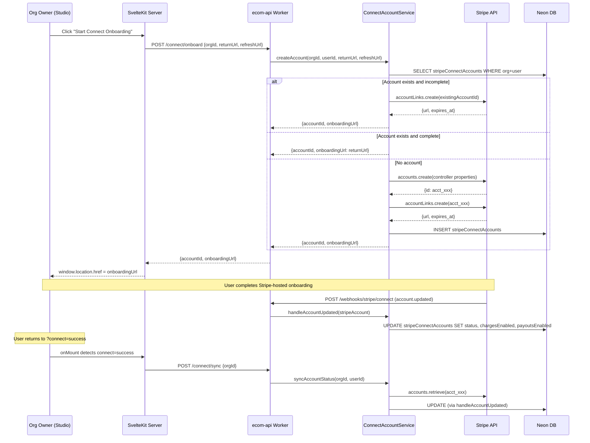
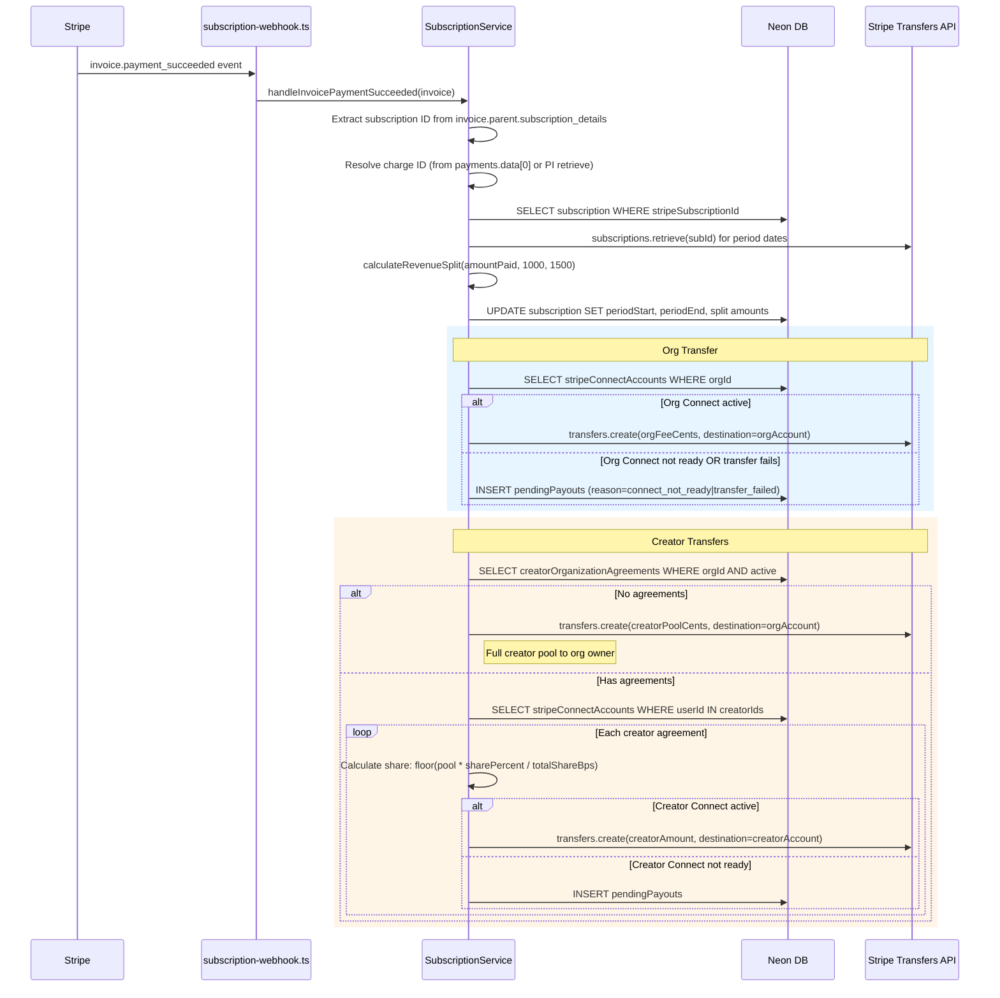

# Stripe Connect & Revenue Audit

## Overview

This audit covers the full Stripe Connect onboarding lifecycle, the two distinct revenue models (one-time purchases vs subscriptions), the transfer execution pipeline, and the Studio monetisation UI. The codebase implements a "separate charges and transfers" pattern for subscriptions (3-party split) and "destination charges" for purchases (2-party, creator-direct). Both models share the same `FEES.PLATFORM_PERCENT` (10%) constant but differ in org fee treatment and transfer mechanics.

**Files audited:**

| File | Lines | Purpose |
|---|---|---|
| `packages/subscription/src/services/connect-account-service.ts` | 317 | Connect account lifecycle |
| `packages/subscription/src/services/revenue-split.ts` | 71 | Subscription revenue calculator |
| `packages/subscription/src/services/subscription-service.ts` | 1037 | Subscription lifecycle + transfers |
| `packages/purchase/src/services/purchase-service.ts` | 909 | Purchase checkout + completion |
| `packages/purchase/src/services/revenue-calculator.ts` | 172 | Purchase revenue calculator |
| `workers/ecom-api/src/routes/connect.ts` | 147 | Connect API endpoints |
| `workers/ecom-api/src/handlers/connect-webhook.ts` | 78 | Connect webhook handler |
| `workers/ecom-api/src/handlers/subscription-webhook.ts` | 212 | Subscription webhook handler |
| `workers/ecom-api/src/handlers/checkout.ts` | 188 | Purchase checkout webhook |
| `workers/ecom-api/src/handlers/payment-webhook.ts` | 89 | Refund webhook handler |
| `workers/ecom-api/src/utils/dev-webhook-router.ts` | 83 | Dev webhook dispatcher |
| `workers/ecom-api/src/index.ts` | 216 | Ecom worker setup + routes |
| `packages/database/src/schema/subscriptions.ts` | 365 | Connect + subscription schema |
| `packages/database/src/schema/ecommerce.ts` | 440 | Purchase + agreements schema |
| `packages/constants/src/commerce.ts` | 56 | Fee constants |
| `apps/web/src/routes/_org/[slug]/studio/monetisation/+page.svelte` | 850 | Studio Connect UI |
| `apps/web/src/lib/remote/subscription.remote.ts` | 384 | Connect remote functions |
| `packages/worker-utils/src/procedure/service-registry.ts` | (relevant sections) | Service registry |
| `docs/stripe-connect-subscription-reference.md` | ~600 | Design reference |

---

## Connect Onboarding Flow



**Key design decisions:**
- Express-equivalent via `controller` properties (new Stripe API, not legacy `type: 'express'`)
- Platform pays fees (`controller.fees.payer: 'application'`)
- Platform absorbs losses (`controller.losses.payments: 'application'`)
- Stripe handles all KYC (`controller.requirement_collection: 'stripe'`)
- `collection_options.fields: 'eventually_due'` collects all info upfront
- Manual sync endpoint (`/connect/sync`) for local dev where webhooks cannot reach

---

## Revenue Models

### Purchase Model (Destination Charges)

```
Customer pays GBP X for content
    |
    v
Stripe creates charge on CREATOR's Connected Account
Platform takes application_fee_amount (10% of gross)
Creator receives remainder (90%) directly
Org receives: 0% (Phase 1)
```

**Implementation:** `PurchaseService.createCheckoutSession()` (lines 237-278)
- Uses `payment_intent_data.transfer_data.destination` to route charge to creator
- Uses `payment_intent_data.application_fee_amount` for platform cut
- Falls back to platform-only charge if creator has no Connect account

**Revenue split (purchase):** `packages/purchase/src/services/revenue-calculator.ts`
- `FEES.PLATFORM_PERCENT` = 1000 (10%)
- `FEES.ORG_PERCENT` = 0 (0%)
- Creator gets 90%

### Subscription Model (Separate Charges + Transfers)

```
Customer pays GBP X for subscription
    |
    v
Stripe creates charge on PLATFORM account (no destination)
    |
    +---> Platform retains 10% (FEES.PLATFORM_PERCENT)
    |
    +---> stripe.transfers.create() to Org account
    |     (15% of post-platform = FEES.SUBSCRIPTION_ORG_PERCENT)
    |
    +---> stripe.transfers.create() to Creator(s) account(s)
          (remainder, split by creatorOrganizationAgreements)
```

**Implementation:** `SubscriptionService.executeTransfers()` (lines 824-1036)
- Uses `source_transaction` to link transfers to the original charge
- Uses `transfer_group` for grouping (`sub_{subscriptionId}`)
- Uses idempotency keys (`{chargeId}_org_fee`, `{chargeId}_creator_{creatorId}`)
- Falls back to `pendingPayouts` table when Connect not ready

**Revenue split (subscription):** `packages/subscription/src/services/revenue-split.ts`
- `FEES.PLATFORM_PERCENT` = 1000 (10%)
- `FEES.SUBSCRIPTION_ORG_PERCENT` = 1500 (15% of post-platform)
- Creator pool = 85% of post-platform = 76.5% of gross

### Comparison Table

| Aspect | Purchase | Subscription |
|---|---|---|
| Stripe pattern | Destination charges | Separate charges + transfers |
| Charge on | Creator's connected account | Platform account |
| Platform fee mechanism | `application_fee_amount` | Retained in balance (no transfer) |
| Org fee | 0% (Phase 1) | 15% of post-platform |
| Creator payout | Automatic via destination | Manual `stripe.transfers.create()` |
| Multi-creator support | No (single creator per content) | Yes (via agreements table) |
| Connect required for | Creator (falls back if missing) | Org + all creators |
| Pending payout fallback | No (stays in platform) | Yes (`pendingPayouts` table) |
| Idempotency | `stripePaymentIntentId` unique | `stripeSubscriptionId` unique + idempotency keys |

---

## Transfer Flow



---

## Bugs Found

### BUG-CON-001: contentAccess table missing deletedAt column -- refund handler will crash

**Severity:** CRITICAL
**File:** `packages/database/src/schema/ecommerce.ts` (lines 24-75)
**Impact:** `PurchaseService.processRefund()` at line 700-703 does `contentAccess.set({ deletedAt: new Date() })` with an `isNull(contentAccess.deletedAt)` filter, but the `contentAccess` table has NO `deletedAt` column defined in the Drizzle schema. This will cause a runtime error on every refund attempt.

**Evidence:** The `contentAccess` pgTable definition (ecommerce.ts lines 24-56) contains only: `id`, `userId`, `contentId`, `organizationId`, `accessType`, `expiresAt`, `createdAt`, `updatedAt`. No `deletedAt` column exists. Grep for `deletedAt` in ecommerce.ts returns zero matches.

**Fix:** Add `deletedAt: timestamp('deleted_at', { withTimezone: true })` to the `contentAccess` table schema and generate a migration.

---

### BUG-CON-002: Pending payout inserted with empty string userId when org has no Connect account

**Severity:** HIGH
**File:** `packages/subscription/src/services/subscription-service.ts` (line 885)
**Impact:** When an org has no Connect account at all (`orgConnect` is undefined), the code inserts a pending payout with `userId: orgConnect?.userId ?? ''`. An empty string violates the `users` FK constraint and will cause a database error.

**Code:**
```typescript
// Line 885
userId: orgConnect?.userId ?? '',
```

**Fix:** When `orgConnect` is null, either skip the pending payout insertion entirely (since there is no user to associate it with), or look up the org owner's userId from the organization membership table.

---

### BUG-CON-003: Subscription checkout missing customer_email and customer on Stripe session

**Severity:** MEDIUM
**File:** `packages/subscription/src/services/subscription-service.ts` (lines 173-191)
**Impact:** The Stripe Checkout session is created without `customer_email` or `customer`. This means:
1. Stripe cannot pre-fill the customer's email on the checkout page
2. Every subscription creates a new Stripe Customer, preventing customer reuse across purchases and subscriptions
3. The subscription-webhook handler (subscription-webhook.ts line 73) relies on `session.customer_details?.email` which only exists after Stripe collects it from the user

**Reference doc says:** `customer_email` or `customer` should be set (stripe-connect-subscription-reference.md).

**Fix:** Pass `customer_email` (from user profile lookup) to the checkout session creation, or look up/create a Stripe Customer and pass `customer`.

---

### BUG-CON-004: Pending payouts table is write-only -- no resolution mechanism

**Severity:** HIGH
**File:** `packages/subscription/src/services/subscription-service.ts`
**Impact:** The `pendingPayouts` table has `resolvedAt` and `stripeTransferId` columns (schema line 274-275), but there is zero code anywhere in the codebase that:
1. Queries unresolved pending payouts
2. Attempts to retry transfers when a Connect account becomes active
3. Marks pending payouts as resolved

**Evidence:** Grep for `resolvePending|processPending` in the subscription package returns zero matches. The `pendingPayouts` table is only ever INSERTed into, never UPDATEed or SELECTed for resolution.

**Fix:** Implement a `resolvePendingPayouts(orgId)` method that:
1. Is triggered when `handleAccountUpdated()` transitions status to `active`
2. Queries `pendingPayouts WHERE resolvedAt IS NULL AND userId = ...`
3. Attempts `stripe.transfers.create()` for each pending payout
4. Updates `resolvedAt` and `stripeTransferId` on success

---

### BUG-CON-005: Dev webhook router routes subscription checkout.session.completed to purchase handler, not subscription handler

**Severity:** HIGH (dev-only, but blocks development testing)
**File:** `workers/ecom-api/src/utils/dev-webhook-router.ts` (lines 36-40)
**Impact:** The event routes are evaluated in order. `checkout.session.completed` matches the first route (Checkout handler), which is the purchase handler. The purchase handler at `workers/ecom-api/src/handlers/checkout.ts` line 59 checks `session.mode !== 'payment'` and returns early for subscription-mode sessions -- so subscription checkouts are silently dropped.

The subscription handler at `workers/ecom-api/src/handlers/subscription-webhook.ts` line 44 also handles `STRIPE_EVENTS.CHECKOUT_COMPLETED`, but because the dev router matches the checkout route first, it never reaches the subscription handler.

**Route evaluation order:**
1. `type === CHECKOUT_COMPLETED` -> Checkout handler (matches first, returns early for subscription mode)
2. `type.startsWith('customer.subscription.')` -> Subscription handler (never reached for checkout.session.completed)

**Fix:** Either:
- (a) Change the Checkout route match to: `type === CHECKOUT_COMPLETED && mode === 'payment'` (requires inspecting the event data), or
- (b) Move subscription route before checkout route and have the subscription handler check mode first, or
- (c) Have the checkout handler forward subscription-mode sessions to the subscription handler

**Note:** In production this is not an issue because `checkout.session.completed` is sent to the `/webhooks/stripe/booking` endpoint (purchase handler) and the `/webhooks/stripe/subscription` endpoint (subscription handler) separately, each with their own signing secret.

---

### BUG-CON-006: creatorOrganizationAgreements.organizationFeePercentage semantically repurposed as creator share

**Severity:** MEDIUM (code smell / data integrity risk)
**File:** `packages/subscription/src/services/subscription-service.ts` (lines 904-906, 958-959)
**Impact:** The `creatorOrganizationAgreements` table column is named `organizationFeePercentage` and documented as "Organization's cut of post-platform-fee revenue" (ecommerce.ts line 179). However, in `subscription-service.ts` line 905, it is read as `sharePercent` and used as the creator's share percentage:

```typescript
// Line 904-906
const creatorAgreements = await this.db
  .select({
    creatorId: creatorOrganizationAgreements.creatorId,
    sharePercent: creatorOrganizationAgreements.organizationFeePercentage, // <-- REPURPOSED
  })
```

The comment at line 958 acknowledges this: "creatorOrganizationAgreements.organizationFeePercentage is repurposed as the creator's share percentage in basis points for subscription context."

**Risk:** If anyone reads the schema or uses this table for its documented purpose (org fee percentage), the subscription creator pool distribution will break.

**Fix:** Either rename the column to something generic (e.g., `revenueSharePercentage`) with clear documentation, or add a dedicated `creatorSharePercentage` column.

---

### BUG-CON-007: Creator pool rounding can lose pence with multiple creators

**Severity:** LOW
**File:** `packages/subscription/src/services/subscription-service.ts` (lines 979-981)
**Impact:** Each creator's share is calculated as `Math.floor(creatorPayoutCents * sharePercent / totalShareBps)`. When there are multiple creators, the sum of individual `Math.floor` amounts may be less than `creatorPayoutCents`. The difference (up to N-1 pence for N creators) is silently lost -- it stays in the platform balance.

**Example:** `creatorPayoutCents = 100`, 3 creators with equal share (3333 bps each, total 9999):
- Creator 1: floor(100 * 3333 / 9999) = floor(33.33...) = 33
- Creator 2: floor(100 * 3333 / 9999) = 33
- Creator 3: floor(100 * 3333 / 9999) = 33
- Total distributed: 99. Lost: 1p.

**Fix:** After the loop, calculate the remainder and add it to the last creator's transfer (or the largest share holder).

---

### BUG-CON-008: Subscription service does not handle invoice.payment_failed

**Severity:** MEDIUM
**File:** `packages/subscription/src/services/subscription-service.ts`
**Impact:** The `SubscriptionService` has no `handleInvoicePaymentFailed()` method. The webhook handler at `subscription-webhook.ts` lines 174-202 handles `INVOICE_PAYMENT_FAILED` only for sending an email -- it never updates the subscription status to `past_due`. The subscription status update relies entirely on `customer.subscription.updated` arriving (which it does, but with a potential delay).

This means the local subscription record may show `active` for a period after payment fails, until the `subscription.updated` webhook arrives.

**Fix:** Add an explicit status update in the `INVOICE_PAYMENT_FAILED` handler to set status to `past_due` immediately, rather than waiting for the subscription.updated event.

---

### BUG-CON-009: Purchase destination charges send payment to creator, not org

**Severity:** MEDIUM (by design for Phase 1 but creates inconsistency)
**File:** `packages/purchase/src/services/purchase-service.ts` (lines 200-268)
**Impact:** Purchase checkout creates a destination charge to the CREATOR's Connect account (looked up by `contentRecord.creatorId`). This means:
1. The creator gets 90% directly via Stripe (destination charge)
2. The org gets 0% (Phase 1 default)
3. If the org has a Connect account but the creator does not, the payment stays in the platform account with a warning

**However**, the subscription model transfers to the ORG's Connect account. This means:
- A content creator who sells individual content gets paid to their personal Connect account
- The same creator's subscription revenue goes to the org's Connect account
- The org owner and the creator may be different people

This is internally consistent with the design doc (purchases = 2-party destination, subscriptions = 3-party separate), but will confuse users who expect consistent money flow.

**No code change needed** -- this is a documented design decision. But the Studio UI should clearly explain which Connect account receives which type of revenue.

---

## Improvements

### IMP-CON-001: Connect account creation missing business_profile and email

**File:** `packages/subscription/src/services/connect-account-service.ts` (lines 73-89)
**Impact:** The reference document (stripe-connect-subscription-reference.md lines 134-147) recommends passing `email`, `business_profile.name`, `business_profile.url`, and `business_profile.mcc` when creating the account. The actual implementation only passes `controller`, `capabilities`, `country`, and `metadata`.

**Missing fields:**
- `email` -- Contact email for the connected account
- `business_profile.name` -- Organization name
- `business_profile.url` -- Organization URL
- `business_profile.mcc` -- Merchant category code (`5815` for digital goods)

**Benefit:** Pre-filling these reduces onboarding friction (fewer fields for the user to fill).

**Fix:** Accept org name/email/slug as parameters to `createAccount()` and pass them to `stripe.accounts.create()`.

---

### IMP-CON-002: No creatorOrganizationAgreements CRUD or seed data

**File:** `packages/database/src/schema/ecommerce.ts` (lines 168-210)
**Impact:** The `creatorOrganizationAgreements` table exists in the schema but:
1. No API endpoints exist to create/read/update/delete agreements
2. No seed data is created (confirmed via grep of seed files)
3. The subscription transfer logic (subscription-service.ts line 914) queries this table and finds zero rows, causing the entire creator pool to be sent to the org owner

This means the 3-party subscription split is effectively 2-party (platform + org) until agreements are manually inserted.

**Fix:** Add agreements CRUD endpoints to the ecom-api worker, accessible from the Studio monetisation page. Add seed data for development/testing.

---

### IMP-CON-003: Dashboard link generation lacks security validation

**File:** `packages/subscription/src/services/connect-account-service.ts` (lines 251-262)
**Impact:** `createDashboardLink()` only checks that a Connect account exists for the org, but does NOT verify that the requesting user is the owner of that Connect account. The route handler (`connect.ts` line 140) uses `requireOrgManagement: true` policy, which checks org management permission but not Connect account ownership.

If an org has multiple members with management permissions, any of them could generate a dashboard link for the org owner's Connect account.

**Fix:** Either (a) verify `userId` matches `account.userId` in `createDashboardLink()`, or (b) document that this is intentional for org management delegation.

---

### IMP-CON-004: No refund handling for subscription payments

**File:** N/A (missing feature)
**Impact:** The payment-webhook handler processes `charge.refunded` for purchase refunds only. If a subscription invoice is refunded, there is no mechanism to:
1. Reverse the transfers already sent to org/creator Connect accounts
2. Update the subscription status
3. Notify the subscriber

Stripe supports transfer reversals (`stripe.transfers.createReversal()`) for this purpose.

**Fix:** Add subscription refund handling that reverses transfers proportionally.

---

### IMP-CON-005: No subscription-mode contentAccess grant

**File:** `packages/subscription/src/services/subscription-service.ts`
**Impact:** When a subscription is created (`handleSubscriptionCreated`, line 219), the service inserts a subscription record but does NOT grant `contentAccess` for the subscription tier's content. The access control system needs a separate mechanism to check subscription status, or `contentAccess` records with `accessType: 'subscription'` need to be created.

Currently, the `contentAccess` table supports `'subscription'` as an `accessType` (CHECK constraint at ecommerce.ts line 66), but no code creates subscription-type access records.

**Fix:** Either (a) create `contentAccess` records when subscription is created (and remove them on cancellation), or (b) ensure the access control service checks subscription status directly from the `subscriptions` table (which is the likely design intent, but should be verified).

---

### IMP-CON-006: Studio UI does not show "disabled" Connect status

**File:** `apps/web/src/routes/_org/[slug]/studio/monetisation/+page.svelte` (lines 138-155)
**Impact:** The `connectStatusLabel()` function handles `active`, `onboarding`, and `restricted`, but falls through to "Not Connected" for `disabled` status. A disabled account (e.g., after deauthorization) should show a specific message like "Account Disabled" with instructions.

Additionally, the UI shows no indication of WHY an account might be restricted (missing requirements, under review, etc.).

**Fix:** Add `disabled` case to the status label/variant functions. Consider showing `requirements.currently_due` information when status is `restricted`.

---

### IMP-CON-007: Subscription cancellation email relies on metadata that is never set

**File:** `workers/ecom-api/src/handlers/subscription-webhook.ts` (lines 119-137)
**Impact:** The cancellation email is sent using `subscription.metadata.customerEmail` and `subscription.metadata.customerName`, but the subscription creation code (subscription-service.ts lines 178-190) never sets these metadata fields. The `subscription_data.metadata` only contains `codex_user_id`, `codex_organization_id`, and `codex_tier_id`.

This means the cancellation email is never sent (the `if (cancelMeta?.customerEmail)` guard at line 120 always evaluates to false).

**Fix:** Either (a) add `customerEmail` and `customerName` to the `subscription_data.metadata` during checkout, or (b) look up the user's email from the database when handling cancellation.

---

### IMP-CON-008: Service registry uses shared DB for ConnectAccountService (OK for reads, risky for writes)

**File:** `packages/worker-utils/src/procedure/service-registry.ts` (lines 402-412)
**Impact:** The service registry creates `ConnectAccountService` with `getSharedDb()`, which returns a per-request WebSocket connection that supports transactions. This is actually correct (not the HTTP-only bug suggested in prior research). However, the Connect endpoints accessed via `procedure()` (routes/connect.ts) use this same shared DB, which means Connect DB writes share a connection with other services in the same request.

This is fine for the current usage pattern (Connect operations are standalone, not part of larger transactions), but should be noted.

**Status:** NOT a bug. Prior research was incorrect -- `getSharedDb()` returns a WebSocket/transaction-capable client, not HTTP-only.

---

### IMP-CON-009: No rate limiting on Connect dashboard link generation

**File:** `workers/ecom-api/src/routes/connect.ts` (lines 131-145)
**Impact:** The `/connect/dashboard` endpoint has no rate limiting (`rateLimit` is not set in the policy). Each call generates a Stripe login link, which counts against Stripe API rate limits. A malicious user could spam this endpoint.

**Fix:** Add `rateLimit: 'strict'` to the dashboard endpoint policy.

---

### IMP-CON-010: Webhook ordering -- account.updated before DB record exists

**File:** `packages/subscription/src/services/connect-account-service.ts` (lines 168-216)
**Impact:** If Stripe sends `account.updated` before the `createAccount()` method completes the database INSERT (lines 99-106), the webhook handler at line 189-200 will find no matching record and log a warning but do nothing. The account will appear stuck in "onboarding" until the next sync.

This is a race condition between:
1. `stripe.accounts.create()` returns (triggers Stripe webhooks)
2. `db.insert(stripeConnectAccounts)` completes

**Mitigation already exists:** The `/connect/sync` endpoint and `onMount` auto-sync in the Studio UI (monetisation page line 126-133) serve as a fallback. But the race window exists.

**Fix:** Consider a retry mechanism in `handleAccountUpdated()` -- if the account is not found, wait briefly and retry once before logging the warning.

---

### IMP-CON-011: MRR calculation uses integer division for annual subscriptions

**File:** `packages/subscription/src/services/subscription-service.ts` (lines 748-750)
**Impact:** The MRR stats query divides annual subscription amounts by 12 using SQL integer division:
```sql
WHEN billing_interval = 'year' THEN amount_cents / 12
```
This truncates the result. For example, a GBP 99.99/year subscription (9999 pence) shows as 833 pence/month MRR (GBP 8.33), but the actual monthly equivalent is 833.25 pence.

**Fix:** Use `ROUND(amount_cents / 12.0)` or `CEIL(amount_cents / 12.0)` in the SQL query.

---

### IMP-CON-012: No tests for executeTransfers or pending payout flow

**File:** `packages/subscription/src/services/__tests__/subscription-service.test.ts`
**Impact:** While test files exist for the subscription service, the `executeTransfers()` private method and the pending payout accumulation logic are the most critical financial code paths and should have comprehensive test coverage for:
- Successful 3-party transfer
- Org Connect not ready -> pending payout
- Creator Connect not ready -> pending payout
- Transfer API failure -> fallback to pending
- Multiple creators with unequal shares
- Rounding edge cases
- Zero-amount edge cases

---

### IMP-CON-013: Purchase model ignores org Connect account entirely

**File:** `packages/purchase/src/services/purchase-service.ts` (lines 200-210)
**Impact:** Purchase checkout looks up the CREATOR's Connect account (by `contentRecord.creatorId` + `contentRecord.organizationId`), not the ORG's. If the creator has no personal Connect account within the org, but the org does have one, the purchase still falls back to platform-only (no destination charge).

With the subscription model, the org's Connect account is the primary recipient. This asymmetry means an org that has completed Connect onboarding still cannot receive purchase revenue -- only the individual creator can.

**Fix:** For Phase 2, consider falling back to the org's Connect account when the creator's is not available.

---

## Work Packets

### WP-CON-01: Fix contentAccess deletedAt column (BUG-CON-001)

**Priority:** P0 -- Blocks refund functionality
**Effort:** 1h
**Scope:**
1. Add `deletedAt` column to `contentAccess` table in `packages/database/src/schema/ecommerce.ts`
2. Generate and apply migration
3. Update `whereNotDeleted` usage if needed
4. Verify `PurchaseService.processRefund()` works end-to-end

---

### WP-CON-02: Fix pending payout empty userId (BUG-CON-002)

**Priority:** P0 -- Database FK violation
**Effort:** 30m
**Scope:**
1. In `executeTransfers()` line 885, when `orgConnect` is null, look up org owner's userId via org membership query
2. If no owner found, log error and skip pending payout insertion (rather than inserting invalid data)
3. Add test case for this edge path

---

### WP-CON-03: Fix dev webhook router subscription checkout routing (BUG-CON-005)

**Priority:** P1 -- Blocks local subscription testing
**Effort:** 30m
**Scope:**
1. In `dev-webhook-router.ts`, modify the Checkout route to only match payment-mode sessions, or have it forward subscription-mode to the subscription handler
2. Test with Stripe CLI: `stripe trigger checkout.session.completed --add checkout_session:mode=subscription`

---

### WP-CON-04: Implement pending payout resolution (BUG-CON-004)

**Priority:** P1 -- Money stuck in limbo
**Effort:** 4h
**Scope:**
1. Add `resolvePendingPayouts(orgId: string, userId: string)` to `SubscriptionService`
2. Query `pendingPayouts WHERE resolvedAt IS NULL AND userId = ? AND organizationId = ?`
3. For each, attempt `stripe.transfers.create()` with stored charge context
4. On success: UPDATE `resolvedAt`, `stripeTransferId`
5. On failure: Log and leave for next attempt
6. Trigger from `ConnectAccountService.handleAccountUpdated()` when transitioning to `active`
7. Add admin endpoint to manually trigger resolution
8. **Challenge:** The original `source_transaction` (chargeId) may be old. Stripe requires the charge to be from the platform account and funds must be available. If the original charge is too old, a standalone transfer (without `source_transaction`) may be needed.

---

### WP-CON-05: Add customer_email to subscription checkout (BUG-CON-003)

**Priority:** P1 -- Poor UX and Stripe customer sprawl
**Effort:** 1h
**Scope:**
1. In `createCheckoutSession()`, accept or look up the user's email
2. Pass `customer_email` to `stripe.checkout.sessions.create()`
3. Optionally implement Stripe Customer lookup/creation to pass `customer` instead (better for customer management)

---

### WP-CON-06: Fix subscription cancellation email metadata (IMP-CON-007)

**Priority:** P2 -- Cancelled users get no email
**Effort:** 1h
**Scope:**
1. Add `customerEmail` and `customerName` to `subscription_data.metadata` in `createCheckoutSession()`
2. OR look up user email in the `SUBSCRIPTION_DELETED` webhook handler before sending
3. Test cancellation email delivery

---

### WP-CON-07: Enhance Connect account creation with business profile (IMP-CON-001)

**Priority:** P2 -- Reduces onboarding friction
**Effort:** 1h
**Scope:**
1. Modify `createAccount()` to accept org name, contact email, and slug
2. Pass `email`, `business_profile.name`, `business_profile.url` (`https://{slug}.revelations.studio`), `business_profile.mcc` (`5815`)
3. Update route handler and remote function to pass org details

---

### WP-CON-08: creatorOrganizationAgreements CRUD + seed data (IMP-CON-002)

**Priority:** P2 -- Required for actual 3-party subscriptions
**Effort:** 8h
**Scope:**
1. Add validation schemas to `@codex/validation`
2. Add CRUD methods to a new `AgreementService` or extend `SubscriptionService`
3. Add API endpoints to ecom-api worker
4. Add Studio UI for managing creator agreements (in monetisation page)
5. Add seed data for development
6. Rename or alias `organizationFeePercentage` to clarify its dual meaning (BUG-CON-006)

---

### WP-CON-09: Creator pool rounding remainder (BUG-CON-007)

**Priority:** P3 -- Low financial impact (max N-1 pence per payment)
**Effort:** 30m
**Scope:**
1. After the creator transfer loop, calculate `distributedTotal = sum of all creatorAmounts`
2. Add `creatorPayoutCents - distributedTotal` to the last creator's transfer
3. Add test cases for rounding edge cases

---

### WP-CON-10: Studio UI disabled state + restricted details (IMP-CON-006)

**Priority:** P3 -- UX polish
**Effort:** 1h
**Scope:**
1. Add `disabled` case to `connectStatusLabel()` and `connectStatusVariant()`
2. Add a "Resume Onboarding" button when status is `restricted`
3. Show requirements information if available from the API

---

### WP-CON-11: Add invoice.payment_failed status update (BUG-CON-008)

**Priority:** P2 -- Status accuracy
**Effort:** 1h
**Scope:**
1. Add `handleInvoicePaymentFailed(invoice)` method to `SubscriptionService`
2. Find subscription by invoice's subscription ID
3. Update status to `past_due`
4. Call from subscription-webhook handler's `INVOICE_PAYMENT_FAILED` case
5. Keep existing email send logic

---

### WP-CON-12: Add rate limiting to dashboard link endpoint (IMP-CON-009)

**Priority:** P3
**Effort:** 15m
**Scope:**
1. Add `rateLimit: 'strict'` to the `/connect/dashboard` procedure policy in `workers/ecom-api/src/routes/connect.ts` line 137

---

### WP-CON-13: Comprehensive transfer test suite (IMP-CON-012)

**Priority:** P2
**Effort:** 4h
**Scope:**
1. Unit tests for `executeTransfers()` covering all paths
2. Unit tests for `calculateRevenueSplit()` edge cases (both purchase and subscription calculators)
3. Integration test for full invoice.payment_succeeded -> transfer flow
4. Test pending payout creation and resolution cycle
